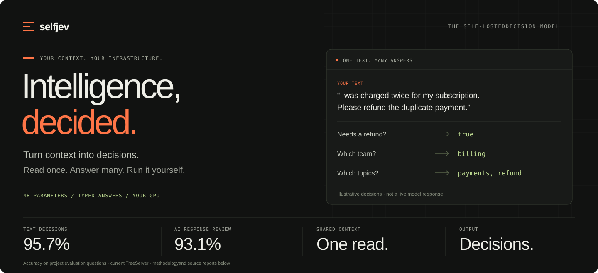
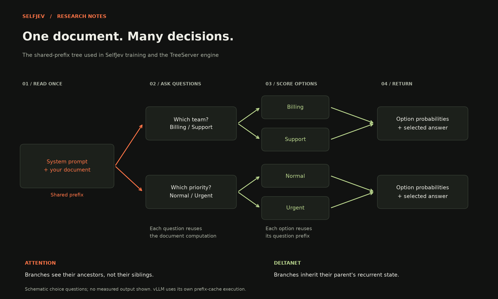

<p align="center">
  
</p>

<p align="center">
  <a href="https://www.selfjev.dev/"><strong>Website</strong></a> &nbsp; · &nbsp;
  <a href="#get-started"><strong>Get started</strong></a> &nbsp; · &nbsp;
  <a href="https://pypi.org/project/selfjev/"><strong>PyPI</strong></a> &nbsp; · &nbsp;
  <a href="https://huggingface.co/Jwuthrich/selfjev-4b"><strong>Download the model</strong></a> &nbsp; · &nbsp;
  <a href="https://huggingface.co/datasets/Jwuthrich/selfjev-decision-bench"><strong>Evaluation dataset</strong></a> &nbsp; · &nbsp;
  <a href="docs/api.md"><strong>API reference</strong></a> &nbsp; · &nbsp;
  <a href="https://jwuthri.github.io/SelfJev/"><strong>Research notebook</strong></a>
</p>

**SelfJev turns text and questions into decisions your code can use.** Route a request, check an AI response, or apply a policy. Get typed answers and probabilities from a 4B model running on infrastructure you control.

The default engine reads a document once and shares that computation across its questions and answer choices. It scores the choices directly, without generating a written response. A Python SDK and Jev-compatible HTTP API make it straightforward to add to an application.

<table>
<tr>
<td width="33%" valign="top"><strong>Route a request</strong><br /><br />Identify intent, choose the right team, and tag every topic in one pass over a customer message.</td>
<td width="33%" valign="top"><strong>Review an AI response</strong><br /><br />Check factual support, evaluate a reply against your criteria, and flag policy violations.</td>
<td width="33%" valign="top"><strong>Apply your rules</strong><br /><br />Ask about eligibility, exceptions, missing evidence, or required actions in a document.</td>
</tr>
</table>

## One text. Many answers.

Four answer types cover the decisions an application needs:

| You need | API type | What comes back |
|---|---|---|
| Does this need a refund? | `Noul` | Probability of yes |
| Which team should handle it? | `Choice` | One choice and probabilities for every option |
| How urgent is it? | `Score` | A position on your ordered scale |
| Which topics are mentioned? | `Multi` | Every selected option and its probability |

You define the questions, options and criteria. SelfJev evaluates them against your text. Run several questions together to reuse the document computation.

## Get started

SelfJev is self-hosted: you run the model server on your own GPU, and your application talks to it. There is no SelfJev cloud.

### 1. Start your server

On a Linux machine with an NVIDIA GPU and Python 3.12+:

```bash
pip install "selfjev[serve,gpu]"

# Choose your own server secret; use the same value in the client.
export SELFJEV_API_KEYS="$(python -c 'import secrets; print(secrets.token_urlsafe(32))')"
selfjev serve --host 0.0.0.0 --port 8000
```

The first start downloads the [selfjev-4b adapter](https://huggingface.co/Jwuthrich/selfjev-4b) (230 MB) and its pinned Qwen3.5-4B base from Hugging Face. `--adapter <dir or Hugging Face repo>` serves another adapter, such as your own fine-tune.

A **24 GB NVIDIA GPU, 16–32 GB host RAM and 50 GB free disk** is a practical starting configuration, not a measured minimum. Memory use depends on text length, question count and concurrency. [Hardware guide →](https://www.selfjev.dev/docs/hardware) · Docker, AWS, Runpod and GCP: [deployment guide →](docs/deploy.md)

| Install | For |
|---|---|
| `pip install selfjev` | the client only (httpx + pydantic, no torch) |
| `pip install "selfjev[serve,gpu]"` | the model server (`gpu`: fast kernels on Linux CUDA) |
| `pip install "selfjev[train]"` | `selfjev finetune` and `selfjev rlcd` |
| `pip install "selfjev[deploy]"` | `selfjev deploy aws` |

### 2a. Already using Jev? Change two environment variables

Code written for TypeSafe's Python SDK (`typesafe-sdk`) runs unchanged against your server:

```bash
export TYPESAFE_BASE_URL="http://your-selfjev-host:8000"
export TYPESAFE_API_KEY="the key you set in SELFJEV_API_KEYS"
```

```python
from typesafe_sdk import Choice, Noul, TypeSafeClient

client = TypeSafeClient()  # reads the two variables above
res = client.system_one(
    state="I was charged twice. Please refund the duplicate payment.",
    questions={
        "refund": Noul(instructions="Does the customer want a refund?"),
        "team": Choice(instructions="Which team?", criteria={"billing": "payments and refunds", "support": "technical issues"}),
    },
)
```

The default model name `jev-latest` is answered by selfjev-4b; `client.models.list()`, errors and retries behave as they do against Jev. OpenRouter's decisions path (`/api/alpha/decisions`) is served too.

### 2b. Or use the selfjev client

It adds `Multi` (select all that apply) and the fine-tuning API:

```bash
pip install selfjev
```

```python
from selfjev import Choice, Multi, Noul, SelfJev

client = SelfJev(
    base_url="http://your-selfjev-host:8000",
    api_key="the key you set in SELFJEV_API_KEYS",
)

result = client.system_one(
    state="I was charged twice. Please refund the duplicate payment.",
    questions={
        "refund": Noul("Does the customer want a refund?"),
        "team": Choice(
            "Which team should handle this?",
            {
                "billing": "payments and refunds",
                "support": "technical issues",
            },
        ),
        "topics": Multi(
            "Which topics are mentioned?",
            {
                "payment": "a payment or charge",
                "refund": "a refund request",
                "login": "an account access problem",
            },
        ),
    },
)

print(result.nouls["refund"].noul)  # Probability of yes
print(result.choices["team"].choice)  # Selected team
print(result.multis["topics"].multi)  # Selected topics
```

`AsyncSelfJev` supports the same interface with `await`; `SELFJEV_BASE_URL` and `SELFJEV_API_KEY` work in place of the arguments. [Requests, responses and authentication →](docs/api.md)

## Read once. Decide across questions.



SelfJev-4B combines **Qwen3.5-4B** with a trained **rank-64 LoRA adapter**. Its shared-prefix tree reuses the document and question computations while keeping answer branches separate. Every choice is judged with the alternatives visible; the resulting scores become the typed answers above.

The default **TreeServer** runs this tree directly. The **vLLM** backend uses the full merged checkpoint and its own prefix cache. Their performance depends on the workload. [Architecture →](docs/how_it_works.md) · [Measured latency and hardware →](docs/speed.md)

## Measured, with the evidence attached

Current SelfJev-4B served by TreeServer, compared with Jev on the same questions:

| What we tested | Questions | SelfJev-4B | Jev | Evidence |
|---|---:|---:|---:|---|
| Text decisions | 1,991 | **95.7%** | 97.2% | [Results](reports/selfjev_4b_treeserver/eval2/report.md) |
| AI response review | 946 | **93.1%** | 92.5% | [Results](reports/selfjev_4b_treeserver/eval_llm/report.md) |
| Broader text tasks · development benchmark | 3,471 | **83.8%** | 82.7% | [Results](reports/selfjev_4b_treeserver/test/report.md) |

Accuracy means matching the expected answer; select-all questions require the entire set to match. These are project evaluations, not a universal model ranking. The first two suites have AI-authored, AI-checked labels and have informed research decisions. The broader benchmark was reused during development. A fresh independent holdout remains necessary.

The original evaluation engine recorded 95.8% on Text Decisions; the table uses the current serving-engine result. [Comparison sources](weights/selfjev_4b/assets/chart-data.json) · [All experiments and limitations](docs/experiments.md) · [Findings](docs/findings.md)

## Get the weights. Inspect the tests.

| Release | What's inside | Download |
|---|---|---|
| **SelfJev-4B** | 230 MB trained adapter; the base downloads separately. Used by the default TreeServer. | [Hugging Face ↗](https://huggingface.co/Jwuthrich/selfjev-4b) |
| **SelfJev-4B merged** | 9.32 GB of complete weights, plus tokenizer and configuration. No separate adapter download. | [Hugging Face ↗](https://huggingface.co/Jwuthrich/selfjev-4b-merged) |
| **Decision Bench** | 3,657 authored evaluation questions, expected answers, provenance and a scoring script. | [Hugging Face ↗](https://huggingface.co/datasets/Jwuthrich/selfjev-decision-bench) |

Decision Bench contains **Text Decisions**, **AI Response Review**, and a smaller **Record Reasoning** challenge. The 3,471-question development benchmark above is separate. Each release card documents its provenance, intended use and current licensing information.

## Make it yours

Adapt the model to your vocabulary, policies and edge cases with your own labeled examples:

```bash
uv run selfjev finetune --data my_train.jsonl \
  --out runs/mine --init weights/selfjev_4b
```

`selfjev rlcd` adds calibration-oriented training. You can also enable fine-tuning jobs over HTTP with `selfjev serve --fine-tuning`. [Fine-tuning guide →](docs/finetune.md)

| Build | Deploy | Explore |
|---|---|---|
| [Quickstart](website/content/quickstart.md) | [Docker](website/content/docker.md) | [Architecture](docs/tree_model.md) |
| [API & SDK](docs/api.md) | [AWS](website/content/aws.md) | [Results & research](docs/findings.md) |
| [Fine-tuning](docs/finetune.md) | [Runpod](website/content/runpod.md) · [GCP](website/content/gcp.md) | [Data & reproducibility](docs/reproduce.md) |
| [Operations](website/content/operations.md) | [Hardware sizing](website/content/hardware.md) | [Research journal](docs/JOURNAL.md) |

<details>
<summary><strong>Develop SelfJev, run the website, or explore the repository</strong></summary>

### Python development

```bash
uv sync
uv run pytest -q
uv run pre-commit install
```

### Website

The Next.js marketing site includes interactive decisions, benchmark and hardware explorers, and practical deployment guides:

```bash
cd website
npm ci
npm run dev       # http://127.0.0.1:3000 — Fast Refresh enabled
npm run check     # production build and link checks
```

It exports a static site; hosting it does not require a GPU or Python model server. [Website development](website/README.md).

The [research notebook](https://jwuthri.github.io/SelfJev/) is built separately from `docs/` using Zensical:

```bash
uv run --no-project --with zensical==0.0.65 python -m zensical serve
```

### Repository map

| Path | Contents |
|---|---|
| [`src/selfjev/`](src/selfjev/) | SDK, API server, inference engines, training, evaluation and deployment |
| [`website/`](website/) | Next.js product site and usage guides |
| [`weights/`](weights/) | Current adapter and model metadata |
| [`data/`](data/README.md) | Canonical dataset catalog and data-building instructions |
| [`reports/`](reports/) | Evaluation results, latency measurements and reviews |
| [`docs/`](docs/) | Guides, architecture, experiment ledger and journal |
| [`tests/`](tests/) · [`scripts/`](scripts/) | CPU tests and reproducible workflows |

Earlier architectures and adapters remain at [`archive/pre-cleanup-2026-09-27`](https://github.com/Jwuthri/SelfJev/tree/archive/pre-cleanup-2026-09-27). Their reports remain in this repository.

Read [AGENTS.md](AGENTS.md) before contributing: claim work in the journal, keep test labels out of training and tuning, and obtain priced approval before starting paid jobs.

</details>

---

SelfJev is an independent project implementing a Jev-compatible interface. It is not affiliated with TypeSafe or Qwen. Training provenance, including the use of Jev probabilities as a teacher signal, is documented in the [model card](https://huggingface.co/Jwuthrich/selfjev-4b).
