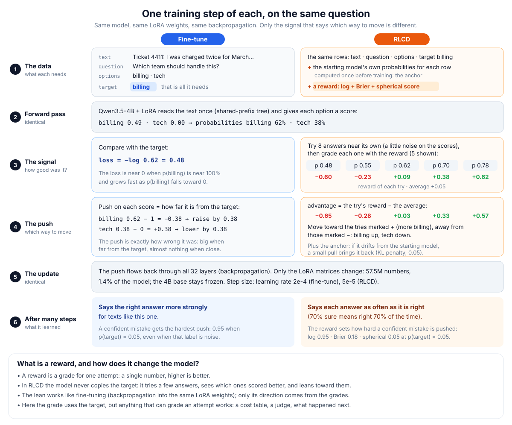
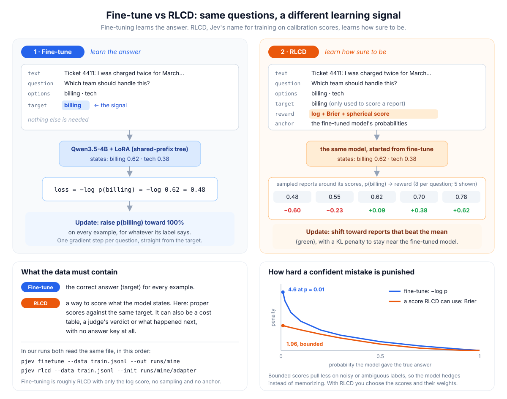

# Fine-tune and RLCD

Two commands train the best recipe (Qwen3.5-4B, shared-prefix tree, LoRA) on your own data: `selfjev finetune` for the
supervised step and `selfjev rlcd` for calibration training, which Jev calls RLCD. Both run on one CUDA GPU (an
AWS box, never the laptop) and write a run directory you can serve directly.

```bash
# 1. supervised fine-tune, from scratch or on top of the best model
uv run selfjev finetune --data my_train.jsonl --out runs/mine --init weights/selfjev_4b

# 2. RLCD on top of it
uv run selfjev rlcd --data my_train.jsonl --out runs/mine_rlcd --init runs/mine/adapter

# 3. serve the result (same option-list transform as in training)
uv run selfjev serve --adapter runs/mine_rlcd/adapter
```

The tree server scores exactly like standalone sequences (CPU test on a tiny model) but has not been timed on a GPU yet.
The vLLM path (`selfjev merge`, then `selfjev serve --engine vllm`) is the one measured on the real model: same
accuracy, fast for one question, slow for many ([speed](speed.md)).

Code: [src/selfjev/finetune.py](../src/selfjev/finetune.py). Tests (CPU, a tiny random model):
[tests/training/test_finetune.py](../tests/training/test_finetune.py).

## Part 1: fine-tune vs RLCD in plain words

Picture a kid learning to guess which of two boxes holds the candy, and to say how sure they are.

- **Fine-tuning is the answer key.** After each guess the teacher opens the right box, and the kid adjusts to point
  at it more firmly. A confident wrong guess gets the biggest correction of all, even when the answer key itself has a
  mistake. On messy lessons the kid ends up very sure, even about things nobody can be sure of.
- **RLCD is a points game.** The kid says "I'm 70% sure it's this box". The box is opened and the kid gets points:
  sure and right earns a lot, sure and wrong loses a lot, unsure earns or loses a little. The kid tries a few
  different "how sure" answers, sees which ones earned more points, and leans toward those. The points are designed
  so that over many rounds the best strategy is to say exactly how sure you really are, and you can choose how much
  a confident miss costs. The points are computed from the same answer key: it is a different way of grading,
  not a different kind of learning.
- **The points are the reward.** A reward is a number that grades one attempt: higher is better.

What changes inside the model is the same in both: the same small set of adjustable weights (the LoRA adapter, 1.4%
of the model) gets nudged a little after every batch. Fine-tuning nudges it toward "this is the answer"; RLCD nudges
it toward "be this sure". RLCD does not train a different part of the model, and it adds no new layer.

## Part 2: step by step, the data and one update of each



### The data

| | fine-tune | RLCD |
|---|---|---|
| each row | text, question, options, target | the same row |
| also needs | nothing | the starting model's own probabilities for the row (computed once before training: the anchor) and a reward, the rule that grades an attempt |
| where the grade comes from | | here from the target (log, Brier and spherical score); it could be a cost table, a judge's verdict or what happened next, with no target at all |

In our runs both commands read the same file, in order: `selfjev finetune` first, then `selfjev rlcd --init` on its result.

### One update

Both start identically: the model reads the text through the tree and gives each option a score, here billing 0.49
and tech 0.00, which a softmax turns into 62% billing, 38% tech. Then:

**Fine-tune**

1. Loss = −log p(target) = −log 0.62 = 0.48.
2. The push on each score is p − target: billing 0.62 − 1 = −0.38 (raise it), tech 0.38 − 0 = +0.38 (lower it).
   The push is exactly how wrong the model was.
3. Backpropagation carries the push through all 32 layers into the LoRA matrices, and the optimizer moves them a
   small step (learning rate 2e-4). The next text like this one gets a higher p(billing).

**RLCD**

1. Try 8 answers near the model's own: add a little random noise (sd 0.3) to the scores. Five of them, as
   p(billing): 0.48, 0.55, 0.62, 0.70, 0.78.
2. Grade each try with the reward (log + Brier + spherical score against billing): −0.60, −0.23, +0.09, +0.38, +0.62.
   The average is +0.05.
3. Advantage = grade − average: −0.65, −0.28, +0.03, +0.33, +0.57. Tries above average should become more likely and
   tries below less likely; here that means raise billing and lower tech.
4. Add the anchor: a small pull (KL penalty, weight 0.05) back toward the starting model's probabilities, so a few
   batches cannot drag it far.
5. Backpropagation into the same LoRA matrices, with smaller steps (learning rate 5e-5).

Despite the name, none of this is reinforcement learning. RL is an agent acting in an environment: its actions
change what happens next, rewards can come late, and it must explore to learn what each action does. Here there is
no environment and no sequence of actions, and the grade of every possible answer is known from the label. The
sampled tries only borrow an RL tool, a policy-gradient estimator: averaged over many tries it follows the slope of
the expected score, a slope that could be computed exactly. "RLCD" is the name Jev (and Laya) use; what it does here
is supervised fine-tuning with a calibration score as the loss.

### How the reward changes the model

In fine-tuning the push on a score is fixed by one formula (p − target). In RLCD the push comes from the grades, so
the reward decides how hard each example pulls. How hard each score pulls the correct option's score up, with two
options, in three situations:

| situation | p(target) | log score (= fine-tuning) | Brier | spherical |
|---|---|---|---|---|
| right but unsure | 0.62 | 0.38 | 0.36 | 0.23 |
| right and sure | 0.95 | 0.05 | 0.01 | 0.003 |
| sure and wrong | 0.05 | **0.95** | 0.18 | 0.05 |

- The log score pushes hardest on confident mistakes. When the label is right, that fixes a real error; when the
  label is noise or the text is genuinely ambiguous, the model bends to fit it and learns to be sure where it
  should not be.
- Brier and spherical pull much less on those cases, so the model can stay unsure there. That is where hedging
  comes from. On examples where the model is unsure but right, all three pull about the same.
- All three are proper scoring rules: over many similar texts that are billing 70% of the time, each one is best at
  saying 70%. They differ in how much a single example can pull.
- The default reward mixes all three (`--reward log=1,brier=1,spherical=1`, so confident mistakes still get pushed
  about as hard as in fine-tuning). `--reward brier=1,spherical=1` drops the log score for the most hedging.



## Data

One question per line, the same format as every eval file in `data/`:

```json
{"state": "Ticket 4411: the invoice was charged twice ...",
 "question": {"type": "multiclass", "instruction": "Which team should handle this?",
              "candidates": [{"id": "billing", "description": "billing and refunds"},
                             {"id": "tech", "description": "outages and bugs"}]},
 "target": "billing"}
```

- `type` is `binary` (target `true` / `false`, no candidates), `multiclass` (target: one candidate id) or `multilabel`
  (target: a list of candidate ids, possibly empty).
- `id` and `family` are optional. Several questions about the same `state` share one tree: the text is encoded once.
- `soft` (optional): a teacher's probabilities, P(yes) for binary or `{candidate id: p}` otherwise. Training then
  targets (1 − `--soft-weight`) × label + `--soft-weight` × `soft` (default 0.5, so the label stays the answer);
  validation stays on the labels. `scripts/jev_soft_targets.py` writes Jev's, from `data/all.jsonl.gz`.
- `--val` gives a validation file; without it, 5% of `--data` (at most 1,000 questions) is held out.
- Every option is listed in the question text (`options.py`), as for the best model; `--no-options-in-question` turns
  that off. Serve with the same setting.
- Questions longer than `--max-length` (default 8,192 tokens: root + question + longest candidate) are dropped and
  counted in `train_meta.json`, never truncated.

## Output

`<out>/adapter` (best validation checkpoint), `<out>/adapter_last`, `<out>/train_meta.json` (base model and revision,
data sha256, settings, every validation). Validation reports accuracy, cross-entropy, Brier score, expected calibration
error (10 bins) and the number of confidently wrong decisions (confidence ≥ 0.9). `finetune` keeps the checkpoint with
the lowest validation cross-entropy, `rlcd` the one with the lowest Brier score. To keep a result with the repo, copy
the adapter into [weights/](../weights/README.md).

## finetune

Cross-entropy on the targets (softmax over a multiclass question's candidates, a sigmoid per yes/no decision), the
recipe that produced `weights/qwen35_4b_tree` and, from scratch on all the non-test data with texts up to 16K tokens and
Jev's probabilities as soft targets, the default `weights/selfjev_4b`: LoRA r64 on the attention and DeltaNet projections, lr 2e-4 with 5%
warm-up and linear decay, batches of whole states packed to 8,192 tokens × 4 accumulation steps, per-layer activation
checkpointing. Start from `--init weights/selfjev_4b` to adapt the default model to a new domain, or without `--init`
to train a fresh adapter. `--base qwen35` uses Qwen3.5-2B for quick runs.

## rlcd settings

- `--reward`: weights of `log`, `brier`, `spherical` (strictly proper scoring rules) and `accuracy` (the argmax
  decision is right; not proper on its own, keep a proper term next to it).
- `confident_miss` in `--reward` is a cost, not a score: −1 for every decision made with confidence ≥ 0.9 that the
  target says is wrong (expected under a soft target). `confident_miss=5` makes a confident mistake cost 5×; with a 95%
  target the best report drops from 0.95 to just under 0.9 (test). It is not differentiable: the sampled tries are what
  let RLCD optimize it, the one reward here a fine-tune cannot.
- `--samples` (8) tries per question, drawn from a Gaussian around the model's scores with sd `--sigma` (0.3).
- `--beta` (0.05): the KL penalty to the starting model's probabilities, computed once before training.
- `--lr` defaults to 5e-5 (fine-tune: 2e-4); the best checkpoint is the one with the lowest validation Brier score.

`tests/training/test_finetune.py` checks the property that matters: trained only with this objective, on a question whose
answer is "yes" 70% of the time, the model learns to say 70% (binary), and 60% for a three-way choice with a
60/30/10 split.

Jev says it is trained with "RLCD" and gives no details; Laya, an open Jev-like engine, uses the name for policy
gradient on proper-scoring-rule rewards ([landscape](landscape.md)), which is what `selfjev rlcd` implements.

## First test on the real model (2026-09-25): no gain

RLCD from `weights/qwen35_4b_tree` on 4,412 labeled questions it never trained on, against a plain fine-tune on the
same questions ([JOURNAL](JOURNAL.md), `reports/rlcd_2026-09-25/`):

| eval2 | accuracy | ECE | confidently wrong (≥ 0.9) |
|---|---|---|---|
| start | 95.58 | 0.005 | 30 |
| + RLCD | 95.63 | 0.010 | 34 |
| + fine-tune (control) | 95.43 | 0.005 | 31 |
| Jev | 97.24 | 0.041 | 7 |

- On questions the model had already trained on, RLCD made it overconfident within 100 steps: keep RLCD data fresh.
- With one hard label per question, a proper-score reward is the same signal as cross-entropy, only noisier: it
  cannot say "be less sure here". The model is already calibrated (ECE 0.005, Jev 0.041); Jev's edge is fewer
  mistakes and hedged ones.
- The sampled reports also bias the optimum toward overconfidence as `--sigma` grows (70% base rate: 0.695 at 0.3,
  0.754 at 1.0); keep `--sigma` small.
- For RLCD to matter, the reward has to carry more than the label: soft targets (judges' agreement, a teacher's
  probabilities) or a cost that punishes confident mistakes more than it rewards confident right answers.

## Second test (2026-09-26): Jev's probabilities as soft targets, all the data

From `weights/qwen35_4b_tree`, one epoch over 69,528 non-test questions of `data/all.jsonl.gz`, target 0.5 × label +
0.5 × Jev (Jev is ≥ 0.9 sure of the label on 77% of them, hedges on 15%, disagrees on 8%). Final checkpoints
([JOURNAL](JOURNAL.md), `reports/rlcd_jev_2026-09-26/`):

| eval2 (1,991 q) | accuracy (paired vs start) | Brier | ECE | wrong decisions | ≥ 0.9 sure | mean confidence when wrong |
|---|---|---|---|---|---|---|
| `qwen35_4b_tree` (start) | 95.58 | 0.0480 | 0.0051 | 99 | 30 | 0.755 |
| A: RLCD on Jev targets | 95.43 (15 / 18, p = 0.73) | 0.0446 | 0.0119 | 100 | 22 | 0.724 |
| **B: fine-tune on Jev targets** | **95.73** (19 / 16, p = 0.74) | **0.0438** | 0.0245 | 94 | **14** | 0.708 |
| Jev | 97.24 | 0.0335 | 0.0406 | 57 | 7 | 0.670 |

| dev benchmark (3,471 q) | accuracy (paired vs start) | Brier | ECE | wrong decisions | ≥ 0.9 sure | mean confidence when wrong |
|---|---|---|---|---|---|---|
| `qwen35_4b_tree` (start) | 84.44 | 0.1787 | 0.0056 | 582 | 83 | 0.686 |
| A: RLCD on Jev targets | 84.50 (76 / 74, p = 0.93) | 0.1816 | 0.0113 | 593 | 88 | 0.701 |
| B: fine-tune on Jev targets | 84.41 (87 / 88, p = 1) | 0.1820 | 0.0127 | 603 | 75 | 0.693 |
| Jev | 82.71 | 0.2105 | 0.0444 | 708 | 253 | 0.791 |

- Soft targets do what hard labels could not: confident mistakes on eval2 halve (30 → 14, Jev 7) and Brier improves
  9%, at the same accuracy. The dev benchmark is flat.
- RLCD on the same targets moves less (the KL anchor) and is no better than the fine-tune: A vs B 4 / 10 on eval2
  (p = 0.18). All its rewards peak at the same target as cross-entropy, so the sampling only adds noise.
- The best-by-validation checkpoint is step 0 for soft-target runs (hard-label loss and Brier penalize hedging): use
  `adapter_last`.

### C: RLCD with a confident-mistake cost, on top of the fine-tune

`--reward log=1,brier=1,spherical=1,confident_miss=5` from B's result, same data and settings:

| eval2 (1,991 q) | accuracy (paired vs start) | Brier | ECE | wrong decisions | ≥ 0.9 sure | mean confidence when wrong |
|---|---|---|---|---|---|---|
| `qwen35_4b_tree` (start) | 95.58 | 0.0480 | 0.0051 | 99 | 30 | 0.755 |
| B: fine-tune on Jev targets | 95.73 (19 / 16, p = 0.74) | **0.0438** | 0.0245 | 94 | 14 | 0.708 |
| **C: B + RLCD with a 5× confident-mistake cost** | 95.68 (24 / 22, p = 0.88; vs B 9 / 10, p = 1) | 0.0518 | 0.0431 | 96 | **8** | 0.690 |
| Jev | 97.24 | 0.0335 | 0.0406 | 57 | 7 | 0.670 |

| dev benchmark (3,471 q) | accuracy | Brier | ECE | wrong decisions | ≥ 0.9 sure | mean confidence when wrong |
|---|---|---|---|---|---|---|
| `qwen35_4b_tree` (start) | 84.44 | 0.1787 | 0.0056 | 582 | 83 | 0.686 |
| B | 84.41 | 0.1820 | 0.0127 | 603 | 75 | 0.693 |
| **C** | 84.41 (vs B 17 / 17) | 0.1835 | 0.0298 | 597 | **48** | 0.672 |
| Jev | 82.71 | 0.2105 | 0.0444 | 708 | 253 | 0.791 |

- The cost does what fine-tuning cannot: confident mistakes 14 → 8 on eval2 (Jev 7), 75 → 48 on the dev benchmark,
  ECE and confidence when wrong at Jev's level, same accuracy.
- The price is sharpness: Brier 0.0438 → 0.0518, because the model also backs off on answers it gets right. Use B for the
  best probabilities, C for Jev-like caution; a smaller weight trades between the two.
- But compared at equal coverage, C is no better than B: it gets its few confident mistakes by being less sure
  overall (≥ 0.9 sure on 77% of decisions, B 88.8%), the same trade a higher threshold on B gives for free:

| mistakes among the k most confident decisions (eval2, 3,491) | 70% | 77% | 85% | 88% | 92% |
|---|---|---|---|---|---|
| `qwen35_4b_tree` | 3 | 8 | 14 | 16 | 29 |
| B | 4 | **5** | **9** | 13 | **20** |
| C | 4 | 8 | 10 | 12 | 24 |
| Jev | 3 | 3 | 4 | 7 | 8 |

- So the cost changed the model's confidence scale, not its ranking. Jev's real edge is ranking: it knows which answers are risky.
