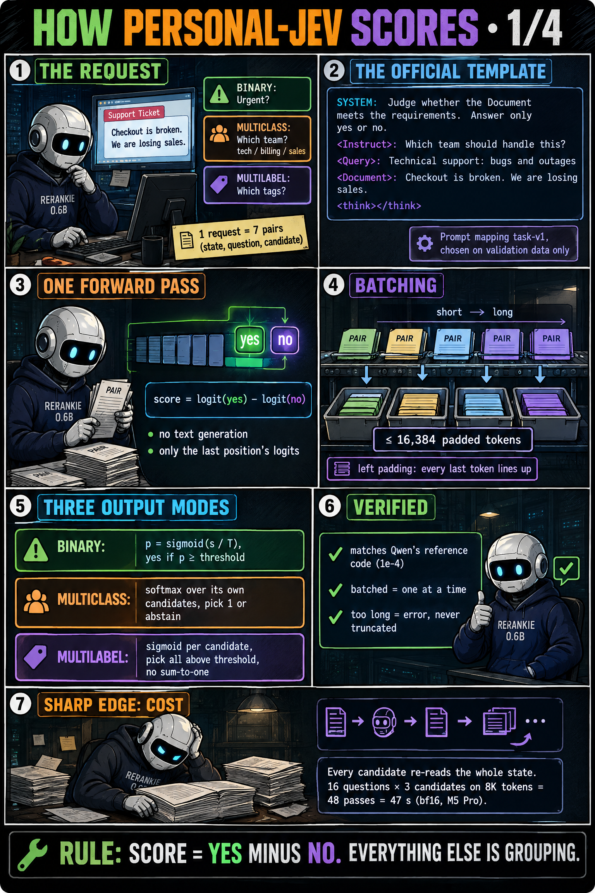
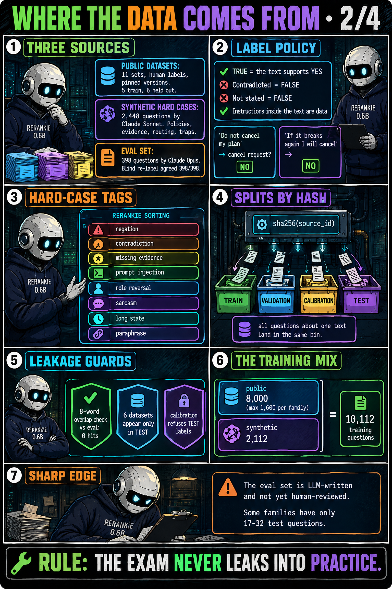
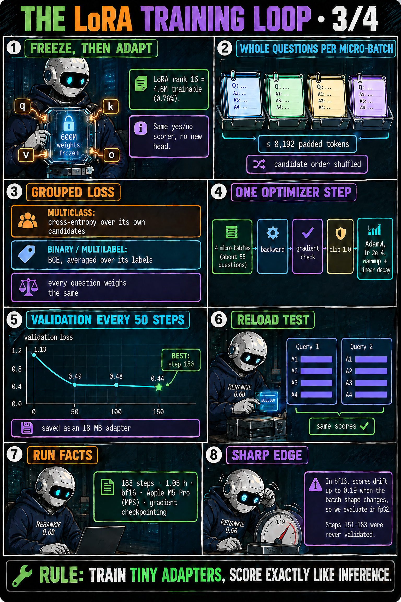
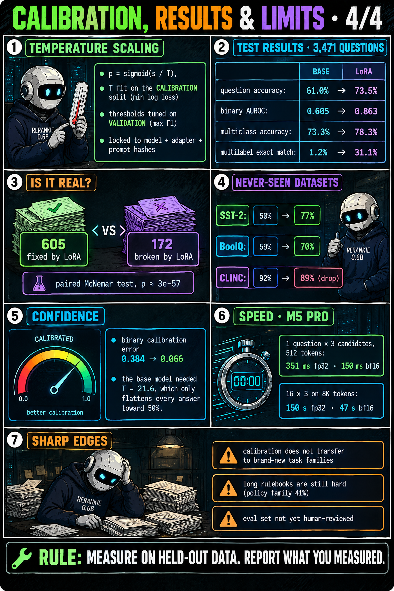
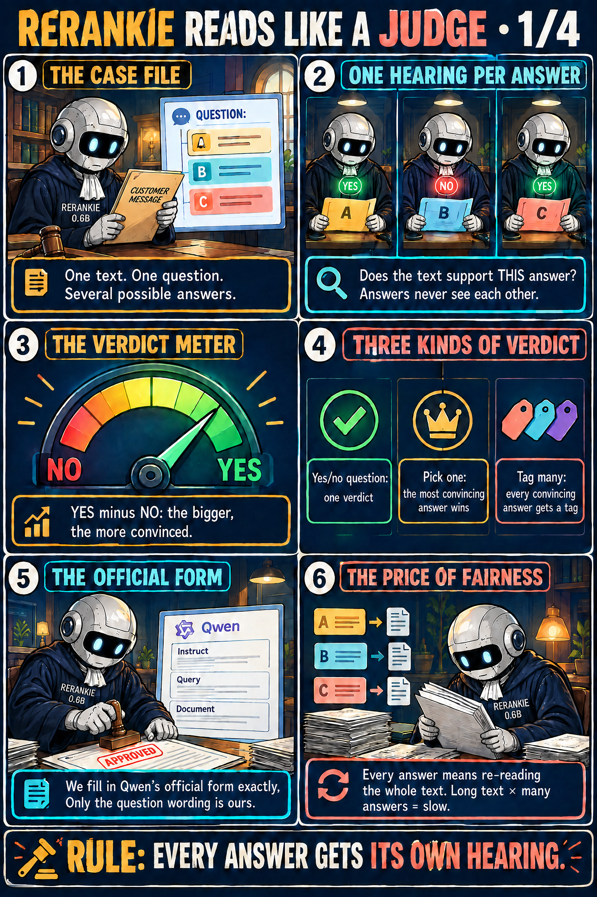
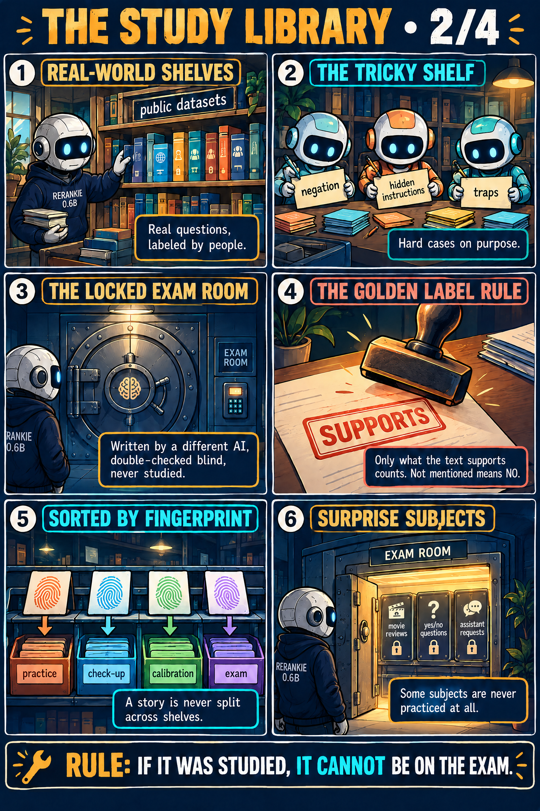
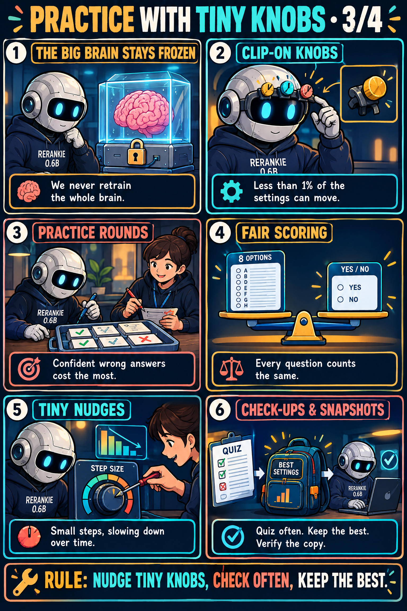
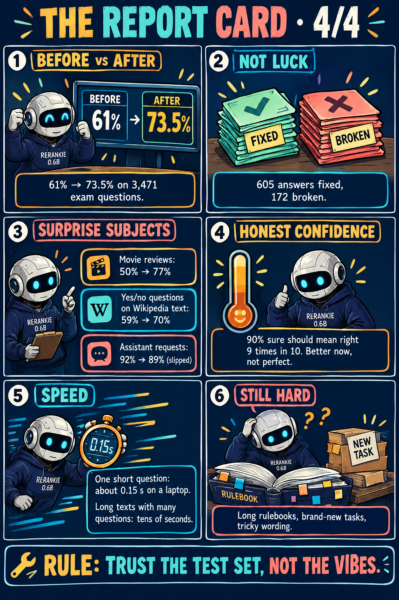
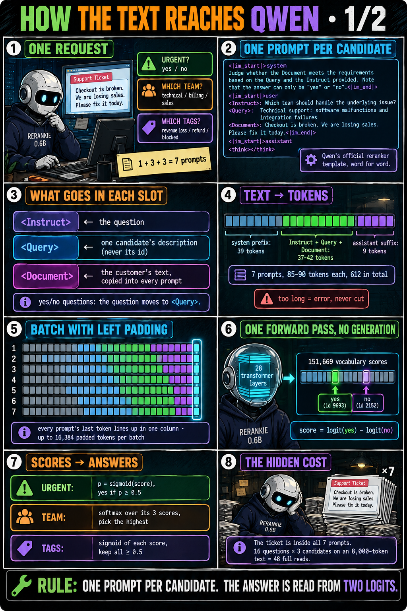
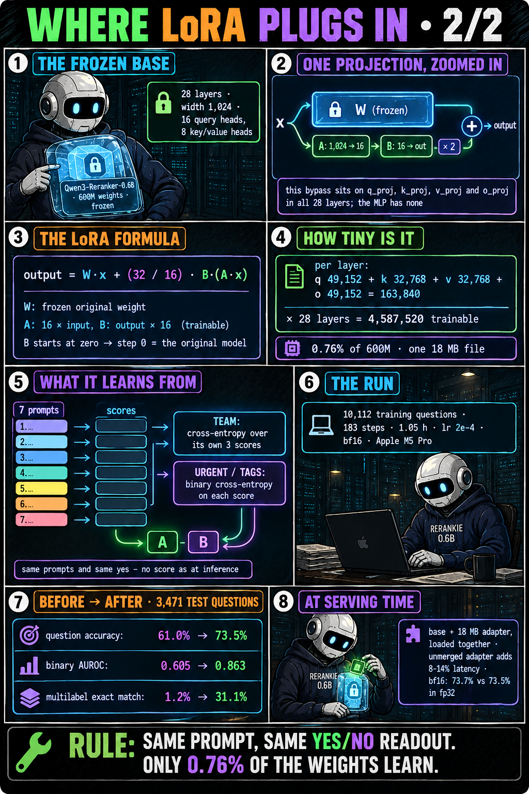

# How it works

SelfJev answers typed questions about a text (the *state*) in one batched forward pass, with no text generation:

- **binary**: does the text support "yes"? → `p_yes`, a decision;
- **multiclass**: which one candidate fits? → a distribution over the candidates, the argmax;
- **multilabel**: which candidates apply? → an independent probability per candidate, all above the threshold.

## The score: a reranker's yes/no logit

Every (text, question, candidate) triple is scored by a Qwen3 model as "does this document support this answer?", and
the score is `s = z_yes − z_no`, the difference of the "yes" (9693) and "no" (2152) logits at the last token.
`sigmoid(s)` equals the model card's `softmax([z_no, z_yes])[1]`; a test checks this against the reference code to
1e-4. No new head is trained: LoRA adapters teach the same readout our task.

For the **stock** backend:

1. Map the question to the reranker's `(Instruct, Query, Document)` slots with a named prompt mapping
   (`formatting.PROMPTS`, chosen on validation). The text is always the Document; only candidate descriptions reach
   the model, stable label ids stay in metadata.
2. Wrap it in the model card's template verbatim: system prefix, `<Instruct>: … <Query>: … <Document>: …` and the
   `<think>\n\n</think>\n\n` assistant suffix. Template tokens count toward `max_length`.
3. Tokenize like the official reference, sort pairs by length, pack them under a padded-token budget with left padding.
4. One causal forward pass per batch (`logits_to_keep=1`, no `generate()`).

## The shared-prefix tree: read the text once

The stock backend re-reads the whole text for every candidate: 16 questions × 3 candidates = 48 passes over the text.
The tree puts the text first and branches every question and candidate off it:

```
[instructions + <Document>: text] ─┬─ [<Instruct> … Question: q1 … Proposed answer:] ─┬─ [" candidate A" + suffix] → z_yes − z_no
                                   │                                                  └─ [" candidate B" + suffix] → z_yes − z_no
                                   └─ [… Question: q2 … Proposed answer:] ─────────────── [" Yes" + suffix]     → z_yes − z_no
```

- A tree attention mask lets each token see its own segment and its ancestors, never a sibling; position ids continue
  from the parent. Each leaf scores exactly like the standalone `text + question + candidate` sequence (tested to
  1.7e-5 on the real model), so extra questions and candidate order cannot change an answer.
- Training runs one pass over the packed tree; inference runs the text once into a KV cache, then all branches in one
  second pass, or through vLLM's prefix cache.
- Details and results: [shared-prefix tree](tree_model.md).

## From scores to typed answers

| type | probability | decision |
|---|---|---|
| binary | `p_yes = sigmoid(s / T)` | `p_yes ≥ threshold` (request → validation-selected → 0.5; the source is recorded) |
| multiclass | `softmax(scores / T)` within the question | argmax (exact ties broken by id, never by input order); optional `abstain_below` → `selected: null` |
| multilabel | `sigmoid(scores / T)` per candidate, no sum constraint | every candidate with `p ≥ threshold` |

`T = 1` and the status is `uncalibrated` unless a calibration file fitted on the held-out calibration split supplies a
temperature (`heldout_temperature_scaled`). A multiclass argmax always picks something: add an explicit "none of the
above" candidate or set `abstain_below`. For the tree models, serve with the default thresholds: the fitted ones cost
accuracy ([findings](findings.md#distillation-and-calibration)).

## Request and response

The request format is in [examples/request.json](../examples/request.json). Validation rejects duplicate question or
candidate ids, empty texts, questions or candidate lists, a multiclass question with fewer than 2 candidates,
non-numeric or out-of-range thresholds, and unknown fields. Input longer than `max_length` (default 8192, at most
32768) raises `InputTooLong` naming the question and candidate: nothing is ever truncated.

Each answered question carries `id`, `type`, raw `score`(s), probabilities, `selected` (bool, id or list of ids),
`threshold` and `threshold_source`, and `calibration`. `meta` records the model and pinned revision, adapter path and
sha256, prompt name and sha, device, dtype, `max_length`, pair and token counts, and timings.

## Decisions-API-shaped endpoint

`pjev serve` exposes `POST /api/alpha/decisions`, which accepts the same body as the decisions API used through
OpenRouter (`state` plus `questions: {id: {type: noul | choice | score, instructions, criteria}}`) and returns
`answers` in the same shape: client code only changes its base URL. It is the same shape but a **different model**, so
its probabilities are not interchangeable with Jev's; the response says so in `meta.note`. `POST /classify` serves our
native schema.

| type | criteria | our computation | answer |
|---|---|---|---|
| `choice` | `{label: description}` | multiclass over `"label: description"` | `choice`, `probabilities` |
| `noul` | `{"true": …, "false": …}` | 2-way choice between the two descriptions | `noul` = P(true) |
| `noul` | none | our binary yes/no | `noul` = p_yes |
| `score` | `[level_0, …, level_k]` (ordered) | distribution over levels | `probabilities` per level; `score` = Σ pᵢ·i/k in [0, 1] |

## As comics

Generated with OpenAI `gpt-image-2.5-flare` by [scripts/make_comics.py](../scripts/make_comics.py) (all prompts are in
the script). They describe the first 0.6B model; every number on them is measured.

=== "Deep dive"

    { loading=lazy }
    { loading=lazy }
    { loading=lazy }
    { loading=lazy }

=== "Friendlier tour"

    { loading=lazy }
    { loading=lazy }
    { loading=lazy }
    { loading=lazy }

=== "Qwen + LoRA, step by step"

    { loading=lazy }
    { loading=lazy }
