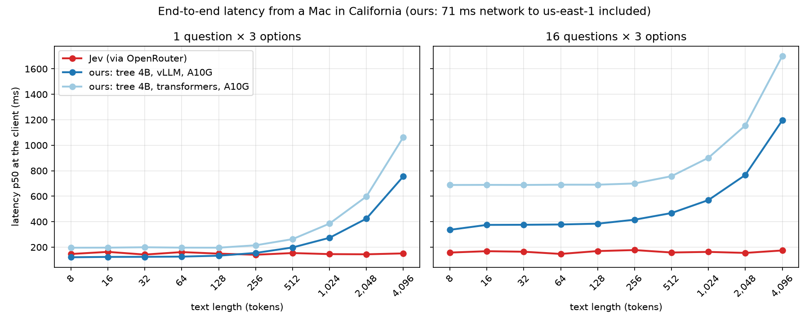

# Shared-prefix tree scorer

The text is read **once**, and every question and candidate still reads it through **all** of the model's layers,
in one forward pass with no text generation. It combines what we measured separately:

- the stock reranker's joint reading of text and question (accurate, but it re-reads the text for every
  candidate);
- the custom model's shared text encoding (fast, but text and question met only in 2 small layers at the end,
  and yes/no questions stayed at chance; see [custom_model.md](custom_model.md)).

Code: [src/personal_jev/tree.py](../src/personal_jev/tree.py), [train_tree.py](../src/personal_jev/train_tree.py),
tests in [tests/test_tree.py](../tests/test_tree.py).

**Bottom line (test split, 3,471 questions, measured 2026-09-23 on an AWS A10G, bf16).**
- **Qwen3-Reranker-4B + LoRA in the tree format scores 81.6%.** On the same data with the same LoRA settings, the
  stock 4B scores 80.3% (p = 0.016) and the stock 8B scores 80.7%. Jev scores 82.7%; the gap is not significant
  (p = 0.08).
- **It is up to 32–37× faster than the stock 4B** when there are several questions per text: 16 questions × 3
  candidates take 2.8 s instead of 90.4 s on an 8K-token text, and 5.6 s instead of 207 s on a 16K-token text.
  With a single question, both take the same time.
- **The reranker is the better base once fine-tuned.** Qwen3-4B-Instruct-2507 was ahead before training (72.0% vs
  66.9% on validation) but scores 80.4% on test after LoRA, vs 81.6% (p = 0.016).

## What is computed

```
[instructions + <Document>: text] ─┬─ [<Instruct> … Question: q1 … Proposed answer:] ─┬─ [" candidate A" + suffix] → z_yes − z_no
                                   │                                                  └─ [" candidate B" + suffix] → z_yes − z_no
                                   └─ [… Question: q2 … Proposed answer:] ─────────────── [" Yes" + suffix]     → z_yes − z_no
```

- **One token tree per distinct text.** A tree attention mask lets each token see its own segment (causally) and
  its ancestors, and never a sibling. Position ids continue from the parent.
- **Exact pairwise semantics.** Each leaf scores exactly like the standalone causal sequence
  `instructions + text + question + candidate`, i.e. the stock reranker's pairwise judgment with the text moved
  first so it can be shared. `tests/test_tree.py` checks this against standalone runs: 1e-4 on a tiny model, 1.7e-5
  on the real 0.6B reranker. Extra questions and candidate order cannot change an answer, and a test checks that too.
- **Two execution paths, both exact:**
  - `packed` (training): one pass over the whole tree with a [T, T] mask.
  - `cached` (inference): the text alone with the plain causal kernel into a KV cache, then all branches in one
    second pass against that cache. The text costs one pass however many questions there are.
- **Readout.** `s = z_yes − z_no` at each leaf's last token, then the same `classify.decide` as every backend:
  sigmoid for binary, softmax within a question for multiclass, per-candidate sigmoid for multilabel.
- **Format `tree-v1`.** It is the stock `answer-v1` mapping (the one validation selected for the 4B reranker) with
  the text first. Template pieces are tokenized with their control tokens; user text is tokenized with
  `split_special_tokens`, so `<|im_end|>` inside a text stays plain text. The reranker uses its official assistant
  suffix; instruct models use `<|im_end|>\n<|im_start|>assistant\n`. The format sha is recorded in every report.
- **Backbones.** Any Qwen3-architecture causal LM works. Hybrid models are out for now:
  - Qwen3.5 makes 3 of every 4 layers recurrent (linear attention), which cannot keep branches isolated in one pass.
  - Gemma-4-E4B uses 512-token sliding windows in 5 of 6 layers.

## Results

Sources: `reports/<run>/test/report.json`; Jev and GPT-6 Astra from `reports/external/full/`.

| test, 3,471 questions | stock 4B | stock 4B + LoRA | **tree 4B + LoRA** | tree Instruct-4B + LoRA | stock 8B + LoRA | Jev | GPT-6 Astra |
|---|---|---|---|---|---|---|---|
| run | `baseline_4b` | `lora_4b` | **`tree_4b`** | `tree_4b_instruct` | `lora_8b` | | |
| question accuracy % | 62.8 | 80.3 | **81.6** | 80.4 | 80.7 | 82.7 | 85.8 |
| binary AUROC | 0.604 | 0.945 | **0.953** | 0.958 | 0.945 | 0.981 | 0.971 |
| multiclass accuracy % | 76.2 | 82.3 | **83.9** | 82.3 | 82.9 | 84.6 | 87.0 |
| multiclass macro-F1 % | 83.4 | 86.2 | **89.7** | 87.1 | 88.7 | 91.6 | 95.3 |
| multilabel exact match % | 2.0 | 47.7 | **51.7** | 46.8 | 48.0 | 40.1 | 55.8 |
| multilabel micro-F1 % | 25.1 | 73.6 | **74.9** | 71.5 | 72.1 | 66.3 | 74.0 |

**Paired exact McNemar tests on the same questions** (questions only one of the two gets right):

| comparison | tree 4B only | other only | p |
|---|---|---|---|
| tree 4B vs stock 4B + LoRA | 182 | 138 | 0.016 |
| tree 4B vs tree Instruct-4B | 175 | 132 | 0.016 |
| tree 4B vs Jev | 217 | 256 | 0.08 (not significant) |
| tree 4B vs GPT-6 Astra | 150 | 297 | 3e-12 |

**Validation (868 questions, the split used for model selection), before and after LoRA:**

| | untrained | + LoRA |
|---|---|---|
| stock Reranker-4B, pair format (text last) | 54.4% | 77.5% |
| tree, Reranker-4B (text first) | 66.9% | 78.0% |
| tree, Qwen3-4B-Instruct-2507 | 72.0% | 77.9% |

Putting the text first helps the untrained reranker by 12.5 points. After LoRA, both tree backbones are close on
validation, and the reranker wins on test.

**Accuracy % by family** (selected; all families are in each report):

| family | stock 4B + LoRA | tree 4B | tree Instruct-4B | Jev |
|---|---|---|---|---|
| eval_adversarial | 81.5 | **96.3** | 81.5 | 100.0 |
| eval_urgency_sentiment | 68.2 | **90.9** | 81.8 | 95.5 |
| eval_agent_output | 53.8 | 61.5 | 57.7 | 92.3 |
| heldout_question_type_trec (unseen) | 76.3 | **88.7** | 90.3 | 94.0 |
| heldout_intent_clinc (unseen) | 93.0 | 94.7 | 91.3 | 94.3 |
| heldout_boolq (unseen) | 83.3 | 83.3 | 83.0 | 90.7 |
| heldout_sentiment_sst2 (unseen) | 88.0 | 84.0 | 86.0 | 96.7 |
| hf_nli | 92.3 | 94.3 | 94.3 | 92.7 |
| hf_emotions_multilabel | 46.7 | 49.7 | 43.3 | 31.7 |

## Speed

**Setup.**
- One AWS A10G (g5.xlarge), bf16, same session. Both models run the 4B reranker with an unmerged LoRA adapter.
- End-to-end p50 latency, one request at a time.
- Sources: `reports/bench/gpu_{tree_4b,stock_lora_4b}_bf16/` and `…_long_bf16/`; environment in
  `reports/bench/gpu_tree_environment.txt` (driver 595.91.07, torch 2.14.0+cu130, transformers 5.17.0).

| text tokens | questions × candidates | stock 4B + LoRA | tree 4B + LoRA | speed-up |
|---|---|---|---|---|
| 512 | 1 × 3 | 375 ms | 192 ms | 2.0× |
| 512 | 16 × 3 | 5,414 ms | 686 ms | 7.9× |
| 2,048 | 1 × 3 | 1,299 ms | 526 ms | 2.5× |
| 2,048 | 16 × 3 | 20,460 ms | 1,091 ms | 18.8× |
| 2,048 | 16 binary | 7,176 ms | 712 ms | 10.1× |
| 8,192 | 1 × 3 | 5,657 ms | 2,012 ms | 2.8× |
| 8,192 | 16 × 3 | 90,449 ms | 2,798 ms | 32.3× |
| 16,384 | 1 binary | 4,324 ms | 4,483 ms | 1.0× |
| 16,384 | 16 × 3 | 206,915 ms | 5,638 ms | 36.7× |
| 32,000 | 16 × 3 | — | 14,235 ms (14.7 GB peak) | |

- **Where the time goes.** The stock model pays pairs × text tokens. The tree pays for the text once, plus a short
  branch per question and candidate, so adding questions barely changes the time.
- **Single-candidate speed-ups.** Even with one question × 3 candidates, the stock model reads the text 3 times,
  hence the 2–3× gain.
- **Absolute latency** is A10G-bound; see the end-to-end comparison with Jev below.

### End to end vs Jev (2026-09-23)

The same decisions-API requests were sent from a Mac in California to both services, one at a time:
- **Jev** through OpenRouter, whose edge is 12 ms away;
- **ours** (tree 4B + LoRA) on one AWS A10G in us-east-1, 71 ms away.

The table gives p50 over 10 timed rounds, text 8 → 4,096 tokens, choice questions with 3 options. Full tables, p95,
server-side times and cost: [reports/latency/summary.md](../reports/latency/summary.md); script
`scripts/latency_sweep.py`, chart `scripts/latency_chart.py`.



| text tokens | Jev, 1 q | ours vLLM, 1 q | ours transformers, 1 q | Jev, 16 q | ours vLLM, 16 q |
|---|---|---|---|---|---|
| 8 | 148 ms | **120 ms** | 196 ms | 159 ms | 336 ms |
| 512 | **156 ms** | 197 ms | 263 ms | **160 ms** | 467 ms |
| 2,048 | **144 ms** | 424 ms | 598 ms | **156 ms** | 767 ms |
| 4,096 | **154 ms** | 755 ms | 1,062 ms | **174 ms** | 1,195 ms |

- **Jev's curve is flat.** Its compute for ~6K tokens takes tens of ms, so its time is mostly network and API
  overhead.
- **Ours scales with the text.** The A10G is compute-bound at 6.5–10K tokens/s with vLLM and 4.7–6K with
  transformers.
- **Cost.** Fully busy at $1.006/h, the A10G with vLLM costs $0.005–0.27 per 1,000 requests; Jev costs $0.016–0.27 at
  $0.042 per million input tokens. We are cheaper only while the GPU is busy.
- **vLLM backend** ([src/personal_jev/vllm_tree.py](../src/personal_jev/vllm_tree.py)):
  - every leaf is one prompt, and the prefix cache shares the text between leaves;
  - the LoRA is merged into the weights;
  - on the example request it makes the same decisions as the transformers path, scores within 0.06 logit;
  - its test-set accuracy has not been re-measured.

## Training

Sources: `runs/tree_4b*/train_meta.json`, `configs/tree_4b*.json`.
- **Data:** the same 10,112 training questions as every other run (seed 13, at most 1,600 per family), with 983
  validation questions.
- **LoRA:** r = 16 on q/k/v/o (11,796,480 trainable parameters), lr 2e-4, 5% warm-up, 1 epoch, bf16, gradient
  checkpointing.
- **Micro-batches:** each holds whole trees (one per text, with all its questions), 16,384 padded tokens,
  gradient accumulation 2.
- **Runs:**
  - Reranker-4B: 84 steps in 37 min; best validation loss 0.321 at the last step (stock 4B LoRA: 0.338).
  - Instruct-4B: 78 steps in 35 min; best validation loss 0.338.
- **Checkpoint reload:** exact (0.0 difference) for both.

## Calibration

The held-out temperatures are about 1 (binary 1.02, multiclass 1.06, multilabel 0.99), so the raw scores are
already calibrated: binary ECE 0.077, multiclass 0.029, multilabel 0.017. The thresholds chosen on validation lower
test accuracy from 81.6% to 79.3%, so **serve `tree_4b` without the calibration file**, with the default 0.5
thresholds.

## Limitations

- One seed and one hyperparameter setting per backbone.
- The 81.6% vs 80.3% gain over stock is significant (p = 0.016) but modest.
- Speed was measured on one A10G only (the L40S was out of capacity); no H100 numbers yet.
- The eval-data caveats of the main README apply: LLM-written `eval_*` families with 17–32 questions each, and
  possible pretraining overlap of the public sets.
- Remaining gap to Jev and GPT-6 Astra: sarcasm and sentiment (SST-2 84.0 vs Jev 96.7), BoolQ (83.3 vs 90.7), and
  judging AI replies (`eval_agent_output`, 61.5 vs 92.3).

## Reproduce

```bash
uv run pytest tests/test_tree.py                              # 10 tests; 2 load the real 0.6B reranker
scripts/run_tree_gpu.sh                                        # on a CUDA box: untrained check, LoRA x2, evals, benchmarks
uv run pjev classify examples/request.json --tree --model Qwen/Qwen3-Reranker-4B \
  --revision 22e683669bc0f0bd69640a1354a6d0aebcfeede5 --adapter runs/tree_4b/adapter --dtype bfloat16
```
