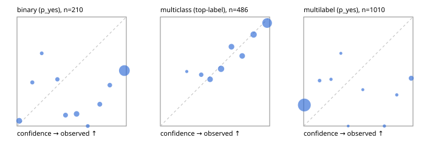

# Evaluation report

- model `Qwen/Qwen3-Reranker-4B` @ `22e683669b` (stock reranker pairs), adapter/checkpoint `None`, prompt `hybrid-v1` (b894703d500d)
- data data/hf.jsonl, data/eval.jsonl; splits ['validation']; n=868; calibration `None`
- cuda / bfloat16; 2026-09-23T19:42:41+0000; wall 32.2s

## Overall

question accuracy 55.8%

**binary**: n 210, positives 79, accuracy 0.510, precision 0.427, recall 0.886, f1 0.576, auroc 0.749, brier 0.387, log_loss 1.601, ece 0.408

**multiclass**: n 486, accuracy 0.770, macro_f1 0.736, log_loss 0.592, brier 0.319, ece_top_label 0.043

**multilabel**: n 172, labels 1010, exact_match 0.017, micro_f1 0.195, macro_f1 0.248, label_auroc 0.681, brier 0.216, log_loss 1.172, ece 0.214

## By family

| family | n | question acc % | details |
|---|---|---|---|
| eval_adversarial | 14 | 64.3 | bin acc 57.1 F1 72.7 AUROC 0.400 ECE 0.284; mc acc 100.0 mF1 100.0 ECE 0.166; ml EM 0.0 µF1 66.7 ECE 0.272 |
| eval_agent_output | 20 | 40.0 | bin acc 58.3 F1 66.7 AUROC 0.694 ECE 0.315; mc acc 20.0 mF1 9.5 ECE 0.360; ml EM 0.0 µF1 0.0 ECE 0.643 |
| eval_evidence | 17 | 41.2 | bin acc 50.0 F1 58.8 AUROC 0.889 ECE 0.491; ml EM 0.0 µF1 44.4 ECE 0.626 |
| eval_multilabel | 12 | 16.7 | bin acc 0.0 F1 0.0 AUROC — ECE 0.562; mc acc 50.0 mF1 33.3 ECE 0.454; ml EM 11.1 µF1 62.1 ECE 0.359 |
| eval_policy | 24 | 45.8 | bin acc 58.3 F1 73.7 AUROC 0.400 ECE 0.412; mc acc 36.4 mF1 23.5 ECE 0.277; ml EM 0.0 µF1 66.7 ECE 0.490 |
| eval_routing | 16 | 87.5 | bin acc 85.7 F1 90.9 AUROC 1.000 ECE 0.136; mc acc 87.5 mF1 77.8 ECE 0.178; ml EM 100.0 µF1 0.0 ECE 0.165 |
| eval_urgency_sentiment | 15 | 66.7 | bin acc 57.1 F1 57.1 AUROC 0.625 ECE 0.360; mc acc 100.0 mF1 100.0 ECE 0.218; ml EM 33.3 µF1 28.6 ECE 0.425 |
| hf_emotions_multilabel | 150 | 0.0 | ml EM 0.0 µF1 0.0 ECE 0.194 |
| hf_intent_banking77 | 150 | 93.3 | mc acc 93.3 mF1 90.4 ECE 0.038 |
| hf_nli | 150 | 48.0 | bin acc 48.0 F1 51.9 AUROC 0.781 ECE 0.456 |
| hf_sentiment_tweets | 150 | 62.0 | mc acc 62.0 mF1 59.4 ECE 0.055 |
| hf_topic_agnews | 150 | 78.7 | mc acc 78.7 mF1 78.0 ECE 0.086 |

## by hard case

| slice | n | question acc % |
|---|---|---|
| (none) | 634 | 63.6 |
| contradiction | 63 | 22.2 |
| distractor | 20 | 45.0 |
| double_negation | 3 | 100.0 |
| evidence_end | 4 | 50.0 |
| evidence_middle | 7 | 71.4 |
| evidence_start | 3 | 33.3 |
| exception | 7 | 57.1 |
| hypothetical | 6 | 16.7 |
| injection | 16 | 68.8 |
| lexical_overlap | 13 | 61.5 |
| long_state | 26 | 50.0 |
| missing_evidence | 59 | 32.2 |
| multi_positive | 40 | 2.5 |
| multi_turn | 21 | 38.1 |
| negation | 9 | 66.7 |
| new_label_names | 5 | 60.0 |
| nota | 4 | 50.0 |
| numeric_reasoning | 13 | 46.2 |
| paraphrase | 10 | 70.0 |
| role_reversal | 7 | 28.6 |
| sarcasm | 5 | 20.0 |
| temporal_reasoning | 15 | 46.7 |
| zero_positive | 7 | 28.6 |

## by state tokens

| slice | n | question acc % |
|---|---|---|
| 00000-00127 | 796 | 55.7 |
| 00128-00511 | 46 | 60.9 |
| 00512-02047 | 26 | 50.0 |

## by candidates

| slice | n | question acc % |
|---|---|---|
| 01 | 210 | 51.0 |
| 03 | 162 | 61.7 |
| 04 | 174 | 77.0 |
| 05 | 13 | 15.4 |
| 06 | 159 | 0.6 |
| 08 | 150 | 93.3 |

## Paraphrase groups

5 groups; same prediction 60.0%; all correct 60.0%

## Multiclass abstention (coverage vs error on accepted)

| abstain_below | coverage % | error % |
|---|---|---|
| 0.0 | 100.0 | 23.0 |
| 0.4 | 96.1 | 21.8 |
| 0.5 | 87.4 | 18.4 |
| 0.6 | 74.9 | 13.5 |
| 0.7 | 65.8 | 11.6 |
| 0.8 | 57.2 | 7.9 |
| 0.9 | 44.4 | 5.6 |

## Reliability: binary

| bin | n | mean confidence | observed frequency |
|---|---|---|---|
| [0.0,0.1) | 21 | 0.020 | 0.048 |
| [0.1,0.2) | 5 | 0.140 | 0.400 |
| [0.2,0.3) | 3 | 0.226 | 0.667 |
| [0.3,0.4) | 7 | 0.369 | 0.429 |
| [0.4,0.5) | 10 | 0.444 | 0.100 |
| [0.5,0.6) | 18 | 0.545 | 0.111 |
| [0.6,0.7) | 4 | 0.647 | 0.000 |
| [0.7,0.8) | 10 | 0.757 | 0.200 |
| [0.8,0.9) | 8 | 0.849 | 0.375 |
| [0.9,1.0] | 124 | 0.982 | 0.508 |

## Reliability: multiclass

| bin | n | mean confidence | observed frequency |
|---|---|---|---|
| [0.2,0.3) | 2 | 0.242 | 0.500 |
| [0.3,0.4) | 17 | 0.374 | 0.471 |
| [0.4,0.5) | 42 | 0.455 | 0.429 |
| [0.5,0.6) | 61 | 0.555 | 0.525 |
| [0.6,0.7) | 44 | 0.651 | 0.727 |
| [0.7,0.8) | 42 | 0.749 | 0.643 |
| [0.8,0.9) | 62 | 0.853 | 0.839 |
| [0.9,1.0] | 216 | 0.976 | 0.944 |

## Reliability: multilabel

| bin | n | mean confidence | observed frequency |
|---|---|---|---|
| [0.0,0.1) | 914 | 0.006 | 0.193 |
| [0.1,0.2) | 12 | 0.146 | 0.417 |
| [0.2,0.3) | 7 | 0.250 | 0.429 |
| [0.3,0.4) | 3 | 0.340 | 0.667 |
| [0.4,0.5) | 1 | 0.407 | 0.000 |
| [0.5,0.6) | 3 | 0.541 | 0.333 |
| [0.7,0.8) | 6 | 0.739 | 0.000 |
| [0.8,0.9) | 7 | 0.852 | 0.286 |
| [0.9,1.0] | 57 | 0.984 | 0.439 |
