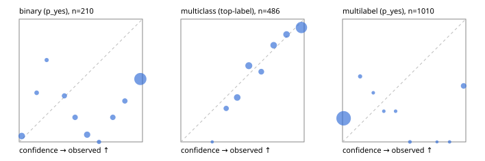

# Evaluation report

- model `Qwen/Qwen3-Reranker-4B` @ `22e683669b` (stock reranker pairs), adapter/checkpoint `None`, prompt `task-v1` (f7b8d8022dfb)
- data data/hf.jsonl, data/eval.jsonl; splits ['validation']; n=868; calibration `None`
- cuda / bfloat16; 2026-09-23T19:41:36+0000; wall 28.0s

## Overall

question accuracy 55.4%

**binary**: n 210, positives 79, accuracy 0.505, precision 0.423, recall 0.873, f1 0.570, auroc 0.749, brier 0.387, log_loss 1.601, ece 0.404

**multiclass**: n 486, accuracy 0.767, macro_f1 0.722, log_loss 0.580, brier 0.310, ece_top_label 0.054

**multilabel**: n 172, labels 1010, exact_match 0.012, micro_f1 0.185, macro_f1 0.248, label_auroc 0.695, brier 0.211, log_loss 1.048, ece 0.210

## By family

| family | n | question acc % | details |
|---|---|---|---|
| eval_adversarial | 14 | 71.4 | bin acc 57.1 F1 72.7 AUROC 0.400 ECE 0.284; mc acc 100.0 mF1 100.0 ECE 0.147; ml EM 50.0 µF1 75.0 ECE 0.167 |
| eval_agent_output | 20 | 50.0 | bin acc 58.3 F1 66.7 AUROC 0.694 ECE 0.317; mc acc 60.0 mF1 46.7 ECE 0.194; ml EM 0.0 µF1 0.0 ECE 0.441 |
| eval_evidence | 17 | 41.2 | bin acc 50.0 F1 58.8 AUROC 0.889 ECE 0.491; ml EM 0.0 µF1 44.4 ECE 0.610 |
| eval_multilabel | 12 | 8.3 | bin acc 0.0 F1 0.0 AUROC — ECE 0.593; mc acc 50.0 mF1 33.3 ECE 0.446; ml EM 0.0 µF1 57.1 ECE 0.392 |
| eval_policy | 24 | 41.7 | bin acc 58.3 F1 73.7 AUROC 0.400 ECE 0.413; mc acc 27.3 mF1 16.7 ECE 0.372; ml EM 0.0 µF1 66.7 ECE 0.481 |
| eval_routing | 16 | 81.2 | bin acc 85.7 F1 90.9 AUROC 1.000 ECE 0.138; mc acc 87.5 mF1 77.8 ECE 0.091; ml EM 0.0 µF1 0.0 ECE 0.161 |
| eval_urgency_sentiment | 15 | 53.3 | bin acc 42.9 F1 33.3 AUROC 0.625 ECE 0.365; mc acc 80.0 mF1 66.7 ECE 0.147; ml EM 33.3 µF1 33.3 ECE 0.399 |
| hf_emotions_multilabel | 150 | 0.0 | ml EM 0.0 µF1 0.0 ECE 0.191 |
| hf_intent_banking77 | 150 | 91.3 | mc acc 91.3 mF1 88.5 ECE 0.042 |
| hf_nli | 150 | 48.0 | bin acc 48.0 F1 51.9 AUROC 0.781 ECE 0.456 |
| hf_sentiment_tweets | 150 | 61.3 | mc acc 61.3 mF1 56.6 ECE 0.073 |
| hf_topic_agnews | 150 | 80.7 | mc acc 80.7 mF1 80.4 ECE 0.101 |

## by hard case

| slice | n | question acc % |
|---|---|---|
| (none) | 634 | 63.6 |
| contradiction | 63 | 22.2 |
| distractor | 20 | 30.0 |
| double_negation | 3 | 100.0 |
| evidence_end | 4 | 50.0 |
| evidence_middle | 7 | 42.9 |
| evidence_start | 3 | 33.3 |
| exception | 7 | 42.9 |
| hypothetical | 6 | 16.7 |
| injection | 16 | 75.0 |
| lexical_overlap | 13 | 61.5 |
| long_state | 26 | 38.5 |
| missing_evidence | 59 | 32.2 |
| multi_positive | 40 | 0.0 |
| multi_turn | 21 | 38.1 |
| negation | 9 | 44.4 |
| new_label_names | 5 | 20.0 |
| nota | 4 | 50.0 |
| numeric_reasoning | 13 | 38.5 |
| paraphrase | 10 | 60.0 |
| role_reversal | 7 | 28.6 |
| sarcasm | 5 | 40.0 |
| temporal_reasoning | 15 | 46.7 |
| zero_positive | 7 | 14.3 |

## by state tokens

| slice | n | question acc % |
|---|---|---|
| 00000-00127 | 796 | 55.9 |
| 00128-00511 | 46 | 56.5 |
| 00512-02047 | 26 | 38.5 |

## by candidates

| slice | n | question acc % |
|---|---|---|
| 01 | 210 | 50.5 |
| 03 | 162 | 61.1 |
| 04 | 174 | 77.6 |
| 05 | 13 | 30.8 |
| 06 | 159 | 0.0 |
| 08 | 150 | 91.3 |

## Paraphrase groups

5 groups; same prediction 60.0%; all correct 60.0%

## Multiclass abstention (coverage vs error on accepted)

| abstain_below | coverage % | error % |
|---|---|---|
| 0.0 | 100.0 | 23.3 |
| 0.4 | 95.3 | 20.7 |
| 0.5 | 85.6 | 15.9 |
| 0.6 | 73.7 | 12.3 |
| 0.7 | 67.9 | 9.7 |
| 0.8 | 58.2 | 7.8 |
| 0.9 | 48.4 | 6.8 |

## Reliability: binary

| bin | n | mean confidence | observed frequency |
|---|---|---|---|
| [0.0,0.1) | 21 | 0.021 | 0.048 |
| [0.1,0.2) | 5 | 0.142 | 0.400 |
| [0.2,0.3) | 3 | 0.223 | 0.667 |
| [0.3,0.4) | 8 | 0.367 | 0.375 |
| [0.4,0.5) | 10 | 0.453 | 0.200 |
| [0.5,0.6) | 17 | 0.551 | 0.059 |
| [0.6,0.7) | 4 | 0.647 | 0.000 |
| [0.7,0.8) | 10 | 0.760 | 0.200 |
| [0.8,0.9) | 9 | 0.857 | 0.333 |
| [0.9,1.0] | 123 | 0.983 | 0.512 |

## Reliability: multiclass

| bin | n | mean confidence | observed frequency |
|---|---|---|---|
| [0.2,0.3) | 1 | 0.255 | 0.000 |
| [0.3,0.4) | 22 | 0.368 | 0.273 |
| [0.4,0.5) | 47 | 0.457 | 0.362 |
| [0.5,0.6) | 58 | 0.551 | 0.621 |
| [0.6,0.7) | 28 | 0.652 | 0.571 |
| [0.7,0.8) | 47 | 0.753 | 0.787 |
| [0.8,0.9) | 48 | 0.857 | 0.875 |
| [0.9,1.0] | 235 | 0.978 | 0.932 |

## Reliability: multilabel

| bin | n | mean confidence | observed frequency |
|---|---|---|---|
| [0.0,0.1) | 915 | 0.009 | 0.192 |
| [0.1,0.2) | 15 | 0.143 | 0.533 |
| [0.2,0.3) | 5 | 0.249 | 0.400 |
| [0.3,0.4) | 4 | 0.335 | 0.250 |
| [0.4,0.5) | 4 | 0.430 | 0.250 |
| [0.5,0.6) | 6 | 0.546 | 0.000 |
| [0.7,0.8) | 1 | 0.766 | 0.000 |
| [0.8,0.9) | 3 | 0.868 | 0.000 |
| [0.9,1.0] | 57 | 0.982 | 0.456 |
