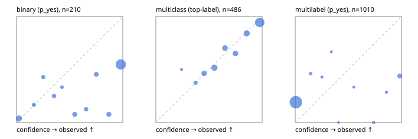

# Evaluation report

- model `Qwen/Qwen3-Reranker-4B` @ `22e683669b` (stock reranker pairs), adapter/checkpoint `None`, prompt `task-v2` (16961aedae12)
- data data/hf.jsonl, data/eval.jsonl; splits ['validation']; n=868; calibration `None`
- cuda / bfloat16; 2026-09-23T19:42:09+0000; wall 32.4s

## Overall

question accuracy 56.3%

**binary**: n 210, positives 79, accuracy 0.538, precision 0.444, recall 0.899, f1 0.594, auroc 0.779, brier 0.358, log_loss 1.432, ece 0.364

**multiclass**: n 486, accuracy 0.767, macro_f1 0.736, log_loss 0.593, brier 0.320, ece_top_label 0.036

**multilabel**: n 172, labels 1010, exact_match 0.017, micro_f1 0.195, macro_f1 0.248, label_auroc 0.682, brier 0.216, log_loss 1.172, ece 0.214

## By family

| family | n | question acc % | details |
|---|---|---|---|
| eval_adversarial | 14 | 71.4 | bin acc 71.4 F1 83.3 AUROC 0.500 ECE 0.243; mc acc 100.0 mF1 100.0 ECE 0.169; ml EM 0.0 µF1 66.7 ECE 0.272 |
| eval_agent_output | 20 | 40.0 | bin acc 58.3 F1 66.7 AUROC 0.500 ECE 0.397; mc acc 20.0 mF1 9.5 ECE 0.360; ml EM 0.0 µF1 0.0 ECE 0.644 |
| eval_evidence | 17 | 35.3 | bin acc 42.9 F1 55.6 AUROC 0.844 ECE 0.472; ml EM 0.0 µF1 44.4 ECE 0.626 |
| eval_multilabel | 12 | 16.7 | bin acc 0.0 F1 0.0 AUROC — ECE 0.651; mc acc 50.0 mF1 33.3 ECE 0.454; ml EM 11.1 µF1 62.1 ECE 0.359 |
| eval_policy | 24 | 45.8 | bin acc 58.3 F1 73.7 AUROC 0.371 ECE 0.394; mc acc 36.4 mF1 23.5 ECE 0.275; ml EM 0.0 µF1 66.7 ECE 0.491 |
| eval_routing | 16 | 87.5 | bin acc 85.7 F1 90.9 AUROC 0.900 ECE 0.109; mc acc 87.5 mF1 77.8 ECE 0.182; ml EM 100.0 µF1 0.0 ECE 0.165 |
| eval_urgency_sentiment | 15 | 60.0 | bin acc 42.9 F1 50.0 AUROC 0.500 ECE 0.457; mc acc 100.0 mF1 100.0 ECE 0.218; ml EM 33.3 µF1 28.6 ECE 0.425 |
| hf_emotions_multilabel | 150 | 0.0 | ml EM 0.0 µF1 0.0 ECE 0.194 |
| hf_intent_banking77 | 150 | 93.3 | mc acc 93.3 mF1 90.4 ECE 0.039 |
| hf_nli | 150 | 52.7 | bin acc 52.7 F1 54.2 AUROC 0.826 ECE 0.397 |
| hf_sentiment_tweets | 150 | 61.3 | mc acc 61.3 mF1 58.5 ECE 0.051 |
| hf_topic_agnews | 150 | 78.7 | mc acc 78.7 mF1 78.0 ECE 0.089 |

## by hard case

| slice | n | question acc % |
|---|---|---|
| (none) | 634 | 63.4 |
| contradiction | 63 | 31.7 |
| distractor | 20 | 35.0 |
| double_negation | 3 | 100.0 |
| evidence_end | 4 | 50.0 |
| evidence_middle | 7 | 71.4 |
| evidence_start | 3 | 33.3 |
| exception | 7 | 57.1 |
| hypothetical | 6 | 16.7 |
| injection | 16 | 68.8 |
| lexical_overlap | 13 | 61.5 |
| long_state | 26 | 42.3 |
| missing_evidence | 59 | 30.5 |
| multi_positive | 40 | 2.5 |
| multi_turn | 21 | 33.3 |
| negation | 9 | 66.7 |
| new_label_names | 5 | 60.0 |
| nota | 4 | 50.0 |
| numeric_reasoning | 13 | 46.2 |
| paraphrase | 10 | 70.0 |
| role_reversal | 7 | 28.6 |
| sarcasm | 5 | 40.0 |
| temporal_reasoning | 15 | 46.7 |
| zero_positive | 7 | 28.6 |

## by state tokens

| slice | n | question acc % |
|---|---|---|
| 00000-00127 | 796 | 56.5 |
| 00128-00511 | 46 | 60.9 |
| 00512-02047 | 26 | 42.3 |

## by candidates

| slice | n | question acc % |
|---|---|---|
| 01 | 210 | 53.8 |
| 03 | 162 | 61.1 |
| 04 | 174 | 77.0 |
| 05 | 13 | 15.4 |
| 06 | 159 | 0.6 |
| 08 | 150 | 93.3 |

## Paraphrase groups

5 groups; same prediction 60.0%; all correct 60.0%

## Multiclass abstention (coverage vs error on accepted)

| abstain_below | coverage % | error % |
|---|---|---|
| 0.0 | 100.0 | 23.3 |
| 0.4 | 96.3 | 21.8 |
| 0.5 | 87.9 | 18.7 |
| 0.6 | 75.5 | 13.9 |
| 0.7 | 65.8 | 11.6 |
| 0.8 | 57.0 | 7.9 |
| 0.9 | 44.0 | 5.6 |

## Reliability: binary

| bin | n | mean confidence | observed frequency |
|---|---|---|---|
| [0.0,0.1) | 26 | 0.023 | 0.038 |
| [0.1,0.2) | 6 | 0.163 | 0.167 |
| [0.2,0.3) | 7 | 0.251 | 0.429 |
| [0.3,0.4) | 8 | 0.353 | 0.250 |
| [0.4,0.5) | 3 | 0.428 | 0.333 |
| [0.5,0.6) | 13 | 0.548 | 0.077 |
| [0.6,0.7) | 8 | 0.655 | 0.125 |
| [0.7,0.8) | 11 | 0.751 | 0.455 |
| [0.8,0.9) | 13 | 0.869 | 0.077 |
| [0.9,1.0] | 115 | 0.981 | 0.548 |

## Reliability: multiclass

| bin | n | mean confidence | observed frequency |
|---|---|---|---|
| [0.2,0.3) | 2 | 0.241 | 0.500 |
| [0.3,0.4) | 16 | 0.374 | 0.375 |
| [0.4,0.5) | 41 | 0.454 | 0.463 |
| [0.5,0.6) | 60 | 0.551 | 0.517 |
| [0.6,0.7) | 47 | 0.651 | 0.702 |
| [0.7,0.8) | 43 | 0.749 | 0.651 |
| [0.8,0.9) | 63 | 0.855 | 0.841 |
| [0.9,1.0] | 214 | 0.977 | 0.944 |

## Reliability: multilabel

| bin | n | mean confidence | observed frequency |
|---|---|---|---|
| [0.0,0.1) | 913 | 0.006 | 0.192 |
| [0.1,0.2) | 13 | 0.145 | 0.462 |
| [0.2,0.3) | 7 | 0.252 | 0.429 |
| [0.3,0.4) | 3 | 0.340 | 0.667 |
| [0.4,0.5) | 1 | 0.407 | 0.000 |
| [0.5,0.6) | 3 | 0.552 | 0.333 |
| [0.7,0.8) | 6 | 0.739 | 0.000 |
| [0.8,0.9) | 7 | 0.858 | 0.286 |
| [0.9,1.0] | 57 | 0.984 | 0.439 |
