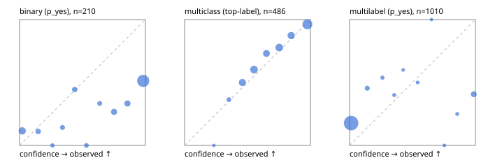

# Evaluation report

- model `Qwen/Qwen3-Reranker-8B` @ `77d193c791` (stock reranker pairs), adapter/checkpoint `None`, prompt `answer-v1` (724795e9b666)
- data data/hf.jsonl, data/eval.jsonl; splits ['validation']; n=868; calibration `None`
- cuda / bfloat16; 2026-09-23T20:55:26+0000; wall 55.5s

## Overall

question accuracy 57.1%

**binary**: n 210, positives 79, accuracy 0.548, precision 0.449, recall 0.886, f1 0.596, auroc 0.749, brier 0.372, log_loss 1.575, ece 0.374

**multiclass**: n 486, accuracy 0.776, macro_f1 0.736, log_loss 0.582, brier 0.317, ece_top_label 0.033

**multilabel**: n 172, labels 1010, exact_match 0.023, micro_f1 0.212, macro_f1 0.257, label_auroc 0.712, brier 0.208, log_loss 0.947, ece 0.200

## By family

| family | n | question acc % | details |
|---|---|---|---|
| eval_adversarial | 14 | 85.7 | bin acc 85.7 F1 90.9 AUROC 0.800 ECE 0.199; mc acc 100.0 mF1 100.0 ECE 0.306; ml EM 50.0 µF1 75.0 ECE 0.240 |
| eval_agent_output | 20 | 50.0 | bin acc 50.0 F1 50.0 AUROC 0.528 ECE 0.469; mc acc 80.0 mF1 60.0 ECE 0.287; ml EM 0.0 µF1 0.0 ECE 0.596 |
| eval_evidence | 17 | 35.3 | bin acc 42.9 F1 55.6 AUROC 0.833 ECE 0.537; ml EM 0.0 µF1 42.1 ECE 0.674 |
| eval_multilabel | 12 | 25.0 | bin acc 0.0 F1 0.0 AUROC — ECE 0.818; mc acc 100.0 mF1 100.0 ECE 0.387; ml EM 11.1 µF1 63.3 ECE 0.413 |
| eval_policy | 24 | 45.8 | bin acc 58.3 F1 73.7 AUROC 0.629 ECE 0.376; mc acc 36.4 mF1 23.5 ECE 0.150; ml EM 0.0 µF1 66.7 ECE 0.496 |
| eval_routing | 16 | 75.0 | bin acc 85.7 F1 90.9 AUROC 1.000 ECE 0.123; mc acc 75.0 mF1 61.9 ECE 0.186; ml EM 0.0 µF1 0.0 ECE 0.185 |
| eval_urgency_sentiment | 15 | 53.3 | bin acc 42.9 F1 50.0 AUROC 0.417 ECE 0.481; mc acc 80.0 mF1 66.7 ECE 0.204; ml EM 33.3 µF1 33.3 ECE 0.340 |
| hf_emotions_multilabel | 150 | 0.7 | ml EM 0.7 µF1 2.2 ECE 0.176 |
| hf_intent_banking77 | 150 | 91.3 | mc acc 91.3 mF1 86.8 ECE 0.039 |
| hf_nli | 150 | 54.0 | bin acc 54.0 F1 55.5 AUROC 0.812 ECE 0.412 |
| hf_sentiment_tweets | 150 | 60.7 | mc acc 60.7 mF1 55.7 ECE 0.043 |
| hf_topic_agnews | 150 | 82.7 | mc acc 82.7 mF1 82.8 ECE 0.080 |

## by hard case

| slice | n | question acc % |
|---|---|---|
| (none) | 634 | 64.4 |
| contradiction | 63 | 34.9 |
| distractor | 20 | 25.0 |
| double_negation | 3 | 100.0 |
| evidence_end | 4 | 50.0 |
| evidence_middle | 7 | 57.1 |
| evidence_start | 3 | 33.3 |
| exception | 7 | 42.9 |
| hypothetical | 6 | 16.7 |
| injection | 16 | 75.0 |
| lexical_overlap | 13 | 53.8 |
| long_state | 26 | 38.5 |
| missing_evidence | 59 | 32.2 |
| multi_positive | 40 | 0.0 |
| multi_turn | 21 | 28.6 |
| negation | 9 | 55.6 |
| new_label_names | 5 | 40.0 |
| nota | 4 | 50.0 |
| numeric_reasoning | 13 | 38.5 |
| paraphrase | 10 | 50.0 |
| role_reversal | 7 | 28.6 |
| sarcasm | 5 | 80.0 |
| temporal_reasoning | 15 | 53.3 |
| zero_positive | 7 | 28.6 |

## by state tokens

| slice | n | question acc % |
|---|---|---|
| 00000-00127 | 796 | 58.0 |
| 00128-00511 | 46 | 52.2 |
| 00512-02047 | 26 | 38.5 |

## by candidates

| slice | n | question acc % |
|---|---|---|
| 01 | 210 | 54.8 |
| 03 | 162 | 60.5 |
| 04 | 174 | 79.3 |
| 05 | 13 | 53.8 |
| 06 | 159 | 0.6 |
| 08 | 150 | 91.3 |

## Paraphrase groups

5 groups; same prediction 40.0%; all correct 40.0%

## Multiclass abstention (coverage vs error on accepted)

| abstain_below | coverage % | error % |
|---|---|---|
| 0.0 | 100.0 | 22.4 |
| 0.4 | 97.5 | 21.3 |
| 0.5 | 86.0 | 17.5 |
| 0.6 | 71.0 | 12.8 |
| 0.7 | 60.3 | 10.2 |
| 0.8 | 45.5 | 6.3 |
| 0.9 | 32.5 | 3.8 |

## Reliability: binary

| bin | n | mean confidence | observed frequency |
|---|---|---|---|
| [0.0,0.1) | 26 | 0.021 | 0.115 |
| [0.1,0.2) | 9 | 0.148 | 0.111 |
| [0.2,0.3) | 3 | 0.261 | 0.000 |
| [0.3,0.4) | 7 | 0.341 | 0.143 |
| [0.4,0.5) | 9 | 0.438 | 0.444 |
| [0.5,0.6) | 5 | 0.531 | 0.000 |
| [0.6,0.7) | 6 | 0.637 | 0.333 |
| [0.7,0.8) | 15 | 0.750 | 0.267 |
| [0.8,0.9) | 15 | 0.857 | 0.333 |
| [0.9,1.0] | 115 | 0.982 | 0.513 |

## Reliability: multiclass

| bin | n | mean confidence | observed frequency |
|---|---|---|---|
| [0.2,0.3) | 1 | 0.233 | 0.000 |
| [0.3,0.4) | 11 | 0.352 | 0.364 |
| [0.4,0.5) | 56 | 0.459 | 0.500 |
| [0.5,0.6) | 73 | 0.552 | 0.603 |
| [0.6,0.7) | 52 | 0.650 | 0.731 |
| [0.7,0.8) | 72 | 0.752 | 0.778 |
| [0.8,0.9) | 63 | 0.847 | 0.873 |
| [0.9,1.0] | 158 | 0.976 | 0.962 |

## Reliability: multilabel

| bin | n | mean confidence | observed frequency |
|---|---|---|---|
| [0.0,0.1) | 870 | 0.012 | 0.177 |
| [0.1,0.2) | 33 | 0.141 | 0.455 |
| [0.2,0.3) | 13 | 0.261 | 0.538 |
| [0.3,0.4) | 10 | 0.355 | 0.400 |
| [0.4,0.5) | 5 | 0.426 | 0.600 |
| [0.5,0.6) | 6 | 0.541 | 0.500 |
| [0.6,0.7) | 2 | 0.651 | 1.000 |
| [0.7,0.8) | 4 | 0.753 | 0.000 |
| [0.8,0.9) | 8 | 0.855 | 0.250 |
| [0.9,1.0] | 59 | 0.987 | 0.407 |
