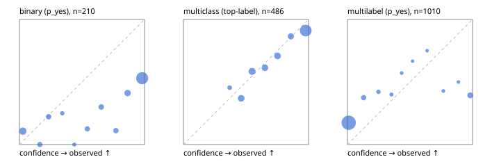

# Evaluation report

- model `Qwen/Qwen3-Reranker-8B` @ `77d193c791` (stock reranker pairs), adapter/checkpoint `None`, prompt `hybrid-v1` (b894703d500d)
- data data/hf.jsonl, data/eval.jsonl; splits ['validation']; n=868; calibration `None`
- cuda / bfloat16; 2026-09-23T20:57:58+0000; wall 51.3s

## Overall

question accuracy 56.9%

**binary**: n 210, positives 79, accuracy 0.562, precision 0.459, recall 0.924, f1 0.613, auroc 0.771, brier 0.358, log_loss 1.471, ece 0.368

**multiclass**: n 486, accuracy 0.763, macro_f1 0.712, log_loss 0.618, brier 0.328, ece_top_label 0.057

**multilabel**: n 172, labels 1010, exact_match 0.029, micro_f1 0.232, macro_f1 0.280, label_auroc 0.760, brier 0.204, log_loss 0.930, ece 0.194

## By family

| family | n | question acc % | details |
|---|---|---|---|
| eval_adversarial | 14 | 85.7 | bin acc 85.7 F1 90.9 AUROC 0.650 ECE 0.179; mc acc 100.0 mF1 100.0 ECE 0.204; ml EM 50.0 µF1 75.0 ECE 0.197 |
| eval_agent_output | 20 | 55.0 | bin acc 58.3 F1 66.7 AUROC 0.556 ECE 0.412; mc acc 80.0 mF1 60.0 ECE 0.184; ml EM 0.0 µF1 0.0 ECE 0.688 |
| eval_evidence | 17 | 35.3 | bin acc 42.9 F1 55.6 AUROC 0.844 ECE 0.537; ml EM 0.0 µF1 44.4 ECE 0.657 |
| eval_multilabel | 12 | 16.7 | bin acc 0.0 F1 0.0 AUROC — ECE 0.881; mc acc 50.0 mF1 33.3 ECE 0.251; ml EM 11.1 µF1 64.4 ECE 0.369 |
| eval_policy | 24 | 41.7 | bin acc 58.3 F1 73.7 AUROC 0.643 ECE 0.400; mc acc 27.3 mF1 16.7 ECE 0.364; ml EM 0.0 µF1 66.7 ECE 0.495 |
| eval_routing | 16 | 81.2 | bin acc 85.7 F1 90.9 AUROC 0.900 ECE 0.137; mc acc 87.5 mF1 81.0 ECE 0.191; ml EM 0.0 µF1 0.0 ECE 0.196 |
| eval_urgency_sentiment | 15 | 46.7 | bin acc 42.9 F1 50.0 AUROC 0.417 ECE 0.498; mc acc 60.0 mF1 42.9 ECE 0.221; ml EM 33.3 µF1 33.3 ECE 0.360 |
| hf_emotions_multilabel | 150 | 1.3 | ml EM 1.3 µF1 5.4 ECE 0.173 |
| hf_intent_banking77 | 150 | 90.7 | mc acc 90.7 mF1 88.2 ECE 0.031 |
| hf_nli | 150 | 55.3 | bin acc 55.3 F1 56.8 AUROC 0.819 ECE 0.391 |
| hf_sentiment_tweets | 150 | 64.7 | mc acc 64.7 mF1 61.0 ECE 0.041 |
| hf_topic_agnews | 150 | 76.7 | mc acc 76.7 mF1 75.8 ECE 0.153 |

## by hard case

| slice | n | question acc % |
|---|---|---|
| (none) | 634 | 63.9 |
| contradiction | 63 | 28.6 |
| distractor | 20 | 25.0 |
| double_negation | 3 | 100.0 |
| evidence_end | 4 | 50.0 |
| evidence_middle | 7 | 57.1 |
| evidence_start | 3 | 33.3 |
| exception | 7 | 57.1 |
| hypothetical | 6 | 16.7 |
| injection | 16 | 62.5 |
| lexical_overlap | 13 | 69.2 |
| long_state | 26 | 38.5 |
| missing_evidence | 59 | 40.7 |
| multi_positive | 40 | 2.5 |
| multi_turn | 21 | 33.3 |
| negation | 9 | 55.6 |
| new_label_names | 5 | 60.0 |
| nota | 4 | 25.0 |
| numeric_reasoning | 13 | 38.5 |
| paraphrase | 10 | 70.0 |
| role_reversal | 7 | 28.6 |
| sarcasm | 5 | 80.0 |
| temporal_reasoning | 15 | 40.0 |
| zero_positive | 7 | 14.3 |

## by state tokens

| slice | n | question acc % |
|---|---|---|
| 00000-00127 | 796 | 57.7 |
| 00128-00511 | 46 | 54.3 |
| 00512-02047 | 26 | 38.5 |

## by candidates

| slice | n | question acc % |
|---|---|---|
| 01 | 210 | 56.2 |
| 03 | 162 | 63.6 |
| 04 | 174 | 74.1 |
| 05 | 13 | 38.5 |
| 06 | 159 | 1.9 |
| 08 | 150 | 90.7 |

## Paraphrase groups

5 groups; same prediction 60.0%; all correct 60.0%

## Multiclass abstention (coverage vs error on accepted)

| abstain_below | coverage % | error % |
|---|---|---|
| 0.0 | 100.0 | 23.7 |
| 0.4 | 97.7 | 22.9 |
| 0.5 | 88.3 | 18.6 |
| 0.6 | 77.4 | 15.4 |
| 0.7 | 68.3 | 12.3 |
| 0.8 | 58.4 | 9.5 |
| 0.9 | 50.8 | 8.9 |

## Reliability: binary

| bin | n | mean confidence | observed frequency |
|---|---|---|---|
| [0.0,0.1) | 28 | 0.027 | 0.107 |
| [0.1,0.2) | 8 | 0.163 | 0.000 |
| [0.2,0.3) | 9 | 0.233 | 0.222 |
| [0.3,0.4) | 4 | 0.342 | 0.250 |
| [0.4,0.5) | 2 | 0.438 | 0.000 |
| [0.5,0.6) | 8 | 0.543 | 0.125 |
| [0.6,0.7) | 10 | 0.654 | 0.300 |
| [0.7,0.8) | 9 | 0.771 | 0.111 |
| [0.8,0.9) | 17 | 0.864 | 0.412 |
| [0.9,1.0] | 115 | 0.981 | 0.530 |

## Reliability: multiclass

| bin | n | mean confidence | observed frequency |
|---|---|---|---|
| [0.3,0.4) | 11 | 0.370 | 0.455 |
| [0.4,0.5) | 46 | 0.462 | 0.370 |
| [0.5,0.6) | 53 | 0.548 | 0.585 |
| [0.6,0.7) | 44 | 0.652 | 0.614 |
| [0.7,0.8) | 48 | 0.752 | 0.708 |
| [0.8,0.9) | 37 | 0.859 | 0.865 |
| [0.9,1.0] | 247 | 0.978 | 0.911 |

## Reliability: multilabel

| bin | n | mean confidence | observed frequency |
|---|---|---|---|
| [0.0,0.1) | 855 | 0.010 | 0.174 |
| [0.1,0.2) | 40 | 0.130 | 0.375 |
| [0.2,0.3) | 19 | 0.248 | 0.421 |
| [0.3,0.4) | 10 | 0.352 | 0.400 |
| [0.4,0.5) | 7 | 0.434 | 0.571 |
| [0.5,0.6) | 3 | 0.521 | 0.667 |
| [0.6,0.7) | 4 | 0.637 | 0.750 |
| [0.7,0.8) | 7 | 0.767 | 0.429 |
| [0.8,0.9) | 4 | 0.887 | 0.500 |
| [0.9,1.0] | 61 | 0.982 | 0.393 |
