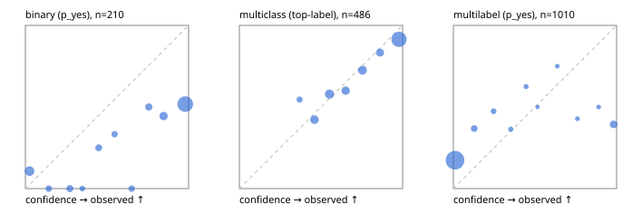

# Evaluation report

- model `Qwen/Qwen3-Reranker-8B` @ `77d193c791` (stock reranker pairs), adapter/checkpoint `None`, prompt `task-v2` (16961aedae12)
- data data/hf.jsonl, data/eval.jsonl; splits ['validation']; n=868; calibration `None`
- cuda / bfloat16; 2026-09-23T20:57:06+0000; wall 53.0s

## Overall

question accuracy 57.9%

**binary**: n 210, positives 79, accuracy 0.590, precision 0.477, recall 0.937, f1 0.632, auroc 0.773, brier 0.347, log_loss 1.405, ece 0.365

**multiclass**: n 486, accuracy 0.770, macro_f1 0.712, log_loss 0.618, brier 0.327, ece_top_label 0.052

**multilabel**: n 172, labels 1010, exact_match 0.029, micro_f1 0.226, macro_f1 0.274, label_auroc 0.760, brier 0.204, log_loss 0.929, ece 0.194

## By family

| family | n | question acc % | details |
|---|---|---|---|
| eval_adversarial | 14 | 85.7 | bin acc 85.7 F1 90.9 AUROC 1.000 ECE 0.193; mc acc 100.0 mF1 100.0 ECE 0.202; ml EM 50.0 µF1 75.0 ECE 0.197 |
| eval_agent_output | 20 | 50.0 | bin acc 50.0 F1 57.1 AUROC 0.583 ECE 0.362; mc acc 80.0 mF1 60.0 ECE 0.188; ml EM 0.0 µF1 0.0 ECE 0.689 |
| eval_evidence | 17 | 41.2 | bin acc 50.0 F1 58.8 AUROC 0.822 ECE 0.494; ml EM 0.0 µF1 44.4 ECE 0.658 |
| eval_multilabel | 12 | 16.7 | bin acc 0.0 F1 0.0 AUROC — ECE 0.953; mc acc 50.0 mF1 33.3 ECE 0.560; ml EM 11.1 µF1 64.4 ECE 0.380 |
| eval_policy | 24 | 41.7 | bin acc 58.3 F1 73.7 AUROC 0.514 ECE 0.392; mc acc 27.3 mF1 16.7 ECE 0.371; ml EM 0.0 µF1 66.7 ECE 0.494 |
| eval_routing | 16 | 81.2 | bin acc 85.7 F1 90.9 AUROC 1.000 ECE 0.126; mc acc 87.5 mF1 81.0 ECE 0.191; ml EM 0.0 µF1 0.0 ECE 0.196 |
| eval_urgency_sentiment | 15 | 53.3 | bin acc 57.1 F1 66.7 AUROC 0.500 ECE 0.429; mc acc 60.0 mF1 42.9 ECE 0.222; ml EM 33.3 µF1 33.3 ECE 0.359 |
| hf_emotions_multilabel | 150 | 1.3 | ml EM 1.3 µF1 4.3 ECE 0.173 |
| hf_intent_banking77 | 150 | 90.7 | mc acc 90.7 mF1 88.2 ECE 0.029 |
| hf_nli | 150 | 58.7 | bin acc 58.7 F1 59.2 AUROC 0.845 ECE 0.392 |
| hf_sentiment_tweets | 150 | 66.7 | mc acc 66.7 mF1 62.7 ECE 0.061 |
| hf_topic_agnews | 150 | 76.7 | mc acc 76.7 mF1 75.6 ECE 0.148 |

## by hard case

| slice | n | question acc % |
|---|---|---|
| (none) | 634 | 64.7 |
| contradiction | 63 | 38.1 |
| distractor | 20 | 30.0 |
| double_negation | 3 | 100.0 |
| evidence_end | 4 | 50.0 |
| evidence_middle | 7 | 57.1 |
| evidence_start | 3 | 33.3 |
| exception | 7 | 57.1 |
| hypothetical | 6 | 16.7 |
| injection | 16 | 62.5 |
| lexical_overlap | 13 | 61.5 |
| long_state | 26 | 42.3 |
| missing_evidence | 59 | 39.0 |
| multi_positive | 40 | 2.5 |
| multi_turn | 21 | 33.3 |
| negation | 9 | 55.6 |
| new_label_names | 5 | 60.0 |
| nota | 4 | 25.0 |
| numeric_reasoning | 13 | 38.5 |
| paraphrase | 10 | 60.0 |
| role_reversal | 7 | 28.6 |
| sarcasm | 5 | 80.0 |
| temporal_reasoning | 15 | 40.0 |
| zero_positive | 7 | 14.3 |

## by state tokens

| slice | n | question acc % |
|---|---|---|
| 00000-00127 | 796 | 58.7 |
| 00128-00511 | 46 | 54.3 |
| 00512-02047 | 26 | 42.3 |

## by candidates

| slice | n | question acc % |
|---|---|---|
| 01 | 210 | 59.0 |
| 03 | 162 | 65.4 |
| 04 | 174 | 74.1 |
| 05 | 13 | 38.5 |
| 06 | 159 | 1.9 |
| 08 | 150 | 90.7 |

## Paraphrase groups

5 groups; same prediction 40.0%; all correct 40.0%

## Multiclass abstention (coverage vs error on accepted)

| abstain_below | coverage % | error % |
|---|---|---|
| 0.0 | 100.0 | 23.0 |
| 0.4 | 97.7 | 22.5 |
| 0.5 | 88.5 | 18.8 |
| 0.6 | 76.7 | 15.3 |
| 0.7 | 68.5 | 12.3 |
| 0.8 | 58.0 | 9.6 |
| 0.9 | 50.6 | 8.5 |

## Reliability: binary

| bin | n | mean confidence | observed frequency |
|---|---|---|---|
| [0.0,0.1) | 28 | 0.026 | 0.107 |
| [0.1,0.2) | 7 | 0.143 | 0.000 |
| [0.2,0.3) | 9 | 0.273 | 0.000 |
| [0.3,0.4) | 3 | 0.349 | 0.000 |
| [0.4,0.5) | 8 | 0.449 | 0.250 |
| [0.5,0.6) | 6 | 0.546 | 0.333 |
| [0.6,0.7) | 7 | 0.651 | 0.000 |
| [0.7,0.8) | 10 | 0.756 | 0.500 |
| [0.8,0.9) | 18 | 0.847 | 0.444 |
| [0.9,1.0] | 114 | 0.979 | 0.518 |

## Reliability: multiclass

| bin | n | mean confidence | observed frequency |
|---|---|---|---|
| [0.3,0.4) | 11 | 0.369 | 0.545 |
| [0.4,0.5) | 45 | 0.460 | 0.422 |
| [0.5,0.6) | 57 | 0.552 | 0.579 |
| [0.6,0.7) | 40 | 0.651 | 0.600 |
| [0.7,0.8) | 51 | 0.754 | 0.725 |
| [0.8,0.9) | 36 | 0.862 | 0.833 |
| [0.9,1.0] | 246 | 0.978 | 0.915 |

## Reliability: multilabel

| bin | n | mean confidence | observed frequency |
|---|---|---|---|
| [0.0,0.1) | 856 | 0.010 | 0.174 |
| [0.1,0.2) | 38 | 0.128 | 0.368 |
| [0.2,0.3) | 19 | 0.246 | 0.474 |
| [0.3,0.4) | 11 | 0.351 | 0.364 |
| [0.4,0.5) | 8 | 0.446 | 0.625 |
| [0.5,0.6) | 2 | 0.516 | 0.500 |
| [0.6,0.7) | 4 | 0.637 | 0.750 |
| [0.7,0.8) | 7 | 0.760 | 0.429 |
| [0.8,0.9) | 4 | 0.890 | 0.500 |
| [0.9,1.0] | 61 | 0.982 | 0.393 |
