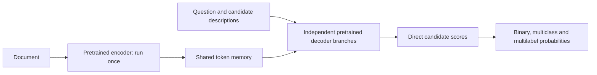

# Next architecture for SelfJev

> **Correction, 24 September 2026 UTC:** a completed T5Gemma 2 experiment was subsequently found in the older challenger worktree. It already implements the architecture proposed below and did not beat the R1 tree on speed/quality together. The user correctly recalled it. This memo is superseded by the [prior-run audit and matched round-2b follow-up](t5_round2b_2026-09-24/README.md); the remaining new question is whether matched round-2b training and bounded cross-cache memory improve the result.

Recommendation prepared 24 September 2026 UTC. This is a research recommendation, not a trained model or a latency forecast. No new GPU instances, paid model calls, branches or commits were created.

**The strongest new architecture experiment is a pretrained encoder–decoder adapted to parallel decisions.** Start with T5Gemma 2 1B–1B, keep its full pretrained reader, and share document memory across independent question/candidate branches. Keep the smaller-tree experiment already running in the other session as the lower-risk comparison. A small joint text/label encoder is a useful third challenger for shorter inputs.

**What the latest evidence changes.**

| Evidence | Measured result | Consequence |
|---|---|---|
| Target-task eval2, 1,991 questions | R1 85.1%; round-2b 90.6%; Jev 97.2% | There is a substantial remaining quality gap; the old development benchmark understated it. |
| Eval2 multilabel exact match | Round-2b 78.8%; Jev 94.2% | Report whole-question correctness as well as individual-label metrics. |
| Eval2 numeric / temporal slices | Round-2b 78.6% / 77.8%; Jev 92.0% / 89.2% | Preserve instruction/evidence interaction; semantic similarity alone is a poor target. |
| R1 A10G resident-model inference, new prefix, 2,048 text tokens × 16 questions × 3 candidates | vLLM 700.37 ms; compact vLLM 648.49 ms | The compact format's 7.4% gain does not close the speed gap. |
| Same-client service sweep at that shape | Jev 156 ms median; R1 vLLM 767 ms | Deployment latency still needs a large improvement. |

Sources: [eval2](eval2/summary.md), [controlled latency experiment](latency_optimization_2026-09-24/conclusions.md), and [service sweep](latency/summary.md). The quality table uses round-2b; the quoted local latency experiments use R1. They are not a single measured round-2b operating point. Eval2 labels are authored and LLM-reviewed, not a fully human-verified ground truth. Its length slices differ in content, so they are not controlled length ablations.

The round-2 recipe materially improves eval2. It does not isolate data from training exposure, and it does not establish that model capacity is irrelevant. Earlier 4B-versus-8B and LoRA-capacity conclusions should be revisited on appropriate data before treating them as universal ceilings.

**The proposed reader.**

The first version should preserve every document token and the complete pretrained decoder. Encode the document once. Feed each known question/candidate prefix through the decoder, with access to the shared encoder memory, then read a classification score directly. All prefixes are known inputs: no answer strings or explanations need to be generated. Use a retained yes/no readout when the tokenizer and checkpoint support a suitable mapping, otherwise train a small scalar head while retaining the pretrained interaction stack.

Questions must remain independent. Pack or batch decoder branches without allowing cross-question attention; compare their scores against separate inference. Cache the encoder-side key/value projections once per decoder layer and document, rather than copying or recomputing them for every candidate. A stock batch call does not prove this sharing occurs: count actual projections and profile the implementation.

T5Gemma 2 supplies pretrained document-to-decoder interaction, including merged self/cross-attention. The 1B–1B variant has roughly 1.7B text parameters with tied embeddings; the smaller 270M–270M variant is roughly 370M, excluding the vision encoder. These are starting points, not SelfJev-ready classifiers. [Google's release](https://blog.google/innovation-and-ai/technology/developers-tools/t5gemma-2/), [model card](https://huggingface.co/google/t5gemma-2-1b-1b), [architecture paper](https://arxiv.org/html/2512.14856v1).

This proposal puts question/candidate prefixes in the decoder while the document is in the encoder. That is a task adaptation, not the released checkpoint's native instruction interface. Its effect on quality must be learned and tested. The pretrained release should not be rejected solely on an untrained zero-shot score in this new format. Hugging Face's generic serving snippets are also not evidence that an inference engine supports this exact shared-memory scoring path.

**Why it is different from our previous cross-attention attempt.**

The previous model independently ran the state and candidate through a causal reranker, projected the representations to width 256, then added two new cross-attention blocks and new heads. Its initial frozen version scored 39.0% on the old benchmark; the similarity-plus-LoRA version reached 58.2%. The token memory was not a single pooled document vector, but the new interaction stack was narrow and shallow. It had to learn instruction-conditioned evidence reading from our supervised mix. [Implementation and diagnostics](../docs/custom_model.md).

The proposed replacement starts with an encoder and reader already trained together at scale. It keeps deep interaction and postpones pruning or aggressive memory compression until after a good quality baseline exists. The previous failure makes this distinction worth testing; it does not guarantee success.

**Where the speed could come from.**

Our tree already reads the shared prefix once and already avoids text generation. Therefore neither property is a new speedup to claim. The new opportunity is making both document processing and branch processing cheaper while retaining pretrained reading ability.

A useful decomposition is:

`latency = document encoding + shared memory projection + branch reading + runtime/network overhead`

The first two terms are paid once per document. Branch reading still increases with the total question/candidate tokens and the amount of document memory attended to. Smaller, well-batched readers could make this increment much smaller, but cannot make it zero. An encoder–decoder with the same compute as our current tree need not be faster; the implementation and chosen checkpoint matter as much as the architectural name.

Start with the full 1B reader. Only after it meets quality requirements, test the smaller checkpoint, decoder layer reduction with distillation, or trained memory compression as separate changes. Compressing the document into a few vectors immediately risks losing the numbers, exceptions, negation and distant evidence this task needs.

A later candidate-sharing experiment can process the question and candidate bank once, then attach short independent scoring branches. This would let rejection depend on the available alternatives while reducing repeated instructions. It is an additional hypothesis: putting all labels into one prompt does not automatically produce order-invariant scores, and unrelated questions must still remain isolated.

**Other architectures worth considering.**

| Route | Why it could help | Main uncertainty | Priority |
|---|---|---|---|
| Smaller pretrained decoder with the existing tree | Retains our working readout and sharing; reduces transformer work on every token | Direct-decision quality on arbitrary criteria and numerical rules | Lower-risk control; coordinate with the existing other-session experiment |
| Pretrained encoder–decoder with shared memory | Separates document processing from a smaller, pretrained reader; supports repeated evidence interaction | Quality after the input-layout change and efficient shared-memory kernels | Main new architecture pilot |
| Joint text/label encoder, GLiClass-style | Processes the candidate set together using a compact classifier | Long context, arbitrary instructions, multiple independent questions | Short-input screening experiment |
| Shallow random reader over frozen features | Very cheap interaction | Previous runs already showed poor evidence-conditioned generalization | Do not repeat the same setup |

GLiClass-Instruct is a roughly 0.4B model exposing task prompts and label descriptions. Its native uni-encoder jointly processes text/labels; independent multi-question sharing is not automatic. The inspected DeBERTa-based configuration uses `max_position_embeddings=512`, so validate actual length handling and training coverage instead of treating it as a proven long-context system. [Model card](https://huggingface.co/knowledgator/gliclass-instruct-large-v1.0), [configuration](https://huggingface.co/knowledgator/gliclass-instruct-large-v1.0/blob/main/config.json), [official implementation](https://github.com/Knowledgator/GLiClass).

ModernBERT supplies an efficient bidirectional-encoder alternative with an 8,192-token native context, but adapting it to this instruction-conditioned multi-question interface requires training. Its published classification/retrieval results do not establish SelfJev reasoning accuracy. [ModernBERT paper](https://arxiv.org/abs/2412.13663).

A conventional fully bidirectional encoder over document plus every question creates another issue: the document can absorb information from all questions and carry it into their scores. Either evaluate questions separately, accept and train for that joint behavior, or use an explicitly isolated architecture and test independence. Simply concatenating everything is not equivalent to our current API contract.

**The training work matters alongside architecture.**

Use the round-2b training mix as a starting control, and create a separate development/validation set before further tuning. Eval2 has now informed the research direction: it remains excluded from training and tuning, but it is no longer an untouched final confirmation set. Reserve fresh authors/templates/documents for a final evaluation.

Train on checked counterfactual pairs: change a number across a limit, reverse who performed an action, add an exception, change an event's time, or remove the only supporting evidence. Include multiple true labels, zero true labels and intent-like examples where `none` is offered but wrong. Use naturally varied wording around verifiable structures, then test on different templates and domains. Do not create variants from eval2 examples for training.

Keep supervised cross-entropy/BCE as the baseline. Compare an optional teacher-loss treatment on identical examples and exposure. Teacher probabilities are auxiliary targets, not ground truth; a 90.6% teacher does not provide evidence that its student will reach Jev's 97.2%. Stronger, independently checked supervision may help, and training-only rationale/evidence tasks are worth a controlled ablation. Existing work demonstrates that rationale supervision can improve small-model label prediction without requiring rationale generation at inference, but not that arbitrary reasoning can always be compressed. [Distilling Step-by-Step](https://arxiv.org/abs/2305.02301).

Separate threshold/calibration fitting from checkpoint selection and final evaluation. Report multilabel exact match, label ranking and calibration together so an apparent accuracy gain is not merely a threshold tradeoff. A fast-model fallback to a larger model can improve a service's average behavior, but its routed fraction and tail latency must be measured; it is not a uniform fast-model solution.

**The next bounded experiment.**

1. Freeze the round-2b control, data IDs, split hashes, typed scoring rules and latency requests. Coordinate with the other session so smaller-tree work is not duplicated.
2. Build a T5Gemma 2 correctness prototype using native pretrained layers and full token memory. Verify separate-versus-batched scoring, question isolation, candidate permutation behavior, overlength errors and adapter reload. Overfit a tiny training-only sample to catch wiring errors before a full pilot.
3. Run a matched training pilot, selecting checkpoints on validation only. First establish supervised quality; test distillation as a separate treatment if useful. Keep the full reader before experimenting with depth reduction.
4. Profile on one named GPU against the current tree, using fresh evidence-bearing documents at 512/2,048/8,192 tokens, 1/4/16 questions, and varied candidate counts. Report new-prefix, document-cached/new-question and repeated-identical-request modes separately. Count actual memory reuse and include at least 100 varied requests in key tail-latency cells.
5. Proposed promotion gate: at least 2× faster than the matched tree at 2,048 tokens × 16 questions × 3 candidates, with no more than a 1 percentage-point overall quality loss and no material drop in critical slices on a reserved comparison set. These are proposed acceptance criteria, not expected results. A higher-quality but slower model may still be useful as a teacher.
6. A service near Jev needs a further target, for example 150–200 ms median end to end and a separately specified p95 on the agreed workload, plus quality close to Jev on a fresh final set. Passing the pilot gate alone would not meet that goal. Compare hardware independently; an A10G result cannot predict an H100 result by scaling peak FLOPs.

**What we can infer about Jev.**

TypeSafe explicitly says it developed a new architecture, parallel sampler and RLCD training, and reports 70–500 ms end-to-end latency. Its announcement does not disclose enough internals to identify the layer arrangement, model size or whether pretraining began from scratch. [Official announcement](https://typesafe.ai/blog/introducing-system-one-models-and-jev).

Our nearly flat service sweep is consistent with a cheap parallel decision stage and substantial fixed service overhead, but it does not identify their architecture. Faster hardware, input-dependent computation and scheduling are other explanations. A useful independent implementation can start from pretrained weights; matching Jev's speed and quality remains an empirical goal.
