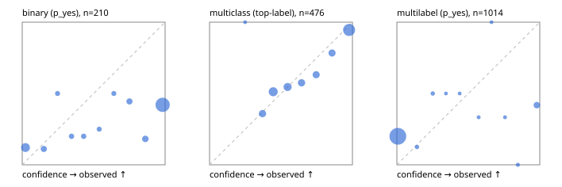

# Evaluation report

- model `Qwen/Qwen3-Reranker-0.6B` @ `e61197ed45`, adapter `None`, prompt `task-v1` (f7b8d8022dfb)
- data data/hf.jsonl, data/eval.jsonl; splits ['calibration']; n=859; calibration `None`
- mps / float32; 2026-09-22T20:32:12-0700; wall 94.2s

## Overall

question accuracy 52.3%

**binary**: n 210, positives 71, accuracy 0.519, precision 0.403, recall 0.873, f1 0.551, auroc 0.721, brier 0.426, log_loss 1.870, ece 0.425

**multiclass**: n 476, accuracy 0.708, macro_f1 0.653, log_loss 0.707, brier 0.391, ece_top_label 0.047

**multilabel**: n 173, labels 1014, exact_match 0.017, micro_f1 0.188, macro_f1 0.268, label_auroc 0.686, brier 0.219, log_loss 1.154, ece 0.216

## By family

| family | n | question acc % | details |
|---|---|---|---|
| eval_adversarial | 19 | 52.6 | bin acc 64.3 F1 70.6 AUROC 0.653 ECE 0.358; mc acc 0.0 mF1 0.0 ECE 0.747; ml EM 50.0 µF1 0.0 ECE 0.074 |
| eval_agent_output | 9 | 44.4 | bin acc 60.0 F1 66.7 AUROC 0.333 ECE 0.462; mc acc 50.0 mF1 33.3 ECE 0.512; ml EM 0.0 µF1 0.0 ECE 0.443 |
| eval_evidence | 19 | 36.8 | bin acc 43.8 F1 52.6 AUROC 0.600 ECE 0.560; ml EM 0.0 µF1 52.2 ECE 0.623 |
| eval_multilabel | 12 | 41.7 | bin acc 100.0 F1 100.0 AUROC — ECE 0.024; mc acc 50.0 mF1 33.3 ECE 0.192; ml EM 25.0 µF1 58.5 ECE 0.346 |
| eval_policy | 16 | 25.0 | bin acc 37.5 F1 54.5 AUROC 0.533 ECE 0.612; mc acc 25.0 mF1 14.3 ECE 0.298; ml EM 0.0 µF1 44.4 ECE 0.694 |
| eval_routing | 15 | 60.0 | bin acc 42.9 F1 33.3 AUROC 0.417 ECE 0.544; mc acc 85.7 mF1 71.4 ECE 0.009; ml EM 0.0 µF1 66.7 ECE 0.232 |
| eval_urgency_sentiment | 19 | 42.1 | bin acc 62.5 F1 57.1 AUROC 1.000 ECE 0.318; mc acc 37.5 mF1 25.0 ECE 0.275; ml EM 0.0 µF1 57.1 ECE 0.357 |
| hf_emotions_multilabel | 150 | 0.0 | ml EM 0.0 µF1 0.0 ECE 0.195 |
| hf_intent_banking77 | 150 | 88.7 | mc acc 88.7 mF1 81.7 ECE 0.036 |
| hf_nli | 150 | 51.3 | bin acc 51.3 F1 52.9 AUROC 0.803 ECE 0.427 |
| hf_sentiment_tweets | 150 | 53.3 | mc acc 53.3 mF1 52.1 ECE 0.079 |
| hf_topic_agnews | 150 | 74.7 | mc acc 74.7 mF1 73.3 ECE 0.088 |

## by hard case

| slice | n | question acc % |
|---|---|---|
| (none) | 624 | 59.6 |
| contradiction | 58 | 34.5 |
| distractor | 25 | 32.0 |
| double_negation | 3 | 100.0 |
| evidence_end | 11 | 45.5 |
| evidence_middle | 6 | 33.3 |
| evidence_start | 7 | 42.9 |
| exception | 4 | 25.0 |
| hypothetical | 7 | 42.9 |
| injection | 6 | 33.3 |
| lexical_overlap | 16 | 56.2 |
| long_state | 42 | 35.7 |
| missing_evidence | 62 | 35.5 |
| multi_positive | 42 | 0.0 |
| multi_turn | 12 | 25.0 |
| negation | 12 | 41.7 |
| new_label_names | 5 | 80.0 |
| nota | 4 | 25.0 |
| numeric_reasoning | 15 | 20.0 |
| paraphrase | 10 | 50.0 |
| role_reversal | 13 | 0.0 |
| sarcasm | 1 | 0.0 |
| temporal_reasoning | 14 | 50.0 |
| zero_positive | 4 | 25.0 |

## by state tokens

| slice | n | question acc % |
|---|---|---|
| 00000-00127 | 780 | 53.6 |
| 00128-00511 | 37 | 43.2 |
| 00512-02047 | 42 | 35.7 |

## by candidates

| slice | n | question acc % |
|---|---|---|
| 01 | 210 | 51.9 |
| 03 | 158 | 51.3 |
| 04 | 168 | 71.4 |
| 05 | 15 | 33.3 |
| 06 | 157 | 0.6 |
| 07 | 1 | 0.0 |
| 08 | 150 | 88.7 |

## Paraphrase groups

5 groups; same prediction 60.0%; all correct 40.0%

## Multiclass abstention (coverage vs error on accepted)

| abstain_below | coverage % | error % |
|---|---|---|
| 0.0 | 100.0 | 29.2 |
| 0.4 | 91.6 | 26.1 |
| 0.5 | 74.4 | 20.9 |
| 0.6 | 62.8 | 16.4 |
| 0.7 | 54.4 | 12.4 |
| 0.8 | 46.4 | 8.1 |
| 0.9 | 38.7 | 5.4 |

## Reliability: binary

| bin | n | mean confidence | observed frequency |
|---|---|---|---|
| [0.0,0.1) | 33 | 0.023 | 0.121 |
| [0.1,0.2) | 9 | 0.151 | 0.111 |
| [0.2,0.3) | 4 | 0.247 | 0.500 |
| [0.3,0.4) | 5 | 0.345 | 0.200 |
| [0.4,0.5) | 5 | 0.430 | 0.200 |
| [0.5,0.6) | 4 | 0.539 | 0.250 |
| [0.6,0.7) | 4 | 0.641 | 0.500 |
| [0.7,0.8) | 9 | 0.751 | 0.444 |
| [0.8,0.9) | 11 | 0.862 | 0.182 |
| [0.9,1.0] | 126 | 0.983 | 0.421 |

## Reliability: multiclass

| bin | n | mean confidence | observed frequency |
|---|---|---|---|
| [0.2,0.3) | 1 | 0.249 | 1.000 |
| [0.3,0.4) | 39 | 0.370 | 0.359 |
| [0.4,0.5) | 82 | 0.446 | 0.512 |
| [0.5,0.6) | 55 | 0.546 | 0.545 |
| [0.6,0.7) | 40 | 0.644 | 0.575 |
| [0.7,0.8) | 38 | 0.746 | 0.632 |
| [0.8,0.9) | 37 | 0.857 | 0.784 |
| [0.9,1.0] | 184 | 0.977 | 0.946 |

## Reliability: multilabel

| bin | n | mean confidence | observed frequency |
|---|---|---|---|
| [0.0,0.1) | 926 | 0.007 | 0.200 |
| [0.1,0.2) | 8 | 0.141 | 0.125 |
| [0.2,0.3) | 8 | 0.251 | 0.500 |
| [0.3,0.4) | 2 | 0.343 | 0.500 |
| [0.4,0.5) | 2 | 0.440 | 0.500 |
| [0.5,0.6) | 3 | 0.572 | 0.333 |
| [0.6,0.7) | 2 | 0.662 | 1.000 |
| [0.7,0.8) | 3 | 0.757 | 0.333 |
| [0.8,0.9) | 5 | 0.847 | 0.000 |
| [0.9,1.0] | 55 | 0.979 | 0.418 |
