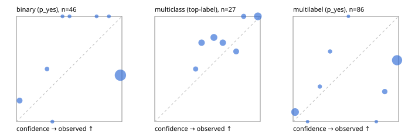

# Evaluation report

- model `Qwen/Qwen3-Reranker-0.6B` @ `e61197ed45`, adapter `None`, prompt `task-v1` (f7b8d8022dfb)
- data data/synthetic.jsonl; splits ['test']; n=96; calibration `None`
- mps / float32; 2026-09-23T00:42:59-0700; wall 19.2s

## Overall

question accuracy 51.0%

**binary**: n 46, positives 21, accuracy 0.522, precision 0.486, recall 0.857, f1 0.621, auroc 0.596, brier 0.445, log_loss 2.211, ece 0.468

**multiclass**: n 27, accuracy 0.815, macro_f1 0.689, log_loss 0.581, brier 0.320, ece_top_label 0.143

**multilabel**: n 23, labels 86, exact_match 0.130, micro_f1 0.667, macro_f1 0.506, label_auroc 0.752, brier 0.320, log_loss 1.401, ece 0.320

## By family

| family | n | question acc % | details |
|---|---|---|---|
| syn_adversarial | 13 | 23.1 | bin acc 33.3 F1 50.0 AUROC 0.556 ECE 0.664; mc acc 0.0 mF1 0.0 ECE 0.428; ml EM 0.0 µF1 82.4 ECE 0.288 |
| syn_evidence | 23 | 52.2 | bin acc 46.2 F1 63.2 AUROC 0.690 ECE 0.526; mc acc 83.3 mF1 71.4 ECE 0.239; ml EM 25.0 µF1 70.0 ECE 0.374 |
| syn_multilabel | 8 | 12.5 | bin acc 0.0 F1 0.0 AUROC — ECE 0.563; mc acc 100.0 mF1 100.0 ECE 0.608; ml EM 0.0 µF1 69.2 ECE 0.326 |
| syn_policy | 19 | 47.4 | bin acc 50.0 F1 60.0 AUROC 0.600 ECE 0.493; mc acc 71.4 mF1 55.6 ECE 0.333; ml EM 0.0 µF1 60.0 ECE 0.560 |
| syn_routing | 12 | 75.0 | bin acc 75.0 F1 80.0 AUROC 1.000 ECE 0.225; mc acc 80.0 mF1 66.7 ECE 0.062; ml EM 66.7 µF1 66.7 ECE 0.089 |
| syn_urgency_sentiment | 21 | 71.4 | bin acc 72.7 F1 72.7 AUROC 0.733 ECE 0.305; mc acc 100.0 mF1 100.0 ECE 0.186; ml EM 0.0 µF1 28.6 ECE 0.386 |

## by hard case

| slice | n | question acc % |
|---|---|---|
| (none) | 9 | 77.8 |
| contradiction | 8 | 25.0 |
| distractor | 18 | 44.4 |
| double_negation | 2 | 100.0 |
| evidence_end | 4 | 75.0 |
| evidence_middle | 2 | 100.0 |
| evidence_start | 4 | 50.0 |
| exception | 20 | 45.0 |
| hypothetical | 2 | 50.0 |
| injection | 6 | 16.7 |
| lexical_overlap | 17 | 58.8 |
| long_state | 18 | 55.6 |
| missing_evidence | 5 | 40.0 |
| multi_positive | 13 | 7.7 |
| multi_turn | 4 | 50.0 |
| negation | 16 | 12.5 |
| nota | 2 | 50.0 |
| numeric_reasoning | 16 | 56.2 |
| paraphrase | 1 | 100.0 |
| role_reversal | 10 | 30.0 |
| sarcasm | 3 | 0.0 |
| temporal_reasoning | 10 | 60.0 |
| zero_positive | 3 | 66.7 |

## by state tokens

| slice | n | question acc % |
|---|---|---|
| 00000-00127 | 48 | 50.0 |
| 00128-00511 | 29 | 51.7 |
| 00512-02047 | 19 | 52.6 |

## by candidates

| slice | n | question acc % |
|---|---|---|
| 01 | 46 | 52.2 |
| 03 | 8 | 12.5 |
| 04 | 38 | 52.6 |
| 05 | 4 | 100.0 |

## Paraphrase groups

0 groups; same prediction —%; all correct —%

## Multiclass abstention (coverage vs error on accepted)

| abstain_below | coverage % | error % |
|---|---|---|
| 0.0 | 100.0 | 18.5 |
| 0.4 | 92.6 | 16.0 |
| 0.5 | 77.8 | 14.3 |
| 0.6 | 59.3 | 12.5 |
| 0.7 | 44.4 | 8.3 |
| 0.8 | 33.3 | 0.0 |
| 0.9 | 25.9 | 0.0 |

## Reliability: binary

| bin | n | mean confidence | observed frequency |
|---|---|---|---|
| [0.0,0.1) | 5 | 0.030 | 0.200 |
| [0.2,0.3) | 2 | 0.290 | 0.500 |
| [0.3,0.4) | 1 | 0.341 | 0.000 |
| [0.4,0.5) | 1 | 0.437 | 1.000 |
| [0.5,0.6) | 1 | 0.504 | 1.000 |
| [0.7,0.8) | 1 | 0.760 | 1.000 |
| [0.8,0.9) | 1 | 0.877 | 1.000 |
| [0.9,1.0] | 34 | 0.986 | 0.441 |

## Reliability: multiclass

| bin | n | mean confidence | observed frequency |
|---|---|---|---|
| [0.3,0.4) | 2 | 0.388 | 0.500 |
| [0.4,0.5) | 4 | 0.444 | 0.750 |
| [0.5,0.6) | 5 | 0.561 | 0.800 |
| [0.6,0.7) | 4 | 0.645 | 0.750 |
| [0.7,0.8) | 3 | 0.772 | 0.667 |
| [0.8,0.9) | 2 | 0.843 | 1.000 |
| [0.9,1.0] | 7 | 0.977 | 1.000 |

## Reliability: multilabel

| bin | n | mean confidence | observed frequency |
|---|---|---|---|
| [0.0,0.1) | 22 | 0.019 | 0.091 |
| [0.1,0.2) | 1 | 0.137 | 0.000 |
| [0.2,0.3) | 3 | 0.253 | 0.333 |
| [0.3,0.4) | 3 | 0.351 | 0.667 |
| [0.5,0.6) | 1 | 0.525 | 1.000 |
| [0.7,0.8) | 1 | 0.789 | 0.000 |
| [0.8,0.9) | 7 | 0.869 | 0.286 |
| [0.9,1.0] | 48 | 0.985 | 0.583 |
