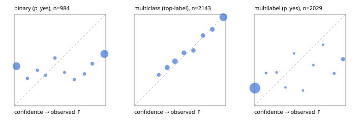

# Evaluation report

- model `Qwen/Qwen3-Reranker-0.6B` @ `e61197ed45`, adapter `None`, prompt `task-v1` (f7b8d8022dfb)
- data data/hf.jsonl, data/eval.jsonl; splits ['test']; n=3471; calibration `None`
- mps / float32; 2026-09-22T20:38:03-0700; wall 347.8s

## Overall

question accuracy 61.0%

**binary**: n 984, positives 475, accuracy 0.553, precision 0.534, recall 0.585, f1 0.558, auroc 0.605, brier 0.397, log_loss 1.747, ece 0.384

**multiclass**: n 2143, accuracy 0.733, macro_f1 0.796, log_loss 0.717, brier 0.363, ece_top_label 0.026

**multilabel**: n 344, labels 2029, exact_match 0.012, micro_f1 0.236, macro_f1 0.363, label_auroc 0.679, brier 0.208, log_loss 1.106, ece 0.203

## By family

| family | n | question acc % | details |
|---|---|---|---|
| eval_adversarial | 27 | 74.1 | bin acc 73.3 F1 75.0 AUROC 0.741 ECE 0.351; mc acc 100.0 mF1 100.0 ECE 0.255; ml EM 40.0 µF1 75.0 ECE 0.251 |
| eval_agent_output | 26 | 30.8 | bin acc 42.9 F1 33.3 AUROC 0.510 ECE 0.454; mc acc 14.3 mF1 11.1 ECE 0.493; ml EM 20.0 µF1 57.1 ECE 0.286 |
| eval_evidence | 17 | 41.2 | bin acc 46.7 F1 55.6 AUROC 0.820 ECE 0.526; ml EM 0.0 µF1 54.5 ECE 0.467 |
| eval_multilabel | 32 | 12.5 | bin acc 57.1 F1 66.7 AUROC 0.750 ECE 0.486; mc acc 0.0 mF1 0.0 ECE 0.434; ml EM 0.0 µF1 55.1 ECE 0.358 |
| eval_policy | 22 | 31.8 | bin acc 46.2 F1 63.2 AUROC 0.548 ECE 0.536; mc acc 20.0 mF1 12.5 ECE 0.241; ml EM 0.0 µF1 69.6 ECE 0.465 |
| eval_routing | 25 | 48.0 | bin acc 60.0 F1 66.7 AUROC 0.875 ECE 0.382; mc acc 38.5 mF1 23.1 ECE 0.284; ml EM 50.0 µF1 50.0 ECE 0.209 |
| eval_urgency_sentiment | 22 | 40.9 | bin acc 60.0 F1 66.7 AUROC 0.417 ECE 0.421; mc acc 30.0 mF1 21.2 ECE 0.334; ml EM 0.0 µF1 66.7 ECE 0.477 |
| heldout_boolq | 300 | 59.3 | bin acc 59.3 F1 70.7 AUROC 0.631 ECE 0.320 |
| heldout_emotion_multiclass | 300 | 51.0 | mc acc 51.0 mF1 41.2 ECE 0.073 |
| heldout_intent_clinc | 300 | 92.3 | mc acc 92.3 mF1 94.9 ECE 0.054 |
| heldout_question_type_trec | 300 | 64.3 | mc acc 64.3 mF1 56.0 ECE 0.093 |
| heldout_sentiment_sst2 | 300 | 50.0 | bin acc 50.0 F1 0.0 AUROC 0.544 ECE 0.471 |
| heldout_topic_dbpedia | 300 | 89.3 | mc acc 89.3 mF1 88.4 ECE 0.050 |
| hf_emotions_multilabel | 300 | 0.0 | ml EM 0.0 µF1 0.6 ECE 0.189 |
| hf_intent_banking77 | 300 | 89.3 | mc acc 89.3 mF1 88.5 ECE 0.011 |
| hf_nli | 300 | 56.7 | bin acc 56.7 F1 60.8 AUROC 0.804 ECE 0.394 |
| hf_sentiment_tweets | 300 | 54.3 | mc acc 54.3 mF1 55.1 ECE 0.075 |
| hf_topic_agnews | 300 | 77.3 | mc acc 77.3 mF1 76.4 ECE 0.117 |

## by hard case

| slice | n | question acc % |
|---|---|---|
| (none) | 3042 | 64.3 |
| contradiction | 107 | 30.8 |
| distractor | 33 | 21.2 |
| double_negation | 6 | 33.3 |
| evidence_end | 13 | 38.5 |
| evidence_middle | 11 | 45.5 |
| evidence_start | 9 | 55.6 |
| exception | 7 | 0.0 |
| hypothetical | 7 | 57.1 |
| injection | 10 | 60.0 |
| lexical_overlap | 20 | 40.0 |
| long_state | 50 | 36.0 |
| missing_evidence | 104 | 37.5 |
| multi_positive | 81 | 1.2 |
| multi_turn | 9 | 33.3 |
| negation | 30 | 33.3 |
| new_label_names | 3 | 0.0 |
| nota | 46 | 87.0 |
| numeric_reasoning | 16 | 37.5 |
| paraphrase | 22 | 18.2 |
| role_reversal | 15 | 40.0 |
| sarcasm | 12 | 8.3 |
| temporal_reasoning | 29 | 31.0 |
| zero_positive | 6 | 33.3 |

## by state tokens

| slice | n | question acc % |
|---|---|---|
| 00000-00127 | 3211 | 61.8 |
| 00128-00511 | 208 | 55.3 |
| 00512-02047 | 52 | 34.6 |

## by candidates

| slice | n | question acc % |
|---|---|---|
| 01 | 984 | 55.3 |
| 03 | 310 | 54.8 |
| 04 | 333 | 73.0 |
| 05 | 22 | 9.1 |
| 06 | 1218 | 50.5 |
| 07 | 49 | 81.6 |
| 08 | 555 | 91.0 |

## Paraphrase groups

11 groups; same prediction 72.7%; all correct 18.2%

## Multiclass abstention (coverage vs error on accepted)

| abstain_below | coverage % | error % |
|---|---|---|
| 0.0 | 100.0 | 26.7 |
| 0.4 | 85.3 | 21.0 |
| 0.5 | 71.4 | 15.0 |
| 0.6 | 62.4 | 11.1 |
| 0.7 | 55.9 | 7.8 |
| 0.8 | 48.7 | 5.6 |
| 0.9 | 40.3 | 3.2 |

## Reliability: binary

| bin | n | mean confidence | observed frequency |
|---|---|---|---|
| [0.0,0.1) | 384 | 0.024 | 0.432 |
| [0.1,0.2) | 20 | 0.144 | 0.300 |
| [0.2,0.3) | 18 | 0.253 | 0.389 |
| [0.3,0.4) | 18 | 0.343 | 0.333 |
| [0.4,0.5) | 23 | 0.445 | 0.522 |
| [0.5,0.6) | 11 | 0.549 | 0.364 |
| [0.6,0.7) | 21 | 0.656 | 0.286 |
| [0.7,0.8) | 23 | 0.766 | 0.348 |
| [0.8,0.9) | 37 | 0.853 | 0.459 |
| [0.9,1.0] | 429 | 0.985 | 0.566 |

## Reliability: multiclass

| bin | n | mean confidence | observed frequency |
|---|---|---|---|
| [0.2,0.3) | 71 | 0.268 | 0.338 |
| [0.3,0.4) | 244 | 0.360 | 0.418 |
| [0.4,0.5) | 298 | 0.445 | 0.487 |
| [0.5,0.6) | 192 | 0.543 | 0.578 |
| [0.6,0.7) | 139 | 0.647 | 0.604 |
| [0.7,0.8) | 155 | 0.751 | 0.768 |
| [0.8,0.9) | 181 | 0.853 | 0.834 |
| [0.9,1.0] | 863 | 0.973 | 0.968 |

## Reliability: multilabel

| bin | n | mean confidence | observed frequency |
|---|---|---|---|
| [0.0,0.1) | 1848 | 0.007 | 0.193 |
| [0.1,0.2) | 14 | 0.129 | 0.357 |
| [0.2,0.3) | 11 | 0.244 | 0.364 |
| [0.3,0.4) | 5 | 0.341 | 0.200 |
| [0.4,0.5) | 7 | 0.435 | 0.571 |
| [0.5,0.6) | 6 | 0.532 | 0.167 |
| [0.6,0.7) | 9 | 0.646 | 0.444 |
| [0.7,0.8) | 6 | 0.752 | 0.667 |
| [0.8,0.9) | 17 | 0.874 | 0.353 |
| [0.9,1.0] | 106 | 0.970 | 0.509 |
