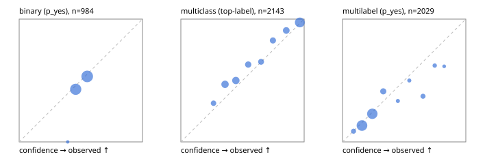

# Evaluation report

- model `Qwen/Qwen3-Reranker-0.6B` @ `e61197ed45`, adapter `None`, prompt `task-v1` (f7b8d8022dfb)
- data data/hf.jsonl, data/eval.jsonl; splits ['test']; n=3471; calibration `{'method': 'temperature scaling per output type, grid search on NLL', 'min_n': 30, 'model': 'Qwen/Qwen3-Reranker-0.6B', 'revision': 'e61197ed45024b0ed8a2d74b80b4d909f1255473', 'adapter': None, 'adapter_sha256': None, 'prompt_sha': 'f7b8d8022dfb', 'fit_report': 'reports/baseline/calibration/report.json', 'fit_report_sha256': '459b955ee3d1e1521cb304aeacbf0e4fe6baf63428f178377882656c886f720f', 'fit_data': [{'path': 'data/hf.jsonl', 'sha256': 'fe29b29286d5a372271e925825e8b9794f3f64be9a9fc04cad458b4b94ada510'}, {'path': 'data/eval.jsonl', 'sha256': 'be888eb38dcca063823924430e03985ddf2186b874e792d5734936ba93ba6910'}], 'created': '2026-09-22T23:23:01-0700', 'n': {'binary': 210, 'multiclass': 476, 'multilabel': 1014}, 'nll_before': {'binary': 1.869606988909585, 'multiclass': 0.7073483443391587, 'multilabel': 1.1541133894741866}, 'nll_after': {'binary': 0.6875403790381559, 'multiclass': 0.7003675207950333, 'multilabel': 0.5028327529804215}, 'skipped': {}, 'threshold_report': 'reports/baseline/validation/report.json', 'threshold_report_sha256': '3912d784468a2eb3671cc96e70e8916960dbda51ff92a57b437119b5f2c30606', 'threshold_rule': 'max F1 on validation after temperature scaling', 'file': 'calib/baseline.json', 'file_sha256': '35d5542b0e82a18f6951a48c704834b0a9942fa286bd04c72d9ca1e18a21442d'}`
- mps / float32; 2026-09-23T00:49:10-0700; wall 343.3s

## Overall

question accuracy 62.5%

**binary**: n 984, positives 475, accuracy 0.593, precision 0.613, recall 0.427, f1 0.504, auroc 0.605, brier 0.244, log_loss 0.681, ece 0.025

**multiclass**: n 2143, accuracy 0.733, macro_f1 0.796, log_loss 0.723, brier 0.366, ece_top_label 0.047

**multilabel**: n 344, labels 2029, exact_match 0.041, micro_f1 0.414, macro_f1 0.380, label_auroc 0.679, brier 0.160, log_loss 0.495, ece 0.037

## By family

| family | n | question acc % | details |
|---|---|---|---|
| eval_adversarial | 27 | 63.0 | bin acc 66.7 F1 61.5 AUROC 0.741 ECE 0.191; mc acc 100.0 mF1 100.0 ECE 0.280; ml EM 0.0 µF1 58.1 ECE 0.250 |
| eval_agent_output | 26 | 30.8 | bin acc 50.0 F1 22.2 AUROC 0.510 ECE 0.112; mc acc 14.3 mF1 11.1 ECE 0.465; ml EM 0.0 µF1 48.0 ECE 0.188 |
| eval_evidence | 17 | 58.8 | bin acc 66.7 F1 61.5 AUROC 0.820 ECE 0.210; ml EM 0.0 µF1 42.9 ECE 0.342 |
| eval_multilabel | 32 | 12.5 | bin acc 57.1 F1 57.1 AUROC 0.750 ECE 0.114; mc acc 0.0 mF1 0.0 ECE 0.393; ml EM 0.0 µF1 53.6 ECE 0.172 |
| eval_policy | 22 | 31.8 | bin acc 46.2 F1 63.2 AUROC 0.548 ECE 0.113; mc acc 20.0 mF1 12.5 ECE 0.403; ml EM 0.0 µF1 69.6 ECE 0.278 |
| eval_routing | 25 | 56.0 | bin acc 90.0 F1 85.7 AUROC 0.875 ECE 0.124; mc acc 38.5 mF1 23.1 ECE 0.319; ml EM 0.0 µF1 50.0 ECE 0.228 |
| eval_urgency_sentiment | 22 | 22.7 | bin acc 20.0 F1 0.0 AUROC 0.417 ECE 0.101; mc acc 30.0 mF1 21.2 ECE 0.317; ml EM 0.0 µF1 66.7 ECE 0.262 |
| heldout_boolq | 300 | 57.7 | bin acc 57.7 F1 60.7 AUROC 0.631 ECE 0.066 |
| heldout_emotion_multiclass | 300 | 51.0 | mc acc 51.0 mF1 41.2 ECE 0.107 |
| heldout_intent_clinc | 300 | 92.3 | mc acc 92.3 mF1 94.9 ECE 0.085 |
| heldout_question_type_trec | 300 | 64.3 | mc acc 64.3 mF1 56.0 ECE 0.100 |
| heldout_sentiment_sst2 | 300 | 50.0 | bin acc 50.0 F1 0.0 AUROC 0.544 ECE 0.050 |
| heldout_topic_dbpedia | 300 | 89.3 | mc acc 89.3 mF1 88.4 ECE 0.054 |
| hf_emotions_multilabel | 300 | 4.7 | ml EM 4.7 µF1 38.2 ECE 0.026 |
| hf_intent_banking77 | 300 | 89.3 | mc acc 89.3 mF1 88.5 ECE 0.040 |
| hf_nli | 300 | 71.0 | bin acc 71.0 F1 66.1 AUROC 0.804 ECE 0.166 |
| hf_sentiment_tweets | 300 | 54.3 | mc acc 54.3 mF1 55.1 ECE 0.107 |
| hf_topic_agnews | 300 | 77.3 | mc acc 77.3 mF1 76.4 ECE 0.091 |

## by hard case

| slice | n | question acc % |
|---|---|---|
| (none) | 3042 | 63.9 |
| contradiction | 107 | 64.5 |
| distractor | 33 | 21.2 |
| double_negation | 6 | 0.0 |
| evidence_end | 13 | 38.5 |
| evidence_middle | 11 | 27.3 |
| evidence_start | 9 | 44.4 |
| exception | 7 | 0.0 |
| hypothetical | 7 | 57.1 |
| injection | 10 | 50.0 |
| lexical_overlap | 20 | 40.0 |
| long_state | 50 | 34.0 |
| missing_evidence | 104 | 65.4 |
| multi_positive | 81 | 6.2 |
| multi_turn | 9 | 33.3 |
| negation | 30 | 33.3 |
| new_label_names | 3 | 0.0 |
| nota | 46 | 87.0 |
| numeric_reasoning | 16 | 50.0 |
| paraphrase | 22 | 18.2 |
| role_reversal | 15 | 40.0 |
| sarcasm | 12 | 25.0 |
| temporal_reasoning | 29 | 27.6 |
| zero_positive | 6 | 0.0 |

## by state tokens

| slice | n | question acc % |
|---|---|---|
| 00000-00127 | 3211 | 63.5 |
| 00128-00511 | 208 | 53.4 |
| 00512-02047 | 52 | 36.5 |

## by candidates

| slice | n | question acc % |
|---|---|---|
| 01 | 984 | 59.3 |
| 03 | 310 | 54.8 |
| 04 | 333 | 72.1 |
| 05 | 22 | 4.5 |
| 06 | 1218 | 51.6 |
| 07 | 49 | 81.6 |
| 08 | 555 | 91.0 |

## Paraphrase groups

11 groups; same prediction 63.6%; all correct 18.2%

## Multiclass abstention (coverage vs error on accepted)

| abstain_below | coverage % | error % |
|---|---|---|
| 0.0 | 100.0 | 26.7 |
| 0.4 | 80.6 | 19.4 |
| 0.5 | 66.5 | 12.9 |
| 0.6 | 58.1 | 9.4 |
| 0.7 | 51.5 | 6.2 |
| 0.8 | 44.0 | 4.2 |
| 0.9 | 34.0 | 2.7 |

## Reliability: binary

| bin | n | mean confidence | observed frequency |
|---|---|---|---|
| [0.3,0.4) | 3 | 0.393 | 0.000 |
| [0.4,0.5) | 460 | 0.458 | 0.428 |
| [0.5,0.6) | 521 | 0.551 | 0.534 |

## Reliability: multiclass

| bin | n | mean confidence | observed frequency |
|---|---|---|---|
| [0.2,0.3) | 108 | 0.265 | 0.315 |
| [0.3,0.4) | 307 | 0.358 | 0.469 |
| [0.4,0.5) | 302 | 0.446 | 0.500 |
| [0.5,0.6) | 181 | 0.546 | 0.630 |
| [0.6,0.7) | 141 | 0.650 | 0.652 |
| [0.7,0.8) | 161 | 0.746 | 0.826 |
| [0.8,0.9) | 215 | 0.855 | 0.907 |
| [0.9,1.0] | 728 | 0.965 | 0.973 |

## Reliability: multilabel

| bin | n | mean confidence | observed frequency |
|---|---|---|---|
| [0.0,0.1) | 69 | 0.089 | 0.087 |
| [0.1,0.2) | 854 | 0.158 | 0.133 |
| [0.2,0.3) | 782 | 0.242 | 0.229 |
| [0.3,0.4) | 153 | 0.331 | 0.412 |
| [0.4,0.5) | 27 | 0.449 | 0.333 |
| [0.5,0.6) | 24 | 0.542 | 0.500 |
| [0.6,0.7) | 70 | 0.653 | 0.371 |
| [0.7,0.8) | 37 | 0.748 | 0.622 |
| [0.8,0.9) | 13 | 0.825 | 0.615 |
