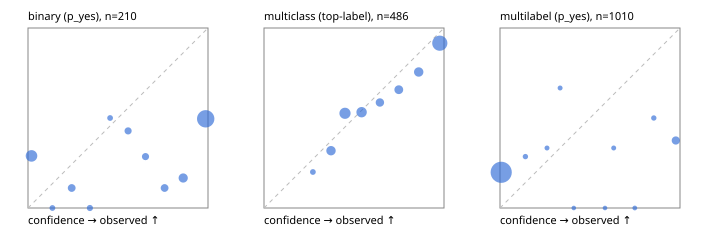

# Evaluation report

- model `Qwen/Qwen3-Reranker-0.6B` @ `e61197ed45`, adapter `None`, prompt `task-v1` (f7b8d8022dfb)
- data data/hf.jsonl, data/eval.jsonl; splits ['validation']; n=868; calibration `None`
- mps / float32; 2026-09-22T20:30:35-0700; wall 92.9s

## Overall

question accuracy 51.5%

**binary**: n 210, positives 79, accuracy 0.510, precision 0.423, recall 0.835, f1 0.562, auroc 0.694, brier 0.422, log_loss 1.903, ece 0.434

**multiclass**: n 486, accuracy 0.691, macro_f1 0.599, log_loss 0.791, brier 0.414, ece_top_label 0.062

**multilabel**: n 172, labels 1010, exact_match 0.023, micro_f1 0.177, macro_f1 0.229, label_auroc 0.652, brier 0.219, log_loss 1.185, ece 0.217

## By family

| family | n | question acc % | details |
|---|---|---|---|
| eval_adversarial | 14 | 50.0 | bin acc 71.4 F1 80.0 AUROC 0.600 ECE 0.372; mc acc 40.0 mF1 25.0 ECE 0.533; ml EM 0.0 µF1 33.3 ECE 0.346 |
| eval_agent_output | 20 | 35.0 | bin acc 50.0 F1 50.0 AUROC 0.417 ECE 0.464; mc acc 20.0 mF1 8.3 ECE 0.652; ml EM 0.0 µF1 0.0 ECE 0.563 |
| eval_evidence | 17 | 41.2 | bin acc 50.0 F1 58.8 AUROC 0.911 ECE 0.483; ml EM 0.0 µF1 44.4 ECE 0.629 |
| eval_multilabel | 12 | 25.0 | bin acc 100.0 F1 0.0 AUROC — ECE 0.010; mc acc 50.0 mF1 33.3 ECE 0.745; ml EM 11.1 µF1 56.7 ECE 0.441 |
| eval_policy | 24 | 37.5 | bin acc 58.3 F1 73.7 AUROC 0.543 ECE 0.383; mc acc 18.2 mF1 10.5 ECE 0.332; ml EM 0.0 µF1 66.7 ECE 0.462 |
| eval_routing | 16 | 75.0 | bin acc 85.7 F1 88.9 AUROC 0.900 ECE 0.171; mc acc 62.5 mF1 59.5 ECE 0.218; ml EM 100.0 µF1 0.0 ECE 0.027 |
| eval_urgency_sentiment | 15 | 46.7 | bin acc 28.6 F1 28.6 AUROC 0.250 ECE 0.678; mc acc 60.0 mF1 42.9 ECE 0.251; ml EM 66.7 µF1 40.0 ECE 0.240 |
| hf_emotions_multilabel | 150 | 0.0 | ml EM 0.0 µF1 0.0 ECE 0.193 |
| hf_intent_banking77 | 150 | 86.7 | mc acc 86.7 mF1 82.0 ECE 0.057 |
| hf_nli | 150 | 48.7 | bin acc 48.7 F1 52.2 AUROC 0.768 ECE 0.462 |
| hf_sentiment_tweets | 150 | 56.7 | mc acc 56.7 mF1 52.3 ECE 0.087 |
| hf_topic_agnews | 150 | 71.3 | mc acc 71.3 mF1 71.2 ECE 0.131 |

## by hard case

| slice | n | question acc % |
|---|---|---|
| (none) | 634 | 59.1 |
| contradiction | 63 | 25.4 |
| distractor | 20 | 25.0 |
| double_negation | 3 | 100.0 |
| evidence_end | 4 | 25.0 |
| evidence_middle | 7 | 42.9 |
| evidence_start | 3 | 33.3 |
| exception | 7 | 28.6 |
| hypothetical | 6 | 16.7 |
| injection | 16 | 50.0 |
| lexical_overlap | 13 | 61.5 |
| long_state | 26 | 34.6 |
| missing_evidence | 59 | 35.6 |
| multi_positive | 40 | 0.0 |
| multi_turn | 21 | 33.3 |
| negation | 9 | 33.3 |
| new_label_names | 5 | 20.0 |
| nota | 4 | 0.0 |
| numeric_reasoning | 13 | 30.8 |
| paraphrase | 10 | 40.0 |
| role_reversal | 7 | 14.3 |
| sarcasm | 5 | 0.0 |
| temporal_reasoning | 15 | 46.7 |
| zero_positive | 7 | 42.9 |

## by state tokens

| slice | n | question acc % |
|---|---|---|
| 00000-00127 | 796 | 52.5 |
| 00128-00511 | 46 | 43.5 |
| 00512-02047 | 26 | 34.6 |

## by candidates

| slice | n | question acc % |
|---|---|---|
| 01 | 210 | 51.0 |
| 03 | 162 | 55.6 |
| 04 | 174 | 67.2 |
| 05 | 13 | 23.1 |
| 06 | 159 | 0.0 |
| 08 | 150 | 86.7 |

## Paraphrase groups

5 groups; same prediction 20.0%; all correct 20.0%

## Multiclass abstention (coverage vs error on accepted)

| abstain_below | coverage % | error % |
|---|---|---|
| 0.0 | 100.0 | 30.9 |
| 0.4 | 89.9 | 26.5 |
| 0.5 | 74.3 | 22.2 |
| 0.6 | 61.5 | 17.1 |
| 0.7 | 55.6 | 14.4 |
| 0.8 | 48.4 | 11.5 |
| 0.9 | 39.1 | 8.4 |

## Reliability: binary

| bin | n | mean confidence | observed frequency |
|---|---|---|---|
| [0.0,0.1) | 38 | 0.019 | 0.289 |
| [0.1,0.2) | 2 | 0.135 | 0.000 |
| [0.2,0.3) | 9 | 0.243 | 0.111 |
| [0.3,0.4) | 3 | 0.344 | 0.000 |
| [0.4,0.5) | 2 | 0.456 | 0.500 |
| [0.5,0.6) | 7 | 0.556 | 0.429 |
| [0.6,0.7) | 7 | 0.653 | 0.286 |
| [0.7,0.8) | 9 | 0.759 | 0.111 |
| [0.8,0.9) | 18 | 0.862 | 0.167 |
| [0.9,1.0] | 115 | 0.987 | 0.496 |

## Reliability: multiclass

| bin | n | mean confidence | observed frequency |
|---|---|---|---|
| [0.2,0.3) | 5 | 0.272 | 0.200 |
| [0.3,0.4) | 44 | 0.372 | 0.318 |
| [0.4,0.5) | 76 | 0.450 | 0.526 |
| [0.5,0.6) | 62 | 0.542 | 0.532 |
| [0.6,0.7) | 29 | 0.644 | 0.586 |
| [0.7,0.8) | 35 | 0.749 | 0.657 |
| [0.8,0.9) | 45 | 0.859 | 0.756 |
| [0.9,1.0] | 190 | 0.977 | 0.916 |

## Reliability: multilabel

| bin | n | mean confidence | observed frequency |
|---|---|---|---|
| [0.0,0.1) | 928 | 0.007 | 0.198 |
| [0.1,0.2) | 7 | 0.141 | 0.286 |
| [0.2,0.3) | 3 | 0.261 | 0.333 |
| [0.3,0.4) | 3 | 0.334 | 0.667 |
| [0.4,0.5) | 1 | 0.410 | 0.000 |
| [0.5,0.6) | 1 | 0.583 | 0.000 |
| [0.6,0.7) | 3 | 0.632 | 0.333 |
| [0.7,0.8) | 2 | 0.749 | 0.000 |
| [0.8,0.9) | 6 | 0.854 | 0.500 |
| [0.9,1.0] | 56 | 0.977 | 0.375 |
