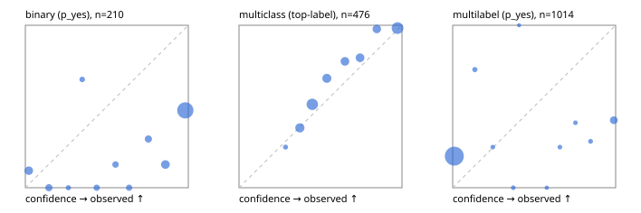

# Evaluation report

- model `Qwen/Qwen3-Reranker-4B` @ `22e683669b` (stock reranker pairs), adapter/checkpoint `None`, prompt `answer-v1` (724795e9b666)
- data data/hf.jsonl, data/eval.jsonl; splits ['calibration']; n=859; calibration `None`
- cuda / bfloat16; 2026-09-23T19:44:08+0000; wall 35.5s

## Overall

question accuracy 52.5%

**binary**: n 210, positives 71, accuracy 0.490, precision 0.394, recall 0.944, f1 0.556, auroc 0.769, brier 0.425, log_loss 1.766, ece 0.463

**multiclass**: n 476, accuracy 0.723, macro_f1 0.699, log_loss 0.647, brier 0.358, ece_top_label 0.063

**multilabel**: n 173, labels 1014, exact_match 0.023, micro_f1 0.212, macro_f1 0.292, label_auroc 0.702, brier 0.220, log_loss 1.079, ece 0.220

## By family

| family | n | question acc % | details |
|---|---|---|---|
| eval_adversarial | 19 | 73.7 | bin acc 78.6 F1 82.4 AUROC 0.776 ECE 0.232; mc acc 33.3 mF1 20.0 ECE 0.286; ml EM 100.0 µF1 100.0 ECE 0.088 |
| eval_agent_output | 9 | 33.3 | bin acc 40.0 F1 57.1 AUROC 0.667 ECE 0.465; mc acc 50.0 mF1 33.3 ECE 0.308; ml EM 0.0 µF1 33.3 ECE 0.378 |
| eval_evidence | 19 | 36.8 | bin acc 43.8 F1 52.6 AUROC 0.618 ECE 0.567; ml EM 0.0 µF1 52.2 ECE 0.632 |
| eval_multilabel | 12 | 33.3 | bin acc 100.0 F1 100.0 AUROC — ECE 0.004; mc acc 50.0 mF1 33.3 ECE 0.396; ml EM 12.5 µF1 54.2 ECE 0.460 |
| eval_policy | 16 | 18.8 | bin acc 37.5 F1 54.5 AUROC 0.533 ECE 0.585; mc acc 0.0 mF1 0.0 ECE 0.622; ml EM 0.0 µF1 44.4 ECE 0.709 |
| eval_routing | 15 | 60.0 | bin acc 57.1 F1 66.7 AUROC 0.667 ECE 0.379; mc acc 71.4 mF1 58.3 ECE 0.178; ml EM 0.0 µF1 80.0 ECE 0.310 |
| eval_urgency_sentiment | 19 | 57.9 | bin acc 62.5 F1 57.1 AUROC 0.750 ECE 0.424; mc acc 62.5 mF1 45.5 ECE 0.355; ml EM 33.3 µF1 58.8 ECE 0.457 |
| hf_emotions_multilabel | 150 | 0.0 | ml EM 0.0 µF1 0.0 ECE 0.193 |
| hf_intent_banking77 | 150 | 91.3 | mc acc 91.3 mF1 87.3 ECE 0.042 |
| hf_nli | 150 | 46.0 | bin acc 46.0 F1 51.5 AUROC 0.806 ECE 0.488 |
| hf_sentiment_tweets | 150 | 50.0 | mc acc 50.0 mF1 47.2 ECE 0.083 |
| hf_topic_agnews | 150 | 79.3 | mc acc 79.3 mF1 79.4 ECE 0.145 |

## by hard case

| slice | n | question acc % |
|---|---|---|
| (none) | 624 | 61.5 |
| contradiction | 58 | 15.5 |
| distractor | 25 | 28.0 |
| double_negation | 3 | 100.0 |
| evidence_end | 11 | 36.4 |
| evidence_middle | 6 | 16.7 |
| evidence_start | 7 | 57.1 |
| exception | 4 | 25.0 |
| hypothetical | 7 | 28.6 |
| injection | 6 | 66.7 |
| lexical_overlap | 16 | 62.5 |
| long_state | 42 | 33.3 |
| missing_evidence | 62 | 33.9 |
| multi_positive | 42 | 2.4 |
| multi_turn | 12 | 16.7 |
| negation | 12 | 33.3 |
| new_label_names | 5 | 80.0 |
| nota | 4 | 50.0 |
| numeric_reasoning | 15 | 13.3 |
| paraphrase | 10 | 40.0 |
| role_reversal | 13 | 15.4 |
| sarcasm | 1 | 0.0 |
| temporal_reasoning | 14 | 42.9 |
| zero_positive | 4 | 25.0 |

## by state tokens

| slice | n | question acc % |
|---|---|---|
| 00000-00127 | 780 | 53.6 |
| 00128-00511 | 37 | 51.4 |
| 00512-02047 | 42 | 33.3 |

## by candidates

| slice | n | question acc % |
|---|---|---|
| 01 | 210 | 49.0 |
| 03 | 158 | 48.1 |
| 04 | 168 | 77.4 |
| 05 | 15 | 26.7 |
| 06 | 157 | 0.6 |
| 07 | 1 | 0.0 |
| 08 | 150 | 91.3 |

## Paraphrase groups

5 groups; same prediction 40.0%; all correct 20.0%

## Multiclass abstention (coverage vs error on accepted)

| abstain_below | coverage % | error % |
|---|---|---|
| 0.0 | 100.0 | 27.7 |
| 0.4 | 87.2 | 22.4 |
| 0.5 | 63.9 | 12.8 |
| 0.6 | 52.9 | 8.7 |
| 0.7 | 43.5 | 5.8 |
| 0.8 | 34.0 | 1.9 |
| 0.9 | 24.8 | 1.7 |

## Reliability: binary

| bin | n | mean confidence | observed frequency |
|---|---|---|---|
| [0.0,0.1) | 19 | 0.021 | 0.105 |
| [0.1,0.2) | 10 | 0.144 | 0.000 |
| [0.2,0.3) | 2 | 0.264 | 0.000 |
| [0.3,0.4) | 3 | 0.349 | 0.667 |
| [0.4,0.5) | 6 | 0.438 | 0.000 |
| [0.5,0.6) | 7 | 0.553 | 0.143 |
| [0.6,0.7) | 6 | 0.637 | 0.000 |
| [0.7,0.8) | 10 | 0.755 | 0.300 |
| [0.8,0.9) | 21 | 0.859 | 0.143 |
| [0.9,1.0] | 126 | 0.982 | 0.476 |

## Reliability: multiclass

| bin | n | mean confidence | observed frequency |
|---|---|---|---|
| [0.2,0.3) | 4 | 0.286 | 0.250 |
| [0.3,0.4) | 57 | 0.373 | 0.368 |
| [0.4,0.5) | 111 | 0.449 | 0.514 |
| [0.5,0.6) | 52 | 0.539 | 0.673 |
| [0.6,0.7) | 45 | 0.650 | 0.778 |
| [0.7,0.8) | 45 | 0.743 | 0.800 |
| [0.8,0.9) | 44 | 0.846 | 0.977 |
| [0.9,1.0] | 118 | 0.973 | 0.983 |

## Reliability: multilabel

| bin | n | mean confidence | observed frequency |
|---|---|---|---|
| [0.0,0.1) | 910 | 0.010 | 0.195 |
| [0.1,0.2) | 11 | 0.136 | 0.727 |
| [0.2,0.3) | 4 | 0.246 | 0.250 |
| [0.3,0.4) | 5 | 0.372 | 0.000 |
| [0.4,0.5) | 1 | 0.407 | 1.000 |
| [0.5,0.6) | 2 | 0.577 | 0.000 |
| [0.6,0.7) | 4 | 0.658 | 0.250 |
| [0.7,0.8) | 5 | 0.753 | 0.400 |
| [0.8,0.9) | 7 | 0.846 | 0.286 |
| [0.9,1.0] | 65 | 0.989 | 0.415 |
