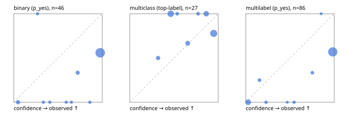

# Evaluation report

- model `Qwen/Qwen3-Reranker-4B` @ `22e683669b` (stock reranker pairs), adapter/checkpoint `None`, prompt `answer-v1` (724795e9b666)
- data data/synthetic.jsonl; splits ['test']; n=96; calibration `None`
- cuda / bfloat16; 2026-09-23T19:49:10+0000; wall 7.4s

## Overall

question accuracy 55.2%

**binary**: n 46, positives 21, accuracy 0.543, precision 0.500, recall 0.952, f1 0.656, auroc 0.653, brier 0.389, log_loss 1.787, ece 0.416

**multiclass**: n 27, accuracy 0.852, macro_f1 0.747, log_loss 0.674, brier 0.367, ece_top_label 0.257

**multilabel**: n 23, labels 86, exact_match 0.217, micro_f1 0.700, macro_f1 0.545, label_auroc 0.791, brier 0.313, log_loss 1.443, ece 0.329

## By family

| family | n | question acc % | details |
|---|---|---|---|
| syn_adversarial | 13 | 38.5 | bin acc 44.4 F1 54.5 AUROC 0.722 ECE 0.557; mc acc 100.0 mF1 100.0 ECE 0.391; ml EM 0.0 µF1 82.4 ECE 0.275 |
| syn_evidence | 23 | 47.8 | bin acc 46.2 F1 63.2 AUROC 0.762 ECE 0.493; mc acc 83.3 mF1 71.4 ECE 0.361; ml EM 0.0 µF1 66.7 ECE 0.391 |
| syn_multilabel | 8 | 25.0 | bin acc 0.0 F1 0.0 AUROC — ECE 0.731; mc acc 0.0 mF1 0.0 ECE 0.321; ml EM 33.3 µF1 75.9 ECE 0.352 |
| syn_policy | 19 | 52.6 | bin acc 50.0 F1 60.0 AUROC 0.733 ECE 0.486; mc acc 85.7 mF1 75.0 ECE 0.401; ml EM 0.0 µF1 60.0 ECE 0.562 |
| syn_routing | 12 | 75.0 | bin acc 75.0 F1 80.0 AUROC 0.500 ECE 0.235; mc acc 80.0 mF1 66.7 ECE 0.360; ml EM 66.7 µF1 66.7 ECE 0.134 |
| syn_urgency_sentiment | 21 | 76.2 | bin acc 72.7 F1 80.0 AUROC 0.867 ECE 0.248; mc acc 100.0 mF1 100.0 ECE 0.180; ml EM 33.3 µF1 60.0 ECE 0.290 |

## by hard case

| slice | n | question acc % |
|---|---|---|
| (none) | 9 | 88.9 |
| contradiction | 8 | 12.5 |
| distractor | 18 | 38.9 |
| double_negation | 2 | 100.0 |
| evidence_end | 4 | 25.0 |
| evidence_middle | 2 | 100.0 |
| evidence_start | 4 | 75.0 |
| exception | 20 | 40.0 |
| hypothetical | 2 | 0.0 |
| injection | 6 | 66.7 |
| lexical_overlap | 17 | 70.6 |
| long_state | 18 | 50.0 |
| missing_evidence | 5 | 20.0 |
| multi_positive | 13 | 15.4 |
| multi_turn | 4 | 25.0 |
| negation | 16 | 18.8 |
| nota | 2 | 50.0 |
| numeric_reasoning | 16 | 62.5 |
| paraphrase | 1 | 100.0 |
| role_reversal | 10 | 40.0 |
| sarcasm | 3 | 0.0 |
| temporal_reasoning | 10 | 50.0 |
| zero_positive | 3 | 66.7 |

## by state tokens

| slice | n | question acc % |
|---|---|---|
| 00000-00127 | 48 | 56.2 |
| 00128-00511 | 29 | 58.6 |
| 00512-02047 | 19 | 47.4 |

## by candidates

| slice | n | question acc % |
|---|---|---|
| 01 | 46 | 54.3 |
| 03 | 8 | 25.0 |
| 04 | 38 | 57.9 |
| 05 | 4 | 100.0 |

## Paraphrase groups

0 groups; same prediction —%; all correct —%

## Multiclass abstention (coverage vs error on accepted)

| abstain_below | coverage % | error % |
|---|---|---|
| 0.0 | 100.0 | 14.8 |
| 0.4 | 92.6 | 12.0 |
| 0.5 | 66.7 | 16.7 |
| 0.6 | 63.0 | 17.6 |
| 0.7 | 51.9 | 14.3 |
| 0.8 | 48.1 | 15.4 |
| 0.9 | 33.3 | 22.2 |

## Reliability: binary

| bin | n | mean confidence | observed frequency |
|---|---|---|---|
| [0.0,0.1) | 3 | 0.048 | 0.000 |
| [0.2,0.3) | 1 | 0.269 | 1.000 |
| [0.3,0.4) | 1 | 0.335 | 0.000 |
| [0.4,0.5) | 1 | 0.407 | 0.000 |
| [0.5,0.6) | 1 | 0.593 | 0.000 |
| [0.6,0.7) | 1 | 0.651 | 0.000 |
| [0.7,0.8) | 3 | 0.722 | 0.333 |
| [0.8,0.9) | 1 | 0.860 | 0.000 |
| [0.9,1.0] | 34 | 0.977 | 0.559 |

## Reliability: multiclass

| bin | n | mean confidence | observed frequency |
|---|---|---|---|
| [0.3,0.4) | 2 | 0.320 | 0.500 |
| [0.4,0.5) | 7 | 0.463 | 1.000 |
| [0.5,0.6) | 1 | 0.536 | 1.000 |
| [0.6,0.7) | 3 | 0.655 | 0.667 |
| [0.7,0.8) | 1 | 0.772 | 1.000 |
| [0.8,0.9) | 4 | 0.864 | 1.000 |
| [0.9,1.0] | 9 | 0.949 | 0.778 |

## Reliability: multilabel

| bin | n | mean confidence | observed frequency |
|---|---|---|---|
| [0.0,0.1) | 15 | 0.027 | 0.000 |
| [0.1,0.2) | 4 | 0.155 | 0.250 |
| [0.2,0.3) | 2 | 0.229 | 0.000 |
| [0.4,0.5) | 1 | 0.469 | 0.000 |
| [0.5,0.6) | 2 | 0.546 | 0.000 |
| [0.7,0.8) | 3 | 0.753 | 0.333 |
| [0.8,0.9) | 1 | 0.852 | 1.000 |
| [0.9,1.0] | 58 | 0.984 | 0.569 |
