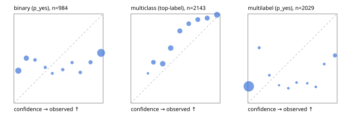

# Evaluation report

- model `Qwen/Qwen3-Reranker-4B` @ `22e683669b` (stock reranker pairs), adapter/checkpoint `None`, prompt `answer-v1` (724795e9b666)
- data data/hf.jsonl, data/eval.jsonl; splits ['test']; n=3471; calibration `None`
- cuda / bfloat16; 2026-09-23T19:46:30+0000; wall 135.4s

## Overall

question accuracy 62.8%

**binary**: n 984, positives 475, accuracy 0.550, precision 0.528, recall 0.638, f1 0.578, auroc 0.604, brier 0.375, log_loss 1.419, ece 0.357

**multiclass**: n 2143, accuracy 0.762, macro_f1 0.834, log_loss 0.732, brier 0.365, ece_top_label 0.144

**multilabel**: n 344, labels 2029, exact_match 0.020, micro_f1 0.251, macro_f1 0.358, label_auroc 0.691, brier 0.206, log_loss 0.986, ece 0.203

## By family

| family | n | question acc % | details |
|---|---|---|---|
| eval_adversarial | 27 | 55.6 | bin acc 60.0 F1 66.7 AUROC 0.806 ECE 0.428; mc acc 71.4 mF1 61.9 ECE 0.302; ml EM 20.0 µF1 69.2 ECE 0.330 |
| eval_agent_output | 26 | 46.2 | bin acc 64.3 F1 66.7 AUROC 0.653 ECE 0.392; mc acc 28.6 mF1 18.5 ECE 0.385; ml EM 20.0 µF1 53.3 ECE 0.332 |
| eval_evidence | 17 | 47.1 | bin acc 53.3 F1 58.8 AUROC 0.820 ECE 0.493; ml EM 0.0 µF1 46.2 ECE 0.594 |
| eval_multilabel | 32 | 18.8 | bin acc 42.9 F1 60.0 AUROC 0.583 ECE 0.549; mc acc 0.0 mF1 0.0 ECE 0.215; ml EM 12.5 µF1 58.3 ECE 0.345 |
| eval_policy | 22 | 40.9 | bin acc 46.2 F1 63.2 AUROC 0.440 ECE 0.529; mc acc 60.0 mF1 44.4 ECE 0.203; ml EM 0.0 µF1 69.6 ECE 0.465 |
| eval_routing | 25 | 56.0 | bin acc 50.0 F1 61.5 AUROC 0.729 ECE 0.416; mc acc 69.2 mF1 58.3 ECE 0.249; ml EM 0.0 µF1 33.3 ECE 0.404 |
| eval_urgency_sentiment | 22 | 54.5 | bin acc 60.0 F1 66.7 AUROC 0.500 ECE 0.351; mc acc 60.0 mF1 50.0 ECE 0.459; ml EM 0.0 µF1 66.7 ECE 0.499 |
| heldout_boolq | 300 | 62.0 | bin acc 62.0 F1 74.4 AUROC 0.617 ECE 0.286 |
| heldout_emotion_multiclass | 300 | 47.3 | mc acc 47.3 mF1 38.9 ECE 0.164 |
| heldout_intent_clinc | 300 | 94.7 | mc acc 94.7 mF1 94.3 ECE 0.211 |
| heldout_question_type_trec | 300 | 73.7 | mc acc 73.7 mF1 67.2 ECE 0.166 |
| heldout_sentiment_sst2 | 300 | 50.3 | bin acc 50.3 F1 1.3 AUROC 0.597 ECE 0.392 |
| heldout_topic_dbpedia | 300 | 93.7 | mc acc 93.7 mF1 93.4 ECE 0.221 |
| hf_emotions_multilabel | 300 | 0.7 | ml EM 0.7 µF1 1.1 ECE 0.184 |
| hf_intent_banking77 | 300 | 91.0 | mc acc 91.0 mF1 90.0 ECE 0.030 |
| hf_nli | 300 | 52.7 | bin acc 52.7 F1 59.2 AUROC 0.785 ECE 0.427 |
| hf_sentiment_tweets | 300 | 54.3 | mc acc 54.3 mF1 54.2 ECE 0.115 |
| hf_topic_agnews | 300 | 81.3 | mc acc 81.3 mF1 80.7 ECE 0.133 |

## by hard case

| slice | n | question acc % |
|---|---|---|
| (none) | 3042 | 66.7 |
| contradiction | 107 | 25.2 |
| distractor | 33 | 27.3 |
| double_negation | 6 | 16.7 |
| evidence_end | 13 | 53.8 |
| evidence_middle | 11 | 45.5 |
| evidence_start | 9 | 55.6 |
| exception | 7 | 0.0 |
| hypothetical | 7 | 42.9 |
| injection | 10 | 50.0 |
| lexical_overlap | 20 | 30.0 |
| long_state | 50 | 46.0 |
| missing_evidence | 104 | 32.7 |
| multi_positive | 81 | 2.5 |
| multi_turn | 9 | 55.6 |
| negation | 30 | 30.0 |
| new_label_names | 3 | 33.3 |
| nota | 46 | 91.3 |
| numeric_reasoning | 16 | 43.8 |
| paraphrase | 22 | 22.7 |
| role_reversal | 15 | 26.7 |
| sarcasm | 12 | 25.0 |
| temporal_reasoning | 29 | 34.5 |
| zero_positive | 6 | 33.3 |

## by state tokens

| slice | n | question acc % |
|---|---|---|
| 00000-00127 | 3211 | 63.3 |
| 00128-00511 | 208 | 61.1 |
| 00512-02047 | 52 | 44.2 |

## by candidates

| slice | n | question acc % |
|---|---|---|
| 01 | 984 | 55.0 |
| 03 | 310 | 54.8 |
| 04 | 333 | 78.4 |
| 05 | 22 | 13.6 |
| 06 | 1218 | 53.3 |
| 07 | 49 | 85.7 |
| 08 | 555 | 92.8 |

## Paraphrase groups

11 groups; same prediction 27.3%; all correct 9.1%

## Multiclass abstention (coverage vs error on accepted)

| abstain_below | coverage % | error % |
|---|---|---|
| 0.0 | 100.0 | 23.8 |
| 0.4 | 75.6 | 13.6 |
| 0.5 | 60.8 | 7.6 |
| 0.6 | 49.1 | 4.8 |
| 0.7 | 39.8 | 3.4 |
| 0.8 | 29.5 | 2.4 |
| 0.9 | 18.7 | 1.0 |

## Reliability: binary

| bin | n | mean confidence | observed frequency |
|---|---|---|---|
| [0.0,0.1) | 212 | 0.050 | 0.363 |
| [0.1,0.2) | 135 | 0.139 | 0.504 |
| [0.2,0.3) | 31 | 0.237 | 0.484 |
| [0.3,0.4) | 20 | 0.352 | 0.400 |
| [0.4,0.5) | 12 | 0.430 | 0.333 |
| [0.5,0.6) | 24 | 0.548 | 0.375 |
| [0.6,0.7) | 22 | 0.652 | 0.455 |
| [0.7,0.8) | 32 | 0.744 | 0.344 |
| [0.8,0.9) | 59 | 0.859 | 0.458 |
| [0.9,1.0] | 437 | 0.977 | 0.563 |

## Reliability: multiclass

| bin | n | mean confidence | observed frequency |
|---|---|---|---|
| [0.1,0.2) | 9 | 0.191 | 0.333 |
| [0.2,0.3) | 190 | 0.253 | 0.458 |
| [0.3,0.4) | 324 | 0.357 | 0.441 |
| [0.4,0.5) | 316 | 0.446 | 0.617 |
| [0.5,0.6) | 251 | 0.548 | 0.809 |
| [0.6,0.7) | 200 | 0.648 | 0.890 |
| [0.7,0.8) | 220 | 0.750 | 0.936 |
| [0.8,0.9) | 233 | 0.855 | 0.953 |
| [0.9,1.0] | 400 | 0.965 | 0.990 |

## Reliability: multilabel

| bin | n | mean confidence | observed frequency |
|---|---|---|---|
| [0.0,0.1) | 1802 | 0.010 | 0.188 |
| [0.1,0.2) | 29 | 0.127 | 0.621 |
| [0.2,0.3) | 16 | 0.241 | 0.312 |
| [0.3,0.4) | 5 | 0.349 | 0.200 |
| [0.4,0.5) | 12 | 0.453 | 0.167 |
| [0.5,0.6) | 13 | 0.545 | 0.231 |
| [0.6,0.7) | 9 | 0.665 | 0.222 |
| [0.7,0.8) | 11 | 0.761 | 0.182 |
| [0.8,0.9) | 16 | 0.855 | 0.438 |
| [0.9,1.0] | 116 | 0.976 | 0.534 |
