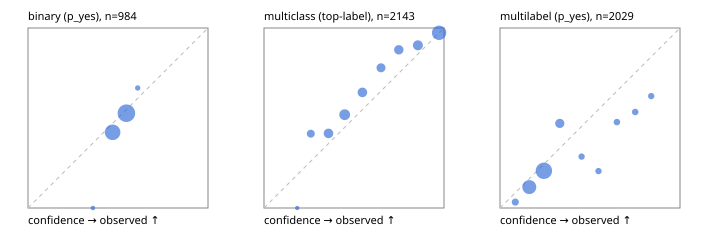

# Evaluation report

- model `Qwen/Qwen3-Reranker-4B` @ `22e683669b` (stock reranker pairs), adapter/checkpoint `None`, prompt `answer-v1` (724795e9b666)
- data data/hf.jsonl, data/eval.jsonl; splits ['test']; n=3471; calibration `{'method': 'temperature scaling per output type, grid search on NLL', 'min_n': 30, 'model': 'Qwen/Qwen3-Reranker-4B', 'revision': '22e683669bc0f0bd69640a1354a6d0aebcfeede5', 'adapter': None, 'adapter_sha256': None, 'prompt_sha': '724795e9b666', 'fit_report': 'reports/baseline_4b/calibration/report.json', 'fit_report_sha256': '3d76f491abf4d83816cb5c8883eaf3a32061992b86f9b64a32c2830fb98967cd', 'fit_data': [{'path': 'data/hf.jsonl', 'sha256': 'fe29b29286d5a372271e925825e8b9794f3f64be9a9fc04cad458b4b94ada510'}, {'path': 'data/eval.jsonl', 'sha256': 'be888eb38dcca063823924430e03985ddf2186b874e792d5734936ba93ba6910'}], 'created': '2026-09-23T19:46:34+0000', 'n': {'binary': 210, 'multiclass': 476, 'multilabel': 1014}, 'nll_before': {'binary': 1.766051348122692, 'multiclass': 0.6473580241830156, 'multilabel': 1.0788931546828444}, 'nll_after': {'binary': 0.686992340627186, 'multiclass': 0.6208673555883749, 'multilabel': 0.5135623751224832}, 'skipped': {}, 'threshold_report': 'reports/baseline_4b/validation/report.json', 'threshold_report_sha256': 'af91288995d8f4bc43b6d31febb20c5a63514e697be13fa53fb519e2dba5b723', 'threshold_rule': 'max F1 on validation after temperature scaling', 'file': 'calib/baseline_4b.json', 'file_sha256': 'f22970cf1723275e2a609d4537b30ab3a3eb28c032589cc883fa903683135519'}`
- cuda / bfloat16; 2026-09-23T19:48:56+0000; wall 135.3s

## Overall

question accuracy 64.6%

**binary**: n 984, positives 475, accuracy 0.584, precision 0.598, recall 0.425, f1 0.497, auroc 0.604, brier 0.245, log_loss 0.683, ece 0.033

**multiclass**: n 2143, accuracy 0.762, macro_f1 0.834, log_loss 0.666, brier 0.336, ece_top_label 0.060

**multilabel**: n 344, labels 2029, exact_match 0.105, micro_f1 0.439, macro_f1 0.392, label_auroc 0.691, brier 0.162, log_loss 0.499, ece 0.067

## By family

| family | n | question acc % | details |
|---|---|---|---|
| eval_adversarial | 27 | 63.0 | bin acc 80.0 F1 80.0 AUROC 0.806 ECE 0.138; mc acc 71.4 mF1 61.9 ECE 0.284; ml EM 0.0 µF1 60.0 ECE 0.228 |
| eval_agent_output | 26 | 38.5 | bin acc 57.1 F1 40.0 AUROC 0.653 ECE 0.115; mc acc 28.6 mF1 18.5 ECE 0.333; ml EM 0.0 µF1 58.3 ECE 0.187 |
| eval_evidence | 17 | 52.9 | bin acc 60.0 F1 57.1 AUROC 0.820 ECE 0.205; ml EM 0.0 µF1 42.9 ECE 0.381 |
| eval_multilabel | 32 | 9.4 | bin acc 42.9 F1 50.0 AUROC 0.583 ECE 0.126; mc acc 0.0 mF1 0.0 ECE 0.222; ml EM 0.0 µF1 53.2 ECE 0.234 |
| eval_policy | 22 | 45.5 | bin acc 53.8 F1 66.7 AUROC 0.440 ECE 0.107; mc acc 60.0 mF1 44.4 ECE 0.162; ml EM 0.0 µF1 69.6 ECE 0.310 |
| eval_routing | 25 | 60.0 | bin acc 60.0 F1 50.0 AUROC 0.729 ECE 0.128; mc acc 69.2 mF1 58.3 ECE 0.199; ml EM 0.0 µF1 50.0 ECE 0.391 |
| eval_urgency_sentiment | 22 | 40.9 | bin acc 30.0 F1 0.0 AUROC 0.500 ECE 0.090; mc acc 60.0 mF1 50.0 ECE 0.454; ml EM 0.0 µF1 66.7 ECE 0.348 |
| heldout_boolq | 300 | 57.3 | bin acc 57.3 F1 59.0 AUROC 0.617 ECE 0.080 |
| heldout_emotion_multiclass | 300 | 47.3 | mc acc 47.3 mF1 38.9 ECE 0.119 |
| heldout_intent_clinc | 300 | 94.7 | mc acc 94.7 mF1 94.3 ECE 0.120 |
| heldout_question_type_trec | 300 | 73.7 | mc acc 73.7 mF1 67.2 ECE 0.066 |
| heldout_sentiment_sst2 | 300 | 50.0 | bin acc 50.0 F1 0.0 AUROC 0.597 ECE 0.030 |
| heldout_topic_dbpedia | 300 | 93.7 | mc acc 93.7 mF1 93.4 ECE 0.104 |
| hf_emotions_multilabel | 300 | 12.0 | ml EM 12.0 µF1 40.4 ECE 0.054 |
| hf_intent_banking77 | 300 | 91.0 | mc acc 91.0 mF1 90.0 ECE 0.026 |
| hf_nli | 300 | 68.3 | bin acc 68.3 F1 64.9 AUROC 0.785 ECE 0.175 |
| hf_sentiment_tweets | 300 | 54.3 | mc acc 54.3 mF1 54.2 ECE 0.087 |
| hf_topic_agnews | 300 | 81.3 | mc acc 81.3 mF1 80.7 ECE 0.066 |

## by hard case

| slice | n | question acc % |
|---|---|---|
| (none) | 3042 | 66.5 |
| contradiction | 107 | 56.1 |
| distractor | 33 | 24.2 |
| double_negation | 6 | 16.7 |
| evidence_end | 13 | 30.8 |
| evidence_middle | 11 | 27.3 |
| evidence_start | 9 | 55.6 |
| exception | 7 | 0.0 |
| hypothetical | 7 | 71.4 |
| injection | 10 | 40.0 |
| lexical_overlap | 20 | 45.0 |
| long_state | 50 | 36.0 |
| missing_evidence | 104 | 62.5 |
| multi_positive | 81 | 4.9 |
| multi_turn | 9 | 44.4 |
| negation | 30 | 33.3 |
| new_label_names | 3 | 33.3 |
| nota | 46 | 91.3 |
| numeric_reasoning | 16 | 43.8 |
| paraphrase | 22 | 18.2 |
| role_reversal | 15 | 46.7 |
| sarcasm | 12 | 25.0 |
| temporal_reasoning | 29 | 27.6 |
| zero_positive | 6 | 0.0 |

## by state tokens

| slice | n | question acc % |
|---|---|---|
| 00000-00127 | 3211 | 65.5 |
| 00128-00511 | 208 | 57.7 |
| 00512-02047 | 52 | 38.5 |

## by candidates

| slice | n | question acc % |
|---|---|---|
| 01 | 984 | 58.4 |
| 03 | 310 | 54.8 |
| 04 | 333 | 77.5 |
| 05 | 22 | 13.6 |
| 06 | 1218 | 55.9 |
| 07 | 49 | 85.7 |
| 08 | 555 | 92.8 |

## Paraphrase groups

11 groups; same prediction 27.3%; all correct 9.1%

## Multiclass abstention (coverage vs error on accepted)

| abstain_below | coverage % | error % |
|---|---|---|
| 0.0 | 100.0 | 23.8 |
| 0.4 | 85.1 | 17.7 |
| 0.5 | 70.9 | 11.6 |
| 0.6 | 61.4 | 7.8 |
| 0.7 | 53.4 | 5.7 |
| 0.8 | 44.5 | 4.4 |
| 0.9 | 33.4 | 2.7 |

## Reliability: binary

| bin | n | mean confidence | observed frequency |
|---|---|---|---|
| [0.3,0.4) | 1 | 0.361 | 0.000 |
| [0.4,0.5) | 409 | 0.470 | 0.421 |
| [0.5,0.6) | 568 | 0.546 | 0.526 |
| [0.6,0.7) | 6 | 0.609 | 0.667 |

## Reliability: multiclass

| bin | n | mean confidence | observed frequency |
|---|---|---|---|
| [0.1,0.2) | 1 | 0.184 | 0.000 |
| [0.2,0.3) | 109 | 0.260 | 0.413 |
| [0.3,0.4) | 210 | 0.359 | 0.414 |
| [0.4,0.5) | 303 | 0.448 | 0.518 |
| [0.5,0.6) | 204 | 0.547 | 0.642 |
| [0.6,0.7) | 172 | 0.650 | 0.779 |
| [0.7,0.8) | 190 | 0.749 | 0.879 |
| [0.8,0.9) | 239 | 0.855 | 0.904 |
| [0.9,1.0] | 715 | 0.973 | 0.973 |

## Reliability: multilabel

| bin | n | mean confidence | observed frequency |
|---|---|---|---|
| [0.0,0.1) | 61 | 0.085 | 0.033 |
| [0.1,0.2) | 637 | 0.163 | 0.116 |
| [0.2,0.3) | 963 | 0.244 | 0.207 |
| [0.3,0.4) | 168 | 0.332 | 0.470 |
| [0.4,0.5) | 35 | 0.454 | 0.286 |
| [0.5,0.6) | 39 | 0.547 | 0.205 |
| [0.6,0.7) | 44 | 0.650 | 0.477 |
| [0.7,0.8) | 45 | 0.751 | 0.533 |
| [0.8,0.9) | 37 | 0.840 | 0.622 |
