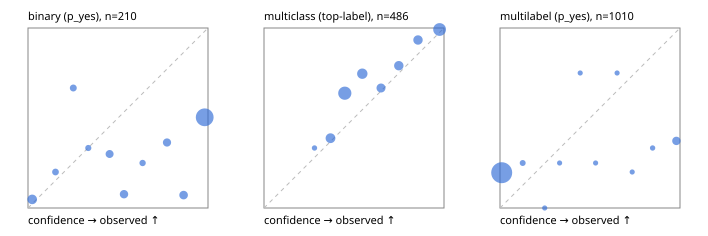

# Evaluation report

- model `Qwen/Qwen3-Reranker-4B` @ `22e683669b` (stock reranker pairs), adapter/checkpoint `None`, prompt `answer-v1` (724795e9b666)
- data data/hf.jsonl, data/eval.jsonl; splits ['validation']; n=868; calibration `None`
- cuda / bfloat16; 2026-09-23T19:43:26+0000; wall 35.1s

## Overall

question accuracy 54.4%

**binary**: n 210, positives 79, accuracy 0.495, precision 0.418, recall 0.873, f1 0.566, auroc 0.732, brier 0.403, log_loss 1.645, ece 0.412

**multiclass**: n 486, accuracy 0.753, macro_f1 0.726, log_loss 0.659, brier 0.363, ece_top_label 0.093

**multilabel**: n 172, labels 1010, exact_match 0.012, micro_f1 0.199, macro_f1 0.244, label_auroc 0.682, brier 0.218, log_loss 1.049, ece 0.215

## By family

| family | n | question acc % | details |
|---|---|---|---|
| eval_adversarial | 14 | 64.3 | bin acc 71.4 F1 80.0 AUROC 0.500 ECE 0.273; mc acc 80.0 mF1 66.7 ECE 0.322; ml EM 0.0 µF1 60.0 ECE 0.380 |
| eval_agent_output | 20 | 45.0 | bin acc 50.0 F1 57.1 AUROC 0.583 ECE 0.435; mc acc 60.0 mF1 44.4 ECE 0.459; ml EM 0.0 µF1 0.0 ECE 0.651 |
| eval_evidence | 17 | 35.3 | bin acc 42.9 F1 55.6 AUROC 0.889 ECE 0.539; ml EM 0.0 µF1 44.4 ECE 0.652 |
| eval_multilabel | 12 | 16.7 | bin acc 100.0 F1 0.0 AUROC — ECE 0.469; mc acc 50.0 mF1 33.3 ECE 0.366; ml EM 0.0 µF1 61.3 ECE 0.381 |
| eval_policy | 24 | 50.0 | bin acc 58.3 F1 73.7 AUROC 0.429 ECE 0.405; mc acc 45.5 mF1 29.4 ECE 0.214; ml EM 0.0 µF1 66.7 ECE 0.493 |
| eval_routing | 16 | 93.8 | bin acc 85.7 F1 90.9 AUROC 1.000 ECE 0.127; mc acc 100.0 mF1 100.0 ECE 0.326; ml EM 100.0 µF1 0.0 ECE 0.087 |
| eval_urgency_sentiment | 15 | 53.3 | bin acc 57.1 F1 57.1 AUROC 0.500 ECE 0.499; mc acc 60.0 mF1 42.9 ECE 0.359; ml EM 33.3 µF1 28.6 ECE 0.469 |
| hf_emotions_multilabel | 150 | 0.0 | ml EM 0.0 µF1 0.0 ECE 0.190 |
| hf_intent_banking77 | 150 | 92.0 | mc acc 92.0 mF1 88.7 ECE 0.039 |
| hf_nli | 150 | 46.0 | bin acc 46.0 F1 50.9 AUROC 0.781 ECE 0.459 |
| hf_sentiment_tweets | 150 | 55.3 | mc acc 55.3 mF1 54.0 ECE 0.109 |
| hf_topic_agnews | 150 | 80.7 | mc acc 80.7 mF1 80.6 ECE 0.144 |

## by hard case

| slice | n | question acc % |
|---|---|---|
| (none) | 634 | 62.3 |
| contradiction | 63 | 22.2 |
| distractor | 20 | 25.0 |
| double_negation | 3 | 100.0 |
| evidence_end | 4 | 50.0 |
| evidence_middle | 7 | 28.6 |
| evidence_start | 3 | 66.7 |
| exception | 7 | 42.9 |
| hypothetical | 6 | 16.7 |
| injection | 16 | 62.5 |
| lexical_overlap | 13 | 61.5 |
| long_state | 26 | 34.6 |
| missing_evidence | 59 | 28.8 |
| multi_positive | 40 | 0.0 |
| multi_turn | 21 | 42.9 |
| negation | 9 | 55.6 |
| new_label_names | 5 | 20.0 |
| nota | 4 | 50.0 |
| numeric_reasoning | 13 | 38.5 |
| paraphrase | 10 | 50.0 |
| role_reversal | 7 | 42.9 |
| sarcasm | 5 | 40.0 |
| temporal_reasoning | 15 | 60.0 |
| zero_positive | 7 | 28.6 |

## by state tokens

| slice | n | question acc % |
|---|---|---|
| 00000-00127 | 796 | 54.5 |
| 00128-00511 | 46 | 63.0 |
| 00512-02047 | 26 | 34.6 |

## by candidates

| slice | n | question acc % |
|---|---|---|
| 01 | 210 | 49.5 |
| 03 | 162 | 56.2 |
| 04 | 174 | 78.2 |
| 05 | 13 | 23.1 |
| 06 | 159 | 0.0 |
| 08 | 150 | 92.0 |

## Paraphrase groups

5 groups; same prediction 40.0%; all correct 40.0%

## Multiclass abstention (coverage vs error on accepted)

| abstain_below | coverage % | error % |
|---|---|---|
| 0.0 | 100.0 | 24.7 |
| 0.4 | 89.3 | 20.3 |
| 0.5 | 63.2 | 13.7 |
| 0.6 | 50.2 | 10.7 |
| 0.7 | 42.2 | 6.3 |
| 0.8 | 33.3 | 2.5 |
| 0.9 | 24.1 | 0.9 |

## Reliability: binary

| bin | n | mean confidence | observed frequency |
|---|---|---|---|
| [0.0,0.1) | 21 | 0.023 | 0.048 |
| [0.1,0.2) | 5 | 0.153 | 0.200 |
| [0.2,0.3) | 6 | 0.252 | 0.667 |
| [0.3,0.4) | 3 | 0.335 | 0.333 |
| [0.4,0.5) | 10 | 0.453 | 0.300 |
| [0.5,0.6) | 13 | 0.533 | 0.077 |
| [0.6,0.7) | 4 | 0.637 | 0.250 |
| [0.7,0.8) | 11 | 0.772 | 0.364 |
| [0.8,0.9) | 14 | 0.864 | 0.071 |
| [0.9,1.0] | 123 | 0.982 | 0.504 |

## Reliability: multiclass

| bin | n | mean confidence | observed frequency |
|---|---|---|---|
| [0.2,0.3) | 3 | 0.281 | 0.333 |
| [0.3,0.4) | 49 | 0.370 | 0.388 |
| [0.4,0.5) | 127 | 0.449 | 0.638 |
| [0.5,0.6) | 63 | 0.546 | 0.746 |
| [0.6,0.7) | 39 | 0.650 | 0.667 |
| [0.7,0.8) | 43 | 0.749 | 0.791 |
| [0.8,0.9) | 45 | 0.856 | 0.933 |
| [0.9,1.0] | 117 | 0.975 | 0.991 |

## Reliability: multilabel

| bin | n | mean confidence | observed frequency |
|---|---|---|---|
| [0.0,0.1) | 907 | 0.009 | 0.196 |
| [0.1,0.2) | 12 | 0.126 | 0.250 |
| [0.2,0.3) | 5 | 0.248 | 0.000 |
| [0.3,0.4) | 4 | 0.331 | 0.250 |
| [0.4,0.5) | 4 | 0.446 | 0.750 |
| [0.5,0.6) | 4 | 0.531 | 0.250 |
| [0.6,0.7) | 4 | 0.651 | 0.750 |
| [0.7,0.8) | 5 | 0.734 | 0.200 |
| [0.8,0.9) | 6 | 0.848 | 0.333 |
| [0.9,1.0] | 59 | 0.980 | 0.373 |
