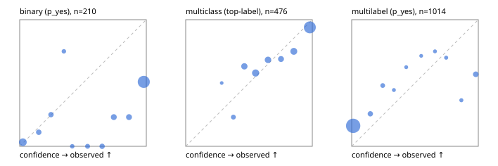

# Evaluation report

- model `Qwen/Qwen3-Reranker-8B` @ `77d193c791` (stock reranker pairs), adapter/checkpoint `None`, prompt `task-v1` (f7b8d8022dfb)
- data data/hf.jsonl, data/eval.jsonl; splits ['calibration']; n=859; calibration `None`
- cuda / bfloat16; 2026-09-23T20:59:45+0000; wall 47.6s

## Overall

question accuracy 59.5%

**binary**: n 210, positives 71, accuracy 0.538, precision 0.416, recall 0.901, f1 0.569, auroc 0.781, brier 0.367, log_loss 1.534, ece 0.385

**multiclass**: n 476, accuracy 0.794, macro_f1 0.767, log_loss 0.551, brier 0.307, ece_top_label 0.060

**multilabel**: n 173, labels 1014, exact_match 0.116, micro_f1 0.333, macro_f1 0.365, label_auroc 0.806, brier 0.179, log_loss 0.754, ece 0.166

## By family

| family | n | question acc % | details |
|---|---|---|---|
| eval_adversarial | 19 | 73.7 | bin acc 71.4 F1 75.0 AUROC 0.776 ECE 0.210; mc acc 66.7 mF1 50.0 ECE 0.325; ml EM 100.0 µF1 100.0 ECE 0.078 |
| eval_agent_output | 9 | 22.2 | bin acc 20.0 F1 33.3 AUROC 0.333 ECE 0.632; mc acc 50.0 mF1 33.3 ECE 0.416; ml EM 0.0 µF1 0.0 ECE 0.390 |
| eval_evidence | 19 | 36.8 | bin acc 43.8 F1 52.6 AUROC 0.673 ECE 0.570; ml EM 0.0 µF1 52.2 ECE 0.617 |
| eval_multilabel | 12 | 50.0 | bin acc 100.0 F1 100.0 AUROC — ECE 0.008; mc acc 50.0 mF1 33.3 ECE 0.154; ml EM 37.5 µF1 70.3 ECE 0.247 |
| eval_policy | 16 | 25.0 | bin acc 37.5 F1 54.5 AUROC 0.467 ECE 0.618; mc acc 0.0 mF1 0.0 ECE 0.591; ml EM 25.0 µF1 50.0 ECE 0.569 |
| eval_routing | 15 | 73.3 | bin acc 71.4 F1 75.0 AUROC 0.750 ECE 0.202; mc acc 85.7 mF1 71.4 ECE 0.218; ml EM 0.0 µF1 66.7 ECE 0.171 |
| eval_urgency_sentiment | 19 | 73.7 | bin acc 62.5 F1 57.1 AUROC 0.833 ECE 0.386; mc acc 100.0 mF1 100.0 ECE 0.146; ml EM 33.3 µF1 83.3 ECE 0.234 |
| hf_emotions_multilabel | 150 | 8.7 | ml EM 8.7 µF1 20.1 ECE 0.162 |
| hf_intent_banking77 | 150 | 93.3 | mc acc 93.3 mF1 89.4 ECE 0.040 |
| hf_nli | 150 | 53.3 | bin acc 53.3 F1 54.5 AUROC 0.847 ECE 0.400 |
| hf_sentiment_tweets | 150 | 68.7 | mc acc 68.7 mF1 67.5 ECE 0.089 |
| hf_topic_agnews | 150 | 78.0 | mc acc 78.0 mF1 77.1 ECE 0.127 |

## by hard case

| slice | n | question acc % |
|---|---|---|
| (none) | 624 | 67.9 |
| contradiction | 58 | 36.2 |
| distractor | 25 | 44.0 |
| double_negation | 3 | 100.0 |
| evidence_end | 11 | 54.5 |
| evidence_middle | 6 | 16.7 |
| evidence_start | 7 | 57.1 |
| exception | 4 | 25.0 |
| hypothetical | 7 | 42.9 |
| injection | 6 | 66.7 |
| lexical_overlap | 16 | 81.2 |
| long_state | 42 | 40.5 |
| missing_evidence | 62 | 35.5 |
| multi_positive | 42 | 2.4 |
| multi_turn | 12 | 33.3 |
| negation | 12 | 58.3 |
| new_label_names | 5 | 80.0 |
| nota | 4 | 75.0 |
| numeric_reasoning | 15 | 13.3 |
| paraphrase | 10 | 60.0 |
| role_reversal | 13 | 15.4 |
| sarcasm | 1 | 100.0 |
| temporal_reasoning | 14 | 57.1 |
| zero_positive | 4 | 50.0 |

## by state tokens

| slice | n | question acc % |
|---|---|---|
| 00000-00127 | 780 | 60.6 |
| 00128-00511 | 37 | 56.8 |
| 00512-02047 | 42 | 40.5 |

## by candidates

| slice | n | question acc % |
|---|---|---|
| 01 | 210 | 53.8 |
| 03 | 158 | 67.7 |
| 04 | 168 | 77.4 |
| 05 | 15 | 46.7 |
| 06 | 157 | 8.9 |
| 07 | 1 | 0.0 |
| 08 | 150 | 93.3 |

## Paraphrase groups

5 groups; same prediction 60.0%; all correct 40.0%

## Multiclass abstention (coverage vs error on accepted)

| abstain_below | coverage % | error % |
|---|---|---|
| 0.0 | 100.0 | 20.6 |
| 0.4 | 96.8 | 18.9 |
| 0.5 | 88.9 | 17.3 |
| 0.6 | 76.9 | 13.4 |
| 0.7 | 68.3 | 11.1 |
| 0.8 | 62.2 | 9.1 |
| 0.9 | 52.1 | 6.0 |

## Reliability: binary

| bin | n | mean confidence | observed frequency |
|---|---|---|---|
| [0.0,0.1) | 31 | 0.025 | 0.032 |
| [0.1,0.2) | 9 | 0.150 | 0.111 |
| [0.2,0.3) | 8 | 0.247 | 0.250 |
| [0.3,0.4) | 4 | 0.349 | 0.750 |
| [0.4,0.5) | 4 | 0.415 | 0.000 |
| [0.5,0.6) | 6 | 0.536 | 0.000 |
| [0.6,0.7) | 8 | 0.651 | 0.000 |
| [0.7,0.8) | 13 | 0.743 | 0.231 |
| [0.8,0.9) | 13 | 0.863 | 0.231 |
| [0.9,1.0] | 114 | 0.980 | 0.509 |

## Reliability: multiclass

| bin | n | mean confidence | observed frequency |
|---|---|---|---|
| [0.2,0.3) | 2 | 0.285 | 0.500 |
| [0.3,0.4) | 13 | 0.377 | 0.231 |
| [0.4,0.5) | 38 | 0.464 | 0.632 |
| [0.5,0.6) | 57 | 0.552 | 0.579 |
| [0.6,0.7) | 41 | 0.650 | 0.683 |
| [0.7,0.8) | 29 | 0.753 | 0.690 |
| [0.8,0.9) | 48 | 0.854 | 0.750 |
| [0.9,1.0] | 248 | 0.981 | 0.940 |

## Reliability: multilabel

| bin | n | mean confidence | observed frequency |
|---|---|---|---|
| [0.0,0.1) | 846 | 0.012 | 0.162 |
| [0.1,0.2) | 39 | 0.147 | 0.256 |
| [0.2,0.3) | 25 | 0.245 | 0.480 |
| [0.3,0.4) | 9 | 0.333 | 0.444 |
| [0.4,0.5) | 8 | 0.430 | 0.625 |
| [0.5,0.6) | 7 | 0.549 | 0.714 |
| [0.6,0.7) | 8 | 0.658 | 0.750 |
| [0.7,0.8) | 10 | 0.746 | 0.700 |
| [0.8,0.9) | 11 | 0.866 | 0.364 |
| [0.9,1.0] | 51 | 0.980 | 0.569 |
