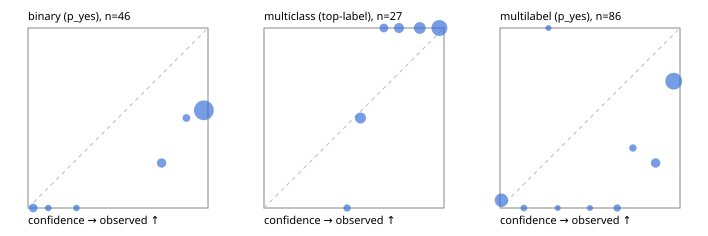

# Evaluation report

- model `Qwen/Qwen3-Reranker-8B` @ `77d193c791` (stock reranker pairs), adapter/checkpoint `None`, prompt `task-v1` (f7b8d8022dfb)
- data data/synthetic.jsonl; splits ['test']; n=96; calibration `None`
- cuda / bfloat16; 2026-09-23T21:06:20+0000; wall 10.4s

## Overall

question accuracy 59.4%

**binary**: n 46, positives 21, accuracy 0.565, precision 0.512, recall 1.000, f1 0.677, auroc 0.711, brier 0.387, log_loss 1.663, ece 0.400

**multiclass**: n 27, accuracy 0.889, macro_f1 0.786, log_loss 0.277, brier 0.137, ece_top_label 0.111

**multilabel**: n 23, labels 86, exact_match 0.304, micro_f1 0.716, macro_f1 0.565, label_auroc 0.871, brier 0.239, log_loss 0.828, ece 0.258

## By family

| family | n | question acc % | details |
|---|---|---|---|
| syn_adversarial | 13 | 38.5 | bin acc 44.4 F1 54.5 AUROC 0.944 ECE 0.519; mc acc 0.0 mF1 0.0 ECE 0.531; ml EM 33.3 µF1 87.5 ECE 0.152 |
| syn_evidence | 23 | 52.2 | bin acc 46.2 F1 63.2 AUROC 0.726 ECE 0.521; mc acc 83.3 mF1 71.4 ECE 0.246; ml EM 25.0 µF1 73.7 ECE 0.316 |
| syn_multilabel | 8 | 25.0 | bin acc 100.0 F1 100.0 AUROC — ECE 0.245; mc acc 0.0 mF1 0.0 ECE 0.462; ml EM 16.7 µF1 71.4 ECE 0.346 |
| syn_policy | 19 | 57.9 | bin acc 50.0 F1 60.0 AUROC 0.733 ECE 0.479; mc acc 100.0 mF1 100.0 ECE 0.228; ml EM 0.0 µF1 60.0 ECE 0.422 |
| syn_routing | 12 | 91.7 | bin acc 75.0 F1 80.0 AUROC 1.000 ECE 0.244; mc acc 100.0 mF1 100.0 ECE 0.072; ml EM 100.0 µF1 100.0 ECE 0.005 |
| syn_urgency_sentiment | 21 | 76.2 | bin acc 72.7 F1 80.0 AUROC 0.767 ECE 0.241; mc acc 100.0 mF1 100.0 ECE 0.071; ml EM 33.3 µF1 60.0 ECE 0.292 |

## by hard case

| slice | n | question acc % |
|---|---|---|
| (none) | 9 | 100.0 |
| contradiction | 8 | 12.5 |
| distractor | 18 | 50.0 |
| double_negation | 2 | 100.0 |
| evidence_end | 4 | 25.0 |
| evidence_middle | 2 | 100.0 |
| evidence_start | 4 | 75.0 |
| exception | 20 | 45.0 |
| hypothetical | 2 | 50.0 |
| injection | 6 | 66.7 |
| lexical_overlap | 17 | 64.7 |
| long_state | 18 | 50.0 |
| missing_evidence | 5 | 20.0 |
| multi_positive | 13 | 23.1 |
| multi_turn | 4 | 25.0 |
| negation | 16 | 18.8 |
| nota | 2 | 100.0 |
| numeric_reasoning | 16 | 62.5 |
| paraphrase | 1 | 100.0 |
| role_reversal | 10 | 40.0 |
| sarcasm | 3 | 0.0 |
| temporal_reasoning | 10 | 60.0 |
| zero_positive | 3 | 66.7 |

## by state tokens

| slice | n | question acc % |
|---|---|---|
| 00000-00127 | 48 | 62.5 |
| 00128-00511 | 29 | 62.1 |
| 00512-02047 | 19 | 47.4 |

## by candidates

| slice | n | question acc % |
|---|---|---|
| 01 | 46 | 56.5 |
| 03 | 8 | 25.0 |
| 04 | 38 | 65.8 |
| 05 | 4 | 100.0 |

## Paraphrase groups

0 groups; same prediction —%; all correct —%

## Multiclass abstention (coverage vs error on accepted)

| abstain_below | coverage % | error % |
|---|---|---|
| 0.0 | 100.0 | 11.1 |
| 0.4 | 100.0 | 11.1 |
| 0.5 | 96.3 | 7.7 |
| 0.6 | 81.5 | 0.0 |
| 0.7 | 74.1 | 0.0 |
| 0.8 | 63.0 | 0.0 |
| 0.9 | 44.4 | 0.0 |

## Reliability: binary

| bin | n | mean confidence | observed frequency |
|---|---|---|---|
| [0.0,0.1) | 3 | 0.029 | 0.000 |
| [0.1,0.2) | 1 | 0.113 | 0.000 |
| [0.2,0.3) | 1 | 0.269 | 0.000 |
| [0.7,0.8) | 4 | 0.742 | 0.250 |
| [0.8,0.9) | 2 | 0.880 | 0.500 |
| [0.9,1.0] | 35 | 0.977 | 0.543 |

## Reliability: multiclass

| bin | n | mean confidence | observed frequency |
|---|---|---|---|
| [0.4,0.5) | 1 | 0.462 | 0.000 |
| [0.5,0.6) | 4 | 0.536 | 0.500 |
| [0.6,0.7) | 2 | 0.666 | 1.000 |
| [0.7,0.8) | 3 | 0.750 | 1.000 |
| [0.8,0.9) | 5 | 0.865 | 1.000 |
| [0.9,1.0] | 12 | 0.975 | 1.000 |

## Reliability: multilabel

| bin | n | mean confidence | observed frequency |
|---|---|---|---|
| [0.0,0.1) | 23 | 0.008 | 0.043 |
| [0.1,0.2) | 2 | 0.133 | 0.000 |
| [0.2,0.3) | 1 | 0.269 | 1.000 |
| [0.3,0.4) | 1 | 0.321 | 0.000 |
| [0.5,0.6) | 1 | 0.500 | 0.000 |
| [0.6,0.7) | 3 | 0.651 | 0.000 |
| [0.7,0.8) | 3 | 0.739 | 0.333 |
| [0.8,0.9) | 8 | 0.865 | 0.250 |
| [0.9,1.0] | 44 | 0.965 | 0.705 |
