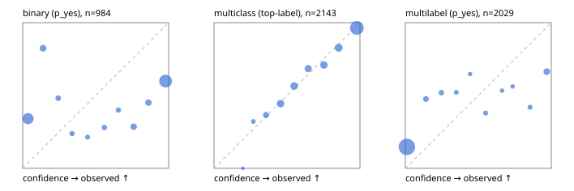

# Evaluation report

- model `Qwen/Qwen3-Reranker-8B` @ `77d193c791` (stock reranker pairs), adapter/checkpoint `None`, prompt `task-v1` (f7b8d8022dfb)
- data data/hf.jsonl, data/eval.jsonl; splits ['test']; n=3471; calibration `None`
- cuda / bfloat16; 2026-09-23T21:02:51+0000; wall 179.6s

## Overall

question accuracy 66.2%

**binary**: n 984, positives 475, accuracy 0.561, precision 0.538, recall 0.644, f1 0.586, auroc 0.658, brier 0.364, log_loss 1.337, ece 0.364

**multiclass**: n 2143, accuracy 0.798, macro_f1 0.865, log_loss 0.564, brier 0.281, ece_top_label 0.020

**multilabel**: n 344, labels 2029, exact_match 0.102, micro_f1 0.356, macro_f1 0.461, label_auroc 0.815, brier 0.173, log_loss 0.711, ece 0.161

## By family

| family | n | question acc % | details |
|---|---|---|---|
| eval_adversarial | 27 | 63.0 | bin acc 53.3 F1 63.2 AUROC 0.852 ECE 0.435; mc acc 100.0 mF1 100.0 ECE 0.134; ml EM 40.0 µF1 78.3 ECE 0.182 |
| eval_agent_output | 26 | 57.7 | bin acc 50.0 F1 58.8 AUROC 0.531 ECE 0.449; mc acc 85.7 mF1 66.7 ECE 0.386; ml EM 40.0 µF1 73.7 ECE 0.190 |
| eval_evidence | 17 | 41.2 | bin acc 46.7 F1 55.6 AUROC 1.000 ECE 0.543; ml EM 0.0 µF1 46.2 ECE 0.495 |
| eval_multilabel | 32 | 31.2 | bin acc 42.9 F1 60.0 AUROC 0.917 ECE 0.546; mc acc 0.0 mF1 0.0 ECE 0.306; ml EM 29.2 µF1 67.6 ECE 0.282 |
| eval_policy | 22 | 31.8 | bin acc 46.2 F1 63.2 AUROC 0.369 ECE 0.525; mc acc 20.0 mF1 12.5 ECE 0.290; ml EM 0.0 µF1 69.6 ECE 0.419 |
| eval_routing | 25 | 64.0 | bin acc 60.0 F1 66.7 AUROC 0.708 ECE 0.437; mc acc 76.9 mF1 66.7 ECE 0.149; ml EM 0.0 µF1 33.3 ECE 0.317 |
| eval_urgency_sentiment | 22 | 63.6 | bin acc 60.0 F1 71.4 AUROC 0.417 ECE 0.472; mc acc 80.0 mF1 66.7 ECE 0.188; ml EM 0.0 µF1 66.7 ECE 0.476 |
| heldout_boolq | 300 | 62.0 | bin acc 62.0 F1 74.9 AUROC 0.639 ECE 0.296 |
| heldout_emotion_multiclass | 300 | 52.7 | mc acc 52.7 mF1 42.2 ECE 0.100 |
| heldout_intent_clinc | 300 | 89.3 | mc acc 89.3 mF1 92.8 ECE 0.039 |
| heldout_question_type_trec | 300 | 82.0 | mc acc 82.0 mF1 80.1 ECE 0.037 |
| heldout_sentiment_sst2 | 300 | 50.0 | bin acc 50.0 F1 0.0 AUROC 0.804 ECE 0.435 |
| heldout_topic_dbpedia | 300 | 96.0 | mc acc 96.0 mF1 95.7 ECE 0.040 |
| hf_emotions_multilabel | 300 | 8.0 | ml EM 8.0 µF1 16.1 ECE 0.154 |
| hf_intent_banking77 | 300 | 94.0 | mc acc 94.0 mF1 93.7 ECE 0.019 |
| hf_nli | 300 | 57.7 | bin acc 57.7 F1 61.6 AUROC 0.841 ECE 0.374 |
| hf_sentiment_tweets | 300 | 64.3 | mc acc 64.3 mF1 64.2 ECE 0.040 |
| hf_topic_agnews | 300 | 81.3 | mc acc 81.3 mF1 79.7 ECE 0.128 |

## by hard case

| slice | n | question acc % |
|---|---|---|
| (none) | 3042 | 70.5 |
| contradiction | 107 | 35.5 |
| distractor | 33 | 33.3 |
| double_negation | 6 | 33.3 |
| evidence_end | 13 | 30.8 |
| evidence_middle | 11 | 54.5 |
| evidence_start | 9 | 55.6 |
| exception | 7 | 0.0 |
| hypothetical | 7 | 42.9 |
| injection | 10 | 50.0 |
| lexical_overlap | 20 | 45.0 |
| long_state | 50 | 38.0 |
| missing_evidence | 104 | 37.5 |
| multi_positive | 81 | 8.6 |
| multi_turn | 9 | 66.7 |
| negation | 30 | 36.7 |
| new_label_names | 3 | 100.0 |
| nota | 46 | 41.3 |
| numeric_reasoning | 16 | 31.2 |
| paraphrase | 22 | 63.6 |
| role_reversal | 15 | 33.3 |
| sarcasm | 12 | 41.7 |
| temporal_reasoning | 29 | 31.0 |
| zero_positive | 6 | 16.7 |

## by state tokens

| slice | n | question acc % |
|---|---|---|
| 00000-00127 | 3211 | 66.8 |
| 00128-00511 | 208 | 63.9 |
| 00512-02047 | 52 | 36.5 |

## by candidates

| slice | n | question acc % |
|---|---|---|
| 01 | 984 | 56.1 |
| 03 | 310 | 65.2 |
| 04 | 333 | 79.3 |
| 05 | 22 | 40.9 |
| 06 | 1218 | 59.2 |
| 07 | 49 | 38.8 |
| 08 | 555 | 95.7 |

## Paraphrase groups

11 groups; same prediction 63.6%; all correct 54.5%

## Multiclass abstention (coverage vs error on accepted)

| abstain_below | coverage % | error % |
|---|---|---|
| 0.0 | 100.0 | 20.2 |
| 0.4 | 94.8 | 17.7 |
| 0.5 | 86.5 | 14.1 |
| 0.6 | 77.5 | 10.7 |
| 0.7 | 70.4 | 8.5 |
| 0.8 | 62.1 | 5.8 |
| 0.9 | 52.0 | 3.6 |

## Reliability: binary

| bin | n | mean confidence | observed frequency |
|---|---|---|---|
| [0.0,0.1) | 296 | 0.036 | 0.341 |
| [0.1,0.2) | 57 | 0.139 | 0.825 |
| [0.2,0.3) | 27 | 0.243 | 0.481 |
| [0.3,0.4) | 21 | 0.338 | 0.238 |
| [0.4,0.5) | 14 | 0.445 | 0.214 |
| [0.5,0.6) | 25 | 0.560 | 0.280 |
| [0.6,0.7) | 20 | 0.655 | 0.400 |
| [0.7,0.8) | 49 | 0.760 | 0.286 |
| [0.8,0.9) | 51 | 0.861 | 0.451 |
| [0.9,1.0] | 424 | 0.979 | 0.599 |

## Reliability: multiclass

| bin | n | mean confidence | observed frequency |
|---|---|---|---|
| [0.1,0.2) | 1 | 0.197 | 0.000 |
| [0.2,0.3) | 28 | 0.270 | 0.321 |
| [0.3,0.4) | 82 | 0.357 | 0.366 |
| [0.4,0.5) | 178 | 0.456 | 0.444 |
| [0.5,0.6) | 193 | 0.549 | 0.565 |
| [0.6,0.7) | 152 | 0.645 | 0.684 |
| [0.7,0.8) | 179 | 0.753 | 0.709 |
| [0.8,0.9) | 215 | 0.854 | 0.828 |
| [0.9,1.0] | 1115 | 0.979 | 0.964 |

## Reliability: multilabel

| bin | n | mean confidence | observed frequency |
|---|---|---|---|
| [0.0,0.1) | 1673 | 0.011 | 0.147 |
| [0.1,0.2) | 63 | 0.141 | 0.476 |
| [0.2,0.3) | 52 | 0.247 | 0.519 |
| [0.3,0.4) | 23 | 0.349 | 0.522 |
| [0.4,0.5) | 17 | 0.443 | 0.647 |
| [0.5,0.6) | 29 | 0.550 | 0.379 |
| [0.6,0.7) | 15 | 0.662 | 0.533 |
| [0.7,0.8) | 16 | 0.735 | 0.562 |
| [0.8,0.9) | 31 | 0.854 | 0.419 |
| [0.9,1.0] | 110 | 0.969 | 0.664 |
