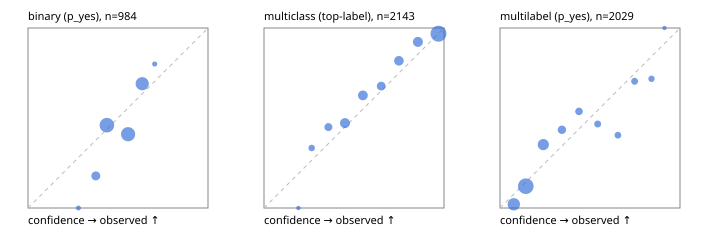

# Evaluation report

- model `Qwen/Qwen3-Reranker-8B` @ `77d193c791` (stock reranker pairs), adapter/checkpoint `None`, prompt `task-v1` (f7b8d8022dfb)
- data data/hf.jsonl, data/eval.jsonl; splits ['test']; n=3471; calibration `{'method': 'temperature scaling per output type, grid search on NLL', 'min_n': 30, 'model': 'Qwen/Qwen3-Reranker-8B', 'revision': '77d193c791ed757ca307ee72715aa132723da912', 'adapter': None, 'adapter_sha256': None, 'prompt_sha': 'f7b8d8022dfb', 'fit_report': 'reports/baseline_8b/calibration/report.json', 'fit_report_sha256': '9059b23720e03ceb67178d9ebd37454a197c5ade3ec3e98350dc2b061bc7d8d8', 'fit_data': [{'path': 'data/hf.jsonl', 'sha256': 'fe29b29286d5a372271e925825e8b9794f3f64be9a9fc04cad458b4b94ada510'}, {'path': 'data/eval.jsonl', 'sha256': 'be888eb38dcca063823924430e03985ddf2186b874e792d5734936ba93ba6910'}], 'created': '2026-09-23T21:02:55+0000', 'n': {'binary': 210, 'multiclass': 476, 'multilabel': 1014}, 'nll_before': {'binary': 1.5335642399377634, 'multiclass': 0.5510482320072558, 'multilabel': 0.7542775768709611}, 'nll_after': {'binary': 0.6682386209855661, 'multiclass': 0.5403646892933756, 'multilabel': 0.4377747395671313}, 'skipped': {}, 'threshold_report': 'reports/baseline_8b/validation/report.json', 'threshold_report_sha256': '5fca3aaf0877300d57da05fe3494b5f30be25b794b79d7d8b37429685bdce934', 'threshold_rule': 'max F1 on validation after temperature scaling', 'file': 'calib/baseline_8b.json', 'file_sha256': 'b462c5aac778d0a5edab5d1417418357f4c74ae34dc68024f91018daa1a12d51'}`
- cuda / bfloat16; 2026-09-23T21:06:03+0000; wall 180.0s

## Overall

question accuracy 68.5%

**binary**: n 984, positives 475, accuracy 0.598, precision 0.586, recall 0.568, f1 0.577, auroc 0.658, brier 0.236, log_loss 0.664, ece 0.084

**multiclass**: n 2143, accuracy 0.798, macro_f1 0.865, log_loss 0.565, brier 0.284, ece_top_label 0.033

**multilabel**: n 344, labels 2029, exact_match 0.224, micro_f1 0.552, macro_f1 0.421, label_auroc 0.815, brier 0.137, log_loss 0.427, ece 0.061

## By family

| family | n | question acc % | details |
|---|---|---|---|
| eval_adversarial | 27 | 66.7 | bin acc 66.7 F1 70.6 AUROC 0.852 ECE 0.258; mc acc 100.0 mF1 100.0 ECE 0.171; ml EM 20.0 µF1 66.7 ECE 0.191 |
| eval_agent_output | 26 | 50.0 | bin acc 50.0 F1 53.3 AUROC 0.531 ECE 0.111; mc acc 85.7 mF1 66.7 ECE 0.334; ml EM 0.0 µF1 57.1 ECE 0.145 |
| eval_evidence | 17 | 47.1 | bin acc 53.3 F1 58.8 AUROC 1.000 ECE 0.264; ml EM 0.0 µF1 42.9 ECE 0.496 |
| eval_multilabel | 32 | 9.4 | bin acc 42.9 F1 60.0 AUROC 0.917 ECE 0.310; mc acc 0.0 mF1 0.0 ECE 0.285; ml EM 0.0 µF1 55.2 ECE 0.215 |
| eval_policy | 22 | 31.8 | bin acc 46.2 F1 63.2 AUROC 0.369 ECE 0.147; mc acc 20.0 mF1 12.5 ECE 0.251; ml EM 0.0 µF1 69.6 ECE 0.306 |
| eval_routing | 25 | 64.0 | bin acc 60.0 F1 66.7 AUROC 0.708 ECE 0.184; mc acc 76.9 mF1 66.7 ECE 0.171; ml EM 0.0 µF1 50.0 ECE 0.358 |
| eval_urgency_sentiment | 22 | 59.1 | bin acc 50.0 F1 54.5 AUROC 0.417 ECE 0.331; mc acc 80.0 mF1 66.7 ECE 0.224; ml EM 0.0 µF1 66.7 ECE 0.334 |
| heldout_boolq | 300 | 61.0 | bin acc 61.0 F1 70.8 AUROC 0.639 ECE 0.047 |
| heldout_emotion_multiclass | 300 | 52.7 | mc acc 52.7 mF1 42.2 ECE 0.091 |
| heldout_intent_clinc | 300 | 89.3 | mc acc 89.3 mF1 92.8 ECE 0.055 |
| heldout_question_type_trec | 300 | 82.0 | mc acc 82.0 mF1 80.1 ECE 0.072 |
| heldout_sentiment_sst2 | 300 | 50.0 | bin acc 50.0 F1 0.0 AUROC 0.804 ECE 0.116 |
| heldout_topic_dbpedia | 300 | 96.0 | mc acc 96.0 mF1 95.7 ECE 0.072 |
| hf_emotions_multilabel | 300 | 25.3 | ml EM 25.3 µF1 54.5 ECE 0.067 |
| hf_intent_banking77 | 300 | 94.0 | mc acc 94.0 mF1 93.7 ECE 0.037 |
| hf_nli | 300 | 70.0 | bin acc 70.0 F1 68.3 AUROC 0.841 ECE 0.229 |
| hf_sentiment_tweets | 300 | 64.3 | mc acc 64.3 mF1 64.2 ECE 0.081 |
| hf_topic_agnews | 300 | 81.3 | mc acc 81.3 mF1 79.7 ECE 0.097 |

## by hard case

| slice | n | question acc % |
|---|---|---|
| (none) | 3042 | 71.3 |
| contradiction | 107 | 53.3 |
| distractor | 33 | 24.2 |
| double_negation | 6 | 16.7 |
| evidence_end | 13 | 23.1 |
| evidence_middle | 11 | 54.5 |
| evidence_start | 9 | 55.6 |
| exception | 7 | 0.0 |
| hypothetical | 7 | 57.1 |
| injection | 10 | 60.0 |
| lexical_overlap | 20 | 40.0 |
| long_state | 50 | 40.0 |
| missing_evidence | 104 | 58.7 |
| multi_positive | 81 | 21.0 |
| multi_turn | 9 | 66.7 |
| negation | 30 | 33.3 |
| new_label_names | 3 | 100.0 |
| nota | 46 | 41.3 |
| numeric_reasoning | 16 | 37.5 |
| paraphrase | 22 | 40.9 |
| role_reversal | 15 | 33.3 |
| sarcasm | 12 | 25.0 |
| temporal_reasoning | 29 | 27.6 |
| zero_positive | 6 | 16.7 |

## by state tokens

| slice | n | question acc % |
|---|---|---|
| 00000-00127 | 3211 | 69.5 |
| 00128-00511 | 208 | 59.1 |
| 00512-02047 | 52 | 40.4 |

## by candidates

| slice | n | question acc % |
|---|---|---|
| 01 | 984 | 59.8 |
| 03 | 310 | 65.2 |
| 04 | 333 | 78.4 |
| 05 | 22 | 31.8 |
| 06 | 1218 | 63.1 |
| 07 | 49 | 38.8 |
| 08 | 555 | 95.7 |

## Paraphrase groups

11 groups; same prediction 54.5%; all correct 36.4%

## Multiclass abstention (coverage vs error on accepted)

| abstain_below | coverage % | error % |
|---|---|---|
| 0.0 | 100.0 | 20.2 |
| 0.4 | 92.6 | 17.1 |
| 0.5 | 81.8 | 12.4 |
| 0.6 | 71.6 | 8.8 |
| 0.7 | 64.4 | 6.2 |
| 0.8 | 54.9 | 4.1 |
| 0.9 | 44.1 | 3.2 |

## Reliability: binary

| bin | n | mean confidence | observed frequency |
|---|---|---|---|
| [0.2,0.3) | 3 | 0.280 | 0.000 |
| [0.3,0.4) | 73 | 0.377 | 0.178 |
| [0.4,0.5) | 339 | 0.438 | 0.460 |
| [0.5,0.6) | 312 | 0.556 | 0.410 |
| [0.6,0.7) | 252 | 0.634 | 0.690 |
| [0.7,0.8) | 5 | 0.704 | 0.800 |

## Reliability: multiclass

| bin | n | mean confidence | observed frequency |
|---|---|---|---|
| [0.1,0.2) | 1 | 0.191 | 0.000 |
| [0.2,0.3) | 48 | 0.265 | 0.333 |
| [0.3,0.4) | 109 | 0.358 | 0.450 |
| [0.4,0.5) | 231 | 0.450 | 0.472 |
| [0.5,0.6) | 219 | 0.549 | 0.626 |
| [0.6,0.7) | 155 | 0.651 | 0.677 |
| [0.7,0.8) | 203 | 0.750 | 0.818 |
| [0.8,0.9) | 233 | 0.855 | 0.923 |
| [0.9,1.0] | 944 | 0.969 | 0.968 |

## Reliability: multilabel

| bin | n | mean confidence | observed frequency |
|---|---|---|---|
| [0.0,0.1) | 441 | 0.077 | 0.020 |
| [0.1,0.2) | 851 | 0.143 | 0.121 |
| [0.2,0.3) | 332 | 0.241 | 0.352 |
| [0.3,0.4) | 122 | 0.344 | 0.434 |
| [0.4,0.5) | 82 | 0.439 | 0.537 |
| [0.5,0.6) | 60 | 0.543 | 0.467 |
| [0.6,0.7) | 47 | 0.655 | 0.404 |
| [0.7,0.8) | 54 | 0.748 | 0.704 |
| [0.8,0.9) | 39 | 0.842 | 0.718 |
| [0.9,1.0] | 1 | 0.914 | 1.000 |
