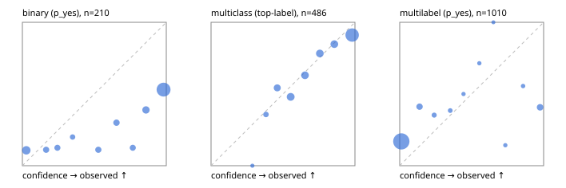

# Evaluation report

- model `Qwen/Qwen3-Reranker-8B` @ `77d193c791` (stock reranker pairs), adapter/checkpoint `None`, prompt `task-v1` (f7b8d8022dfb)
- data data/hf.jsonl, data/eval.jsonl; splits ['validation']; n=868; calibration `None`
- cuda / bfloat16; 2026-09-23T20:58:50+0000; wall 46.0s

## Overall

question accuracy 57.9%

**binary**: n 210, positives 79, accuracy 0.557, precision 0.456, recall 0.924, f1 0.611, auroc 0.772, brier 0.358, log_loss 1.468, ece 0.367

**multiclass**: n 486, accuracy 0.776, macro_f1 0.758, log_loss 0.605, brier 0.318, ece_top_label 0.056

**multilabel**: n 172, labels 1010, exact_match 0.052, micro_f1 0.245, macro_f1 0.289, label_auroc 0.786, brier 0.197, log_loss 0.830, ece 0.188

## By family

| family | n | question acc % | details |
|---|---|---|---|
| eval_adversarial | 14 | 85.7 | bin acc 85.7 F1 90.9 AUROC 0.600 ECE 0.182; mc acc 100.0 mF1 100.0 ECE 0.139; ml EM 50.0 µF1 85.7 ECE 0.157 |
| eval_agent_output | 20 | 55.0 | bin acc 58.3 F1 66.7 AUROC 0.542 ECE 0.357; mc acc 80.0 mF1 60.0 ECE 0.362; ml EM 0.0 µF1 0.0 ECE 0.587 |
| eval_evidence | 17 | 35.3 | bin acc 42.9 F1 55.6 AUROC 0.844 ECE 0.537; ml EM 0.0 µF1 44.4 ECE 0.626 |
| eval_multilabel | 12 | 25.0 | bin acc 0.0 F1 0.0 AUROC — ECE 0.881; mc acc 50.0 mF1 33.3 ECE 0.605; ml EM 22.2 µF1 65.5 ECE 0.388 |
| eval_policy | 24 | 41.7 | bin acc 58.3 F1 73.7 AUROC 0.643 ECE 0.399; mc acc 27.3 mF1 16.7 ECE 0.299; ml EM 0.0 µF1 66.7 ECE 0.473 |
| eval_routing | 16 | 81.2 | bin acc 85.7 F1 90.9 AUROC 0.900 ECE 0.137; mc acc 87.5 mF1 81.0 ECE 0.126; ml EM 0.0 µF1 0.0 ECE 0.184 |
| eval_urgency_sentiment | 15 | 60.0 | bin acc 42.9 F1 50.0 AUROC 0.417 ECE 0.498; mc acc 100.0 mF1 100.0 ECE 0.173; ml EM 33.3 µF1 33.3 ECE 0.324 |
| hf_emotions_multilabel | 150 | 3.3 | ml EM 3.3 µF1 7.4 ECE 0.168 |
| hf_intent_banking77 | 150 | 93.3 | mc acc 93.3 mF1 90.4 ECE 0.046 |
| hf_nli | 150 | 54.7 | bin acc 54.7 F1 56.4 AUROC 0.820 ECE 0.391 |
| hf_sentiment_tweets | 150 | 63.3 | mc acc 63.3 mF1 60.4 ECE 0.015 |
| hf_topic_agnews | 150 | 78.0 | mc acc 78.0 mF1 77.8 ECE 0.161 |

## by hard case

| slice | n | question acc % |
|---|---|---|
| (none) | 634 | 65.0 |
| contradiction | 63 | 28.6 |
| distractor | 20 | 25.0 |
| double_negation | 3 | 100.0 |
| evidence_end | 4 | 50.0 |
| evidence_middle | 7 | 71.4 |
| evidence_start | 3 | 33.3 |
| exception | 7 | 42.9 |
| hypothetical | 6 | 16.7 |
| injection | 16 | 75.0 |
| lexical_overlap | 13 | 69.2 |
| long_state | 26 | 38.5 |
| missing_evidence | 59 | 39.0 |
| multi_positive | 40 | 5.0 |
| multi_turn | 21 | 33.3 |
| negation | 9 | 44.4 |
| new_label_names | 5 | 60.0 |
| nota | 4 | 25.0 |
| numeric_reasoning | 13 | 53.8 |
| paraphrase | 10 | 80.0 |
| role_reversal | 7 | 28.6 |
| sarcasm | 5 | 80.0 |
| temporal_reasoning | 15 | 46.7 |
| zero_positive | 7 | 14.3 |

## by state tokens

| slice | n | question acc % |
|---|---|---|
| 00000-00127 | 796 | 58.5 |
| 00128-00511 | 46 | 58.7 |
| 00512-02047 | 26 | 38.5 |

## by candidates

| slice | n | question acc % |
|---|---|---|
| 01 | 210 | 55.7 |
| 03 | 162 | 63.6 |
| 04 | 174 | 75.3 |
| 05 | 13 | 38.5 |
| 06 | 159 | 4.4 |
| 08 | 150 | 93.3 |

## Paraphrase groups

5 groups; same prediction 60.0%; all correct 80.0%

## Multiclass abstention (coverage vs error on accepted)

| abstain_below | coverage % | error % |
|---|---|---|
| 0.0 | 100.0 | 22.4 |
| 0.4 | 96.7 | 20.9 |
| 0.5 | 89.5 | 18.9 |
| 0.6 | 79.2 | 14.5 |
| 0.7 | 69.8 | 11.5 |
| 0.8 | 60.3 | 9.9 |
| 0.9 | 50.8 | 8.9 |

## Reliability: binary

| bin | n | mean confidence | observed frequency |
|---|---|---|---|
| [0.0,0.1) | 28 | 0.027 | 0.107 |
| [0.1,0.2) | 9 | 0.165 | 0.111 |
| [0.2,0.3) | 8 | 0.243 | 0.125 |
| [0.3,0.4) | 5 | 0.349 | 0.200 |
| [0.5,0.6) | 9 | 0.528 | 0.111 |
| [0.6,0.7) | 10 | 0.654 | 0.300 |
| [0.7,0.8) | 8 | 0.767 | 0.125 |
| [0.8,0.9) | 18 | 0.859 | 0.389 |
| [0.9,1.0] | 115 | 0.981 | 0.530 |

## Reliability: multiclass

| bin | n | mean confidence | observed frequency |
|---|---|---|---|
| [0.2,0.3) | 2 | 0.287 | 0.000 |
| [0.3,0.4) | 14 | 0.382 | 0.357 |
| [0.4,0.5) | 35 | 0.460 | 0.543 |
| [0.5,0.6) | 50 | 0.553 | 0.480 |
| [0.6,0.7) | 46 | 0.653 | 0.630 |
| [0.7,0.8) | 46 | 0.756 | 0.783 |
| [0.8,0.9) | 46 | 0.856 | 0.848 |
| [0.9,1.0] | 247 | 0.981 | 0.911 |

## Reliability: multilabel

| bin | n | mean confidence | observed frequency |
|---|---|---|---|
| [0.0,0.1) | 843 | 0.011 | 0.170 |
| [0.1,0.2) | 51 | 0.138 | 0.412 |
| [0.2,0.3) | 17 | 0.240 | 0.353 |
| [0.3,0.4) | 13 | 0.351 | 0.385 |
| [0.4,0.5) | 6 | 0.443 | 0.500 |
| [0.5,0.6) | 7 | 0.553 | 0.714 |
| [0.6,0.7) | 3 | 0.651 | 1.000 |
| [0.7,0.8) | 7 | 0.734 | 0.143 |
| [0.8,0.9) | 9 | 0.857 | 0.556 |
| [0.9,1.0] | 54 | 0.975 | 0.407 |
