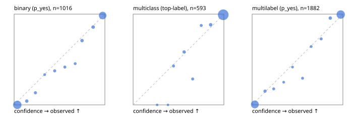

# Evaluation report

- model `Qwen/Qwen3.5-4B` @ `851bf6e806` (shared-prefix tree, forward only: text once per request, each question once, then each candidate), adapter/checkpoint `runs/pilot/adapter`, prompt `challenger-state-first-v1` (6c9d8459ac44)
- data data/ova/eval2.jsonl; splits ['test']; n=1991; calibration `None`
- cuda / bfloat16; 2026-10-01T09:15:49+0000; wall 696.8s

## Overall

question accuracy 94.8%

**binary**: n 1016, positives 435, accuracy 0.960, precision 0.934, recall 0.975, f1 0.954, auroc 0.995, brier 0.028, log_loss 0.110, ece 0.031

**multiclass**: n 593, accuracy 0.961, macro_f1 0.934, log_loss 0.099, brier 0.051, ece_top_label 0.009

**multilabel**: n 382, labels 1882, exact_match 0.898, micro_f1 0.976, macro_f1 0.954, label_auroc 0.997, brier 0.019, log_loss 0.080, ece 0.027

## By family

| family | n | question acc % | details |
|---|---|---|---|
| e2_hard | 673 | 93.0 | bin acc 94.8 F1 93.0 AUROC 0.993 ECE 0.039; mc acc 94.8 mF1 89.5 ECE 0.018; ml EM 85.6 µF1 95.8 ECE 0.029 |
| e2_simple | 664 | 98.2 | bin acc 97.7 F1 97.9 AUROC 0.998 ECE 0.026; mc acc 100.0 mF1 100.0 ECE 0.009; ml EM 96.7 µF1 99.3 ECE 0.030 |
| e2_very_hard | 654 | 93.3 | bin acc 95.4 F1 94.1 AUROC 0.994 ECE 0.039; mc acc 93.5 mF1 90.7 ECE 0.030; ml EM 87.7 µF1 97.7 ECE 0.034 |

## by hard case

| slice | n | question acc % |
|---|---|---|
| (none) | 569 | 98.1 |
| contradiction | 172 | 96.5 |
| distractor | 474 | 93.5 |
| double_negation | 126 | 97.6 |
| evidence_end | 57 | 100.0 |
| evidence_middle | 114 | 97.4 |
| evidence_start | 17 | 100.0 |
| exception | 213 | 93.9 |
| hypothetical | 128 | 95.3 |
| injection | 151 | 94.7 |
| lexical_overlap | 201 | 96.5 |
| long_state | 191 | 97.9 |
| missing_evidence | 141 | 96.5 |
| multi_positive | 322 | 91.0 |
| multi_turn | 149 | 92.6 |
| negation | 257 | 96.5 |
| nota | 118 | 93.2 |
| numeric_reasoning | 224 | 84.8 |
| paraphrase | 218 | 91.3 |
| role_reversal | 187 | 94.1 |
| sarcasm | 149 | 94.0 |
| temporal_reasoning | 203 | 83.7 |
| zero_positive | 73 | 91.8 |
| zero_positive_distractor | 1 | 100.0 |

## by state tokens

| slice | n | question acc % |
|---|---|---|
| 00000-00127 | 666 | 93.5 |
| 00128-00511 | 469 | 93.0 |
| 00512-02047 | 488 | 95.9 |
| 02048-08191 | 329 | 97.9 |
| 08192+ | 39 | 100.0 |

## by candidates

| slice | n | question acc % |
|---|---|---|
| 01 | 1016 | 96.0 |
| 03 | 128 | 96.9 |
| 04 | 515 | 94.6 |
| 05 | 224 | 91.1 |
| 06 | 86 | 90.7 |
| 07 | 18 | 94.4 |
| 08 | 4 | 75.0 |

## Paraphrase groups

76 groups; same prediction 82.9%; all correct 82.9%

## Multiclass abstention (coverage vs error on accepted)

| abstain_below | coverage % | error % |
|---|---|---|
| 0.0 | 100.0 | 3.9 |
| 0.4 | 99.7 | 3.6 |
| 0.5 | 98.5 | 2.9 |
| 0.6 | 96.5 | 2.1 |
| 0.7 | 95.3 | 1.2 |
| 0.8 | 93.9 | 1.1 |
| 0.9 | 91.1 | 0.7 |

## Reliability: binary

| bin | n | mean confidence | observed frequency |
|---|---|---|---|
| [0.0,0.1) | 501 | 0.035 | 0.000 |
| [0.1,0.2) | 24 | 0.139 | 0.042 |
| [0.2,0.3) | 15 | 0.234 | 0.133 |
| [0.3,0.4) | 6 | 0.337 | 0.333 |
| [0.4,0.5) | 16 | 0.447 | 0.375 |
| [0.5,0.6) | 12 | 0.559 | 0.417 |
| [0.6,0.7) | 11 | 0.673 | 0.455 |
| [0.7,0.8) | 24 | 0.748 | 0.708 |
| [0.8,0.9) | 28 | 0.871 | 0.857 |
| [0.9,1.0] | 379 | 0.976 | 0.984 |

## Reliability: multiclass

| bin | n | mean confidence | observed frequency |
|---|---|---|---|
| [0.2,0.3) | 1 | 0.265 | 0.000 |
| [0.3,0.4) | 1 | 0.384 | 0.000 |
| [0.4,0.5) | 7 | 0.445 | 0.429 |
| [0.5,0.6) | 12 | 0.562 | 0.583 |
| [0.6,0.7) | 7 | 0.656 | 0.286 |
| [0.7,0.8) | 8 | 0.751 | 0.875 |
| [0.8,0.9) | 17 | 0.854 | 0.882 |
| [0.9,1.0] | 540 | 0.993 | 0.993 |

## Reliability: multilabel

| bin | n | mean confidence | observed frequency |
|---|---|---|---|
| [0.0,0.1) | 774 | 0.030 | 0.005 |
| [0.1,0.2) | 33 | 0.142 | 0.152 |
| [0.2,0.3) | 17 | 0.238 | 0.176 |
| [0.3,0.4) | 12 | 0.348 | 0.250 |
| [0.4,0.5) | 12 | 0.445 | 0.417 |
| [0.5,0.6) | 17 | 0.556 | 0.294 |
| [0.6,0.7) | 14 | 0.651 | 0.643 |
| [0.7,0.8) | 22 | 0.761 | 0.727 |
| [0.8,0.9) | 46 | 0.861 | 0.957 |
| [0.9,1.0] | 935 | 0.976 | 0.996 |
