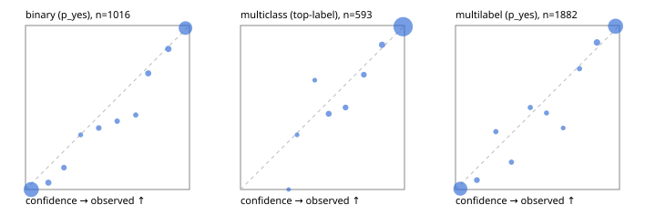

# Evaluation report

- model `Qwen/Qwen3.5-4B` @ `851bf6e806` (shared-prefix tree, forward only: text once per request, each question once, then each candidate), adapter/checkpoint `runs/pilot/adapter`, prompt `challenger-state-first-v1` (6c9d8459ac44)
- data data/ova/eval2_rev.jsonl; splits ['test']; n=1991; calibration `None`
- cuda / bfloat16; 2026-10-01T09:26:43+0000; wall 403.3s

## Overall

question accuracy 94.6%

**binary**: n 1016, positives 435, accuracy 0.960, precision 0.934, recall 0.975, f1 0.954, auroc 0.995, brier 0.028, log_loss 0.110, ece 0.031

**multiclass**: n 593, accuracy 0.958, macro_f1 0.923, log_loss 0.108, brier 0.056, ece_top_label 0.008

**multilabel**: n 382, labels 1882, exact_match 0.890, micro_f1 0.975, macro_f1 0.953, label_auroc 0.996, brier 0.020, log_loss 0.085, ece 0.027

## By family

| family | n | question acc % | details |
|---|---|---|---|
| e2_hard | 673 | 93.0 | bin acc 94.8 F1 93.0 AUROC 0.993 ECE 0.039; mc acc 94.8 mF1 88.9 ECE 0.019; ml EM 85.6 µF1 95.9 ECE 0.025 |
| e2_simple | 664 | 98.2 | bin acc 97.7 F1 97.9 AUROC 0.998 ECE 0.026; mc acc 99.5 mF1 98.9 ECE 0.010; ml EM 97.5 µF1 99.4 ECE 0.031 |
| e2_very_hard | 654 | 92.5 | bin acc 95.4 F1 94.1 AUROC 0.994 ECE 0.039; mc acc 93.0 mF1 89.3 ECE 0.027; ml EM 84.6 µF1 97.0 ECE 0.037 |

## by hard case

| slice | n | question acc % |
|---|---|---|
| (none) | 569 | 98.1 |
| contradiction | 172 | 95.9 |
| distractor | 474 | 92.8 |
| double_negation | 126 | 96.8 |
| evidence_end | 57 | 93.0 |
| evidence_middle | 114 | 97.4 |
| evidence_start | 17 | 100.0 |
| exception | 213 | 93.4 |
| hypothetical | 128 | 94.5 |
| injection | 151 | 93.4 |
| lexical_overlap | 201 | 96.0 |
| long_state | 191 | 95.8 |
| missing_evidence | 141 | 96.5 |
| multi_positive | 322 | 89.1 |
| multi_turn | 149 | 91.3 |
| negation | 257 | 95.3 |
| nota | 118 | 94.9 |
| numeric_reasoning | 224 | 83.0 |
| paraphrase | 218 | 90.8 |
| role_reversal | 187 | 94.1 |
| sarcasm | 149 | 92.6 |
| temporal_reasoning | 203 | 83.3 |
| zero_positive | 73 | 94.5 |
| zero_positive_distractor | 1 | 100.0 |

## by state tokens

| slice | n | question acc % |
|---|---|---|
| 00000-00127 | 666 | 93.5 |
| 00128-00511 | 469 | 93.0 |
| 00512-02047 | 488 | 95.7 |
| 02048-08191 | 329 | 96.7 |
| 08192+ | 39 | 100.0 |

## by candidates

| slice | n | question acc % |
|---|---|---|
| 01 | 1016 | 96.0 |
| 03 | 128 | 97.7 |
| 04 | 515 | 94.6 |
| 05 | 224 | 90.6 |
| 06 | 86 | 84.9 |
| 07 | 18 | 94.4 |
| 08 | 4 | 75.0 |

## Paraphrase groups

76 groups; same prediction 80.3%; all correct 81.6%

## Multiclass abstention (coverage vs error on accepted)

| abstain_below | coverage % | error % |
|---|---|---|
| 0.0 | 100.0 | 4.2 |
| 0.4 | 99.3 | 3.7 |
| 0.5 | 98.8 | 3.6 |
| 0.6 | 96.6 | 2.4 |
| 0.7 | 94.9 | 1.6 |
| 0.8 | 93.3 | 1.1 |
| 0.9 | 90.4 | 0.7 |

## Reliability: binary

| bin | n | mean confidence | observed frequency |
|---|---|---|---|
| [0.0,0.1) | 501 | 0.035 | 0.000 |
| [0.1,0.2) | 24 | 0.139 | 0.042 |
| [0.2,0.3) | 15 | 0.235 | 0.133 |
| [0.3,0.4) | 6 | 0.337 | 0.333 |
| [0.4,0.5) | 16 | 0.446 | 0.375 |
| [0.5,0.6) | 12 | 0.559 | 0.417 |
| [0.6,0.7) | 11 | 0.672 | 0.455 |
| [0.7,0.8) | 24 | 0.748 | 0.708 |
| [0.8,0.9) | 28 | 0.871 | 0.857 |
| [0.9,1.0] | 379 | 0.976 | 0.984 |

## Reliability: multiclass

| bin | n | mean confidence | observed frequency |
|---|---|---|---|
| [0.2,0.3) | 1 | 0.293 | 0.000 |
| [0.3,0.4) | 3 | 0.345 | 0.333 |
| [0.4,0.5) | 3 | 0.453 | 0.667 |
| [0.5,0.6) | 13 | 0.538 | 0.462 |
| [0.6,0.7) | 10 | 0.641 | 0.500 |
| [0.7,0.8) | 10 | 0.752 | 0.700 |
| [0.8,0.9) | 17 | 0.863 | 0.882 |
| [0.9,1.0] | 536 | 0.992 | 0.993 |

## Reliability: multilabel

| bin | n | mean confidence | observed frequency |
|---|---|---|---|
| [0.0,0.1) | 765 | 0.030 | 0.005 |
| [0.1,0.2) | 35 | 0.130 | 0.057 |
| [0.2,0.3) | 17 | 0.246 | 0.353 |
| [0.3,0.4) | 18 | 0.341 | 0.167 |
| [0.4,0.5) | 18 | 0.456 | 0.500 |
| [0.5,0.6) | 15 | 0.555 | 0.467 |
| [0.6,0.7) | 8 | 0.657 | 0.375 |
| [0.7,0.8) | 19 | 0.756 | 0.737 |
| [0.8,0.9) | 58 | 0.863 | 0.897 |
| [0.9,1.0] | 929 | 0.976 | 0.996 |
