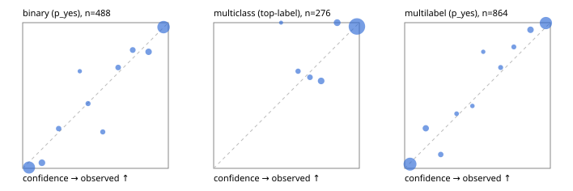

# Evaluation report

- model `Qwen/Qwen3.5-4B` @ `851bf6e806` (shared-prefix tree, forward only: text once per request, each question once, then each candidate), adapter/checkpoint `runs/pilot/adapter`, prompt `challenger-state-first-v1` (6c9d8459ac44)
- data data/ova/eval_llm.jsonl; splits ['test']; n=946; calibration `None`
- cuda / bfloat16; 2026-10-01T09:19:49+0000; wall 229.6s

## Overall

question accuracy 91.2%

**binary**: n 488, positives 245, accuracy 0.928, precision 0.907, recall 0.955, f1 0.930, auroc 0.979, brier 0.052, log_loss 0.188, ece 0.033

**multiclass**: n 276, accuracy 0.938, macro_f1 0.890, log_loss 0.214, brier 0.103, ece_top_label 0.030

**multilabel**: n 182, labels 864, exact_match 0.830, micro_f1 0.952, macro_f1 0.910, label_auroc 0.989, brier 0.039, log_loss 0.145, ece 0.032

## By family

| family | n | question acc % | details |
|---|---|---|---|
| tllm_guardrail_hard | 60 | 86.7 | bin acc 87.5 F1 87.5 AUROC 0.992 ECE 0.148; mc acc 94.1 mF1 87.5 ECE 0.056; ml EM 72.7 µF1 92.7 ECE 0.094 |
| tllm_guardrail_simple | 67 | 98.5 | bin acc 100.0 F1 100.0 AUROC 1.000 ECE 0.029; mc acc 100.0 mF1 100.0 ECE 0.025; ml EM 92.9 µF1 98.5 ECE 0.040 |
| tllm_guardrail_very_hard | 43 | 95.3 | bin acc 95.0 F1 95.7 AUROC 1.000 ECE 0.138; mc acc 92.9 mF1 83.3 ECE 0.066; ml EM 100.0 µF1 100.0 ECE 0.068 |
| tllm_jailbreak_hard | 59 | 98.3 | bin acc 96.3 F1 96.6 AUROC 1.000 ECE 0.092; mc acc 100.0 mF1 100.0 ECE 0.056; ml EM 100.0 µF1 100.0 ECE 0.055 |
| tllm_jailbreak_simple | 70 | 97.1 | bin acc 100.0 F1 100.0 AUROC 1.000 ECE 0.040; mc acc 95.5 mF1 87.5 ECE 0.053; ml EM 90.9 µF1 98.6 ECE 0.042 |
| tllm_jailbreak_very_hard | 60 | 86.7 | bin acc 87.5 F1 85.7 AUROC 0.968 ECE 0.084; mc acc 88.9 mF1 82.4 ECE 0.070; ml EM 80.0 µF1 96.3 ECE 0.052 |
| tllm_judge_hard | 86 | 94.2 | bin acc 95.0 F1 93.3 AUROC 0.960 ECE 0.080; mc acc 100.0 mF1 100.0 ECE 0.047; ml EM 85.7 µF1 92.3 ECE 0.014 |
| tllm_judge_simple | 72 | 93.1 | bin acc 97.4 F1 97.9 AUROC 0.997 ECE 0.077; mc acc 95.0 mF1 88.2 ECE 0.035; ml EM 78.6 µF1 96.4 ECE 0.057 |
| tllm_judge_very_hard | 64 | 87.5 | bin acc 96.9 F1 97.3 AUROC 0.992 ECE 0.062; mc acc 90.5 mF1 77.9 ECE 0.084; ml EM 54.5 µF1 89.9 ECE 0.117 |
| tllm_score_hard | 62 | 98.4 | bin acc 100.0 F1 100.0 AUROC 1.000 ECE 0.089; mc acc 100.0 mF1 100.0 ECE 0.034; ml EM 91.7 µF1 98.0 ECE 0.115 |
| tllm_score_simple | 62 | 98.4 | bin acc 97.1 F1 98.0 AUROC 0.983 ECE 0.046; mc acc 100.0 mF1 100.0 ECE 0.061; ml EM 100.0 µF1 100.0 ECE 0.042 |
| tllm_score_very_hard | 76 | 82.9 | bin acc 86.8 F1 81.5 AUROC 0.976 ECE 0.107; mc acc 81.8 mF1 68.0 ECE 0.198; ml EM 75.0 µF1 90.6 ECE 0.057 |
| tllm_verify_hard | 50 | 72.0 | bin acc 69.2 F1 69.2 AUROC 0.891 ECE 0.191; mc acc 87.5 mF1 76.5 ECE 0.211; ml EM 50.0 µF1 74.1 ECE 0.119 |
| tllm_verify_simple | 60 | 96.7 | bin acc 97.0 F1 97.6 AUROC 1.000 ECE 0.065; mc acc 100.0 mF1 100.0 ECE 0.006; ml EM 91.7 µF1 98.5 ECE 0.044 |
| tllm_verify_very_hard | 55 | 78.2 | bin acc 80.6 F1 75.0 AUROC 0.863 ECE 0.178; mc acc 80.0 mF1 70.8 ECE 0.144; ml EM 66.7 µF1 84.6 ECE 0.068 |

## by hard case

| slice | n | question acc % |
|---|---|---|
| (none) | 265 | 97.4 |
| answer_trace_mismatch | 45 | 88.9 |
| benign_lookalike | 88 | 89.8 |
| confident_wrong | 39 | 79.5 |
| contradiction | 22 | 95.5 |
| distractor | 117 | 90.6 |
| double_negation | 3 | 100.0 |
| evidence_end | 11 | 90.9 |
| evidence_middle | 20 | 75.0 |
| evidence_start | 2 | 50.0 |
| exception | 20 | 95.0 |
| fake_authority | 1 | 100.0 |
| flawed_step | 44 | 59.1 |
| format_near_miss | 46 | 82.6 |
| gradual_escalation | 1 | 100.0 |
| hypothetical | 7 | 100.0 |
| indirect_injection | 25 | 92.0 |
| injection | 22 | 95.5 |
| judge_injection | 112 | 86.6 |
| length_bias | 7 | 100.0 |
| lexical_overlap | 103 | 90.3 |
| long_state | 74 | 90.5 |
| missing_evidence | 35 | 94.3 |
| multi_positive | 124 | 80.6 |
| multi_turn | 44 | 90.9 |
| negation | 62 | 93.5 |
| nota | 55 | 89.1 |
| numeric_reasoning | 109 | 79.8 |
| obfuscation | 1 | 0.0 |
| over_refusal | 50 | 86.0 |
| paraphrase | 73 | 89.0 |
| partial_compliance | 31 | 74.2 |
| role_reversal | 6 | 66.7 |
| sarcasm | 8 | 87.5 |
| speaker_confusion | 58 | 87.9 |
| subtle_violation | 16 | 87.5 |
| sycophancy | 13 | 84.6 |
| temporal_reasoning | 20 | 95.0 |
| tool_misuse | 6 | 83.3 |
| unsupported_claim | 96 | 88.5 |
| zero_positive | 55 | 94.5 |
| zero_positive_partial | 1 | 100.0 |

## by state tokens

| slice | n | question acc % |
|---|---|---|
| 00000-00127 | 308 | 88.3 |
| 00128-00511 | 284 | 96.8 |
| 00512-02047 | 222 | 91.0 |
| 02048-08191 | 125 | 86.4 |
| 08192+ | 7 | 85.7 |

## by candidates

| slice | n | question acc % |
|---|---|---|
| 01 | 488 | 92.8 |
| 03 | 82 | 91.5 |
| 04 | 239 | 93.3 |
| 05 | 98 | 81.6 |
| 06 | 33 | 84.8 |
| 07 | 3 | 66.7 |
| 08 | 3 | 66.7 |

## Paraphrase groups

29 groups; same prediction 96.6%; all correct 86.2%

## Multiclass abstention (coverage vs error on accepted)

| abstain_below | coverage % | error % |
|---|---|---|
| 0.0 | 100.0 | 6.2 |
| 0.4 | 100.0 | 6.2 |
| 0.5 | 99.6 | 6.2 |
| 0.6 | 97.5 | 5.6 |
| 0.7 | 94.6 | 4.6 |
| 0.8 | 89.1 | 2.4 |
| 0.9 | 83.0 | 2.6 |

## Reliability: binary

| bin | n | mean confidence | observed frequency |
|---|---|---|---|
| [0.0,0.1) | 181 | 0.043 | 0.006 |
| [0.1,0.2) | 26 | 0.132 | 0.038 |
| [0.2,0.3) | 11 | 0.247 | 0.273 |
| [0.3,0.4) | 3 | 0.392 | 0.667 |
| [0.4,0.5) | 9 | 0.449 | 0.444 |
| [0.5,0.6) | 8 | 0.550 | 0.250 |
| [0.6,0.7) | 13 | 0.655 | 0.692 |
| [0.7,0.8) | 16 | 0.756 | 0.812 |
| [0.8,0.9) | 25 | 0.864 | 0.800 |
| [0.9,1.0] | 196 | 0.967 | 0.969 |

## Reliability: multiclass

| bin | n | mean confidence | observed frequency |
|---|---|---|---|
| [0.4,0.5) | 1 | 0.463 | 1.000 |
| [0.5,0.6) | 6 | 0.579 | 0.667 |
| [0.6,0.7) | 8 | 0.661 | 0.625 |
| [0.7,0.8) | 15 | 0.738 | 0.600 |
| [0.8,0.9) | 17 | 0.848 | 1.000 |
| [0.9,1.0] | 229 | 0.984 | 0.974 |

## Reliability: multilabel

| bin | n | mean confidence | observed frequency |
|---|---|---|---|
| [0.0,0.1) | 380 | 0.037 | 0.029 |
| [0.1,0.2) | 40 | 0.145 | 0.275 |
| [0.2,0.3) | 21 | 0.248 | 0.095 |
| [0.3,0.4) | 8 | 0.357 | 0.375 |
| [0.4,0.5) | 7 | 0.465 | 0.429 |
| [0.5,0.6) | 5 | 0.539 | 0.800 |
| [0.6,0.7) | 13 | 0.659 | 0.692 |
| [0.7,0.8) | 12 | 0.750 | 0.833 |
| [0.8,0.9) | 41 | 0.864 | 0.951 |
| [0.9,1.0] | 337 | 0.970 | 0.997 |
