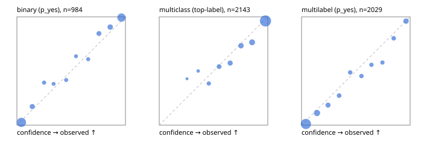

# Evaluation report

- model `Qwen/Qwen3.5-4B` @ `851bf6e806` (shared-prefix tree, forward only: text once per request, each question once, then each candidate), adapter/checkpoint `runs/pilot/adapter`, prompt `challenger-state-first-v1` (6c9d8459ac44)
- data data/ova/hf.jsonl, data/ova/eval.jsonl; splits ['test']; n=3471; calibration `None`
- cuda / bfloat16; 2026-10-01T09:21:37+0000; wall 195.4s

## Overall

question accuracy 83.5%

**binary**: n 984, positives 475, accuracy 0.915, precision 0.926, recall 0.895, f1 0.910, auroc 0.972, brier 0.064, log_loss 0.222, ece 0.034

**multiclass**: n 2143, accuracy 0.852, macro_f1 0.932, log_loss 0.431, brier 0.219, ece_top_label 0.032

**multilabel**: n 344, labels 2029, exact_match 0.503, micro_f1 0.725, macro_f1 0.833, label_auroc 0.940, brier 0.080, log_loss 0.260, ece 0.040

## By family

| family | n | question acc % | details |
|---|---|---|---|
| eval_adversarial | 27 | 96.3 | bin acc 93.3 F1 90.9 AUROC 0.981 ECE 0.069; mc acc 100.0 mF1 100.0 ECE 0.003; ml EM 100.0 µF1 100.0 ECE 0.035 |
| eval_agent_output | 26 | 92.3 | bin acc 100.0 F1 100.0 AUROC 1.000 ECE 0.048; mc acc 85.7 mF1 86.7 ECE 0.202; ml EM 80.0 µF1 94.1 ECE 0.079 |
| eval_evidence | 17 | 94.1 | bin acc 100.0 F1 100.0 AUROC 1.000 ECE 0.028; ml EM 50.0 µF1 57.1 ECE 0.218 |
| eval_multilabel | 32 | 93.8 | bin acc 100.0 F1 100.0 AUROC 1.000 ECE 0.065; mc acc 100.0 mF1 100.0 ECE 0.017; ml EM 91.7 µF1 98.0 ECE 0.035 |
| eval_policy | 22 | 72.7 | bin acc 76.9 F1 76.9 AUROC 0.929 ECE 0.211; mc acc 60.0 mF1 42.9 ECE 0.336; ml EM 75.0 µF1 94.1 ECE 0.172 |
| eval_routing | 25 | 88.0 | bin acc 100.0 F1 100.0 AUROC 1.000 ECE 0.028; mc acc 84.6 mF1 81.8 ECE 0.135; ml EM 50.0 µF1 80.0 ECE 0.163 |
| eval_urgency_sentiment | 22 | 90.9 | bin acc 80.0 F1 83.3 AUROC 0.958 ECE 0.152; mc acc 100.0 mF1 100.0 ECE 0.054; ml EM 100.0 µF1 100.0 ECE 0.028 |
| heldout_boolq | 300 | 88.7 | bin acc 88.7 F1 90.2 AUROC 0.957 ECE 0.051 |
| heldout_emotion_multiclass | 300 | 58.0 | mc acc 58.0 mF1 45.9 ECE 0.153 |
| heldout_intent_clinc | 300 | 97.3 | mc acc 97.3 mF1 98.4 ECE 0.023 |
| heldout_question_type_trec | 300 | 89.3 | mc acc 89.3 mF1 88.0 ECE 0.075 |
| heldout_sentiment_sst2 | 300 | 92.0 | bin acc 92.0 F1 91.7 AUROC 0.979 ECE 0.080 |
| heldout_topic_dbpedia | 300 | 97.7 | mc acc 97.7 mF1 97.4 ECE 0.016 |
| hf_emotions_multilabel | 300 | 45.0 | ml EM 45.0 µF1 67.0 ECE 0.044 |
| hf_intent_banking77 | 300 | 95.3 | mc acc 95.3 mF1 94.8 ECE 0.031 |
| hf_nli | 300 | 93.3 | bin acc 93.3 F1 91.1 AUROC 0.982 ECE 0.060 |
| hf_sentiment_tweets | 300 | 68.7 | mc acc 68.7 mF1 69.1 ECE 0.131 |
| hf_topic_agnews | 300 | 89.7 | mc acc 89.7 mF1 89.6 ECE 0.050 |

## by hard case

| slice | n | question acc % |
|---|---|---|
| (none) | 3042 | 83.4 |
| contradiction | 107 | 100.0 |
| distractor | 33 | 78.8 |
| double_negation | 6 | 83.3 |
| evidence_end | 13 | 100.0 |
| evidence_middle | 11 | 72.7 |
| evidence_start | 9 | 100.0 |
| exception | 7 | 28.6 |
| hypothetical | 7 | 100.0 |
| injection | 10 | 100.0 |
| lexical_overlap | 20 | 100.0 |
| long_state | 50 | 86.0 |
| missing_evidence | 104 | 86.5 |
| multi_positive | 81 | 46.9 |
| multi_turn | 9 | 88.9 |
| negation | 30 | 96.7 |
| new_label_names | 3 | 100.0 |
| nota | 46 | 100.0 |
| numeric_reasoning | 16 | 68.8 |
| paraphrase | 22 | 81.8 |
| role_reversal | 15 | 93.3 |
| sarcasm | 12 | 100.0 |
| temporal_reasoning | 29 | 65.5 |
| zero_positive | 6 | 100.0 |

## by state tokens

| slice | n | question acc % |
|---|---|---|
| 00000-00127 | 3213 | 83.2 |
| 00128-00511 | 206 | 88.3 |
| 00512-02047 | 52 | 86.5 |

## by candidates

| slice | n | question acc % |
|---|---|---|
| 01 | 984 | 91.5 |
| 03 | 310 | 69.7 |
| 04 | 333 | 89.2 |
| 05 | 22 | 95.5 |
| 06 | 1218 | 72.5 |
| 07 | 49 | 100.0 |
| 08 | 555 | 96.0 |

## Paraphrase groups

11 groups; same prediction 63.6%; all correct 72.7%

## Multiclass abstention (coverage vs error on accepted)

| abstain_below | coverage % | error % |
|---|---|---|
| 0.0 | 100.0 | 14.8 |
| 0.4 | 98.7 | 14.3 |
| 0.5 | 95.7 | 12.8 |
| 0.6 | 90.5 | 10.9 |
| 0.7 | 83.9 | 8.4 |
| 0.8 | 76.2 | 6.6 |
| 0.9 | 65.4 | 3.8 |

## Reliability: binary

| bin | n | mean confidence | observed frequency |
|---|---|---|---|
| [0.0,0.1) | 388 | 0.042 | 0.026 |
| [0.1,0.2) | 64 | 0.141 | 0.172 |
| [0.2,0.3) | 28 | 0.251 | 0.393 |
| [0.3,0.4) | 21 | 0.338 | 0.381 |
| [0.4,0.5) | 24 | 0.454 | 0.417 |
| [0.5,0.6) | 22 | 0.544 | 0.636 |
| [0.6,0.7) | 23 | 0.657 | 0.609 |
| [0.7,0.8) | 52 | 0.755 | 0.846 |
| [0.8,0.9) | 74 | 0.859 | 0.905 |
| [0.9,1.0] | 288 | 0.963 | 0.993 |

## Reliability: multiclass

| bin | n | mean confidence | observed frequency |
|---|---|---|---|
| [0.2,0.3) | 7 | 0.256 | 0.429 |
| [0.3,0.4) | 20 | 0.359 | 0.500 |
| [0.4,0.5) | 65 | 0.457 | 0.385 |
| [0.5,0.6) | 111 | 0.552 | 0.541 |
| [0.6,0.7) | 143 | 0.653 | 0.573 |
| [0.7,0.8) | 165 | 0.753 | 0.733 |
| [0.8,0.9) | 230 | 0.856 | 0.765 |
| [0.9,1.0] | 1402 | 0.979 | 0.962 |

## Reliability: multilabel

| bin | n | mean confidence | observed frequency |
|---|---|---|---|
| [0.0,0.1) | 1062 | 0.040 | 0.011 |
| [0.1,0.2) | 250 | 0.142 | 0.112 |
| [0.2,0.3) | 119 | 0.244 | 0.185 |
| [0.3,0.4) | 88 | 0.346 | 0.273 |
| [0.4,0.5) | 76 | 0.448 | 0.487 |
| [0.5,0.6) | 75 | 0.551 | 0.453 |
| [0.6,0.7) | 61 | 0.644 | 0.557 |
| [0.7,0.8) | 64 | 0.745 | 0.578 |
| [0.8,0.9) | 81 | 0.849 | 0.802 |
| [0.9,1.0] | 153 | 0.962 | 0.961 |
