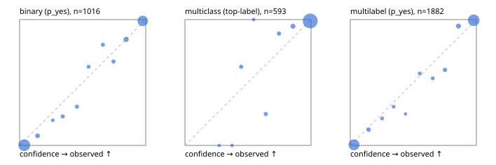

# Evaluation report

- model `Qwen/Qwen3.5-4B` @ `851bf6e806` (shared-prefix tree, forward only: text once per request, each question once, then each candidate), adapter/checkpoint `runs/pilotL/adapter`, prompt `challenger-state-first-v1` (6c9d8459ac44)
- data data/ova/eval2.jsonl; splits ['test']; n=1991; calibration `None`
- cuda / bfloat16; 2026-10-01T09:14:36+0000; wall 624.1s

## Overall

question accuracy 95.5%

**binary**: n 1016, positives 435, accuracy 0.970, precision 0.957, recall 0.975, f1 0.966, auroc 0.995, brier 0.025, log_loss 0.103, ece 0.030

**multiclass**: n 593, accuracy 0.968, macro_f1 0.941, log_loss 0.096, brier 0.048, ece_top_label 0.020

**multilabel**: n 382, labels 1882, exact_match 0.893, micro_f1 0.976, macro_f1 0.955, label_auroc 0.996, brier 0.020, log_loss 0.083, ece 0.025

## By family

| family | n | question acc % | details |
|---|---|---|---|
| e2_hard | 673 | 94.1 | bin acc 96.3 F1 94.9 AUROC 0.995 ECE 0.045; mc acc 95.3 mF1 90.0 ECE 0.030; ml EM 86.4 µF1 96.3 ECE 0.031 |
| e2_simple | 664 | 98.9 | bin acc 98.5 F1 98.7 AUROC 0.997 ECE 0.036; mc acc 99.5 mF1 98.9 ECE 0.007; ml EM 99.2 µF1 99.9 ECE 0.029 |
| e2_very_hard | 654 | 93.4 | bin acc 96.3 F1 95.1 AUROC 0.993 ECE 0.038; mc acc 95.5 mF1 93.7 ECE 0.033; ml EM 83.1 µF1 96.7 ECE 0.031 |

## by hard case

| slice | n | question acc % |
|---|---|---|
| (none) | 569 | 98.9 |
| contradiction | 172 | 97.1 |
| distractor | 474 | 93.7 |
| double_negation | 126 | 96.8 |
| evidence_end | 57 | 96.5 |
| evidence_middle | 114 | 96.5 |
| evidence_start | 17 | 94.1 |
| exception | 213 | 95.3 |
| hypothetical | 128 | 96.9 |
| injection | 151 | 94.7 |
| lexical_overlap | 201 | 95.0 |
| long_state | 191 | 95.8 |
| missing_evidence | 141 | 97.2 |
| multi_positive | 322 | 89.8 |
| multi_turn | 149 | 91.3 |
| negation | 257 | 96.5 |
| nota | 118 | 94.1 |
| numeric_reasoning | 224 | 87.1 |
| paraphrase | 218 | 93.1 |
| role_reversal | 187 | 94.1 |
| sarcasm | 149 | 96.0 |
| temporal_reasoning | 203 | 85.2 |
| zero_positive | 73 | 93.2 |
| zero_positive_distractor | 1 | 100.0 |

## by state tokens

| slice | n | question acc % |
|---|---|---|
| 00000-00127 | 666 | 94.4 |
| 00128-00511 | 469 | 94.7 |
| 00512-02047 | 488 | 96.1 |
| 02048-08191 | 329 | 97.3 |
| 08192+ | 39 | 100.0 |

## by candidates

| slice | n | question acc % |
|---|---|---|
| 01 | 1016 | 97.0 |
| 03 | 128 | 95.3 |
| 04 | 515 | 95.0 |
| 05 | 224 | 92.9 |
| 06 | 86 | 88.4 |
| 07 | 18 | 94.4 |
| 08 | 4 | 75.0 |

## Paraphrase groups

76 groups; same prediction 78.9%; all correct 86.8%

## Multiclass abstention (coverage vs error on accepted)

| abstain_below | coverage % | error % |
|---|---|---|
| 0.0 | 100.0 | 3.2 |
| 0.4 | 99.7 | 2.9 |
| 0.5 | 98.3 | 2.4 |
| 0.6 | 98.0 | 2.4 |
| 0.7 | 96.6 | 1.4 |
| 0.8 | 95.1 | 1.2 |
| 0.9 | 91.9 | 1.1 |

## Reliability: binary

| bin | n | mean confidence | observed frequency |
|---|---|---|---|
| [0.0,0.1) | 516 | 0.036 | 0.002 |
| [0.1,0.2) | 26 | 0.142 | 0.077 |
| [0.2,0.3) | 5 | 0.263 | 0.200 |
| [0.3,0.4) | 13 | 0.342 | 0.231 |
| [0.4,0.5) | 13 | 0.455 | 0.308 |
| [0.5,0.6) | 8 | 0.547 | 0.625 |
| [0.6,0.7) | 10 | 0.660 | 0.800 |
| [0.7,0.8) | 12 | 0.745 | 0.667 |
| [0.8,0.9) | 38 | 0.845 | 0.842 |
| [0.9,1.0] | 375 | 0.977 | 0.989 |

## Reliability: multiclass

| bin | n | mean confidence | observed frequency |
|---|---|---|---|
| [0.2,0.3) | 1 | 0.271 | 0.000 |
| [0.3,0.4) | 1 | 0.374 | 0.000 |
| [0.4,0.5) | 8 | 0.446 | 0.625 |
| [0.5,0.6) | 2 | 0.545 | 1.000 |
| [0.6,0.7) | 8 | 0.640 | 0.250 |
| [0.7,0.8) | 9 | 0.746 | 0.889 |
| [0.8,0.9) | 19 | 0.856 | 0.947 |
| [0.9,1.0] | 545 | 0.994 | 0.989 |

## Reliability: multilabel

| bin | n | mean confidence | observed frequency |
|---|---|---|---|
| [0.0,0.1) | 777 | 0.030 | 0.005 |
| [0.1,0.2) | 32 | 0.146 | 0.125 |
| [0.2,0.3) | 14 | 0.252 | 0.214 |
| [0.3,0.4) | 13 | 0.344 | 0.308 |
| [0.4,0.5) | 4 | 0.438 | 0.250 |
| [0.5,0.6) | 14 | 0.551 | 0.571 |
| [0.6,0.7) | 15 | 0.654 | 0.533 |
| [0.7,0.8) | 30 | 0.750 | 0.600 |
| [0.8,0.9) | 58 | 0.858 | 0.948 |
| [0.9,1.0] | 925 | 0.979 | 0.995 |
