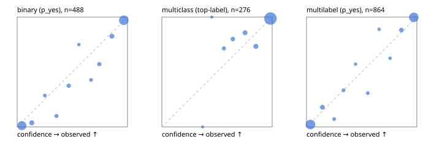

# Evaluation report

- model `Qwen/Qwen3.5-4B` @ `851bf6e806` (shared-prefix tree, forward only: text once per request, each question once, then each candidate), adapter/checkpoint `runs/pilotL/adapter`, prompt `challenger-state-first-v1` (6c9d8459ac44)
- data data/ova/eval_llm.jsonl; splits ['test']; n=946; calibration `None`
- cuda / bfloat16; 2026-10-01T09:18:10+0000; wall 203.5s

## Overall

question accuracy 91.4%

**binary**: n 488, positives 245, accuracy 0.932, precision 0.917, recall 0.951, f1 0.934, auroc 0.979, brier 0.054, log_loss 0.193, ece 0.039

**multiclass**: n 276, accuracy 0.949, macro_f1 0.913, log_loss 0.173, brier 0.088, ece_top_label 0.027

**multilabel**: n 182, labels 864, exact_match 0.813, micro_f1 0.951, macro_f1 0.908, label_auroc 0.990, brier 0.036, log_loss 0.135, ece 0.030

## By family

| family | n | question acc % | details |
|---|---|---|---|
| tllm_guardrail_hard | 60 | 90.0 | bin acc 93.8 F1 93.3 AUROC 0.996 ECE 0.114; mc acc 94.1 mF1 87.5 ECE 0.063; ml EM 72.7 µF1 90.0 ECE 0.077 |
| tllm_guardrail_simple | 67 | 100.0 | bin acc 100.0 F1 100.0 AUROC 1.000 ECE 0.030; mc acc 100.0 mF1 100.0 ECE 0.020; ml EM 100.0 µF1 100.0 ECE 0.041 |
| tllm_guardrail_very_hard | 43 | 95.3 | bin acc 100.0 F1 100.0 AUROC 1.000 ECE 0.068; mc acc 92.9 mF1 83.3 ECE 0.045; ml EM 88.9 µF1 97.9 ECE 0.063 |
| tllm_jailbreak_hard | 59 | 98.3 | bin acc 96.3 F1 96.6 AUROC 1.000 ECE 0.075; mc acc 100.0 mF1 100.0 ECE 0.039; ml EM 100.0 µF1 100.0 ECE 0.052 |
| tllm_jailbreak_simple | 70 | 98.6 | bin acc 100.0 F1 100.0 AUROC 1.000 ECE 0.037; mc acc 100.0 mF1 100.0 ECE 0.032; ml EM 90.9 µF1 98.6 ECE 0.034 |
| tllm_jailbreak_very_hard | 60 | 83.3 | bin acc 87.5 F1 85.7 AUROC 0.955 ECE 0.115; mc acc 94.4 mF1 91.7 ECE 0.044; ml EM 50.0 µF1 91.2 ECE 0.083 |
| tllm_judge_hard | 86 | 91.9 | bin acc 92.5 F1 90.3 AUROC 0.965 ECE 0.100; mc acc 96.0 mF1 90.9 ECE 0.040; ml EM 85.7 µF1 92.3 ECE 0.026 |
| tllm_judge_simple | 72 | 97.2 | bin acc 94.7 F1 95.8 AUROC 0.997 ECE 0.083; mc acc 100.0 mF1 100.0 ECE 0.067; ml EM 100.0 µF1 100.0 ECE 0.041 |
| tllm_judge_very_hard | 64 | 84.4 | bin acc 93.8 F1 94.7 AUROC 0.976 ECE 0.079; mc acc 85.7 mF1 75.1 ECE 0.127; ml EM 54.5 µF1 92.8 ECE 0.081 |
| tllm_score_hard | 62 | 95.2 | bin acc 97.1 F1 96.8 AUROC 0.993 ECE 0.094; mc acc 100.0 mF1 100.0 ECE 0.056; ml EM 83.3 µF1 96.2 ECE 0.093 |
| tllm_score_simple | 62 | 95.2 | bin acc 97.1 F1 98.0 AUROC 0.971 ECE 0.059; mc acc 93.8 mF1 88.2 ECE 0.111; ml EM 91.7 µF1 98.6 ECE 0.042 |
| tllm_score_very_hard | 76 | 86.8 | bin acc 89.5 F1 83.3 AUROC 0.980 ECE 0.098; mc acc 95.5 mF1 90.9 ECE 0.126; ml EM 68.8 µF1 87.9 ECE 0.048 |
| tllm_verify_hard | 50 | 72.0 | bin acc 73.1 F1 66.7 AUROC 0.812 ECE 0.202; mc acc 87.5 mF1 76.5 ECE 0.200; ml EM 37.5 µF1 77.4 ECE 0.188 |
| tllm_verify_simple | 60 | 100.0 | bin acc 100.0 F1 100.0 AUROC 1.000 ECE 0.050; mc acc 100.0 mF1 100.0 ECE 0.005; ml EM 100.0 µF1 100.0 ECE 0.046 |
| tllm_verify_very_hard | 55 | 78.2 | bin acc 80.6 F1 76.9 AUROC 0.846 ECE 0.183; mc acc 80.0 mF1 70.8 ECE 0.180; ml EM 66.7 µF1 85.7 ECE 0.058 |

## by hard case

| slice | n | question acc % |
|---|---|---|
| (none) | 265 | 98.1 |
| answer_trace_mismatch | 45 | 91.1 |
| benign_lookalike | 88 | 86.4 |
| confident_wrong | 39 | 79.5 |
| contradiction | 22 | 95.5 |
| distractor | 117 | 88.0 |
| double_negation | 3 | 100.0 |
| evidence_end | 11 | 100.0 |
| evidence_middle | 20 | 75.0 |
| evidence_start | 2 | 50.0 |
| exception | 20 | 95.0 |
| fake_authority | 1 | 100.0 |
| flawed_step | 44 | 61.4 |
| format_near_miss | 46 | 84.8 |
| gradual_escalation | 1 | 100.0 |
| hypothetical | 7 | 100.0 |
| indirect_injection | 25 | 92.0 |
| injection | 22 | 100.0 |
| judge_injection | 112 | 85.7 |
| length_bias | 7 | 100.0 |
| lexical_overlap | 103 | 91.3 |
| long_state | 74 | 91.9 |
| missing_evidence | 35 | 94.3 |
| multi_positive | 124 | 79.0 |
| multi_turn | 44 | 90.9 |
| negation | 62 | 93.5 |
| nota | 55 | 90.9 |
| numeric_reasoning | 109 | 78.9 |
| obfuscation | 1 | 0.0 |
| over_refusal | 50 | 82.0 |
| paraphrase | 73 | 90.4 |
| partial_compliance | 31 | 71.0 |
| role_reversal | 6 | 66.7 |
| sarcasm | 8 | 75.0 |
| speaker_confusion | 58 | 93.1 |
| subtle_violation | 16 | 87.5 |
| sycophancy | 13 | 92.3 |
| temporal_reasoning | 20 | 85.0 |
| tool_misuse | 6 | 66.7 |
| unsupported_claim | 96 | 88.5 |
| zero_positive | 55 | 92.7 |
| zero_positive_partial | 1 | 100.0 |

## by state tokens

| slice | n | question acc % |
|---|---|---|
| 00000-00127 | 308 | 88.6 |
| 00128-00511 | 284 | 95.1 |
| 00512-02047 | 222 | 93.2 |
| 02048-08191 | 125 | 87.2 |
| 08192+ | 7 | 85.7 |

## by candidates

| slice | n | question acc % |
|---|---|---|
| 01 | 488 | 93.2 |
| 03 | 82 | 92.7 |
| 04 | 239 | 92.5 |
| 05 | 98 | 84.7 |
| 06 | 33 | 81.8 |
| 07 | 3 | 33.3 |
| 08 | 3 | 66.7 |

## Paraphrase groups

29 groups; same prediction 89.7%; all correct 82.8%

## Multiclass abstention (coverage vs error on accepted)

| abstain_below | coverage % | error % |
|---|---|---|
| 0.0 | 100.0 | 5.1 |
| 0.4 | 99.6 | 4.7 |
| 0.5 | 99.3 | 4.7 |
| 0.6 | 96.7 | 4.1 |
| 0.7 | 93.1 | 3.5 |
| 0.8 | 88.0 | 2.9 |
| 0.9 | 82.6 | 1.3 |

## Reliability: binary

| bin | n | mean confidence | observed frequency |
|---|---|---|---|
| [0.0,0.1) | 174 | 0.043 | 0.011 |
| [0.1,0.2) | 27 | 0.132 | 0.037 |
| [0.2,0.3) | 7 | 0.251 | 0.286 |
| [0.3,0.4) | 10 | 0.356 | 0.100 |
| [0.4,0.5) | 16 | 0.468 | 0.375 |
| [0.5,0.6) | 4 | 0.560 | 0.750 |
| [0.6,0.7) | 7 | 0.670 | 0.429 |
| [0.7,0.8) | 14 | 0.745 | 0.571 |
| [0.8,0.9) | 23 | 0.858 | 0.826 |
| [0.9,1.0] | 206 | 0.966 | 0.971 |

## Reliability: multiclass

| bin | n | mean confidence | observed frequency |
|---|---|---|---|
| [0.3,0.4) | 1 | 0.369 | 0.000 |
| [0.4,0.5) | 1 | 0.453 | 1.000 |
| [0.5,0.6) | 7 | 0.563 | 0.714 |
| [0.6,0.7) | 10 | 0.644 | 0.800 |
| [0.7,0.8) | 14 | 0.754 | 0.857 |
| [0.8,0.9) | 15 | 0.853 | 0.733 |
| [0.9,1.0] | 228 | 0.984 | 0.987 |

## Reliability: multilabel

| bin | n | mean confidence | observed frequency |
|---|---|---|---|
| [0.0,0.1) | 370 | 0.036 | 0.022 |
| [0.1,0.2) | 39 | 0.144 | 0.179 |
| [0.2,0.3) | 14 | 0.251 | 0.071 |
| [0.3,0.4) | 12 | 0.335 | 0.333 |
| [0.4,0.5) | 7 | 0.445 | 0.571 |
| [0.5,0.6) | 13 | 0.556 | 0.308 |
| [0.6,0.7) | 9 | 0.658 | 0.889 |
| [0.7,0.8) | 8 | 0.758 | 0.625 |
| [0.8,0.9) | 34 | 0.860 | 0.882 |
| [0.9,1.0] | 358 | 0.973 | 0.997 |
