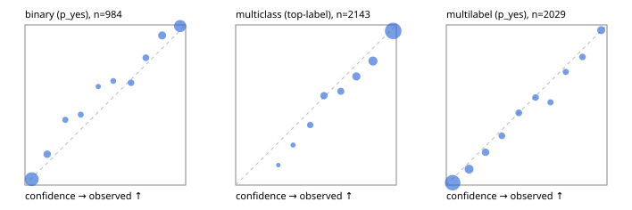

# Evaluation report

- model `Qwen/Qwen3.5-4B` @ `851bf6e806` (shared-prefix tree, forward only: text once per request, each question once, then each candidate), adapter/checkpoint `runs/pilot/adapter`, prompt `challenger-state-first-v1` (6c9d8459ac44)
- data data/ova/hf.jsonl, data/ova/eval.jsonl; splits ['test']; n=3471; calibration `None`
- cuda / bfloat16; 2026-10-01T08:55:43+0000; wall 257.0s

## Overall

question accuracy 83.4%

**binary**: n 984, positives 475, accuracy 0.908, precision 0.923, recall 0.882, f1 0.902, auroc 0.971, brier 0.068, log_loss 0.230, ece 0.033

**multiclass**: n 2143, accuracy 0.848, macro_f1 0.930, log_loss 0.434, brier 0.221, ece_top_label 0.036

**multilabel**: n 344, labels 2029, exact_match 0.538, micro_f1 0.739, macro_f1 0.836, label_auroc 0.942, brier 0.077, log_loss 0.252, ece 0.029

## By family

| family | n | question acc % | details |
|---|---|---|---|
| eval_adversarial | 27 | 96.3 | bin acc 93.3 F1 90.9 AUROC 0.944 ECE 0.064; mc acc 100.0 mF1 100.0 ECE 0.005; ml EM 100.0 µF1 100.0 ECE 0.047 |
| eval_agent_output | 26 | 96.2 | bin acc 100.0 F1 100.0 AUROC 1.000 ECE 0.060; mc acc 100.0 mF1 100.0 ECE 0.138; ml EM 80.0 µF1 94.1 ECE 0.093 |
| eval_evidence | 17 | 94.1 | bin acc 100.0 F1 100.0 AUROC 1.000 ECE 0.029; ml EM 50.0 µF1 57.1 ECE 0.234 |
| eval_multilabel | 32 | 96.9 | bin acc 100.0 F1 100.0 AUROC 1.000 ECE 0.047; mc acc 100.0 mF1 100.0 ECE 0.043; ml EM 95.8 µF1 98.0 ECE 0.037 |
| eval_policy | 22 | 72.7 | bin acc 76.9 F1 76.9 AUROC 0.881 ECE 0.171; mc acc 60.0 mF1 42.9 ECE 0.272; ml EM 75.0 µF1 94.1 ECE 0.140 |
| eval_routing | 25 | 88.0 | bin acc 100.0 F1 100.0 AUROC 1.000 ECE 0.029; mc acc 84.6 mF1 81.8 ECE 0.129; ml EM 50.0 µF1 80.0 ECE 0.137 |
| eval_urgency_sentiment | 22 | 95.5 | bin acc 90.0 F1 92.3 AUROC 0.958 ECE 0.137; mc acc 100.0 mF1 100.0 ECE 0.081; ml EM 100.0 µF1 100.0 ECE 0.027 |
| heldout_boolq | 300 | 88.3 | bin acc 88.3 F1 89.8 AUROC 0.959 ECE 0.056 |
| heldout_emotion_multiclass | 300 | 55.0 | mc acc 55.0 mF1 42.6 ECE 0.179 |
| heldout_intent_clinc | 300 | 96.7 | mc acc 96.7 mF1 96.9 ECE 0.025 |
| heldout_question_type_trec | 300 | 90.0 | mc acc 90.0 mF1 88.6 ECE 0.069 |
| heldout_sentiment_sst2 | 300 | 91.0 | bin acc 91.0 F1 90.5 AUROC 0.977 ECE 0.082 |
| heldout_topic_dbpedia | 300 | 98.0 | mc acc 98.0 mF1 97.8 ECE 0.015 |
| hf_emotions_multilabel | 300 | 48.7 | ml EM 48.7 µF1 68.4 ECE 0.029 |
| hf_intent_banking77 | 300 | 95.7 | mc acc 95.7 mF1 96.0 ECE 0.034 |
| hf_nli | 300 | 92.0 | bin acc 92.0 F1 89.5 AUROC 0.982 ECE 0.059 |
| hf_sentiment_tweets | 300 | 67.3 | mc acc 67.3 mF1 68.2 ECE 0.130 |
| hf_topic_agnews | 300 | 90.0 | mc acc 90.0 mF1 90.0 ECE 0.047 |

## by hard case

| slice | n | question acc % |
|---|---|---|
| (none) | 3042 | 83.3 |
| contradiction | 107 | 99.1 |
| distractor | 33 | 78.8 |
| double_negation | 6 | 83.3 |
| evidence_end | 13 | 100.0 |
| evidence_middle | 11 | 81.8 |
| evidence_start | 9 | 100.0 |
| exception | 7 | 28.6 |
| hypothetical | 7 | 100.0 |
| injection | 10 | 100.0 |
| lexical_overlap | 20 | 100.0 |
| long_state | 50 | 88.0 |
| missing_evidence | 104 | 83.7 |
| multi_positive | 81 | 46.9 |
| multi_turn | 9 | 88.9 |
| negation | 30 | 100.0 |
| new_label_names | 3 | 100.0 |
| nota | 46 | 100.0 |
| numeric_reasoning | 16 | 75.0 |
| paraphrase | 22 | 86.4 |
| role_reversal | 15 | 93.3 |
| sarcasm | 12 | 100.0 |
| temporal_reasoning | 29 | 69.0 |
| zero_positive | 6 | 100.0 |

## by state tokens

| slice | n | question acc % |
|---|---|---|
| 00000-00127 | 3213 | 82.9 |
| 00128-00511 | 206 | 89.3 |
| 00512-02047 | 52 | 88.5 |

## by candidates

| slice | n | question acc % |
|---|---|---|
| 01 | 984 | 90.8 |
| 03 | 310 | 68.4 |
| 04 | 333 | 89.5 |
| 05 | 22 | 100.0 |
| 06 | 1218 | 73.0 |
| 07 | 49 | 100.0 |
| 08 | 555 | 95.9 |

## Paraphrase groups

11 groups; same prediction 72.7%; all correct 81.8%

## Multiclass abstention (coverage vs error on accepted)

| abstain_below | coverage % | error % |
|---|---|---|
| 0.0 | 100.0 | 15.2 |
| 0.4 | 98.7 | 14.4 |
| 0.5 | 95.7 | 12.9 |
| 0.6 | 90.1 | 10.9 |
| 0.7 | 84.9 | 9.1 |
| 0.8 | 76.8 | 6.6 |
| 0.9 | 65.2 | 3.8 |

## Reliability: binary

| bin | n | mean confidence | observed frequency |
|---|---|---|---|
| [0.0,0.1) | 408 | 0.042 | 0.037 |
| [0.1,0.2) | 57 | 0.138 | 0.193 |
| [0.2,0.3) | 27 | 0.251 | 0.407 |
| [0.3,0.4) | 25 | 0.347 | 0.440 |
| [0.4,0.5) | 13 | 0.456 | 0.615 |
| [0.5,0.6) | 20 | 0.549 | 0.650 |
| [0.6,0.7) | 36 | 0.660 | 0.639 |
| [0.7,0.8) | 39 | 0.752 | 0.795 |
| [0.8,0.9) | 76 | 0.853 | 0.934 |
| [0.9,1.0] | 283 | 0.966 | 0.993 |

## Reliability: multiclass

| bin | n | mean confidence | observed frequency |
|---|---|---|---|
| [0.2,0.3) | 8 | 0.266 | 0.125 |
| [0.3,0.4) | 20 | 0.357 | 0.250 |
| [0.4,0.5) | 64 | 0.464 | 0.375 |
| [0.5,0.6) | 120 | 0.549 | 0.558 |
| [0.6,0.7) | 111 | 0.655 | 0.586 |
| [0.7,0.8) | 174 | 0.751 | 0.678 |
| [0.8,0.9) | 248 | 0.855 | 0.774 |
| [0.9,1.0] | 1398 | 0.981 | 0.962 |

## Reliability: multilabel

| bin | n | mean confidence | observed frequency |
|---|---|---|---|
| [0.0,0.1) | 1116 | 0.039 | 0.015 |
| [0.1,0.2) | 221 | 0.142 | 0.100 |
| [0.2,0.3) | 117 | 0.244 | 0.205 |
| [0.3,0.4) | 78 | 0.345 | 0.308 |
| [0.4,0.5) | 82 | 0.451 | 0.451 |
| [0.5,0.6) | 75 | 0.556 | 0.547 |
| [0.6,0.7) | 60 | 0.648 | 0.517 |
| [0.7,0.8) | 58 | 0.743 | 0.707 |
| [0.8,0.9) | 70 | 0.847 | 0.800 |
| [0.9,1.0] | 152 | 0.964 | 0.967 |
