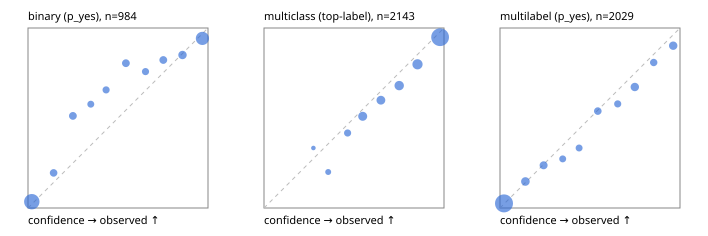

# Evaluation report

- model `Qwen/Qwen3-Reranker-4B` @ `22e683669b` (stock reranker pairs), adapter/checkpoint `runs/curve/boolq_100/adapter`, prompt `answer-v1` (724795e9b666)
- data data/hf.jsonl, data/eval.jsonl; splits ['test']; n=3471; calibration `None`
- cuda / bfloat16; 2026-09-24T00:55:46+0000; wall 414.0s

## Overall

question accuracy 80.0%

**binary**: n 984, positives 475, accuracy 0.869, precision 0.890, recall 0.832, f1 0.860, auroc 0.945, brier 0.097, log_loss 0.315, ece 0.059

**multiclass**: n 2143, accuracy 0.820, macro_f1 0.869, log_loss 0.523, brier 0.262, ece_top_label 0.041

**multilabel**: n 344, labels 2029, exact_match 0.483, micro_f1 0.736, macro_f1 0.706, label_auroc 0.928, brier 0.086, log_loss 0.282, ece 0.020

## By family

| family | n | question acc % | details |
|---|---|---|---|
| eval_adversarial | 27 | 81.5 | bin acc 86.7 F1 85.7 AUROC 0.944 ECE 0.142; mc acc 100.0 mF1 100.0 ECE 0.036; ml EM 40.0 µF1 73.7 ECE 0.193 |
| eval_agent_output | 26 | 53.8 | bin acc 78.6 F1 82.4 AUROC 0.857 ECE 0.159; mc acc 14.3 mF1 6.2 ECE 0.623; ml EM 40.0 µF1 82.4 ECE 0.204 |
| eval_evidence | 17 | 88.2 | bin acc 100.0 F1 100.0 AUROC 1.000 ECE 0.033; ml EM 0.0 µF1 50.0 ECE 0.349 |
| eval_multilabel | 32 | 71.9 | bin acc 85.7 F1 85.7 AUROC 1.000 ECE 0.115; mc acc 0.0 mF1 0.0 ECE 0.583; ml EM 70.8 µF1 92.5 ECE 0.056 |
| eval_policy | 22 | 50.0 | bin acc 53.8 F1 57.1 AUROC 0.667 ECE 0.416; mc acc 60.0 mF1 44.4 ECE 0.469; ml EM 25.0 µF1 80.0 ECE 0.249 |
| eval_routing | 25 | 84.0 | bin acc 90.0 F1 85.7 AUROC 1.000 ECE 0.076; mc acc 84.6 mF1 81.8 ECE 0.116; ml EM 50.0 µF1 80.0 ECE 0.124 |
| eval_urgency_sentiment | 22 | 68.2 | bin acc 70.0 F1 72.7 AUROC 0.750 ECE 0.314; mc acc 70.0 mF1 58.3 ECE 0.198; ml EM 50.0 µF1 90.9 ECE 0.125 |
| heldout_boolq | 300 | 84.3 | bin acc 84.3 F1 87.3 AUROC 0.914 ECE 0.054 |
| heldout_emotion_multiclass | 300 | 57.3 | mc acc 57.3 mF1 46.9 ECE 0.152 |
| heldout_intent_clinc | 300 | 92.0 | mc acc 92.0 mF1 93.1 ECE 0.035 |
| heldout_question_type_trec | 300 | 78.0 | mc acc 78.0 mF1 77.5 ECE 0.061 |
| heldout_sentiment_sst2 | 300 | 84.7 | bin acc 84.7 F1 82.0 AUROC 0.986 ECE 0.165 |
| heldout_topic_dbpedia | 300 | 96.0 | mc acc 96.0 mF1 95.5 ECE 0.020 |
| hf_emotions_multilabel | 300 | 47.3 | ml EM 47.3 µF1 70.4 ECE 0.016 |
| hf_intent_banking77 | 300 | 95.7 | mc acc 95.7 mF1 94.3 ECE 0.014 |
| hf_nli | 300 | 93.3 | bin acc 93.3 F1 90.7 AUROC 0.974 ECE 0.034 |
| hf_sentiment_tweets | 300 | 69.0 | mc acc 69.0 mF1 69.4 ECE 0.059 |
| hf_topic_agnews | 300 | 88.0 | mc acc 88.0 mF1 88.1 ECE 0.044 |

## by hard case

| slice | n | question acc % |
|---|---|---|
| (none) | 3042 | 80.2 |
| contradiction | 107 | 100.0 |
| distractor | 33 | 54.5 |
| double_negation | 6 | 66.7 |
| evidence_end | 13 | 92.3 |
| evidence_middle | 11 | 63.6 |
| evidence_start | 9 | 77.8 |
| exception | 7 | 0.0 |
| hypothetical | 7 | 71.4 |
| injection | 10 | 70.0 |
| lexical_overlap | 20 | 70.0 |
| long_state | 50 | 66.0 |
| missing_evidence | 104 | 90.4 |
| multi_positive | 81 | 38.3 |
| multi_turn | 9 | 88.9 |
| negation | 30 | 83.3 |
| new_label_names | 3 | 33.3 |
| nota | 46 | 95.7 |
| numeric_reasoning | 16 | 50.0 |
| paraphrase | 22 | 59.1 |
| role_reversal | 15 | 60.0 |
| sarcasm | 12 | 58.3 |
| temporal_reasoning | 29 | 44.8 |
| zero_positive | 6 | 33.3 |

## by state tokens

| slice | n | question acc % |
|---|---|---|
| 00000-00127 | 3211 | 80.3 |
| 00128-00511 | 208 | 78.8 |
| 00512-02047 | 52 | 65.4 |

## by candidates

| slice | n | question acc % |
|---|---|---|
| 01 | 984 | 86.9 |
| 03 | 310 | 69.7 |
| 04 | 333 | 86.2 |
| 05 | 22 | 31.8 |
| 06 | 1218 | 69.6 |
| 07 | 49 | 93.9 |
| 08 | 555 | 93.5 |

## Paraphrase groups

11 groups; same prediction 63.6%; all correct 45.5%

## Multiclass abstention (coverage vs error on accepted)

| abstain_below | coverage % | error % |
|---|---|---|
| 0.0 | 100.0 | 18.0 |
| 0.4 | 98.7 | 17.2 |
| 0.5 | 95.3 | 15.8 |
| 0.6 | 87.8 | 12.9 |
| 0.7 | 80.5 | 10.4 |
| 0.8 | 71.3 | 7.7 |
| 0.9 | 59.3 | 5.1 |

## Reliability: binary

| bin | n | mean confidence | observed frequency |
|---|---|---|---|
| [0.0,0.1) | 398 | 0.021 | 0.035 |
| [0.1,0.2) | 41 | 0.142 | 0.195 |
| [0.2,0.3) | 43 | 0.250 | 0.512 |
| [0.3,0.4) | 26 | 0.349 | 0.577 |
| [0.4,0.5) | 32 | 0.434 | 0.656 |
| [0.5,0.6) | 46 | 0.544 | 0.804 |
| [0.6,0.7) | 33 | 0.653 | 0.758 |
| [0.7,0.8) | 45 | 0.752 | 0.822 |
| [0.8,0.9) | 60 | 0.858 | 0.850 |
| [0.9,1.0] | 260 | 0.969 | 0.942 |

## Reliability: multiclass

| bin | n | mean confidence | observed frequency |
|---|---|---|---|
| [0.2,0.3) | 3 | 0.274 | 0.333 |
| [0.3,0.4) | 25 | 0.357 | 0.200 |
| [0.4,0.5) | 72 | 0.464 | 0.417 |
| [0.5,0.6) | 161 | 0.548 | 0.509 |
| [0.6,0.7) | 157 | 0.649 | 0.599 |
| [0.7,0.8) | 197 | 0.751 | 0.680 |
| [0.8,0.9) | 258 | 0.853 | 0.798 |
| [0.9,1.0] | 1270 | 0.978 | 0.949 |

## Reliability: multilabel

| bin | n | mean confidence | observed frequency |
|---|---|---|---|
| [0.0,0.1) | 1226 | 0.022 | 0.025 |
| [0.1,0.2) | 129 | 0.141 | 0.147 |
| [0.2,0.3) | 97 | 0.242 | 0.237 |
| [0.3,0.4) | 55 | 0.348 | 0.273 |
| [0.4,0.5) | 60 | 0.439 | 0.333 |
| [0.5,0.6) | 78 | 0.543 | 0.538 |
| [0.6,0.7) | 64 | 0.654 | 0.578 |
| [0.7,0.8) | 125 | 0.749 | 0.672 |
| [0.8,0.9) | 73 | 0.854 | 0.808 |
| [0.9,1.0] | 122 | 0.962 | 0.902 |
