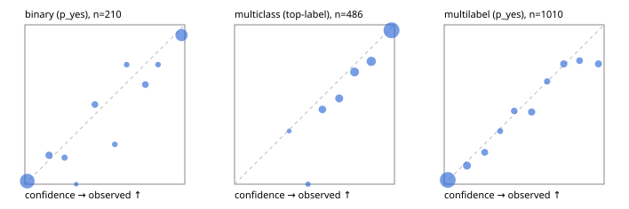

# Evaluation report

- model `Qwen/Qwen3-Reranker-4B` @ `22e683669b` (stock reranker pairs), adapter/checkpoint `runs/curve/boolq_100/adapter`, prompt `answer-v1` (724795e9b666)
- data data/hf.jsonl, data/eval.jsonl; splits ['validation']; n=868; calibration `None`
- cuda / bfloat16; 2026-09-24T00:48:44+0000; wall 105.9s

## Overall

question accuracy 77.4%

**binary**: n 210, positives 79, accuracy 0.900, precision 0.854, recall 0.886, f1 0.870, auroc 0.962, brier 0.072, log_loss 0.253, ece 0.038

**multiclass**: n 486, accuracy 0.829, macro_f1 0.795, log_loss 0.447, brier 0.235, ece_top_label 0.046

**multilabel**: n 172, labels 1010, exact_match 0.465, micro_f1 0.698, macro_f1 0.621, label_auroc 0.914, brier 0.094, log_loss 0.310, ece 0.026

## By family

| family | n | question acc % | details |
|---|---|---|---|
| eval_adversarial | 14 | 78.6 | bin acc 71.4 F1 80.0 AUROC 0.900 ECE 0.176; mc acc 80.0 mF1 66.7 ECE 0.114; ml EM 100.0 µF1 100.0 ECE 0.010 |
| eval_agent_output | 20 | 75.0 | bin acc 91.7 F1 92.3 AUROC 0.917 ECE 0.147; mc acc 60.0 mF1 33.3 ECE 0.363; ml EM 33.3 µF1 0.0 ECE 0.296 |
| eval_evidence | 17 | 88.2 | bin acc 92.9 F1 90.9 AUROC 1.000 ECE 0.076; ml EM 66.7 µF1 88.9 ECE 0.072 |
| eval_multilabel | 12 | 41.7 | bin acc 0.0 F1 0.0 AUROC — ECE 0.798; mc acc 100.0 mF1 100.0 ECE 0.001; ml EM 33.3 µF1 85.1 ECE 0.163 |
| eval_policy | 24 | 41.7 | bin acc 41.7 F1 36.4 AUROC 0.514 ECE 0.404; mc acc 45.5 mF1 31.2 ECE 0.359; ml EM 0.0 µF1 80.0 ECE 0.469 |
| eval_routing | 16 | 100.0 | bin acc 100.0 F1 100.0 AUROC 1.000 ECE 0.101; mc acc 100.0 mF1 100.0 ECE 0.070; ml EM 100.0 µF1 0.0 ECE 0.127 |
| eval_urgency_sentiment | 15 | 80.0 | bin acc 100.0 F1 100.0 AUROC 1.000 ECE 0.047; mc acc 80.0 mF1 66.7 ECE 0.133; ml EM 33.3 µF1 50.0 ECE 0.156 |
| hf_emotions_multilabel | 150 | 46.7 | ml EM 46.7 µF1 67.8 ECE 0.022 |
| hf_intent_banking77 | 150 | 95.3 | mc acc 95.3 mF1 94.5 ECE 0.026 |
| hf_nli | 150 | 94.0 | bin acc 94.0 F1 90.7 AUROC 0.984 ECE 0.048 |
| hf_sentiment_tweets | 150 | 70.0 | mc acc 70.0 mF1 65.4 ECE 0.073 |
| hf_topic_agnews | 150 | 86.0 | mc acc 86.0 mF1 86.2 ECE 0.081 |

## by hard case

| slice | n | question acc % |
|---|---|---|
| (none) | 634 | 78.5 |
| contradiction | 63 | 93.7 |
| distractor | 20 | 75.0 |
| double_negation | 3 | 100.0 |
| evidence_end | 4 | 25.0 |
| evidence_middle | 7 | 85.7 |
| evidence_start | 3 | 100.0 |
| exception | 7 | 71.4 |
| hypothetical | 6 | 66.7 |
| injection | 16 | 81.2 |
| lexical_overlap | 13 | 84.6 |
| long_state | 26 | 69.2 |
| missing_evidence | 59 | 89.8 |
| multi_positive | 40 | 22.5 |
| multi_turn | 21 | 76.2 |
| negation | 9 | 77.8 |
| new_label_names | 5 | 40.0 |
| nota | 4 | 100.0 |
| numeric_reasoning | 13 | 53.8 |
| paraphrase | 10 | 40.0 |
| role_reversal | 7 | 57.1 |
| sarcasm | 5 | 40.0 |
| temporal_reasoning | 15 | 26.7 |
| zero_positive | 7 | 71.4 |

## by state tokens

| slice | n | question acc % |
|---|---|---|
| 00000-00127 | 796 | 77.9 |
| 00128-00511 | 46 | 73.9 |
| 00512-02047 | 26 | 69.2 |

## by candidates

| slice | n | question acc % |
|---|---|---|
| 01 | 210 | 90.0 |
| 03 | 162 | 69.1 |
| 04 | 174 | 84.5 |
| 05 | 13 | 61.5 |
| 06 | 159 | 45.9 |
| 08 | 150 | 95.3 |

## Paraphrase groups

5 groups; same prediction 60.0%; all correct 40.0%

## Multiclass abstention (coverage vs error on accepted)

| abstain_below | coverage % | error % |
|---|---|---|
| 0.0 | 100.0 | 17.1 |
| 0.4 | 99.4 | 16.8 |
| 0.5 | 98.1 | 15.7 |
| 0.6 | 91.6 | 13.0 |
| 0.7 | 83.5 | 9.9 |
| 0.8 | 72.4 | 6.8 |
| 0.9 | 59.9 | 3.4 |

## Reliability: binary

| bin | n | mean confidence | observed frequency |
|---|---|---|---|
| [0.0,0.1) | 102 | 0.015 | 0.020 |
| [0.1,0.2) | 11 | 0.151 | 0.182 |
| [0.2,0.3) | 6 | 0.248 | 0.167 |
| [0.3,0.4) | 1 | 0.321 | 0.000 |
| [0.4,0.5) | 8 | 0.438 | 0.500 |
| [0.5,0.6) | 4 | 0.562 | 0.250 |
| [0.6,0.7) | 4 | 0.637 | 0.750 |
| [0.7,0.8) | 8 | 0.753 | 0.625 |
| [0.8,0.9) | 4 | 0.833 | 0.750 |
| [0.9,1.0] | 62 | 0.980 | 0.935 |

## Reliability: multiclass

| bin | n | mean confidence | observed frequency |
|---|---|---|---|
| [0.3,0.4) | 3 | 0.342 | 0.333 |
| [0.4,0.5) | 6 | 0.460 | 0.000 |
| [0.5,0.6) | 32 | 0.549 | 0.469 |
| [0.6,0.7) | 39 | 0.654 | 0.538 |
| [0.7,0.8) | 54 | 0.751 | 0.704 |
| [0.8,0.9) | 61 | 0.855 | 0.770 |
| [0.9,1.0] | 291 | 0.981 | 0.966 |

## Reliability: multilabel

| bin | n | mean confidence | observed frequency |
|---|---|---|---|
| [0.0,0.1) | 597 | 0.022 | 0.027 |
| [0.1,0.2) | 77 | 0.142 | 0.117 |
| [0.2,0.3) | 45 | 0.253 | 0.200 |
| [0.3,0.4) | 24 | 0.350 | 0.333 |
| [0.4,0.5) | 37 | 0.438 | 0.459 |
| [0.5,0.6) | 53 | 0.547 | 0.453 |
| [0.6,0.7) | 31 | 0.644 | 0.645 |
| [0.7,0.8) | 57 | 0.748 | 0.754 |
| [0.8,0.9) | 40 | 0.847 | 0.775 |
| [0.9,1.0] | 49 | 0.965 | 0.755 |
