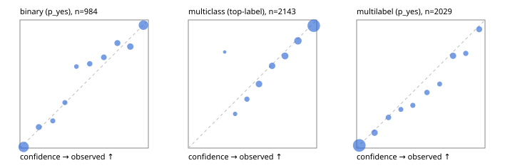

# Evaluation report

- model `Qwen/Qwen3-Reranker-4B` @ `22e683669b` (stock reranker pairs), adapter/checkpoint `runs/curve/boolq_1000/adapter`, prompt `answer-v1` (724795e9b666)
- data data/hf.jsonl, data/eval.jsonl; splits ['test']; n=3471; calibration `None`
- cuda / bfloat16; 2026-09-24T00:58:28+0000; wall 414.0s

## Overall

question accuracy 80.9%

**binary**: n 984, positives 475, accuracy 0.888, precision 0.869, recall 0.905, f1 0.887, auroc 0.954, brier 0.083, log_loss 0.272, ece 0.031

**multiclass**: n 2143, accuracy 0.825, macro_f1 0.886, log_loss 0.506, brier 0.253, ece_top_label 0.028

**multilabel**: n 344, labels 2029, exact_match 0.488, micro_f1 0.733, macro_f1 0.697, label_auroc 0.931, brier 0.085, log_loss 0.273, ece 0.023

## By family

| family | n | question acc % | details |
|---|---|---|---|
| eval_adversarial | 27 | 81.5 | bin acc 86.7 F1 85.7 AUROC 0.981 ECE 0.103; mc acc 100.0 mF1 100.0 ECE 0.057; ml EM 40.0 µF1 73.7 ECE 0.184 |
| eval_agent_output | 26 | 57.7 | bin acc 78.6 F1 80.0 AUROC 0.898 ECE 0.164; mc acc 28.6 mF1 21.4 ECE 0.619; ml EM 40.0 µF1 82.4 ECE 0.175 |
| eval_evidence | 17 | 88.2 | bin acc 100.0 F1 100.0 AUROC 1.000 ECE 0.047; ml EM 0.0 µF1 50.0 ECE 0.317 |
| eval_multilabel | 32 | 71.9 | bin acc 100.0 F1 100.0 AUROC 1.000 ECE 0.087; mc acc 0.0 mF1 0.0 ECE 0.551; ml EM 66.7 µF1 91.6 ECE 0.064 |
| eval_policy | 22 | 54.5 | bin acc 61.5 F1 66.7 AUROC 0.679 ECE 0.356; mc acc 60.0 mF1 42.9 ECE 0.457; ml EM 25.0 µF1 80.0 ECE 0.237 |
| eval_routing | 25 | 88.0 | bin acc 90.0 F1 88.9 AUROC 1.000 ECE 0.071; mc acc 92.3 mF1 87.9 ECE 0.077; ml EM 50.0 µF1 80.0 ECE 0.112 |
| eval_urgency_sentiment | 22 | 77.3 | bin acc 80.0 F1 83.3 AUROC 0.875 ECE 0.222; mc acc 80.0 mF1 81.0 ECE 0.223; ml EM 50.0 µF1 83.3 ECE 0.186 |
| heldout_boolq | 300 | 84.3 | bin acc 84.3 F1 87.9 AUROC 0.935 ECE 0.073 |
| heldout_emotion_multiclass | 300 | 58.3 | mc acc 58.3 mF1 48.6 ECE 0.141 |
| heldout_intent_clinc | 300 | 92.3 | mc acc 92.3 mF1 93.5 ECE 0.031 |
| heldout_question_type_trec | 300 | 76.0 | mc acc 76.0 mF1 76.5 ECE 0.042 |
| heldout_sentiment_sst2 | 300 | 91.0 | bin acc 91.0 F1 90.4 AUROC 0.989 ECE 0.129 |
| heldout_topic_dbpedia | 300 | 97.0 | mc acc 97.0 mF1 96.6 ECE 0.014 |
| hf_emotions_multilabel | 300 | 48.3 | ml EM 48.3 µF1 70.3 ECE 0.018 |
| hf_intent_banking77 | 300 | 96.0 | mc acc 96.0 mF1 94.6 ECE 0.029 |
| hf_nli | 300 | 92.3 | bin acc 92.3 F1 89.5 AUROC 0.973 ECE 0.034 |
| hf_sentiment_tweets | 300 | 69.0 | mc acc 69.0 mF1 69.1 ECE 0.047 |
| hf_topic_agnews | 300 | 89.7 | mc acc 89.7 mF1 89.7 ECE 0.049 |

## by hard case

| slice | n | question acc % |
|---|---|---|
| (none) | 3042 | 81.1 |
| contradiction | 107 | 99.1 |
| distractor | 33 | 66.7 |
| double_negation | 6 | 66.7 |
| evidence_end | 13 | 100.0 |
| evidence_middle | 11 | 54.5 |
| evidence_start | 9 | 77.8 |
| exception | 7 | 28.6 |
| hypothetical | 7 | 71.4 |
| injection | 10 | 70.0 |
| lexical_overlap | 20 | 75.0 |
| long_state | 50 | 72.0 |
| missing_evidence | 104 | 88.5 |
| multi_positive | 81 | 39.5 |
| multi_turn | 9 | 77.8 |
| negation | 30 | 83.3 |
| new_label_names | 3 | 33.3 |
| nota | 46 | 97.8 |
| numeric_reasoning | 16 | 56.2 |
| paraphrase | 22 | 63.6 |
| role_reversal | 15 | 53.3 |
| sarcasm | 12 | 58.3 |
| temporal_reasoning | 29 | 48.3 |
| zero_positive | 6 | 16.7 |

## by state tokens

| slice | n | question acc % |
|---|---|---|
| 00000-00127 | 3211 | 81.1 |
| 00128-00511 | 208 | 80.8 |
| 00512-02047 | 52 | 71.2 |

## by candidates

| slice | n | question acc % |
|---|---|---|
| 01 | 984 | 88.8 |
| 03 | 310 | 69.7 |
| 04 | 333 | 87.4 |
| 05 | 22 | 45.5 |
| 06 | 1218 | 70.0 |
| 07 | 49 | 93.9 |
| 08 | 555 | 93.7 |

## Paraphrase groups

11 groups; same prediction 63.6%; all correct 54.5%

## Multiclass abstention (coverage vs error on accepted)

| abstain_below | coverage % | error % |
|---|---|---|
| 0.0 | 100.0 | 17.5 |
| 0.4 | 98.4 | 16.7 |
| 0.5 | 94.9 | 15.1 |
| 0.6 | 86.3 | 11.6 |
| 0.7 | 78.9 | 9.3 |
| 0.8 | 69.1 | 6.6 |
| 0.9 | 56.8 | 4.5 |

## Reliability: binary

| bin | n | mean confidence | observed frequency |
|---|---|---|---|
| [0.0,0.1) | 342 | 0.028 | 0.009 |
| [0.1,0.2) | 61 | 0.146 | 0.164 |
| [0.2,0.3) | 33 | 0.255 | 0.212 |
| [0.3,0.4) | 31 | 0.350 | 0.355 |
| [0.4,0.5) | 22 | 0.439 | 0.636 |
| [0.5,0.6) | 38 | 0.543 | 0.658 |
| [0.6,0.7) | 48 | 0.653 | 0.708 |
| [0.7,0.8) | 61 | 0.759 | 0.820 |
| [0.8,0.9) | 77 | 0.860 | 0.792 |
| [0.9,1.0] | 271 | 0.962 | 0.959 |

## Reliability: multiclass

| bin | n | mean confidence | observed frequency |
|---|---|---|---|
| [0.2,0.3) | 4 | 0.284 | 0.750 |
| [0.3,0.4) | 30 | 0.365 | 0.267 |
| [0.4,0.5) | 76 | 0.457 | 0.382 |
| [0.5,0.6) | 184 | 0.551 | 0.500 |
| [0.6,0.7) | 159 | 0.653 | 0.642 |
| [0.7,0.8) | 210 | 0.753 | 0.719 |
| [0.8,0.9) | 263 | 0.854 | 0.837 |
| [0.9,1.0] | 1217 | 0.977 | 0.955 |

## Reliability: multilabel

| bin | n | mean confidence | observed frequency |
|---|---|---|---|
| [0.0,0.1) | 1181 | 0.021 | 0.020 |
| [0.1,0.2) | 158 | 0.139 | 0.120 |
| [0.2,0.3) | 92 | 0.248 | 0.239 |
| [0.3,0.4) | 53 | 0.345 | 0.302 |
| [0.4,0.5) | 63 | 0.438 | 0.333 |
| [0.5,0.6) | 83 | 0.548 | 0.434 |
| [0.6,0.7) | 56 | 0.647 | 0.500 |
| [0.7,0.8) | 150 | 0.751 | 0.720 |
| [0.8,0.9) | 69 | 0.850 | 0.739 |
| [0.9,1.0] | 124 | 0.955 | 0.927 |
