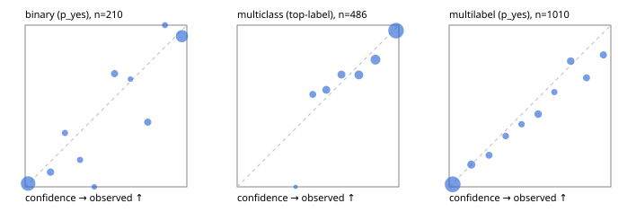

# Evaluation report

- model `Qwen/Qwen3-Reranker-4B` @ `22e683669b` (stock reranker pairs), adapter/checkpoint `runs/curve/boolq_1000/adapter`, prompt `answer-v1` (724795e9b666)
- data data/hf.jsonl, data/eval.jsonl; splits ['validation']; n=868; calibration `None`
- cuda / bfloat16; 2026-09-24T00:51:26+0000; wall 106.1s

## Overall

question accuracy 78.2%

**binary**: n 210, positives 79, accuracy 0.905, precision 0.839, recall 0.924, f1 0.880, auroc 0.959, brier 0.077, log_loss 0.259, ece 0.056

**multiclass**: n 486, accuracy 0.844, macro_f1 0.813, log_loss 0.446, brier 0.238, ece_top_label 0.038

**multilabel**: n 172, labels 1010, exact_match 0.459, micro_f1 0.707, macro_f1 0.624, label_auroc 0.918, brier 0.092, log_loss 0.295, ece 0.033

## By family

| family | n | question acc % | details |
|---|---|---|---|
| eval_adversarial | 14 | 85.7 | bin acc 85.7 F1 90.9 AUROC 0.900 ECE 0.079; mc acc 80.0 mF1 66.7 ECE 0.163; ml EM 100.0 µF1 100.0 ECE 0.054 |
| eval_agent_output | 20 | 75.0 | bin acc 91.7 F1 92.3 AUROC 0.917 ECE 0.182; mc acc 60.0 mF1 33.3 ECE 0.420; ml EM 33.3 µF1 0.0 ECE 0.316 |
| eval_evidence | 17 | 94.1 | bin acc 92.9 F1 90.9 AUROC 1.000 ECE 0.088; ml EM 100.0 µF1 100.0 ECE 0.064 |
| eval_multilabel | 12 | 41.7 | bin acc 0.0 F1 0.0 AUROC — ECE 0.915; mc acc 100.0 mF1 100.0 ECE 0.001; ml EM 33.3 µF1 84.6 ECE 0.125 |
| eval_policy | 24 | 50.0 | bin acc 58.3 F1 61.5 AUROC 0.600 ECE 0.376; mc acc 45.5 mF1 31.2 ECE 0.425; ml EM 0.0 µF1 80.0 ECE 0.416 |
| eval_routing | 16 | 100.0 | bin acc 100.0 F1 100.0 AUROC 1.000 ECE 0.121; mc acc 100.0 mF1 100.0 ECE 0.093; ml EM 100.0 µF1 0.0 ECE 0.078 |
| eval_urgency_sentiment | 15 | 86.7 | bin acc 100.0 F1 100.0 AUROC 1.000 ECE 0.089; mc acc 100.0 mF1 100.0 ECE 0.105; ml EM 33.3 µF1 50.0 ECE 0.163 |
| hf_emotions_multilabel | 150 | 45.3 | ml EM 45.3 µF1 68.6 ECE 0.028 |
| hf_intent_banking77 | 150 | 95.3 | mc acc 95.3 mF1 94.5 ECE 0.027 |
| hf_nli | 150 | 92.7 | bin acc 92.7 F1 88.9 AUROC 0.981 ECE 0.050 |
| hf_sentiment_tweets | 150 | 72.7 | mc acc 72.7 mF1 66.6 ECE 0.050 |
| hf_topic_agnews | 150 | 87.3 | mc acc 87.3 mF1 87.5 ECE 0.075 |

## by hard case

| slice | n | question acc % |
|---|---|---|
| (none) | 634 | 79.2 |
| contradiction | 63 | 93.7 |
| distractor | 20 | 80.0 |
| double_negation | 3 | 100.0 |
| evidence_end | 4 | 50.0 |
| evidence_middle | 7 | 100.0 |
| evidence_start | 3 | 100.0 |
| exception | 7 | 85.7 |
| hypothetical | 6 | 83.3 |
| injection | 16 | 81.2 |
| lexical_overlap | 13 | 84.6 |
| long_state | 26 | 76.9 |
| missing_evidence | 59 | 86.4 |
| multi_positive | 40 | 22.5 |
| multi_turn | 21 | 71.4 |
| negation | 9 | 66.7 |
| new_label_names | 5 | 60.0 |
| nota | 4 | 100.0 |
| numeric_reasoning | 13 | 76.9 |
| paraphrase | 10 | 50.0 |
| role_reversal | 7 | 42.9 |
| sarcasm | 5 | 60.0 |
| temporal_reasoning | 15 | 33.3 |
| zero_positive | 7 | 71.4 |

## by state tokens

| slice | n | question acc % |
|---|---|---|
| 00000-00127 | 796 | 78.3 |
| 00128-00511 | 46 | 78.3 |
| 00512-02047 | 26 | 76.9 |

## by candidates

| slice | n | question acc % |
|---|---|---|
| 01 | 210 | 90.5 |
| 03 | 162 | 71.6 |
| 04 | 174 | 86.2 |
| 05 | 13 | 69.2 |
| 06 | 159 | 44.7 |
| 08 | 150 | 95.3 |

## Paraphrase groups

5 groups; same prediction 60.0%; all correct 40.0%

## Multiclass abstention (coverage vs error on accepted)

| abstain_below | coverage % | error % |
|---|---|---|
| 0.0 | 100.0 | 15.6 |
| 0.4 | 99.8 | 15.5 |
| 0.5 | 95.5 | 14.2 |
| 0.6 | 88.3 | 12.1 |
| 0.7 | 80.9 | 10.4 |
| 0.8 | 70.2 | 7.3 |
| 0.9 | 54.7 | 3.4 |

## Reliability: binary

| bin | n | mean confidence | observed frequency |
|---|---|---|---|
| [0.0,0.1) | 97 | 0.018 | 0.021 |
| [0.1,0.2) | 11 | 0.157 | 0.091 |
| [0.2,0.3) | 6 | 0.246 | 0.333 |
| [0.3,0.4) | 6 | 0.340 | 0.167 |
| [0.4,0.5) | 3 | 0.428 | 0.000 |
| [0.5,0.6) | 10 | 0.553 | 0.700 |
| [0.6,0.7) | 3 | 0.651 | 0.667 |
| [0.7,0.8) | 10 | 0.759 | 0.400 |
| [0.8,0.9) | 5 | 0.865 | 1.000 |
| [0.9,1.0] | 59 | 0.969 | 0.932 |

## Reliability: multiclass

| bin | n | mean confidence | observed frequency |
|---|---|---|---|
| [0.3,0.4) | 1 | 0.361 | 0.000 |
| [0.4,0.5) | 21 | 0.468 | 0.571 |
| [0.5,0.6) | 35 | 0.551 | 0.600 |
| [0.6,0.7) | 36 | 0.645 | 0.694 |
| [0.7,0.8) | 52 | 0.753 | 0.692 |
| [0.8,0.9) | 75 | 0.856 | 0.787 |
| [0.9,1.0] | 266 | 0.983 | 0.966 |

## Reliability: multilabel

| bin | n | mean confidence | observed frequency |
|---|---|---|---|
| [0.0,0.1) | 574 | 0.022 | 0.016 |
| [0.1,0.2) | 80 | 0.137 | 0.138 |
| [0.2,0.3) | 46 | 0.247 | 0.196 |
| [0.3,0.4) | 35 | 0.350 | 0.314 |
| [0.4,0.5) | 31 | 0.448 | 0.387 |
| [0.5,0.6) | 60 | 0.551 | 0.450 |
| [0.6,0.7) | 29 | 0.651 | 0.586 |
| [0.7,0.8) | 63 | 0.751 | 0.778 |
| [0.8,0.9) | 43 | 0.849 | 0.674 |
| [0.9,1.0] | 49 | 0.954 | 0.816 |
