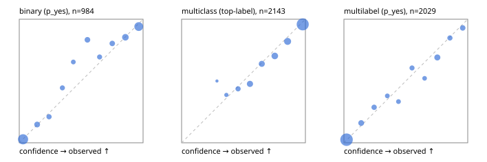

# Evaluation report

- model `Qwen/Qwen3-Reranker-4B` @ `22e683669b` (stock reranker pairs), adapter/checkpoint `runs/curve/boolq_300/adapter`, prompt `answer-v1` (724795e9b666)
- data data/hf.jsonl, data/eval.jsonl; splits ['test']; n=3471; calibration `None`
- cuda / bfloat16; 2026-09-24T00:56:29+0000; wall 414.1s

## Overall

question accuracy 80.9%

**binary**: n 984, positives 475, accuracy 0.880, precision 0.877, recall 0.874, f1 0.876, auroc 0.940, brier 0.094, log_loss 0.311, ece 0.037

**multiclass**: n 2143, accuracy 0.825, macro_f1 0.855, log_loss 0.503, brier 0.253, ece_top_label 0.029

**multilabel**: n 344, labels 2029, exact_match 0.509, micro_f1 0.737, macro_f1 0.714, label_auroc 0.930, brier 0.083, log_loss 0.271, ece 0.021

## By family

| family | n | question acc % | details |
|---|---|---|---|
| eval_adversarial | 27 | 81.5 | bin acc 86.7 F1 85.7 AUROC 0.944 ECE 0.137; mc acc 100.0 mF1 100.0 ECE 0.050; ml EM 40.0 µF1 80.0 ECE 0.162 |
| eval_agent_output | 26 | 57.7 | bin acc 71.4 F1 75.0 AUROC 0.827 ECE 0.249; mc acc 42.9 mF1 41.7 ECE 0.520; ml EM 40.0 µF1 82.4 ECE 0.178 |
| eval_evidence | 17 | 88.2 | bin acc 100.0 F1 100.0 AUROC 1.000 ECE 0.038; ml EM 0.0 µF1 57.1 ECE 0.262 |
| eval_multilabel | 32 | 71.9 | bin acc 100.0 F1 100.0 AUROC 1.000 ECE 0.085; mc acc 0.0 mF1 0.0 ECE 0.655; ml EM 66.7 µF1 91.6 ECE 0.052 |
| eval_policy | 22 | 40.9 | bin acc 53.8 F1 62.5 AUROC 0.631 ECE 0.345; mc acc 20.0 mF1 12.5 ECE 0.485; ml EM 25.0 µF1 76.2 ECE 0.279 |
| eval_routing | 25 | 92.0 | bin acc 100.0 F1 100.0 AUROC 1.000 ECE 0.059; mc acc 92.3 mF1 87.9 ECE 0.148; ml EM 50.0 µF1 80.0 ECE 0.119 |
| eval_urgency_sentiment | 22 | 72.7 | bin acc 70.0 F1 72.7 AUROC 0.875 ECE 0.241; mc acc 70.0 mF1 58.3 ECE 0.213; ml EM 100.0 µF1 100.0 ECE 0.151 |
| heldout_boolq | 300 | 83.3 | bin acc 83.3 F1 87.0 AUROC 0.902 ECE 0.081 |
| heldout_emotion_multiclass | 300 | 58.7 | mc acc 58.7 mF1 50.9 ECE 0.149 |
| heldout_intent_clinc | 300 | 89.7 | mc acc 89.7 mF1 90.1 ECE 0.050 |
| heldout_question_type_trec | 300 | 82.0 | mc acc 82.0 mF1 81.3 ECE 0.046 |
| heldout_sentiment_sst2 | 300 | 89.7 | bin acc 89.7 F1 88.6 AUROC 0.989 ECE 0.155 |
| heldout_topic_dbpedia | 300 | 96.0 | mc acc 96.0 mF1 95.5 ECE 0.017 |
| hf_emotions_multilabel | 300 | 50.3 | ml EM 50.3 µF1 70.2 ECE 0.023 |
| hf_intent_banking77 | 300 | 95.3 | mc acc 95.3 mF1 93.9 ECE 0.026 |
| hf_nli | 300 | 92.7 | bin acc 92.7 F1 89.6 AUROC 0.970 ECE 0.038 |
| hf_sentiment_tweets | 300 | 69.7 | mc acc 69.7 mF1 69.9 ECE 0.052 |
| hf_topic_agnews | 300 | 88.0 | mc acc 88.0 mF1 88.1 ECE 0.053 |

## by hard case

| slice | n | question acc % |
|---|---|---|
| (none) | 3042 | 81.2 |
| contradiction | 107 | 99.1 |
| distractor | 33 | 63.6 |
| double_negation | 6 | 66.7 |
| evidence_end | 13 | 76.9 |
| evidence_middle | 11 | 63.6 |
| evidence_start | 9 | 66.7 |
| exception | 7 | 28.6 |
| hypothetical | 7 | 71.4 |
| injection | 10 | 70.0 |
| lexical_overlap | 20 | 70.0 |
| long_state | 50 | 68.0 |
| missing_evidence | 104 | 92.3 |
| multi_positive | 81 | 35.8 |
| multi_turn | 9 | 77.8 |
| negation | 30 | 80.0 |
| new_label_names | 3 | 33.3 |
| nota | 46 | 97.8 |
| numeric_reasoning | 16 | 62.5 |
| paraphrase | 22 | 68.2 |
| role_reversal | 15 | 46.7 |
| sarcasm | 12 | 66.7 |
| temporal_reasoning | 29 | 44.8 |
| zero_positive | 6 | 33.3 |

## by state tokens

| slice | n | question acc % |
|---|---|---|
| 00000-00127 | 3211 | 81.2 |
| 00128-00511 | 208 | 80.3 |
| 00512-02047 | 52 | 67.3 |

## by candidates

| slice | n | question acc % |
|---|---|---|
| 01 | 984 | 88.0 |
| 03 | 310 | 70.3 |
| 04 | 333 | 86.2 |
| 05 | 22 | 36.4 |
| 06 | 1218 | 71.8 |
| 07 | 49 | 91.8 |
| 08 | 555 | 92.1 |

## Paraphrase groups

11 groups; same prediction 63.6%; all correct 54.5%

## Multiclass abstention (coverage vs error on accepted)

| abstain_below | coverage % | error % |
|---|---|---|
| 0.0 | 100.0 | 17.5 |
| 0.4 | 98.5 | 16.8 |
| 0.5 | 94.4 | 15.1 |
| 0.6 | 86.5 | 11.7 |
| 0.7 | 79.2 | 9.5 |
| 0.8 | 69.3 | 6.6 |
| 0.9 | 57.1 | 4.2 |

## Reliability: binary

| bin | n | mean confidence | observed frequency |
|---|---|---|---|
| [0.0,0.1) | 350 | 0.031 | 0.029 |
| [0.1,0.2) | 61 | 0.145 | 0.148 |
| [0.2,0.3) | 38 | 0.241 | 0.211 |
| [0.3,0.4) | 36 | 0.348 | 0.444 |
| [0.4,0.5) | 26 | 0.437 | 0.654 |
| [0.5,0.6) | 54 | 0.551 | 0.833 |
| [0.6,0.7) | 36 | 0.649 | 0.694 |
| [0.7,0.8) | 51 | 0.751 | 0.804 |
| [0.8,0.9) | 96 | 0.857 | 0.854 |
| [0.9,1.0] | 236 | 0.965 | 0.941 |

## Reliability: multiclass

| bin | n | mean confidence | observed frequency |
|---|---|---|---|
| [0.2,0.3) | 2 | 0.286 | 0.500 |
| [0.3,0.4) | 31 | 0.361 | 0.387 |
| [0.4,0.5) | 87 | 0.456 | 0.437 |
| [0.5,0.6) | 170 | 0.552 | 0.476 |
| [0.6,0.7) | 155 | 0.648 | 0.639 |
| [0.7,0.8) | 212 | 0.753 | 0.703 |
| [0.8,0.9) | 262 | 0.856 | 0.821 |
| [0.9,1.0] | 1224 | 0.978 | 0.958 |

## Reliability: multilabel

| bin | n | mean confidence | observed frequency |
|---|---|---|---|
| [0.0,0.1) | 1268 | 0.021 | 0.025 |
| [0.1,0.2) | 125 | 0.140 | 0.160 |
| [0.2,0.3) | 87 | 0.244 | 0.287 |
| [0.3,0.4) | 58 | 0.351 | 0.379 |
| [0.4,0.5) | 57 | 0.441 | 0.333 |
| [0.5,0.6) | 71 | 0.550 | 0.606 |
| [0.6,0.7) | 46 | 0.652 | 0.522 |
| [0.7,0.8) | 139 | 0.754 | 0.691 |
| [0.8,0.9) | 79 | 0.856 | 0.848 |
| [0.9,1.0] | 99 | 0.960 | 0.929 |
