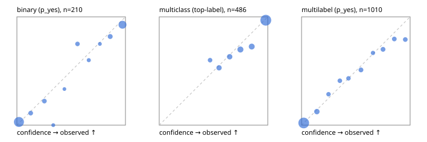

# Evaluation report

- model `Qwen/Qwen3-Reranker-4B` @ `22e683669b` (stock reranker pairs), adapter/checkpoint `runs/curve/boolq_300/adapter`, prompt `answer-v1` (724795e9b666)
- data data/hf.jsonl, data/eval.jsonl; splits ['validation']; n=868; calibration `None`
- cuda / bfloat16; 2026-09-24T00:49:27+0000; wall 105.9s

## Overall

question accuracy 78.2%

**binary**: n 210, positives 79, accuracy 0.914, precision 0.867, recall 0.911, f1 0.889, auroc 0.960, brier 0.074, log_loss 0.251, ece 0.038

**multiclass**: n 486, accuracy 0.842, macro_f1 0.780, log_loss 0.441, brier 0.234, ece_top_label 0.034

**multilabel**: n 172, labels 1010, exact_match 0.453, micro_f1 0.694, macro_f1 0.617, label_auroc 0.920, brier 0.090, log_loss 0.291, ece 0.019

## By family

| family | n | question acc % | details |
|---|---|---|---|
| eval_adversarial | 14 | 78.6 | bin acc 71.4 F1 80.0 AUROC 0.900 ECE 0.234; mc acc 80.0 mF1 66.7 ECE 0.187; ml EM 100.0 µF1 100.0 ECE 0.016 |
| eval_agent_output | 20 | 75.0 | bin acc 91.7 F1 92.3 AUROC 0.917 ECE 0.129; mc acc 60.0 mF1 33.3 ECE 0.246; ml EM 33.3 µF1 0.0 ECE 0.229 |
| eval_evidence | 17 | 94.1 | bin acc 92.9 F1 90.9 AUROC 1.000 ECE 0.087; ml EM 100.0 µF1 100.0 ECE 0.049 |
| eval_multilabel | 12 | 33.3 | bin acc 0.0 F1 0.0 AUROC — ECE 0.881; mc acc 100.0 mF1 100.0 ECE 0.001; ml EM 22.2 µF1 80.8 ECE 0.128 |
| eval_policy | 24 | 50.0 | bin acc 66.7 F1 71.4 AUROC 0.586 ECE 0.446; mc acc 36.4 mF1 23.5 ECE 0.435; ml EM 0.0 µF1 80.0 ECE 0.339 |
| eval_routing | 16 | 93.8 | bin acc 100.0 F1 100.0 AUROC 1.000 ECE 0.112; mc acc 87.5 mF1 77.8 ECE 0.124; ml EM 100.0 µF1 0.0 ECE 0.104 |
| eval_urgency_sentiment | 15 | 80.0 | bin acc 100.0 F1 100.0 AUROC 1.000 ECE 0.082; mc acc 80.0 mF1 66.7 ECE 0.139; ml EM 33.3 µF1 50.0 ECE 0.161 |
| hf_emotions_multilabel | 150 | 45.3 | ml EM 45.3 µF1 67.2 ECE 0.016 |
| hf_intent_banking77 | 150 | 96.0 | mc acc 96.0 mF1 95.3 ECE 0.026 |
| hf_nli | 150 | 94.0 | bin acc 94.0 F1 90.5 AUROC 0.979 ECE 0.033 |
| hf_sentiment_tweets | 150 | 72.7 | mc acc 72.7 mF1 66.5 ECE 0.060 |
| hf_topic_agnews | 150 | 88.0 | mc acc 88.0 mF1 88.1 ECE 0.064 |

## by hard case

| slice | n | question acc % |
|---|---|---|
| (none) | 634 | 79.5 |
| contradiction | 63 | 92.1 |
| distractor | 20 | 75.0 |
| double_negation | 3 | 100.0 |
| evidence_end | 4 | 50.0 |
| evidence_middle | 7 | 85.7 |
| evidence_start | 3 | 100.0 |
| exception | 7 | 71.4 |
| hypothetical | 6 | 83.3 |
| injection | 16 | 81.2 |
| lexical_overlap | 13 | 76.9 |
| long_state | 26 | 73.1 |
| missing_evidence | 59 | 91.5 |
| multi_positive | 40 | 17.5 |
| multi_turn | 21 | 71.4 |
| negation | 9 | 66.7 |
| new_label_names | 5 | 40.0 |
| nota | 4 | 75.0 |
| numeric_reasoning | 13 | 69.2 |
| paraphrase | 10 | 40.0 |
| role_reversal | 7 | 42.9 |
| sarcasm | 5 | 40.0 |
| temporal_reasoning | 15 | 40.0 |
| zero_positive | 7 | 71.4 |

## by state tokens

| slice | n | question acc % |
|---|---|---|
| 00000-00127 | 796 | 78.4 |
| 00128-00511 | 46 | 78.3 |
| 00512-02047 | 26 | 73.1 |

## by candidates

| slice | n | question acc % |
|---|---|---|
| 01 | 210 | 91.4 |
| 03 | 162 | 70.4 |
| 04 | 174 | 86.2 |
| 05 | 13 | 69.2 |
| 06 | 159 | 44.0 |
| 08 | 150 | 96.0 |

## Paraphrase groups

5 groups; same prediction 60.0%; all correct 40.0%

## Multiclass abstention (coverage vs error on accepted)

| abstain_below | coverage % | error % |
|---|---|---|
| 0.0 | 100.0 | 15.8 |
| 0.4 | 100.0 | 15.8 |
| 0.5 | 95.9 | 14.8 |
| 0.6 | 88.9 | 12.3 |
| 0.7 | 81.1 | 9.9 |
| 0.8 | 70.2 | 6.7 |
| 0.9 | 59.7 | 3.1 |

## Reliability: binary

| bin | n | mean confidence | observed frequency |
|---|---|---|---|
| [0.0,0.1) | 102 | 0.019 | 0.029 |
| [0.1,0.2) | 9 | 0.127 | 0.111 |
| [0.2,0.3) | 9 | 0.253 | 0.222 |
| [0.3,0.4) | 4 | 0.335 | 0.000 |
| [0.4,0.5) | 3 | 0.438 | 0.333 |
| [0.5,0.6) | 8 | 0.558 | 0.750 |
| [0.6,0.7) | 5 | 0.662 | 0.600 |
| [0.7,0.8) | 4 | 0.765 | 0.750 |
| [0.8,0.9) | 11 | 0.859 | 0.818 |
| [0.9,1.0] | 55 | 0.973 | 0.927 |

## Reliability: multiclass

| bin | n | mean confidence | observed frequency |
|---|---|---|---|
| [0.4,0.5) | 20 | 0.468 | 0.600 |
| [0.5,0.6) | 34 | 0.551 | 0.529 |
| [0.6,0.7) | 38 | 0.649 | 0.632 |
| [0.7,0.8) | 53 | 0.748 | 0.698 |
| [0.8,0.9) | 51 | 0.852 | 0.725 |
| [0.9,1.0] | 290 | 0.981 | 0.969 |

## Reliability: multilabel

| bin | n | mean confidence | observed frequency |
|---|---|---|---|
| [0.0,0.1) | 601 | 0.020 | 0.020 |
| [0.1,0.2) | 80 | 0.141 | 0.125 |
| [0.2,0.3) | 35 | 0.248 | 0.286 |
| [0.3,0.4) | 39 | 0.353 | 0.410 |
| [0.4,0.5) | 37 | 0.432 | 0.432 |
| [0.5,0.6) | 51 | 0.547 | 0.510 |
| [0.6,0.7) | 30 | 0.658 | 0.667 |
| [0.7,0.8) | 50 | 0.750 | 0.700 |
| [0.8,0.9) | 44 | 0.854 | 0.795 |
| [0.9,1.0] | 43 | 0.956 | 0.791 |
