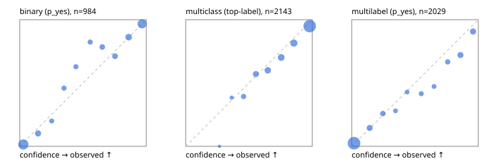

# Evaluation report

- model `Qwen/Qwen3-Reranker-4B` @ `22e683669b` (stock reranker pairs), adapter/checkpoint `runs/curve/boolq_3000/adapter`, prompt `answer-v1` (724795e9b666)
- data data/hf.jsonl, data/eval.jsonl; splits ['test']; n=3471; calibration `None`
- cuda / bfloat16; 2026-09-24T01:04:13+0000; wall 414.0s

## Overall

question accuracy 80.9%

**binary**: n 984, positives 475, accuracy 0.889, precision 0.889, recall 0.880, f1 0.885, auroc 0.954, brier 0.082, log_loss 0.274, ece 0.039

**multiclass**: n 2143, accuracy 0.825, macro_f1 0.859, log_loss 0.524, brier 0.259, ece_top_label 0.035

**multilabel**: n 344, labels 2029, exact_match 0.477, micro_f1 0.725, macro_f1 0.712, label_auroc 0.929, brier 0.088, log_loss 0.283, ece 0.032

## By family

| family | n | question acc % | details |
|---|---|---|---|
| eval_adversarial | 27 | 81.5 | bin acc 86.7 F1 85.7 AUROC 0.944 ECE 0.171; mc acc 100.0 mF1 100.0 ECE 0.056; ml EM 40.0 µF1 76.2 ECE 0.173 |
| eval_agent_output | 26 | 50.0 | bin acc 71.4 F1 71.4 AUROC 0.827 ECE 0.200; mc acc 14.3 mF1 6.2 ECE 0.585; ml EM 40.0 µF1 77.8 ECE 0.167 |
| eval_evidence | 17 | 94.1 | bin acc 100.0 F1 100.0 AUROC 1.000 ECE 0.057; ml EM 50.0 µF1 66.7 ECE 0.279 |
| eval_multilabel | 32 | 78.1 | bin acc 100.0 F1 100.0 AUROC 1.000 ECE 0.073; mc acc 100.0 mF1 100.0 ECE 0.493; ml EM 70.8 µF1 91.7 ECE 0.077 |
| eval_policy | 22 | 50.0 | bin acc 61.5 F1 66.7 AUROC 0.714 ECE 0.369; mc acc 40.0 mF1 25.0 ECE 0.266; ml EM 25.0 µF1 84.2 ECE 0.220 |
| eval_routing | 25 | 84.0 | bin acc 90.0 F1 88.9 AUROC 1.000 ECE 0.096; mc acc 84.6 mF1 75.0 ECE 0.118; ml EM 50.0 µF1 80.0 ECE 0.125 |
| eval_urgency_sentiment | 22 | 77.3 | bin acc 80.0 F1 83.3 AUROC 0.917 ECE 0.216; mc acc 80.0 mF1 81.0 ECE 0.210; ml EM 50.0 µF1 83.3 ECE 0.183 |
| heldout_boolq | 300 | 86.7 | bin acc 86.7 F1 89.6 AUROC 0.949 ECE 0.072 |
| heldout_emotion_multiclass | 300 | 58.7 | mc acc 58.7 mF1 48.2 ECE 0.163 |
| heldout_intent_clinc | 300 | 90.0 | mc acc 90.0 mF1 90.3 ECE 0.054 |
| heldout_question_type_trec | 300 | 82.7 | mc acc 82.7 mF1 82.8 ECE 0.021 |
| heldout_sentiment_sst2 | 300 | 89.0 | bin acc 89.0 F1 87.9 AUROC 0.987 ECE 0.148 |
| heldout_topic_dbpedia | 300 | 96.0 | mc acc 96.0 mF1 95.5 ECE 0.016 |
| hf_emotions_multilabel | 300 | 46.3 | ml EM 46.3 µF1 68.9 ECE 0.032 |
| hf_intent_banking77 | 300 | 96.0 | mc acc 96.0 mF1 94.7 ECE 0.013 |
| hf_nli | 300 | 92.7 | bin acc 92.7 F1 89.4 AUROC 0.976 ECE 0.034 |
| hf_sentiment_tweets | 300 | 68.3 | mc acc 68.3 mF1 67.8 ECE 0.057 |
| hf_topic_agnews | 300 | 88.0 | mc acc 88.0 mF1 88.1 ECE 0.049 |

## by hard case

| slice | n | question acc % |
|---|---|---|
| (none) | 3042 | 80.9 |
| contradiction | 107 | 99.1 |
| distractor | 33 | 66.7 |
| double_negation | 6 | 66.7 |
| evidence_end | 13 | 92.3 |
| evidence_middle | 11 | 63.6 |
| evidence_start | 9 | 88.9 |
| exception | 7 | 14.3 |
| hypothetical | 7 | 71.4 |
| injection | 10 | 70.0 |
| lexical_overlap | 20 | 75.0 |
| long_state | 50 | 70.0 |
| missing_evidence | 104 | 93.3 |
| multi_positive | 81 | 40.7 |
| multi_turn | 9 | 88.9 |
| negation | 30 | 86.7 |
| new_label_names | 3 | 33.3 |
| nota | 46 | 97.8 |
| numeric_reasoning | 16 | 56.2 |
| paraphrase | 22 | 63.6 |
| role_reversal | 15 | 60.0 |
| sarcasm | 12 | 58.3 |
| temporal_reasoning | 29 | 44.8 |
| zero_positive | 6 | 33.3 |

## by state tokens

| slice | n | question acc % |
|---|---|---|
| 00000-00127 | 3211 | 81.0 |
| 00128-00511 | 208 | 83.2 |
| 00512-02047 | 52 | 67.3 |

## by candidates

| slice | n | question acc % |
|---|---|---|
| 01 | 984 | 88.9 |
| 03 | 310 | 69.0 |
| 04 | 333 | 85.6 |
| 05 | 22 | 45.5 |
| 06 | 1218 | 70.9 |
| 07 | 49 | 95.9 |
| 08 | 555 | 92.4 |

## Paraphrase groups

11 groups; same prediction 63.6%; all correct 54.5%

## Multiclass abstention (coverage vs error on accepted)

| abstain_below | coverage % | error % |
|---|---|---|
| 0.0 | 100.0 | 17.5 |
| 0.4 | 98.6 | 16.8 |
| 0.5 | 94.5 | 14.9 |
| 0.6 | 87.9 | 12.7 |
| 0.7 | 79.7 | 10.0 |
| 0.8 | 70.3 | 7.3 |
| 0.9 | 58.4 | 5.0 |

## Reliability: binary

| bin | n | mean confidence | observed frequency |
|---|---|---|---|
| [0.0,0.1) | 343 | 0.029 | 0.015 |
| [0.1,0.2) | 69 | 0.145 | 0.101 |
| [0.2,0.3) | 30 | 0.253 | 0.200 |
| [0.3,0.4) | 37 | 0.350 | 0.459 |
| [0.4,0.5) | 35 | 0.444 | 0.629 |
| [0.5,0.6) | 34 | 0.557 | 0.824 |
| [0.6,0.7) | 51 | 0.652 | 0.784 |
| [0.7,0.8) | 52 | 0.753 | 0.712 |
| [0.8,0.9) | 87 | 0.861 | 0.862 |
| [0.9,1.0] | 246 | 0.967 | 0.967 |

## Reliability: multiclass

| bin | n | mean confidence | observed frequency |
|---|---|---|---|
| [0.2,0.3) | 3 | 0.266 | 0.000 |
| [0.3,0.4) | 26 | 0.363 | 0.385 |
| [0.4,0.5) | 89 | 0.457 | 0.393 |
| [0.5,0.6) | 142 | 0.555 | 0.570 |
| [0.6,0.7) | 175 | 0.648 | 0.600 |
| [0.7,0.8) | 201 | 0.755 | 0.701 |
| [0.8,0.9) | 255 | 0.854 | 0.816 |
| [0.9,1.0] | 1252 | 0.979 | 0.950 |

## Reliability: multilabel

| bin | n | mean confidence | observed frequency |
|---|---|---|---|
| [0.0,0.1) | 1231 | 0.018 | 0.024 |
| [0.1,0.2) | 131 | 0.142 | 0.145 |
| [0.2,0.3) | 89 | 0.246 | 0.258 |
| [0.3,0.4) | 50 | 0.346 | 0.280 |
| [0.4,0.5) | 49 | 0.438 | 0.429 |
| [0.5,0.6) | 65 | 0.550 | 0.415 |
| [0.6,0.7) | 55 | 0.650 | 0.473 |
| [0.7,0.8) | 84 | 0.758 | 0.667 |
| [0.8,0.9) | 136 | 0.859 | 0.721 |
| [0.9,1.0] | 139 | 0.959 | 0.906 |
