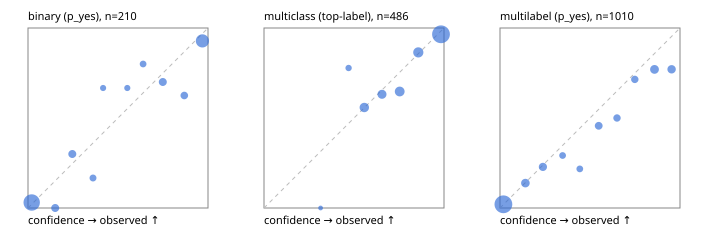

# Evaluation report

- model `Qwen/Qwen3-Reranker-4B` @ `22e683669b` (stock reranker pairs), adapter/checkpoint `runs/curve/boolq_3000/adapter`, prompt `answer-v1` (724795e9b666)
- data data/hf.jsonl, data/eval.jsonl; splits ['validation']; n=868; calibration `None`
- cuda / bfloat16; 2026-09-24T00:57:11+0000; wall 105.8s

## Overall

question accuracy 79.0%

**binary**: n 210, positives 79, accuracy 0.900, precision 0.854, recall 0.886, f1 0.870, auroc 0.959, brier 0.078, log_loss 0.260, ece 0.051

**multiclass**: n 486, accuracy 0.852, macro_f1 0.797, log_loss 0.428, brier 0.223, ece_top_label 0.031

**multilabel**: n 172, labels 1010, exact_match 0.483, micro_f1 0.721, macro_f1 0.597, label_auroc 0.919, brier 0.093, log_loss 0.302, ece 0.036

## By family

| family | n | question acc % | details |
|---|---|---|---|
| eval_adversarial | 14 | 85.7 | bin acc 85.7 F1 90.9 AUROC 0.950 ECE 0.103; mc acc 80.0 mF1 66.7 ECE 0.116; ml EM 100.0 µF1 100.0 ECE 0.024 |
| eval_agent_output | 20 | 75.0 | bin acc 91.7 F1 92.3 AUROC 0.917 ECE 0.199; mc acc 60.0 mF1 33.3 ECE 0.233; ml EM 33.3 µF1 0.0 ECE 0.273 |
| eval_evidence | 17 | 94.1 | bin acc 92.9 F1 90.9 AUROC 1.000 ECE 0.113; ml EM 100.0 µF1 100.0 ECE 0.036 |
| eval_multilabel | 12 | 33.3 | bin acc 0.0 F1 0.0 AUROC — ECE 0.936; mc acc 100.0 mF1 100.0 ECE 0.003; ml EM 22.2 µF1 80.8 ECE 0.155 |
| eval_policy | 24 | 41.7 | bin acc 41.7 F1 46.2 AUROC 0.514 ECE 0.497; mc acc 45.5 mF1 29.4 ECE 0.356; ml EM 0.0 µF1 80.0 ECE 0.320 |
| eval_routing | 16 | 93.8 | bin acc 100.0 F1 100.0 AUROC 1.000 ECE 0.121; mc acc 100.0 mF1 100.0 ECE 0.111; ml EM 0.0 µF1 0.0 ECE 0.331 |
| eval_urgency_sentiment | 15 | 80.0 | bin acc 100.0 F1 100.0 AUROC 1.000 ECE 0.106; mc acc 80.0 mF1 66.7 ECE 0.124; ml EM 33.3 µF1 40.0 ECE 0.210 |
| hf_emotions_multilabel | 150 | 49.3 | ml EM 49.3 µF1 71.4 ECE 0.027 |
| hf_intent_banking77 | 150 | 96.7 | mc acc 96.7 mF1 95.7 ECE 0.022 |
| hf_nli | 150 | 93.3 | bin acc 93.3 F1 89.4 AUROC 0.983 ECE 0.045 |
| hf_sentiment_tweets | 150 | 74.7 | mc acc 74.7 mF1 69.6 ECE 0.066 |
| hf_topic_agnews | 150 | 87.3 | mc acc 87.3 mF1 87.5 ECE 0.067 |

## by hard case

| slice | n | question acc % |
|---|---|---|
| (none) | 634 | 80.4 |
| contradiction | 63 | 93.7 |
| distractor | 20 | 70.0 |
| double_negation | 3 | 100.0 |
| evidence_end | 4 | 50.0 |
| evidence_middle | 7 | 85.7 |
| evidence_start | 3 | 100.0 |
| exception | 7 | 85.7 |
| hypothetical | 6 | 83.3 |
| injection | 16 | 81.2 |
| lexical_overlap | 13 | 84.6 |
| long_state | 26 | 69.2 |
| missing_evidence | 59 | 91.5 |
| multi_positive | 40 | 22.5 |
| multi_turn | 21 | 71.4 |
| negation | 9 | 55.6 |
| new_label_names | 5 | 40.0 |
| nota | 4 | 100.0 |
| numeric_reasoning | 13 | 53.8 |
| paraphrase | 10 | 40.0 |
| role_reversal | 7 | 42.9 |
| sarcasm | 5 | 60.0 |
| temporal_reasoning | 15 | 33.3 |
| zero_positive | 7 | 57.1 |

## by state tokens

| slice | n | question acc % |
|---|---|---|
| 00000-00127 | 796 | 79.9 |
| 00128-00511 | 46 | 69.6 |
| 00512-02047 | 26 | 69.2 |

## by candidates

| slice | n | question acc % |
|---|---|---|
| 01 | 210 | 90.0 |
| 03 | 162 | 74.1 |
| 04 | 174 | 84.5 |
| 05 | 13 | 69.2 |
| 06 | 159 | 47.8 |
| 08 | 150 | 96.7 |

## Paraphrase groups

5 groups; same prediction 60.0%; all correct 40.0%

## Multiclass abstention (coverage vs error on accepted)

| abstain_below | coverage % | error % |
|---|---|---|
| 0.0 | 100.0 | 14.8 |
| 0.4 | 99.8 | 14.6 |
| 0.5 | 97.9 | 14.5 |
| 0.6 | 89.1 | 11.5 |
| 0.7 | 81.3 | 9.1 |
| 0.8 | 70.8 | 5.2 |
| 0.9 | 58.6 | 3.5 |

## Reliability: binary

| bin | n | mean confidence | observed frequency |
|---|---|---|---|
| [0.0,0.1) | 99 | 0.021 | 0.030 |
| [0.1,0.2) | 10 | 0.151 | 0.000 |
| [0.2,0.3) | 10 | 0.246 | 0.300 |
| [0.3,0.4) | 6 | 0.361 | 0.167 |
| [0.4,0.5) | 3 | 0.417 | 0.667 |
| [0.5,0.6) | 3 | 0.552 | 0.667 |
| [0.6,0.7) | 5 | 0.640 | 0.800 |
| [0.7,0.8) | 10 | 0.749 | 0.700 |
| [0.8,0.9) | 8 | 0.869 | 0.625 |
| [0.9,1.0] | 56 | 0.969 | 0.929 |

## Reliability: multiclass

| bin | n | mean confidence | observed frequency |
|---|---|---|---|
| [0.3,0.4) | 1 | 0.315 | 0.000 |
| [0.4,0.5) | 9 | 0.470 | 0.778 |
| [0.5,0.6) | 43 | 0.557 | 0.558 |
| [0.6,0.7) | 38 | 0.655 | 0.632 |
| [0.7,0.8) | 51 | 0.754 | 0.647 |
| [0.8,0.9) | 59 | 0.857 | 0.864 |
| [0.9,1.0] | 285 | 0.983 | 0.965 |

## Reliability: multilabel

| bin | n | mean confidence | observed frequency |
|---|---|---|---|
| [0.0,0.1) | 589 | 0.019 | 0.020 |
| [0.1,0.2) | 65 | 0.141 | 0.138 |
| [0.2,0.3) | 57 | 0.238 | 0.228 |
| [0.3,0.4) | 24 | 0.348 | 0.292 |
| [0.4,0.5) | 23 | 0.443 | 0.217 |
| [0.5,0.6) | 46 | 0.549 | 0.457 |
| [0.6,0.7) | 36 | 0.650 | 0.500 |
| [0.7,0.8) | 35 | 0.749 | 0.714 |
| [0.8,0.9) | 74 | 0.858 | 0.770 |
| [0.9,1.0] | 61 | 0.953 | 0.770 |
