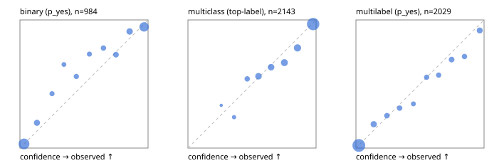

# Evaluation report

- model `Qwen/Qwen3-4B-Instruct-2507` @ `cdbee75f17` (stock reranker pairs), adapter/checkpoint `runs/curve/instruct_lora/adapter`, prompt `answer-v1` (724795e9b666)
- data data/hf.jsonl, data/eval.jsonl; splits ['test']; n=3471; calibration `None`
- cuda / bfloat16; 2026-09-24T01:09:26+0000; wall 413.7s

## Overall

question accuracy 80.6%

**binary**: n 984, positives 475, accuracy 0.874, precision 0.887, recall 0.846, f1 0.866, auroc 0.944, brier 0.092, log_loss 0.308, ece 0.044

**multiclass**: n 2143, accuracy 0.826, macro_f1 0.899, log_loss 0.511, brier 0.258, ece_top_label 0.030

**multilabel**: n 344, labels 2029, exact_match 0.483, micro_f1 0.723, macro_f1 0.723, label_auroc 0.927, brier 0.088, log_loss 0.280, ece 0.023

## By family

| family | n | question acc % | details |
|---|---|---|---|
| eval_adversarial | 27 | 85.2 | bin acc 93.3 F1 92.3 AUROC 1.000 ECE 0.081; mc acc 100.0 mF1 100.0 ECE 0.064; ml EM 40.0 µF1 85.7 ECE 0.114 |
| eval_agent_output | 26 | 42.3 | bin acc 64.3 F1 70.6 AUROC 0.796 ECE 0.262; mc acc 14.3 mF1 6.2 ECE 0.643; ml EM 20.0 µF1 75.0 ECE 0.161 |
| eval_evidence | 17 | 88.2 | bin acc 100.0 F1 100.0 AUROC 1.000 ECE 0.032; ml EM 0.0 µF1 57.1 ECE 0.255 |
| eval_multilabel | 32 | 84.4 | bin acc 100.0 F1 100.0 AUROC 1.000 ECE 0.055; mc acc 100.0 mF1 100.0 ECE 0.339; ml EM 79.2 µF1 94.3 ECE 0.044 |
| eval_policy | 22 | 50.0 | bin acc 53.8 F1 62.5 AUROC 0.619 ECE 0.425; mc acc 60.0 mF1 42.9 ECE 0.413; ml EM 25.0 µF1 80.0 ECE 0.264 |
| eval_routing | 25 | 92.0 | bin acc 90.0 F1 88.9 AUROC 1.000 ECE 0.092; mc acc 100.0 mF1 100.0 ECE 0.165; ml EM 50.0 µF1 80.0 ECE 0.149 |
| eval_urgency_sentiment | 22 | 86.4 | bin acc 90.0 F1 92.3 AUROC 1.000 ECE 0.119; mc acc 80.0 mF1 81.0 ECE 0.185; ml EM 100.0 µF1 100.0 ECE 0.084 |
| heldout_boolq | 300 | 84.0 | bin acc 84.0 F1 86.5 AUROC 0.922 ECE 0.070 |
| heldout_emotion_multiclass | 300 | 55.0 | mc acc 55.0 mF1 45.5 ECE 0.174 |
| heldout_intent_clinc | 300 | 94.7 | mc acc 94.7 mF1 95.5 ECE 0.036 |
| heldout_question_type_trec | 300 | 80.3 | mc acc 80.3 mF1 80.5 ECE 0.059 |
| heldout_sentiment_sst2 | 300 | 87.7 | bin acc 87.7 F1 86.1 AUROC 0.985 ECE 0.153 |
| heldout_topic_dbpedia | 300 | 95.7 | mc acc 95.7 mF1 95.5 ECE 0.012 |
| hf_emotions_multilabel | 300 | 46.7 | ml EM 46.7 µF1 68.0 ECE 0.018 |
| hf_intent_banking77 | 300 | 95.7 | mc acc 95.7 mF1 94.5 ECE 0.024 |
| hf_nli | 300 | 91.7 | bin acc 91.7 F1 88.7 AUROC 0.964 ECE 0.039 |
| hf_sentiment_tweets | 300 | 68.7 | mc acc 68.7 mF1 69.7 ECE 0.075 |
| hf_topic_agnews | 300 | 89.0 | mc acc 89.0 mF1 89.0 ECE 0.038 |

## by hard case

| slice | n | question acc % |
|---|---|---|
| (none) | 3042 | 80.7 |
| contradiction | 107 | 98.1 |
| distractor | 33 | 69.7 |
| double_negation | 6 | 66.7 |
| evidence_end | 13 | 92.3 |
| evidence_middle | 11 | 90.9 |
| evidence_start | 9 | 88.9 |
| exception | 7 | 42.9 |
| hypothetical | 7 | 71.4 |
| injection | 10 | 70.0 |
| lexical_overlap | 20 | 70.0 |
| long_state | 50 | 80.0 |
| missing_evidence | 104 | 87.5 |
| multi_positive | 81 | 40.7 |
| multi_turn | 9 | 88.9 |
| negation | 30 | 86.7 |
| new_label_names | 3 | 33.3 |
| nota | 46 | 97.8 |
| numeric_reasoning | 16 | 68.8 |
| paraphrase | 22 | 72.7 |
| role_reversal | 15 | 66.7 |
| sarcasm | 12 | 66.7 |
| temporal_reasoning | 29 | 55.2 |
| zero_positive | 6 | 33.3 |

## by state tokens

| slice | n | question acc % |
|---|---|---|
| 00000-00127 | 3211 | 80.6 |
| 00128-00511 | 208 | 79.3 |
| 00512-02047 | 52 | 80.8 |

## by candidates

| slice | n | question acc % |
|---|---|---|
| 01 | 984 | 87.4 |
| 03 | 310 | 69.4 |
| 04 | 333 | 86.5 |
| 05 | 22 | 50.0 |
| 06 | 1218 | 69.5 |
| 07 | 49 | 100.0 |
| 08 | 555 | 94.8 |

## Paraphrase groups

11 groups; same prediction 63.6%; all correct 63.6%

## Multiclass abstention (coverage vs error on accepted)

| abstain_below | coverage % | error % |
|---|---|---|
| 0.0 | 100.0 | 17.4 |
| 0.4 | 98.5 | 16.5 |
| 0.5 | 94.4 | 15.3 |
| 0.6 | 86.4 | 12.6 |
| 0.7 | 78.0 | 10.0 |
| 0.8 | 67.8 | 6.5 |
| 0.9 | 56.0 | 3.2 |

## Reliability: binary

| bin | n | mean confidence | observed frequency |
|---|---|---|---|
| [0.0,0.1) | 375 | 0.032 | 0.032 |
| [0.1,0.2) | 66 | 0.133 | 0.197 |
| [0.2,0.3) | 33 | 0.250 | 0.424 |
| [0.3,0.4) | 23 | 0.343 | 0.652 |
| [0.4,0.5) | 34 | 0.440 | 0.559 |
| [0.5,0.6) | 30 | 0.542 | 0.733 |
| [0.6,0.7) | 41 | 0.651 | 0.780 |
| [0.7,0.8) | 48 | 0.750 | 0.729 |
| [0.8,0.9) | 78 | 0.856 | 0.910 |
| [0.9,1.0] | 256 | 0.969 | 0.945 |

## Reliability: multiclass

| bin | n | mean confidence | observed frequency |
|---|---|---|---|
| [0.2,0.3) | 3 | 0.260 | 0.333 |
| [0.3,0.4) | 29 | 0.360 | 0.241 |
| [0.4,0.5) | 87 | 0.463 | 0.540 |
| [0.5,0.6) | 173 | 0.551 | 0.561 |
| [0.6,0.7) | 179 | 0.649 | 0.631 |
| [0.7,0.8) | 219 | 0.753 | 0.667 |
| [0.8,0.9) | 252 | 0.855 | 0.782 |
| [0.9,1.0] | 1201 | 0.977 | 0.968 |

## Reliability: multilabel

| bin | n | mean confidence | observed frequency |
|---|---|---|---|
| [0.0,0.1) | 1211 | 0.023 | 0.021 |
| [0.1,0.2) | 145 | 0.139 | 0.186 |
| [0.2,0.3) | 87 | 0.242 | 0.253 |
| [0.3,0.4) | 77 | 0.341 | 0.312 |
| [0.4,0.5) | 58 | 0.448 | 0.345 |
| [0.5,0.6) | 76 | 0.551 | 0.553 |
| [0.6,0.7) | 72 | 0.645 | 0.569 |
| [0.7,0.8) | 97 | 0.747 | 0.691 |
| [0.8,0.9) | 84 | 0.847 | 0.714 |
| [0.9,1.0] | 122 | 0.966 | 0.918 |
