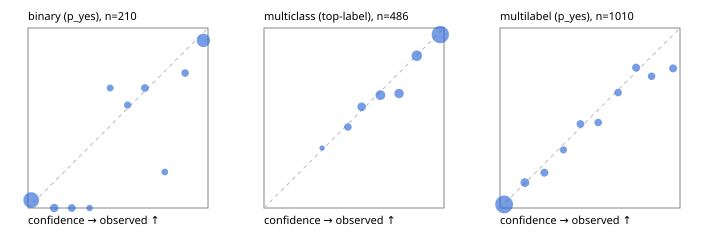

# Evaluation report

- model `Qwen/Qwen3-4B-Instruct-2507` @ `cdbee75f17` (stock reranker pairs), adapter/checkpoint `runs/curve/instruct_lora/adapter`, prompt `answer-v1` (724795e9b666)
- data data/hf.jsonl, data/eval.jsonl; splits ['validation']; n=868; calibration `None`
- cuda / bfloat16; 2026-09-24T01:02:24+0000; wall 105.3s

## Overall

question accuracy 77.0%

**binary**: n 210, positives 79, accuracy 0.886, precision 0.816, recall 0.899, f1 0.855, auroc 0.953, brier 0.085, log_loss 0.287, ece 0.075

**multiclass**: n 486, accuracy 0.831, macro_f1 0.765, log_loss 0.435, brier 0.238, ece_top_label 0.024

**multilabel**: n 172, labels 1010, exact_match 0.453, micro_f1 0.697, macro_f1 0.604, label_auroc 0.920, brier 0.091, log_loss 0.293, ece 0.024

## By family

| family | n | question acc % | details |
|---|---|---|---|
| eval_adversarial | 14 | 92.9 | bin acc 85.7 F1 88.9 AUROC 1.000 ECE 0.140; mc acc 100.0 mF1 100.0 ECE 0.113; ml EM 100.0 µF1 100.0 ECE 0.009 |
| eval_agent_output | 20 | 75.0 | bin acc 91.7 F1 92.3 AUROC 0.944 ECE 0.116; mc acc 60.0 mF1 33.3 ECE 0.144; ml EM 33.3 µF1 0.0 ECE 0.350 |
| eval_evidence | 17 | 100.0 | bin acc 100.0 F1 100.0 AUROC 1.000 ECE 0.060; ml EM 100.0 µF1 100.0 ECE 0.009 |
| eval_multilabel | 12 | 50.0 | bin acc 0.0 F1 0.0 AUROC — ECE 0.798; mc acc 100.0 mF1 100.0 ECE 0.001; ml EM 44.4 µF1 87.5 ECE 0.108 |
| eval_policy | 24 | 45.8 | bin acc 50.0 F1 62.5 AUROC 0.571 ECE 0.471; mc acc 45.5 mF1 29.4 ECE 0.448; ml EM 0.0 µF1 80.0 ECE 0.458 |
| eval_routing | 16 | 93.8 | bin acc 100.0 F1 100.0 AUROC 1.000 ECE 0.109; mc acc 100.0 mF1 100.0 ECE 0.087; ml EM 0.0 µF1 0.0 ECE 0.265 |
| eval_urgency_sentiment | 15 | 80.0 | bin acc 85.7 F1 85.7 AUROC 1.000 ECE 0.177; mc acc 80.0 mF1 66.7 ECE 0.154; ml EM 66.7 µF1 50.0 ECE 0.133 |
| hf_emotions_multilabel | 150 | 44.0 | ml EM 44.0 µF1 67.4 ECE 0.020 |
| hf_intent_banking77 | 150 | 92.7 | mc acc 92.7 mF1 90.4 ECE 0.030 |
| hf_nli | 150 | 90.7 | bin acc 90.7 F1 86.0 AUROC 0.967 ECE 0.061 |
| hf_sentiment_tweets | 150 | 70.7 | mc acc 70.7 mF1 67.0 ECE 0.078 |
| hf_topic_agnews | 150 | 88.0 | mc acc 88.0 mF1 88.1 ECE 0.032 |

## by hard case

| slice | n | question acc % |
|---|---|---|
| (none) | 634 | 77.9 |
| contradiction | 63 | 92.1 |
| distractor | 20 | 80.0 |
| double_negation | 3 | 100.0 |
| evidence_end | 4 | 75.0 |
| evidence_middle | 7 | 85.7 |
| evidence_start | 3 | 66.7 |
| exception | 7 | 100.0 |
| hypothetical | 6 | 83.3 |
| injection | 16 | 81.2 |
| lexical_overlap | 13 | 84.6 |
| long_state | 26 | 76.9 |
| missing_evidence | 59 | 86.4 |
| multi_positive | 40 | 22.5 |
| multi_turn | 21 | 81.0 |
| negation | 9 | 66.7 |
| new_label_names | 5 | 40.0 |
| nota | 4 | 100.0 |
| numeric_reasoning | 13 | 61.5 |
| paraphrase | 10 | 40.0 |
| role_reversal | 7 | 71.4 |
| sarcasm | 5 | 60.0 |
| temporal_reasoning | 15 | 46.7 |
| zero_positive | 7 | 57.1 |

## by state tokens

| slice | n | question acc % |
|---|---|---|
| 00000-00127 | 796 | 77.1 |
| 00128-00511 | 46 | 73.9 |
| 00512-02047 | 26 | 76.9 |

## by candidates

| slice | n | question acc % |
|---|---|---|
| 01 | 210 | 88.6 |
| 03 | 162 | 71.0 |
| 04 | 174 | 85.6 |
| 05 | 13 | 69.2 |
| 06 | 159 | 44.0 |
| 08 | 150 | 92.7 |

## Paraphrase groups

5 groups; same prediction 60.0%; all correct 40.0%

## Multiclass abstention (coverage vs error on accepted)

| abstain_below | coverage % | error % |
|---|---|---|
| 0.0 | 100.0 | 16.9 |
| 0.4 | 99.4 | 16.6 |
| 0.5 | 95.3 | 14.9 |
| 0.6 | 88.7 | 12.8 |
| 0.7 | 78.2 | 9.5 |
| 0.8 | 69.1 | 6.0 |
| 0.9 | 55.8 | 3.7 |

## Reliability: binary

| bin | n | mean confidence | observed frequency |
|---|---|---|---|
| [0.0,0.1) | 91 | 0.018 | 0.044 |
| [0.1,0.2) | 13 | 0.146 | 0.000 |
| [0.2,0.3) | 9 | 0.243 | 0.000 |
| [0.3,0.4) | 4 | 0.342 | 0.000 |
| [0.4,0.5) | 6 | 0.456 | 0.667 |
| [0.5,0.6) | 7 | 0.553 | 0.571 |
| [0.6,0.7) | 9 | 0.650 | 0.667 |
| [0.7,0.8) | 5 | 0.760 | 0.200 |
| [0.8,0.9) | 8 | 0.873 | 0.750 |
| [0.9,1.0] | 58 | 0.975 | 0.931 |

## Reliability: multiclass

| bin | n | mean confidence | observed frequency |
|---|---|---|---|
| [0.3,0.4) | 3 | 0.323 | 0.333 |
| [0.4,0.5) | 20 | 0.466 | 0.450 |
| [0.5,0.6) | 32 | 0.543 | 0.562 |
| [0.6,0.7) | 51 | 0.647 | 0.627 |
| [0.7,0.8) | 44 | 0.751 | 0.636 |
| [0.8,0.9) | 65 | 0.849 | 0.846 |
| [0.9,1.0] | 271 | 0.979 | 0.963 |

## Reliability: multilabel

| bin | n | mean confidence | observed frequency |
|---|---|---|---|
| [0.0,0.1) | 593 | 0.023 | 0.020 |
| [0.1,0.2) | 71 | 0.138 | 0.141 |
| [0.2,0.3) | 51 | 0.247 | 0.196 |
| [0.3,0.4) | 31 | 0.353 | 0.323 |
| [0.4,0.5) | 45 | 0.447 | 0.467 |
| [0.5,0.6) | 40 | 0.545 | 0.475 |
| [0.6,0.7) | 39 | 0.656 | 0.641 |
| [0.7,0.8) | 50 | 0.756 | 0.780 |
| [0.8,0.9) | 41 | 0.842 | 0.732 |
| [0.9,1.0] | 49 | 0.962 | 0.776 |
