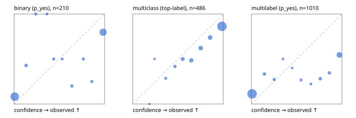

# Evaluation report

- model `Qwen/Qwen3-4B-Instruct-2507` @ `cdbee75f17` (stock reranker pairs), adapter/checkpoint `None`, prompt `hybrid-v1` (b894703d500d)
- data data/hf.jsonl, data/eval.jsonl; splits ['validation']; n=868; calibration `None`
- cuda / bfloat16; 2026-09-23T23:23:47+0000; wall 85.0s

## Overall

question accuracy 65.8%

**binary**: n 210, positives 79, accuracy 0.795, precision 0.714, recall 0.759, f1 0.736, auroc 0.903, brier 0.160, log_loss 0.627, ece 0.156

**multiclass**: n 486, accuracy 0.767, macro_f1 0.683, log_loss 0.849, brier 0.357, ece_top_label 0.120

**multilabel**: n 172, labels 1010, exact_match 0.180, micro_f1 0.497, macro_f1 0.487, label_auroc 0.816, brier 0.192, log_loss 0.789, ece 0.187

## By family

| family | n | question acc % | details |
|---|---|---|---|
| eval_adversarial | 14 | 92.9 | bin acc 100.0 F1 100.0 AUROC 1.000 ECE 0.028; mc acc 80.0 mF1 66.7 ECE 0.111; ml EM 100.0 µF1 100.0 ECE 0.007 |
| eval_agent_output | 20 | 50.0 | bin acc 66.7 F1 66.7 AUROC 0.889 ECE 0.255; mc acc 20.0 mF1 11.1 ECE 0.432; ml EM 33.3 µF1 0.0 ECE 0.377 |
| eval_evidence | 17 | 82.4 | bin acc 92.9 F1 90.9 AUROC 0.978 ECE 0.087; ml EM 33.3 µF1 66.7 ECE 0.271 |
| eval_multilabel | 12 | 41.7 | bin acc 0.0 F1 0.0 AUROC — ECE 0.777; mc acc 100.0 mF1 100.0 ECE 0.021; ml EM 33.3 µF1 76.6 ECE 0.176 |
| eval_policy | 24 | 33.3 | bin acc 41.7 F1 53.3 AUROC 0.400 ECE 0.554; mc acc 27.3 mF1 15.8 ECE 0.444; ml EM 0.0 µF1 66.7 ECE 0.496 |
| eval_routing | 16 | 87.5 | bin acc 85.7 F1 88.9 AUROC 0.900 ECE 0.134; mc acc 100.0 mF1 100.0 ECE 0.038; ml EM 0.0 µF1 0.0 ECE 0.726 |
| eval_urgency_sentiment | 15 | 66.7 | bin acc 71.4 F1 66.7 AUROC 0.750 ECE 0.294; mc acc 60.0 mF1 42.9 ECE 0.262; ml EM 66.7 µF1 66.7 ECE 0.117 |
| hf_emotions_multilabel | 150 | 14.7 | ml EM 14.7 µF1 45.7 ECE 0.188 |
| hf_intent_banking77 | 150 | 88.0 | mc acc 88.0 mF1 85.7 ECE 0.070 |
| hf_nli | 150 | 82.0 | bin acc 82.0 F1 72.7 AUROC 0.911 ECE 0.138 |
| hf_sentiment_tweets | 150 | 67.3 | mc acc 67.3 mF1 64.9 ECE 0.203 |
| hf_topic_agnews | 150 | 79.3 | mc acc 79.3 mF1 79.3 ECE 0.135 |

## by hard case

| slice | n | question acc % |
|---|---|---|
| (none) | 634 | 65.9 |
| contradiction | 63 | 92.1 |
| distractor | 20 | 60.0 |
| double_negation | 3 | 100.0 |
| evidence_end | 4 | 25.0 |
| evidence_middle | 7 | 85.7 |
| evidence_start | 3 | 33.3 |
| exception | 7 | 85.7 |
| hypothetical | 6 | 100.0 |
| injection | 16 | 62.5 |
| lexical_overlap | 13 | 84.6 |
| long_state | 26 | 50.0 |
| missing_evidence | 59 | 76.3 |
| multi_positive | 40 | 12.5 |
| multi_turn | 21 | 61.9 |
| negation | 9 | 66.7 |
| new_label_names | 5 | 40.0 |
| nota | 4 | 75.0 |
| numeric_reasoning | 13 | 46.2 |
| paraphrase | 10 | 40.0 |
| role_reversal | 7 | 42.9 |
| sarcasm | 5 | 60.0 |
| temporal_reasoning | 15 | 33.3 |
| zero_positive | 7 | 57.1 |

## by state tokens

| slice | n | question acc % |
|---|---|---|
| 00000-00127 | 796 | 66.3 |
| 00128-00511 | 46 | 65.2 |
| 00512-02047 | 26 | 50.0 |

## by candidates

| slice | n | question acc % |
|---|---|---|
| 01 | 210 | 79.5 |
| 03 | 162 | 66.0 |
| 04 | 174 | 77.6 |
| 05 | 13 | 46.2 |
| 06 | 159 | 15.1 |
| 08 | 150 | 88.0 |

## Paraphrase groups

5 groups; same prediction 80.0%; all correct 40.0%

## Multiclass abstention (coverage vs error on accepted)

| abstain_below | coverage % | error % |
|---|---|---|
| 0.0 | 100.0 | 23.3 |
| 0.4 | 97.9 | 22.3 |
| 0.5 | 95.5 | 21.3 |
| 0.6 | 90.5 | 19.8 |
| 0.7 | 83.7 | 17.2 |
| 0.8 | 76.1 | 15.1 |
| 0.9 | 67.5 | 13.7 |

## Reliability: binary

| bin | n | mean confidence | observed frequency |
|---|---|---|---|
| [0.0,0.1) | 110 | 0.007 | 0.082 |
| [0.1,0.2) | 7 | 0.134 | 0.429 |
| [0.2,0.3) | 3 | 0.239 | 1.000 |
| [0.3,0.4) | 2 | 0.363 | 1.000 |
| [0.4,0.5) | 4 | 0.438 | 0.500 |
| [0.5,0.6) | 2 | 0.531 | 0.500 |
| [0.6,0.7) | 5 | 0.640 | 0.200 |
| [0.7,0.8) | 4 | 0.765 | 0.500 |
| [0.8,0.9) | 4 | 0.859 | 0.250 |
| [0.9,1.0] | 69 | 0.983 | 0.797 |

## Reliability: multiclass

| bin | n | mean confidence | observed frequency |
|---|---|---|---|
| [0.1,0.2) | 1 | 0.183 | 0.000 |
| [0.2,0.3) | 2 | 0.242 | 0.500 |
| [0.3,0.4) | 7 | 0.364 | 0.286 |
| [0.4,0.5) | 12 | 0.466 | 0.417 |
| [0.5,0.6) | 24 | 0.552 | 0.500 |
| [0.6,0.7) | 33 | 0.647 | 0.485 |
| [0.7,0.8) | 37 | 0.751 | 0.622 |
| [0.8,0.9) | 42 | 0.855 | 0.738 |
| [0.9,1.0] | 328 | 0.986 | 0.863 |

## Reliability: multilabel

| bin | n | mean confidence | observed frequency |
|---|---|---|---|
| [0.0,0.1) | 701 | 0.007 | 0.113 |
| [0.1,0.2) | 27 | 0.144 | 0.333 |
| [0.2,0.3) | 22 | 0.252 | 0.273 |
| [0.3,0.4) | 6 | 0.349 | 0.500 |
| [0.4,0.5) | 5 | 0.450 | 0.400 |
| [0.5,0.6) | 15 | 0.548 | 0.267 |
| [0.6,0.7) | 9 | 0.657 | 0.222 |
| [0.7,0.8) | 32 | 0.761 | 0.281 |
| [0.8,0.9) | 26 | 0.861 | 0.346 |
| [0.9,1.0] | 167 | 0.972 | 0.545 |
