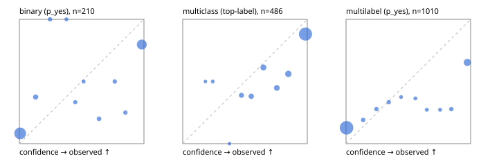

# Evaluation report

- model `Qwen/Qwen3-4B-Instruct-2507` @ `cdbee75f17` (stock reranker pairs), adapter/checkpoint `None`, prompt `task-v1` (f7b8d8022dfb)
- data data/hf.jsonl, data/eval.jsonl; splits ['validation']; n=868; calibration `None`
- cuda / bfloat16; 2026-09-23T23:20:56+0000; wall 76.0s

## Overall

question accuracy 66.5%

**binary**: n 210, positives 79, accuracy 0.795, precision 0.714, recall 0.759, f1 0.736, auroc 0.904, brier 0.160, log_loss 0.622, ece 0.159

**multiclass**: n 486, accuracy 0.763, macro_f1 0.672, log_loss 0.896, brier 0.361, ece_top_label 0.132

**multilabel**: n 172, labels 1010, exact_match 0.227, micro_f1 0.500, macro_f1 0.551, label_auroc 0.803, brier 0.170, log_loss 0.860, ece 0.158

## By family

| family | n | question acc % | details |
|---|---|---|---|
| eval_adversarial | 14 | 100.0 | bin acc 100.0 F1 100.0 AUROC 1.000 ECE 0.028; mc acc 100.0 mF1 100.0 ECE 0.115; ml EM 100.0 µF1 100.0 ECE 0.008 |
| eval_agent_output | 20 | 50.0 | bin acc 66.7 F1 66.7 AUROC 0.889 ECE 0.261; mc acc 0.0 mF1 0.0 ECE 0.537; ml EM 66.7 µF1 0.0 ECE 0.193 |
| eval_evidence | 17 | 82.4 | bin acc 92.9 F1 90.9 AUROC 0.978 ECE 0.086; ml EM 33.3 µF1 80.0 ECE 0.125 |
| eval_multilabel | 12 | 33.3 | bin acc 0.0 F1 0.0 AUROC — ECE 0.755; mc acc 100.0 mF1 100.0 ECE 0.002; ml EM 22.2 µF1 78.3 ECE 0.153 |
| eval_policy | 24 | 37.5 | bin acc 41.7 F1 53.3 AUROC 0.414 ECE 0.550; mc acc 36.4 mF1 22.2 ECE 0.464; ml EM 0.0 µF1 66.7 ECE 0.464 |
| eval_routing | 16 | 87.5 | bin acc 85.7 F1 88.9 AUROC 0.900 ECE 0.134; mc acc 100.0 mF1 100.0 ECE 0.176; ml EM 0.0 µF1 0.0 ECE 0.318 |
| eval_urgency_sentiment | 15 | 60.0 | bin acc 71.4 F1 66.7 AUROC 0.750 ECE 0.295; mc acc 40.0 mF1 25.0 ECE 0.293; ml EM 66.7 µF1 50.0 ECE 0.145 |
| hf_emotions_multilabel | 150 | 20.0 | ml EM 20.0 µF1 44.2 ECE 0.164 |
| hf_intent_banking77 | 150 | 90.0 | mc acc 90.0 mF1 85.4 ECE 0.073 |
| hf_nli | 150 | 82.0 | bin acc 82.0 F1 72.7 AUROC 0.912 ECE 0.137 |
| hf_sentiment_tweets | 150 | 66.7 | mc acc 66.7 mF1 63.7 ECE 0.249 |
| hf_topic_agnews | 150 | 76.7 | mc acc 76.7 mF1 76.9 ECE 0.137 |

## by hard case

| slice | n | question acc % |
|---|---|---|
| (none) | 634 | 66.7 |
| contradiction | 63 | 92.1 |
| distractor | 20 | 55.0 |
| double_negation | 3 | 100.0 |
| evidence_end | 4 | 25.0 |
| evidence_middle | 7 | 85.7 |
| evidence_start | 3 | 33.3 |
| exception | 7 | 85.7 |
| hypothetical | 6 | 100.0 |
| injection | 16 | 62.5 |
| lexical_overlap | 13 | 84.6 |
| long_state | 26 | 50.0 |
| missing_evidence | 59 | 76.3 |
| multi_positive | 40 | 12.5 |
| multi_turn | 21 | 57.1 |
| negation | 9 | 55.6 |
| new_label_names | 5 | 40.0 |
| nota | 4 | 75.0 |
| numeric_reasoning | 13 | 46.2 |
| paraphrase | 10 | 40.0 |
| role_reversal | 7 | 28.6 |
| sarcasm | 5 | 80.0 |
| temporal_reasoning | 15 | 33.3 |
| zero_positive | 7 | 71.4 |

## by state tokens

| slice | n | question acc % |
|---|---|---|
| 00000-00127 | 796 | 67.2 |
| 00128-00511 | 46 | 63.0 |
| 00512-02047 | 26 | 50.0 |

## by candidates

| slice | n | question acc % |
|---|---|---|
| 01 | 210 | 79.5 |
| 03 | 162 | 66.7 |
| 04 | 174 | 75.3 |
| 05 | 13 | 38.5 |
| 06 | 159 | 19.5 |
| 08 | 150 | 90.0 |

## Paraphrase groups

5 groups; same prediction 60.0%; all correct 40.0%

## Multiclass abstention (coverage vs error on accepted)

| abstain_below | coverage % | error % |
|---|---|---|
| 0.0 | 100.0 | 23.7 |
| 0.4 | 98.4 | 23.0 |
| 0.5 | 94.7 | 21.5 |
| 0.6 | 90.3 | 19.6 |
| 0.7 | 84.0 | 18.1 |
| 0.8 | 78.0 | 15.3 |
| 0.9 | 69.5 | 11.8 |

## Reliability: binary

| bin | n | mean confidence | observed frequency |
|---|---|---|---|
| [0.0,0.1) | 109 | 0.006 | 0.083 |
| [0.1,0.2) | 8 | 0.130 | 0.375 |
| [0.2,0.3) | 4 | 0.246 | 1.000 |
| [0.3,0.4) | 2 | 0.378 | 1.000 |
| [0.4,0.5) | 3 | 0.448 | 0.333 |
| [0.5,0.6) | 2 | 0.516 | 0.500 |
| [0.6,0.7) | 5 | 0.640 | 0.200 |
| [0.7,0.8) | 4 | 0.766 | 0.500 |
| [0.8,0.9) | 4 | 0.851 | 0.250 |
| [0.9,1.0] | 69 | 0.983 | 0.797 |

## Reliability: multiclass

| bin | n | mean confidence | observed frequency |
|---|---|---|---|
| [0.1,0.2) | 2 | 0.182 | 0.500 |
| [0.2,0.3) | 4 | 0.241 | 0.500 |
| [0.3,0.4) | 2 | 0.376 | 0.000 |
| [0.4,0.5) | 18 | 0.472 | 0.389 |
| [0.5,0.6) | 21 | 0.550 | 0.381 |
| [0.6,0.7) | 31 | 0.648 | 0.613 |
| [0.7,0.8) | 29 | 0.755 | 0.448 |
| [0.8,0.9) | 41 | 0.848 | 0.561 |
| [0.9,1.0] | 338 | 0.986 | 0.882 |

## Reliability: multilabel

| bin | n | mean confidence | observed frequency |
|---|---|---|---|
| [0.0,0.1) | 767 | 0.004 | 0.128 |
| [0.1,0.2) | 21 | 0.137 | 0.190 |
| [0.2,0.3) | 18 | 0.244 | 0.278 |
| [0.3,0.4) | 18 | 0.343 | 0.333 |
| [0.4,0.5) | 8 | 0.442 | 0.375 |
| [0.5,0.6) | 11 | 0.556 | 0.364 |
| [0.6,0.7) | 11 | 0.648 | 0.273 |
| [0.7,0.8) | 11 | 0.755 | 0.273 |
| [0.8,0.9) | 18 | 0.845 | 0.278 |
| [0.9,1.0] | 127 | 0.974 | 0.654 |
