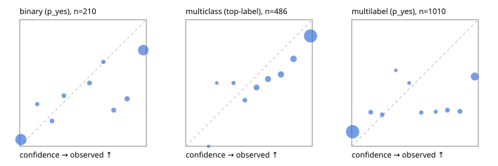

# Evaluation report

- model `Qwen/Qwen3-4B-Instruct-2507` @ `cdbee75f17` (stock reranker pairs), adapter/checkpoint `None`, prompt `task-v2` (16961aedae12)
- data data/hf.jsonl, data/eval.jsonl; splits ['validation']; n=868; calibration `None`
- cuda / bfloat16; 2026-09-23T23:22:22+0000; wall 85.4s

## Overall

question accuracy 65.9%

**binary**: n 210, positives 79, accuracy 0.800, precision 0.680, recall 0.886, f1 0.769, auroc 0.898, brier 0.162, log_loss 0.602, ece 0.141

**multiclass**: n 486, accuracy 0.767, macro_f1 0.683, log_loss 0.846, brier 0.358, ece_top_label 0.124

**multilabel**: n 172, labels 1010, exact_match 0.180, micro_f1 0.496, macro_f1 0.487, label_auroc 0.814, brier 0.192, log_loss 0.792, ece 0.188

## By family

| family | n | question acc % | details |
|---|---|---|---|
| eval_adversarial | 14 | 92.9 | bin acc 100.0 F1 100.0 AUROC 1.000 ECE 0.060; mc acc 80.0 mF1 66.7 ECE 0.111; ml EM 100.0 µF1 100.0 ECE 0.007 |
| eval_agent_output | 20 | 50.0 | bin acc 66.7 F1 71.4 AUROC 0.861 ECE 0.195; mc acc 20.0 mF1 11.1 ECE 0.469; ml EM 33.3 µF1 0.0 ECE 0.379 |
| eval_evidence | 17 | 76.5 | bin acc 85.7 F1 83.3 AUROC 1.000 ECE 0.138; ml EM 33.3 µF1 66.7 ECE 0.271 |
| eval_multilabel | 12 | 41.7 | bin acc 0.0 F1 0.0 AUROC — ECE 0.818; mc acc 100.0 mF1 100.0 ECE 0.021; ml EM 33.3 µF1 76.6 ECE 0.174 |
| eval_policy | 24 | 37.5 | bin acc 50.0 F1 62.5 AUROC 0.443 ECE 0.474; mc acc 27.3 mF1 15.8 ECE 0.482; ml EM 0.0 µF1 66.7 ECE 0.492 |
| eval_routing | 16 | 93.8 | bin acc 100.0 F1 100.0 AUROC 1.000 ECE 0.081; mc acc 100.0 mF1 100.0 ECE 0.043; ml EM 0.0 µF1 0.0 ECE 0.726 |
| eval_urgency_sentiment | 15 | 60.0 | bin acc 57.1 F1 66.7 AUROC 0.750 ECE 0.398; mc acc 60.0 mF1 42.9 ECE 0.257; ml EM 66.7 µF1 66.7 ECE 0.116 |
| hf_emotions_multilabel | 150 | 14.7 | ml EM 14.7 µF1 45.5 ECE 0.189 |
| hf_intent_banking77 | 150 | 88.0 | mc acc 88.0 mF1 85.7 ECE 0.065 |
| hf_nli | 150 | 82.7 | bin acc 82.7 F1 76.4 AUROC 0.910 ECE 0.137 |
| hf_sentiment_tweets | 150 | 67.3 | mc acc 67.3 mF1 64.9 ECE 0.181 |
| hf_topic_agnews | 150 | 79.3 | mc acc 79.3 mF1 79.3 ECE 0.117 |

## by hard case

| slice | n | question acc % |
|---|---|---|
| (none) | 634 | 67.0 |
| contradiction | 63 | 90.5 |
| distractor | 20 | 50.0 |
| double_negation | 3 | 100.0 |
| evidence_end | 4 | 25.0 |
| evidence_middle | 7 | 85.7 |
| evidence_start | 3 | 33.3 |
| exception | 7 | 85.7 |
| hypothetical | 6 | 83.3 |
| injection | 16 | 68.8 |
| lexical_overlap | 13 | 76.9 |
| long_state | 26 | 50.0 |
| missing_evidence | 59 | 66.1 |
| multi_positive | 40 | 12.5 |
| multi_turn | 21 | 52.4 |
| negation | 9 | 66.7 |
| new_label_names | 5 | 40.0 |
| nota | 4 | 75.0 |
| numeric_reasoning | 13 | 46.2 |
| paraphrase | 10 | 50.0 |
| role_reversal | 7 | 57.1 |
| sarcasm | 5 | 60.0 |
| temporal_reasoning | 15 | 33.3 |
| zero_positive | 7 | 57.1 |

## by state tokens

| slice | n | question acc % |
|---|---|---|
| 00000-00127 | 796 | 66.5 |
| 00128-00511 | 46 | 65.2 |
| 00512-02047 | 26 | 50.0 |

## by candidates

| slice | n | question acc % |
|---|---|---|
| 01 | 210 | 80.0 |
| 03 | 162 | 66.0 |
| 04 | 174 | 77.6 |
| 05 | 13 | 46.2 |
| 06 | 159 | 15.1 |
| 08 | 150 | 88.0 |

## Paraphrase groups

5 groups; same prediction 60.0%; all correct 40.0%

## Multiclass abstention (coverage vs error on accepted)

| abstain_below | coverage % | error % |
|---|---|---|
| 0.0 | 100.0 | 23.3 |
| 0.4 | 98.1 | 22.6 |
| 0.5 | 95.9 | 21.7 |
| 0.6 | 90.1 | 19.6 |
| 0.7 | 83.5 | 17.5 |
| 0.8 | 75.9 | 14.9 |
| 0.9 | 67.3 | 12.8 |

## Reliability: binary

| bin | n | mean confidence | observed frequency |
|---|---|---|---|
| [0.0,0.1) | 94 | 0.009 | 0.053 |
| [0.1,0.2) | 3 | 0.138 | 0.333 |
| [0.2,0.3) | 5 | 0.255 | 0.200 |
| [0.3,0.4) | 5 | 0.349 | 0.400 |
| [0.5,0.6) | 6 | 0.552 | 0.500 |
| [0.6,0.7) | 3 | 0.661 | 0.667 |
| [0.7,0.8) | 7 | 0.743 | 0.286 |
| [0.8,0.9) | 8 | 0.848 | 0.375 |
| [0.9,1.0] | 79 | 0.976 | 0.759 |

## Reliability: multiclass

| bin | n | mean confidence | observed frequency |
|---|---|---|---|
| [0.1,0.2) | 1 | 0.181 | 0.000 |
| [0.2,0.3) | 2 | 0.245 | 0.500 |
| [0.3,0.4) | 6 | 0.378 | 0.500 |
| [0.4,0.5) | 11 | 0.467 | 0.364 |
| [0.5,0.6) | 28 | 0.559 | 0.464 |
| [0.6,0.7) | 32 | 0.649 | 0.531 |
| [0.7,0.8) | 37 | 0.752 | 0.568 |
| [0.8,0.9) | 42 | 0.852 | 0.690 |
| [0.9,1.0] | 327 | 0.986 | 0.872 |

## Reliability: multilabel

| bin | n | mean confidence | observed frequency |
|---|---|---|---|
| [0.0,0.1) | 703 | 0.007 | 0.115 |
| [0.1,0.2) | 26 | 0.150 | 0.269 |
| [0.2,0.3) | 20 | 0.241 | 0.250 |
| [0.3,0.4) | 5 | 0.349 | 0.600 |
| [0.4,0.5) | 6 | 0.453 | 0.500 |
| [0.5,0.6) | 15 | 0.550 | 0.267 |
| [0.6,0.7) | 11 | 0.664 | 0.273 |
| [0.7,0.8) | 28 | 0.756 | 0.286 |
| [0.8,0.9) | 29 | 0.854 | 0.276 |
| [0.9,1.0] | 167 | 0.972 | 0.551 |
