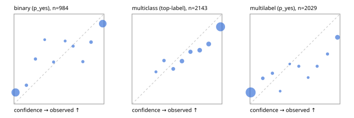

# Evaluation report

- model `Qwen/Qwen3-4B-Instruct-2507` @ `cdbee75f17` (stock reranker pairs), adapter/checkpoint `None`, prompt `answer-v1` (724795e9b666)
- data data/hf.jsonl, data/eval.jsonl; splits ['test']; n=3471; calibration `None`
- cuda / bfloat16; 2026-09-23T23:31:32+0000; wall 354.1s

## Overall

question accuracy 71.3%

**binary**: n 984, positives 475, accuracy 0.842, precision 0.851, recall 0.817, f1 0.834, auroc 0.911, brier 0.133, log_loss 0.531, ece 0.111

**multiclass**: n 2143, accuracy 0.735, macro_f1 0.664, log_loss 0.949, brier 0.403, ece_top_label 0.124

**multilabel**: n 344, labels 2029, exact_match 0.201, micro_f1 0.524, macro_f1 0.578, label_auroc 0.817, brier 0.154, log_loss 0.718, ece 0.141

## By family

| family | n | question acc % | details |
|---|---|---|---|
| eval_adversarial | 27 | 66.7 | bin acc 73.3 F1 71.4 AUROC 0.880 ECE 0.215; mc acc 71.4 mF1 71.4 ECE 0.285; ml EM 40.0 µF1 53.3 ECE 0.267 |
| eval_agent_output | 26 | 50.0 | bin acc 78.6 F1 80.0 AUROC 0.714 ECE 0.231; mc acc 14.3 mF1 6.2 ECE 0.498; ml EM 20.0 µF1 66.7 ECE 0.205 |
| eval_evidence | 17 | 82.4 | bin acc 93.3 F1 90.9 AUROC 1.000 ECE 0.082; ml EM 0.0 µF1 44.4 ECE 0.396 |
| eval_multilabel | 32 | 53.1 | bin acc 71.4 F1 75.0 AUROC 0.833 ECE 0.382; mc acc 0.0 mF1 0.0 ECE 0.399; ml EM 50.0 µF1 85.4 ECE 0.066 |
| eval_policy | 22 | 63.6 | bin acc 76.9 F1 76.9 AUROC 0.810 ECE 0.230; mc acc 60.0 mF1 42.9 ECE 0.423; ml EM 25.0 µF1 70.6 ECE 0.247 |
| eval_routing | 25 | 76.0 | bin acc 100.0 F1 100.0 AUROC 1.000 ECE 0.062; mc acc 69.2 mF1 58.3 ECE 0.228; ml EM 0.0 µF1 40.0 ECE 0.247 |
| eval_urgency_sentiment | 22 | 59.1 | bin acc 60.0 F1 66.7 AUROC 0.750 ECE 0.338; mc acc 70.0 mF1 58.3 ECE 0.260; ml EM 0.0 µF1 71.4 ECE 0.371 |
| heldout_boolq | 300 | 80.0 | bin acc 80.0 F1 83.2 AUROC 0.852 ECE 0.157 |
| heldout_emotion_multiclass | 300 | 52.7 | mc acc 52.7 mF1 40.3 ECE 0.236 |
| heldout_intent_clinc | 300 | 56.3 | mc acc 56.3 mF1 55.5 ECE 0.257 |
| heldout_question_type_trec | 300 | 76.3 | mc acc 76.3 mF1 70.8 ECE 0.124 |
| heldout_sentiment_sst2 | 300 | 90.0 | bin acc 90.0 F1 89.4 AUROC 0.962 ECE 0.064 |
| heldout_topic_dbpedia | 300 | 95.7 | mc acc 95.7 mF1 95.3 ECE 0.045 |
| hf_emotions_multilabel | 300 | 17.7 | ml EM 17.7 µF1 45.2 ECE 0.145 |
| hf_intent_banking77 | 300 | 92.3 | mc acc 92.3 mF1 91.7 ECE 0.057 |
| hf_nli | 300 | 84.0 | bin acc 84.0 F1 76.9 AUROC 0.921 ECE 0.133 |
| hf_sentiment_tweets | 300 | 65.0 | mc acc 65.0 mF1 63.1 ECE 0.114 |
| hf_topic_agnews | 300 | 78.7 | mc acc 78.7 mF1 78.3 ECE 0.140 |

## by hard case

| slice | n | question acc % |
|---|---|---|
| (none) | 3042 | 71.2 |
| contradiction | 107 | 92.5 |
| distractor | 33 | 42.4 |
| double_negation | 6 | 50.0 |
| evidence_end | 13 | 76.9 |
| evidence_middle | 11 | 54.5 |
| evidence_start | 9 | 77.8 |
| exception | 7 | 14.3 |
| hypothetical | 7 | 57.1 |
| injection | 10 | 50.0 |
| lexical_overlap | 20 | 75.0 |
| long_state | 50 | 58.0 |
| missing_evidence | 104 | 83.7 |
| multi_positive | 81 | 22.2 |
| multi_turn | 9 | 77.8 |
| negation | 30 | 66.7 |
| new_label_names | 3 | 33.3 |
| nota | 46 | 97.8 |
| numeric_reasoning | 16 | 50.0 |
| paraphrase | 22 | 31.8 |
| role_reversal | 15 | 66.7 |
| sarcasm | 12 | 50.0 |
| temporal_reasoning | 29 | 34.5 |
| zero_positive | 6 | 33.3 |

## by state tokens

| slice | n | question acc % |
|---|---|---|
| 00000-00127 | 3211 | 71.3 |
| 00128-00511 | 208 | 74.5 |
| 00512-02047 | 52 | 59.6 |

## by candidates

| slice | n | question acc % |
|---|---|---|
| 01 | 984 | 84.2 |
| 03 | 310 | 65.5 |
| 04 | 333 | 77.2 |
| 05 | 22 | 18.2 |
| 06 | 1218 | 60.3 |
| 07 | 49 | 93.9 |
| 08 | 555 | 72.3 |

## Paraphrase groups

11 groups; same prediction 54.5%; all correct 18.2%

## Multiclass abstention (coverage vs error on accepted)

| abstain_below | coverage % | error % |
|---|---|---|
| 0.0 | 100.0 | 26.5 |
| 0.4 | 96.0 | 25.2 |
| 0.5 | 92.2 | 23.7 |
| 0.6 | 84.1 | 21.0 |
| 0.7 | 78.0 | 19.4 |
| 0.8 | 69.9 | 17.0 |
| 0.9 | 60.0 | 14.2 |

## Reliability: binary

| bin | n | mean confidence | observed frequency |
|---|---|---|---|
| [0.0,0.1) | 460 | 0.017 | 0.128 |
| [0.1,0.2) | 24 | 0.138 | 0.208 |
| [0.2,0.3) | 22 | 0.238 | 0.500 |
| [0.3,0.4) | 7 | 0.341 | 0.714 |
| [0.4,0.5) | 15 | 0.440 | 0.467 |
| [0.5,0.6) | 10 | 0.568 | 0.700 |
| [0.6,0.7) | 14 | 0.657 | 0.643 |
| [0.7,0.8) | 17 | 0.765 | 0.471 |
| [0.8,0.9) | 32 | 0.856 | 0.688 |
| [0.9,1.0] | 383 | 0.986 | 0.893 |

## Reliability: multiclass

| bin | n | mean confidence | observed frequency |
|---|---|---|---|
| [0.2,0.3) | 28 | 0.266 | 0.357 |
| [0.3,0.4) | 58 | 0.356 | 0.483 |
| [0.4,0.5) | 82 | 0.459 | 0.390 |
| [0.5,0.6) | 172 | 0.555 | 0.477 |
| [0.6,0.7) | 131 | 0.650 | 0.580 |
| [0.7,0.8) | 174 | 0.752 | 0.598 |
| [0.8,0.9) | 213 | 0.852 | 0.667 |
| [0.9,1.0] | 1285 | 0.984 | 0.858 |

## Reliability: multilabel

| bin | n | mean confidence | observed frequency |
|---|---|---|---|
| [0.0,0.1) | 1590 | 0.007 | 0.129 |
| [0.1,0.2) | 63 | 0.142 | 0.286 |
| [0.2,0.3) | 41 | 0.249 | 0.341 |
| [0.3,0.4) | 14 | 0.335 | 0.143 |
| [0.4,0.5) | 9 | 0.441 | 0.444 |
| [0.5,0.6) | 31 | 0.542 | 0.419 |
| [0.6,0.7) | 17 | 0.646 | 0.294 |
| [0.7,0.8) | 31 | 0.746 | 0.419 |
| [0.8,0.9) | 36 | 0.861 | 0.556 |
| [0.9,1.0] | 197 | 0.972 | 0.741 |
