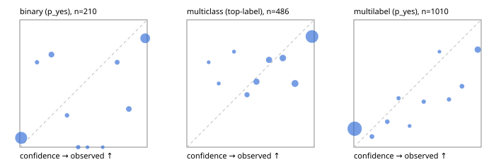

# Evaluation report

- model `Qwen/Qwen3-4B-Instruct-2507` @ `cdbee75f17` (stock reranker pairs), adapter/checkpoint `None`, prompt `answer-v1` (724795e9b666)
- data data/hf.jsonl, data/eval.jsonl; splits ['validation']; n=868; calibration `None`
- cuda / bfloat16; 2026-09-23T23:25:30+0000; wall 90.4s

## Overall

question accuracy 66.9%

**binary**: n 210, positives 79, accuracy 0.814, precision 0.750, recall 0.759, f1 0.755, auroc 0.897, brier 0.149, log_loss 0.571, ece 0.147

**multiclass**: n 486, accuracy 0.757, macro_f1 0.701, log_loss 0.795, brier 0.380, ece_top_label 0.126

**multilabel**: n 172, labels 1010, exact_match 0.244, micro_f1 0.483, macro_f1 0.538, label_auroc 0.804, brier 0.158, log_loss 0.759, ece 0.149

## By family

| family | n | question acc % | details |
|---|---|---|---|
| eval_adversarial | 14 | 92.9 | bin acc 100.0 F1 100.0 AUROC 1.000 ECE 0.024; mc acc 80.0 mF1 66.7 ECE 0.198; ml EM 100.0 µF1 100.0 ECE 0.014 |
| eval_agent_output | 20 | 65.0 | bin acc 83.3 F1 83.3 AUROC 0.889 ECE 0.179; mc acc 20.0 mF1 16.7 ECE 0.513; ml EM 66.7 µF1 0.0 ECE 0.233 |
| eval_evidence | 17 | 88.2 | bin acc 100.0 F1 100.0 AUROC 1.000 ECE 0.073; ml EM 33.3 µF1 66.7 ECE 0.219 |
| eval_multilabel | 12 | 50.0 | bin acc 0.0 F1 0.0 AUROC — ECE 0.818; mc acc 100.0 mF1 100.0 ECE 0.002; ml EM 44.4 µF1 76.2 ECE 0.201 |
| eval_policy | 24 | 41.7 | bin acc 41.7 F1 46.2 AUROC 0.429 ECE 0.521; mc acc 45.5 mF1 29.4 ECE 0.489; ml EM 0.0 µF1 66.7 ECE 0.447 |
| eval_routing | 16 | 87.5 | bin acc 85.7 F1 88.9 AUROC 1.000 ECE 0.131; mc acc 100.0 mF1 100.0 ECE 0.113; ml EM 0.0 µF1 0.0 ECE 0.305 |
| eval_urgency_sentiment | 15 | 73.3 | bin acc 71.4 F1 75.0 AUROC 0.833 ECE 0.220; mc acc 60.0 mF1 42.9 ECE 0.424; ml EM 100.0 µF1 100.0 ECE 0.027 |
| hf_emotions_multilabel | 150 | 20.0 | ml EM 20.0 µF1 41.9 ECE 0.148 |
| hf_intent_banking77 | 150 | 88.7 | mc acc 88.7 mF1 84.3 ECE 0.074 |
| hf_nli | 150 | 82.7 | bin acc 82.7 F1 72.9 AUROC 0.899 ECE 0.141 |
| hf_sentiment_tweets | 150 | 62.7 | mc acc 62.7 mF1 60.0 ECE 0.191 |
| hf_topic_agnews | 150 | 78.7 | mc acc 78.7 mF1 79.0 ECE 0.140 |

## by hard case

| slice | n | question acc % |
|---|---|---|
| (none) | 634 | 65.9 |
| contradiction | 63 | 93.7 |
| distractor | 20 | 65.0 |
| double_negation | 3 | 100.0 |
| evidence_end | 4 | 25.0 |
| evidence_middle | 7 | 100.0 |
| evidence_start | 3 | 66.7 |
| exception | 7 | 100.0 |
| hypothetical | 6 | 100.0 |
| injection | 16 | 68.8 |
| lexical_overlap | 13 | 84.6 |
| long_state | 26 | 65.4 |
| missing_evidence | 59 | 81.4 |
| multi_positive | 40 | 17.5 |
| multi_turn | 21 | 76.2 |
| negation | 9 | 66.7 |
| new_label_names | 5 | 40.0 |
| nota | 4 | 100.0 |
| numeric_reasoning | 13 | 46.2 |
| paraphrase | 10 | 40.0 |
| role_reversal | 7 | 71.4 |
| sarcasm | 5 | 60.0 |
| temporal_reasoning | 15 | 26.7 |
| zero_positive | 7 | 71.4 |

## by state tokens

| slice | n | question acc % |
|---|---|---|
| 00000-00127 | 796 | 66.8 |
| 00128-00511 | 46 | 69.6 |
| 00512-02047 | 26 | 65.4 |

## by candidates

| slice | n | question acc % |
|---|---|---|
| 01 | 210 | 81.4 |
| 03 | 162 | 63.0 |
| 04 | 174 | 78.2 |
| 05 | 13 | 46.2 |
| 06 | 159 | 20.8 |
| 08 | 150 | 88.7 |

## Paraphrase groups

5 groups; same prediction 80.0%; all correct 40.0%

## Multiclass abstention (coverage vs error on accepted)

| abstain_below | coverage % | error % |
|---|---|---|
| 0.0 | 100.0 | 24.3 |
| 0.4 | 97.7 | 24.0 |
| 0.5 | 94.2 | 22.7 |
| 0.6 | 87.0 | 20.6 |
| 0.7 | 79.8 | 19.6 |
| 0.8 | 71.6 | 18.4 |
| 0.9 | 61.3 | 13.1 |

## Reliability: binary

| bin | n | mean confidence | observed frequency |
|---|---|---|---|
| [0.0,0.1) | 109 | 0.011 | 0.073 |
| [0.1,0.2) | 3 | 0.135 | 0.667 |
| [0.2,0.3) | 11 | 0.248 | 0.727 |
| [0.3,0.4) | 4 | 0.370 | 0.250 |
| [0.4,0.5) | 3 | 0.458 | 0.000 |
| [0.5,0.6) | 1 | 0.531 | 0.000 |
| [0.6,0.7) | 1 | 0.651 | 0.000 |
| [0.7,0.8) | 6 | 0.765 | 0.667 |
| [0.8,0.9) | 10 | 0.856 | 0.300 |
| [0.9,1.0] | 62 | 0.984 | 0.855 |

## Reliability: multiclass

| bin | n | mean confidence | observed frequency |
|---|---|---|---|
| [0.1,0.2) | 3 | 0.172 | 0.667 |
| [0.2,0.3) | 4 | 0.251 | 0.500 |
| [0.3,0.4) | 4 | 0.371 | 0.750 |
| [0.4,0.5) | 17 | 0.473 | 0.412 |
| [0.5,0.6) | 35 | 0.547 | 0.514 |
| [0.6,0.7) | 35 | 0.646 | 0.686 |
| [0.7,0.8) | 40 | 0.754 | 0.700 |
| [0.8,0.9) | 50 | 0.850 | 0.500 |
| [0.9,1.0] | 298 | 0.983 | 0.869 |

## Reliability: multilabel

| bin | n | mean confidence | observed frequency |
|---|---|---|---|
| [0.0,0.1) | 813 | 0.007 | 0.145 |
| [0.1,0.2) | 24 | 0.142 | 0.083 |
| [0.2,0.3) | 20 | 0.263 | 0.200 |
| [0.3,0.4) | 13 | 0.351 | 0.385 |
| [0.4,0.5) | 6 | 0.438 | 0.167 |
| [0.5,0.6) | 14 | 0.549 | 0.357 |
| [0.6,0.7) | 4 | 0.672 | 0.750 |
| [0.7,0.8) | 16 | 0.747 | 0.375 |
| [0.8,0.9) | 23 | 0.849 | 0.478 |
| [0.9,1.0] | 77 | 0.973 | 0.766 |
