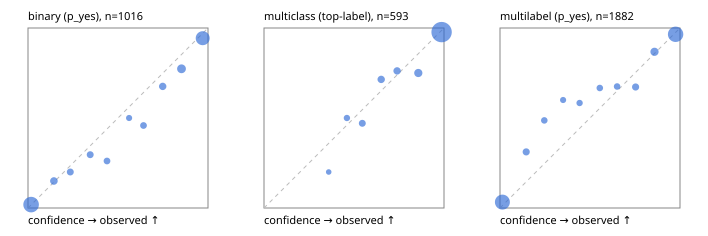

# Evaluation report

- model `Qwen/Qwen3-Reranker-4B` @ `22e683669b` (shared-prefix tree (tree-v1)), adapter/checkpoint `runs/curve/tree_4b_mlp/adapter`, prompt `tree-v1` (bc025ae9f6bc)
- data data/eval2.jsonl; splits ['test']; n=1991; calibration `None`
- cuda / bfloat16; 2026-09-24T07:09:07+0000; wall 289.9s

## Overall

question accuracy 86.3%

**binary**: n 1016, positives 435, accuracy 0.900, precision 0.855, recall 0.922, f1 0.887, auroc 0.963, brier 0.076, log_loss 0.250, ece 0.030

**multiclass**: n 593, accuracy 0.919, macro_f1 0.858, log_loss 0.243, brier 0.122, ece_top_label 0.021

**multilabel**: n 382, labels 1882, exact_match 0.681, micro_f1 0.909, macro_f1 0.841, label_auroc 0.968, brier 0.072, log_loss 0.239, ece 0.034

## By family

| family | n | question acc % | details |
|---|---|---|---|
| e2_hard | 673 | 83.8 | bin acc 86.8 F1 83.1 AUROC 0.945 ECE 0.060; mc acc 90.2 mF1 82.1 ECE 0.032; ml EM 66.7 µF1 89.1 ECE 0.046 |
| e2_simple | 664 | 93.4 | bin acc 96.2 F1 96.5 AUROC 0.988 ECE 0.025; mc acc 98.0 mF1 95.7 ECE 0.018; ml EM 77.5 µF1 94.4 ECE 0.058 |
| e2_very_hard | 654 | 81.8 | bin acc 86.7 F1 83.3 AUROC 0.941 ECE 0.042; mc acc 87.5 mF1 79.3 ECE 0.052; ml EM 60.8 µF1 89.3 ECE 0.037 |

## by hard case

| slice | n | question acc % |
|---|---|---|
| (none) | 569 | 95.1 |
| contradiction | 172 | 86.0 |
| distractor | 474 | 82.7 |
| double_negation | 126 | 87.3 |
| evidence_end | 57 | 84.2 |
| evidence_middle | 114 | 89.5 |
| evidence_start | 17 | 70.6 |
| exception | 213 | 81.2 |
| hypothetical | 128 | 88.3 |
| injection | 151 | 72.8 |
| lexical_overlap | 201 | 88.6 |
| long_state | 191 | 82.7 |
| missing_evidence | 141 | 90.8 |
| multi_positive | 322 | 71.4 |
| multi_turn | 149 | 83.9 |
| negation | 257 | 85.2 |
| nota | 118 | 82.2 |
| numeric_reasoning | 224 | 72.3 |
| paraphrase | 218 | 83.9 |
| role_reversal | 187 | 85.0 |
| sarcasm | 149 | 74.5 |
| temporal_reasoning | 203 | 71.4 |
| zero_positive | 73 | 83.6 |
| zero_positive_distractor | 1 | 100.0 |

## by state tokens

| slice | n | question acc % |
|---|---|---|
| 00000-00127 | 662 | 86.6 |
| 00128-00511 | 477 | 82.4 |
| 00512-02047 | 484 | 90.7 |
| 02048-08191 | 329 | 84.5 |
| 08192+ | 39 | 92.3 |

## by candidates

| slice | n | question acc % |
|---|---|---|
| 01 | 1016 | 90.0 |
| 03 | 128 | 87.5 |
| 04 | 515 | 88.5 |
| 05 | 224 | 74.1 |
| 06 | 86 | 67.4 |
| 07 | 18 | 61.1 |
| 08 | 4 | 50.0 |

## Paraphrase groups

76 groups; same prediction 75.0%; all correct 71.1%

## Multiclass abstention (coverage vs error on accepted)

| abstain_below | coverage % | error % |
|---|---|---|
| 0.0 | 100.0 | 8.1 |
| 0.4 | 99.2 | 7.5 |
| 0.5 | 97.5 | 6.7 |
| 0.6 | 94.6 | 5.3 |
| 0.7 | 91.1 | 4.4 |
| 0.8 | 87.5 | 3.7 |
| 0.9 | 82.1 | 2.3 |

## Reliability: binary

| bin | n | mean confidence | observed frequency |
|---|---|---|---|
| [0.0,0.1) | 427 | 0.017 | 0.019 |
| [0.1,0.2) | 40 | 0.144 | 0.150 |
| [0.2,0.3) | 30 | 0.235 | 0.200 |
| [0.3,0.4) | 27 | 0.346 | 0.296 |
| [0.4,0.5) | 23 | 0.439 | 0.261 |
| [0.5,0.6) | 16 | 0.562 | 0.500 |
| [0.6,0.7) | 24 | 0.642 | 0.458 |
| [0.7,0.8) | 37 | 0.748 | 0.676 |
| [0.8,0.9) | 75 | 0.853 | 0.773 |
| [0.9,1.0] | 317 | 0.971 | 0.943 |

## Reliability: multiclass

| bin | n | mean confidence | observed frequency |
|---|---|---|---|
| [0.3,0.4) | 5 | 0.360 | 0.200 |
| [0.4,0.5) | 10 | 0.461 | 0.500 |
| [0.5,0.6) | 17 | 0.546 | 0.471 |
| [0.6,0.7) | 21 | 0.651 | 0.714 |
| [0.7,0.8) | 21 | 0.740 | 0.762 |
| [0.8,0.9) | 32 | 0.857 | 0.750 |
| [0.9,1.0] | 487 | 0.987 | 0.977 |

## Reliability: multilabel

| bin | n | mean confidence | observed frequency |
|---|---|---|---|
| [0.0,0.1) | 705 | 0.014 | 0.033 |
| [0.1,0.2) | 61 | 0.146 | 0.311 |
| [0.2,0.3) | 37 | 0.246 | 0.486 |
| [0.3,0.4) | 30 | 0.351 | 0.600 |
| [0.4,0.5) | 36 | 0.442 | 0.583 |
| [0.5,0.6) | 42 | 0.554 | 0.667 |
| [0.6,0.7) | 40 | 0.650 | 0.675 |
| [0.7,0.8) | 58 | 0.753 | 0.672 |
| [0.8,0.9) | 106 | 0.858 | 0.868 |
| [0.9,1.0] | 767 | 0.976 | 0.965 |
