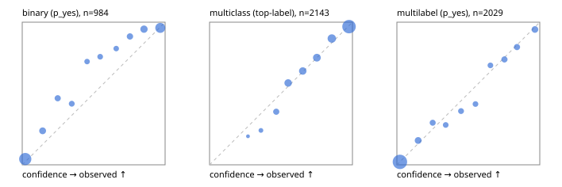

# Evaluation report

- model `Qwen/Qwen3-Reranker-4B` @ `22e683669b` (shared-prefix tree (tree-v1)), adapter/checkpoint `runs/curve/tree_4b_mlp/adapter`, prompt `tree-v1` (bc025ae9f6bc)
- data data/hf.jsonl, data/eval.jsonl; splits ['test']; n=3471; calibration `None`
- cuda / bfloat16; 2026-09-24T04:55:01+0000; wall 257.1s

## Overall

question accuracy 81.6%

**binary**: n 984, positives 475, accuracy 0.879, precision 0.926, recall 0.815, f1 0.867, auroc 0.955, brier 0.090, log_loss 0.292, ece 0.063

**multiclass**: n 2143, accuracy 0.834, macro_f1 0.899, log_loss 0.464, brier 0.236, ece_top_label 0.016

**multilabel**: n 344, labels 2029, exact_match 0.517, micro_f1 0.749, macro_f1 0.737, label_auroc 0.942, brier 0.077, log_loss 0.248, ece 0.015

## By family

| family | n | question acc % | details |
|---|---|---|---|
| eval_adversarial | 27 | 96.3 | bin acc 100.0 F1 100.0 AUROC 1.000 ECE 0.085; mc acc 100.0 mF1 100.0 ECE 0.010; ml EM 80.0 µF1 94.7 ECE 0.076 |
| eval_agent_output | 26 | 61.5 | bin acc 85.7 F1 85.7 AUROC 0.857 ECE 0.167; mc acc 28.6 mF1 21.4 ECE 0.664; ml EM 40.0 µF1 80.0 ECE 0.150 |
| eval_evidence | 17 | 88.2 | bin acc 100.0 F1 100.0 AUROC 1.000 ECE 0.051; ml EM 0.0 µF1 57.1 ECE 0.275 |
| eval_multilabel | 32 | 81.2 | bin acc 100.0 F1 100.0 AUROC 1.000 ECE 0.038; mc acc 100.0 mF1 100.0 ECE 0.166; ml EM 75.0 µF1 93.2 ECE 0.029 |
| eval_policy | 22 | 59.1 | bin acc 61.5 F1 66.7 AUROC 0.643 ECE 0.368; mc acc 60.0 mF1 42.9 ECE 0.478; ml EM 50.0 µF1 76.2 ECE 0.274 |
| eval_routing | 25 | 84.0 | bin acc 90.0 F1 88.9 AUROC 0.917 ECE 0.127; mc acc 84.6 mF1 75.0 ECE 0.102; ml EM 50.0 µF1 80.0 ECE 0.108 |
| eval_urgency_sentiment | 22 | 81.8 | bin acc 70.0 F1 76.9 AUROC 0.917 ECE 0.183; mc acc 90.0 mF1 92.4 ECE 0.113; ml EM 100.0 µF1 100.0 ECE 0.020 |
| heldout_boolq | 300 | 83.3 | bin acc 83.3 F1 84.9 AUROC 0.931 ECE 0.102 |
| heldout_emotion_multiclass | 300 | 54.0 | mc acc 54.0 mF1 42.5 ECE 0.181 |
| heldout_intent_clinc | 300 | 94.3 | mc acc 94.3 mF1 95.2 ECE 0.057 |
| heldout_question_type_trec | 300 | 83.3 | mc acc 83.3 mF1 84.1 ECE 0.097 |
| heldout_sentiment_sst2 | 300 | 86.3 | bin acc 86.3 F1 84.4 AUROC 0.973 ECE 0.135 |
| heldout_topic_dbpedia | 300 | 96.7 | mc acc 96.7 mF1 96.2 ECE 0.019 |
| hf_emotions_multilabel | 300 | 49.7 | ml EM 49.7 µF1 71.2 ECE 0.018 |
| hf_intent_banking77 | 300 | 96.3 | mc acc 96.3 mF1 95.5 ECE 0.040 |
| hf_nli | 300 | 94.3 | bin acc 94.3 F1 92.2 AUROC 0.985 ECE 0.022 |
| hf_sentiment_tweets | 300 | 70.0 | mc acc 70.0 mF1 69.8 ECE 0.046 |
| hf_topic_agnews | 300 | 90.3 | mc acc 90.3 mF1 90.4 ECE 0.019 |

## by hard case

| slice | n | question acc % |
|---|---|---|
| (none) | 3042 | 81.5 |
| contradiction | 107 | 100.0 |
| distractor | 33 | 72.7 |
| double_negation | 6 | 100.0 |
| evidence_end | 13 | 92.3 |
| evidence_middle | 11 | 90.9 |
| evidence_start | 9 | 88.9 |
| exception | 7 | 28.6 |
| hypothetical | 7 | 100.0 |
| injection | 10 | 70.0 |
| lexical_overlap | 20 | 85.0 |
| long_state | 50 | 80.0 |
| missing_evidence | 104 | 90.4 |
| multi_positive | 81 | 43.2 |
| multi_turn | 9 | 77.8 |
| negation | 30 | 83.3 |
| new_label_names | 3 | 33.3 |
| nota | 46 | 95.7 |
| numeric_reasoning | 16 | 50.0 |
| paraphrase | 22 | 77.3 |
| role_reversal | 15 | 73.3 |
| sarcasm | 12 | 83.3 |
| temporal_reasoning | 29 | 58.6 |
| zero_positive | 6 | 66.7 |

## by state tokens

| slice | n | question acc % |
|---|---|---|
| 00000-00127 | 3211 | 81.6 |
| 00128-00511 | 208 | 81.7 |
| 00512-02047 | 52 | 80.8 |

## by candidates

| slice | n | question acc % |
|---|---|---|
| 01 | 984 | 87.9 |
| 03 | 310 | 70.6 |
| 04 | 333 | 88.3 |
| 05 | 22 | 63.6 |
| 06 | 1218 | 70.9 |
| 07 | 49 | 98.0 |
| 08 | 555 | 95.1 |

## Paraphrase groups

11 groups; same prediction 63.6%; all correct 72.7%

## Multiclass abstention (coverage vs error on accepted)

| abstain_below | coverage % | error % |
|---|---|---|
| 0.0 | 100.0 | 16.6 |
| 0.4 | 98.4 | 15.6 |
| 0.5 | 94.0 | 13.4 |
| 0.6 | 85.2 | 10.4 |
| 0.7 | 76.4 | 7.6 |
| 0.8 | 65.7 | 4.8 |
| 0.9 | 52.3 | 3.1 |

## Reliability: binary

| bin | n | mean confidence | observed frequency |
|---|---|---|---|
| [0.0,0.1) | 394 | 0.021 | 0.041 |
| [0.1,0.2) | 63 | 0.143 | 0.238 |
| [0.2,0.3) | 45 | 0.248 | 0.467 |
| [0.3,0.4) | 35 | 0.347 | 0.429 |
| [0.4,0.5) | 29 | 0.454 | 0.724 |
| [0.5,0.6) | 33 | 0.545 | 0.758 |
| [0.6,0.7) | 27 | 0.658 | 0.815 |
| [0.7,0.8) | 50 | 0.754 | 0.900 |
| [0.8,0.9) | 82 | 0.852 | 0.951 |
| [0.9,1.0] | 226 | 0.966 | 0.960 |

## Reliability: multiclass

| bin | n | mean confidence | observed frequency |
|---|---|---|---|
| [0.2,0.3) | 5 | 0.269 | 0.200 |
| [0.3,0.4) | 29 | 0.359 | 0.241 |
| [0.4,0.5) | 94 | 0.467 | 0.372 |
| [0.5,0.6) | 190 | 0.550 | 0.574 |
| [0.6,0.7) | 187 | 0.652 | 0.658 |
| [0.7,0.8) | 229 | 0.751 | 0.751 |
| [0.8,0.9) | 288 | 0.856 | 0.885 |
| [0.9,1.0] | 1121 | 0.976 | 0.969 |

## Reliability: multilabel

| bin | n | mean confidence | observed frequency |
|---|---|---|---|
| [0.0,0.1) | 1256 | 0.021 | 0.021 |
| [0.1,0.2) | 135 | 0.149 | 0.170 |
| [0.2,0.3) | 78 | 0.251 | 0.295 |
| [0.3,0.4) | 68 | 0.342 | 0.279 |
| [0.4,0.5) | 69 | 0.449 | 0.377 |
| [0.5,0.6) | 61 | 0.550 | 0.426 |
| [0.6,0.7) | 66 | 0.655 | 0.697 |
| [0.7,0.8) | 92 | 0.753 | 0.739 |
| [0.8,0.9) | 86 | 0.840 | 0.826 |
| [0.9,1.0] | 118 | 0.966 | 0.949 |
